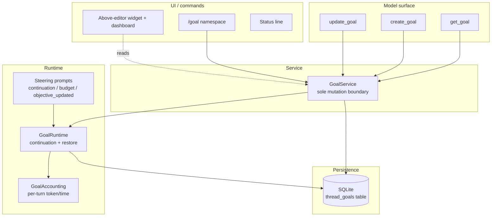
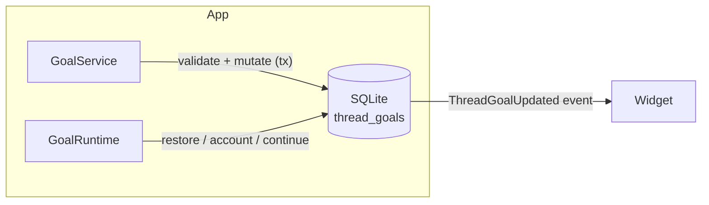
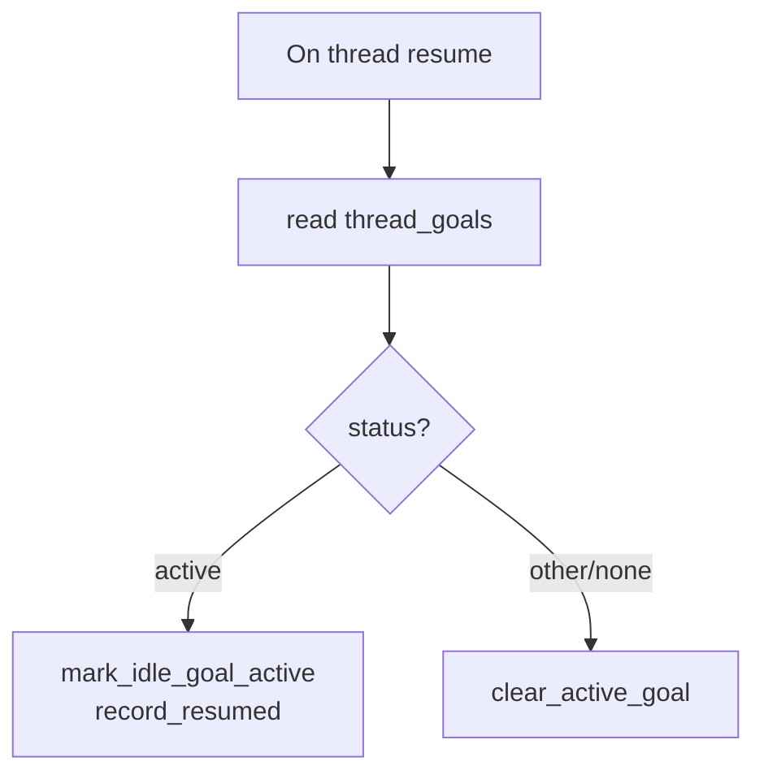
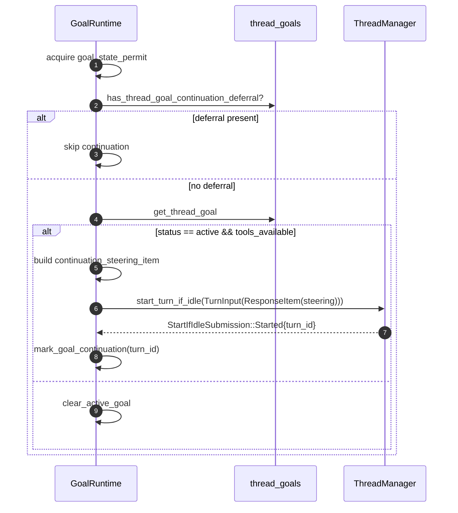
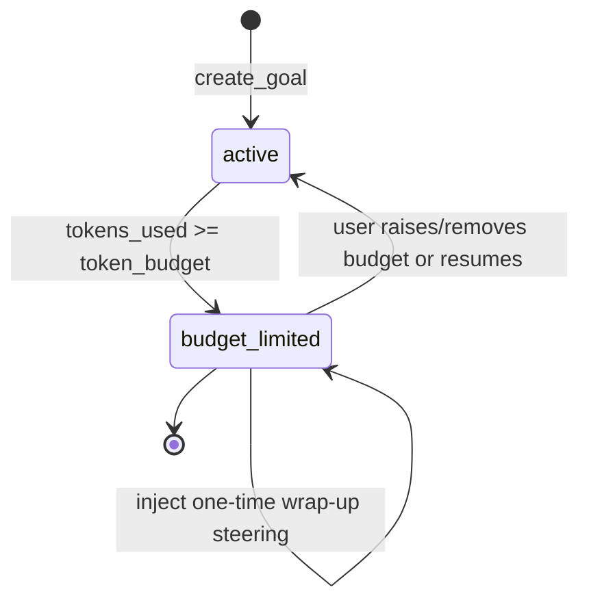
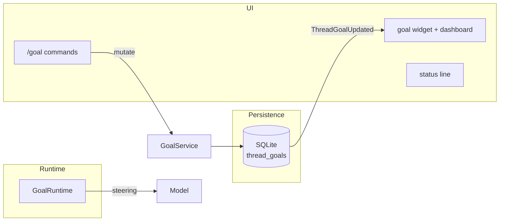

# Architecture: Codex Goal Replicate with pi-goal-x TUI

**Project:** pi-secretary — Codex goal replicate
**Document type:** System / Architecture Design
**Status:** Draft
**Date:** 2026-09-15
**Related:** `../user-stories/user-stories.md` · `../ux/ux-design.md` · `../../.plans/2026-09-15T13:17:45Z-codex-goal-replicate.md`

---

## 1. Design Goal

Build a **high-fidelity replicate of OpenAI Codex's goal system** as a
pi-coding-agent extension, **presented through pi-goal-x's TUI**, inside the
`pi-secretary` project.

The core architectural rule, taken verbatim from the Codex-inspired design
record that pi-goal-x itself follows:

> **Tools express durable model intents; a service owns validated state
> mutation; runtime hooks own accounting and continuation; steering prompts
> own behavioral policy; UI and external commands mutate through the same
> service.**

The replicate is **Codex-faithful** on semantics (three tools, six statuses,
single goal per thread, SQLite) and **pi-goal-x-faithful** on presentation
(above-editor widget + dashboard, status line, command palette, keyboard
interactions).

---

## 2. Module Boundaries

### 2.1 Layering



### 2.2 Responsibility table

| Module | Responsibility |
| --- | --- |
| `extensions/goal.ts` | Thin installer: instantiate service/runtime, register tools/commands/events/widget. |
| `extensions/goal-service.ts` | `GoalService` — all validated mutations: create, get, set objective/status, clear. |
| `extensions/goal-runtime.ts` | Per-thread runtime: restore on resume, idle continuation, stop-on-error/empty/usage, external-mutation effects. |
| `extensions/goal-accounting.ts` | Per-turn baselines, idempotent token/time accounting, budget-limit transition. |
| `extensions/tools/goal-tools.ts` | Specs + thin executors for `get_goal`, `create_goal`, `update_goal`. |
| `extensions/prompts/goal-prompts.ts` | Bounded steering templates (continuation, budget-limit, objective-updated). |
| `extensions/widgets/goal-widget.ts` | Above-editor widget + dashboard renderer, status line. |
| `extensions/commands/goal-commands.ts` | `/goal` command namespace handling. |
| `extensions/storage/goal-db.ts` | SQLite access layer (`thread_goals` table). |
| `extensions/events.ts` | `ThreadGoalUpdated` event emission / subscription. |

**Invariant:** `GoalService` is the **only** module allowed to perform a
logical goal mutation. Tool handlers, command handlers, and the TUI call it
and then apply returned runtime/UI effects.

---

## 3. Data Model

### 3.1 Status enum (Codex-faithful)

```ts
type ThreadGoalStatus =
  | "active"          // only status that continues
  | "paused"          // user-initiated
  | "blocked"         // model impasse (3 consecutive turns)
  | "usage_limited"   // system usage limit
  | "budget_limited"  // system token budget reached
  | "complete";       // verified achievement
```

`is_active()` = only `active`. `is_terminal()` = `budget_limited` | `complete`.

### 3.2 `ThreadGoal` record

```ts
interface ThreadGoal {
  threadId: string;
  objective: string;         // non-empty, <= 4,000 chars
  status: ThreadGoalStatus;
  tokenBudget?: number;      // positive, optional
  tokensUsed: number;
  timeUsedSeconds: number;
  createdAt: number;         // epoch seconds
  updatedAt: number;
}
```

### 3.3 SQLite schema

```sql
CREATE TABLE IF NOT EXISTS thread_goals (
  thread_id        TEXT PRIMARY KEY,   -- one goal per thread
  goal_id          TEXT NOT NULL,
  objective        TEXT NOT NULL,
  status           TEXT NOT NULL,      -- active|paused|blocked|usage_limited|budget_limited|complete
  token_budget     INTEGER,            -- nullable, must be positive when set
  tokens_used      INTEGER NOT NULL DEFAULT 0,
  time_used_seconds INTEGER NOT NULL DEFAULT 0,
  created_at_ms    INTEGER NOT NULL,
  updated_at_ms    INTEGER NOT NULL
);
CREATE INDEX IF NOT EXISTS idx_thread_goals_thread ON thread_goals(thread_id);
```

**Writes** are transactional. `expected_goal_id` (compare-and-apply) guards
concurrent mutation so an external set/clear cannot clobber a goal revision it
did not observe. A `goal_state_permit` semaphore serializes a persisted
mutation against idle continuation.

---

## 4. Tool Specifications

All schemas use `additionalProperties: false` and a strict small shape.

### 4.1 `get_goal`

```
parameters: {}
```

Returns the complete snapshot: `goal`, `remainingTokens`, and
`completionBudgetReport` (only for a completed budgeted goal).

### 4.2 `create_goal`

```
{ "objective": string (required, 1..4000), "token_budget": integer (optional, positive) }
```

**Policy:**
- Only on explicit user/system/developer request; never infer from an ordinary
  task.
- `token_budget` legal only when explicitly requested.
- **Fails** if an unfinished goal exists (single-goal-per-thread invariant).
- Resets the accounting baseline so pre-goal tokens are not charged.

### 4.3 `update_goal`

```
{ "status": "complete" | "blocked" | "paused" }
```

**Policy:**
- Single field; no objective/reason/evidence/bypass.
- `paused` only at the user's explicit request.
- `complete` only after the requirement-by-requirement completion audit passes.
- `blocked` only after the same condition recurs 3 consecutive goal turns.
- Budget/usage status changes are system-controlled, never model-set.
- On `complete` of a budgeted goal, report final token usage.

---

## 5. Persistence Layer

### 5.1 Codex-style SQLite



### 5.2 Mutation ordering

1. Acquire `goal_state_permit` (serialize against idle continuation).
2. Read the current goal (or confirm absence for create).
3. Capture `expected_goal_id`.
4. Perform the transactional write.
5. Emit `ThreadGoalUpdated`.
6. Apply runtime effects (continue / stop / clear active accounting).
7. Release the permit.

**On write failure:** no runtime effect is applied; the transaction rolls
back. On emit failure: the state transition is retained but diagnostics are
surfaced (best-effort event).

---

## 6. Runtime & Continuation

### 6.1 Restore on resume



### 6.2 Idle continuation



### 6.3 Stop on error / empty / usage

| Reason | Status |
| --- | --- |
| turn error | `blocked` |
| repeated empty response | `blocked` |
| usage limit | `usage_limited` |

Each stop: accounts progress, then updates the goal to the target status,
clears active accounting, emits the event.

---

## 7. Accounting

### 7.1 Per-turn baselines

- Baseline resets at `create_goal` so pre-goal tokens in the creation turn are
  not charged.
- `progress_snapshot(turn_id)` captures `time_delta_seconds` and
  `token_delta`.
- `account_thread_goal_usage(...)` writes once per snapshot (idempotent).
- A `progress_accounting_permit` serializes concurrent tool-finish
  accounting.

### 7.2 Budget-limit transition



Budget exhaustion **never** calls completion nor bypasses the audit; it only
winds down with a wrap-up prompt.

---

## 8. Steering Prompts

Bounded internal-context fragments injected as `InternalModelContextFragment`
with explicit untrusted-data framing.

| Template | Trigger |
| --- | --- |
| `continuation.md` | Idle continuation when active. |
| `budget_limit.md` | One-time wrap-up on budget exhaustion. |
| `objective_updated.md` | After a user edits the objective. |

Each **escapes** the objective as untrusted data and **hard-caps** the fragment
length. The continuation prompt encodes:
- work-from-authoritative-state,
- no-progress detection,
- requirement-by-requirement completion audit,
- 3-consecutive-turn blocked rule.

---

## 9. TUI Integration



- The widget reads the authoritative service snapshot and re-renders on
  `ThreadGoalUpdated`.
- `Ctrl+Shift+T` toggles the dashboard; `Esc` collapses/pauses.
- Commands mutate through `GoalService` and then apply UI effects.

---

## 10. Deliberate Divergences from pi-goal-x

These are exactly the features we **drop** to remain Codex-faithful:

| pi-goal-x feature | Replicate decision | Reason |
| --- | --- | --- |
| Multiple open goals + focus model | Drop — single goal per thread | Codex semantics |
| Recursive task tree + evidence | Drop | Codex has no task model |
| Verification contracts | Drop | Not a Codex concept |
| Independent auditor agent | Drop | Completion is the model self-audit |
| Sisyphus / ordered mode | Drop | Not in Codex goal |
| `clear` archives | Change — `clear` deletes | Codex semantics |
| Markdown + ledger persistence | Replace with SQLite | Codex persistence |

**Kept from pi-goal-x:** the TUI (widget, dashboard, status line, command
palette, keybindings) and the interaction model.

---

## 11. Architecture Acceptance Criteria

1. Exactly three model-facing goal tools, installed statically.
2. `GoalService` is the sole mutation boundary.
3. SQLite `thread_goals` is the source of truth (single goal per thread).
4. Continuation is serialized against mutation via `goal_state_permit`.
5. Status vocabulary matches Codex exactly (6 statuses).
6. All status transitions follow the state machine in §6/§7.
7. The TUI renders only from the authoritative service snapshot.
8. Prompts escape objective data and honor hard size caps.
9. Behavior is covered by unit + integration tests (serial mode).

---

## 12. Risks and Mitigations

| Risk | Mitigation |
| --- | --- |
| Static tools allow invalid phase calls | Small schemas + service validators + actionable tool results. |
| Prompt-only completion audit is inconsistent | Mirror Codex template wording exactly; gate on evaluations. |
| Single-goal-per-thread is limiting | Deliberate; matches Codex; documented in user stories. |
| SQLite migration/opacity | Inspectable DB; expose a read path in TUI/CLI; no schema churn. |
| Late async results clobber state | `expected_goal_id` compare-and-apply + per-goal permit. |
| Removing pi-goal-x features surprises users | Guarded by the product vision (Codex-faithful replicate) + README. |
