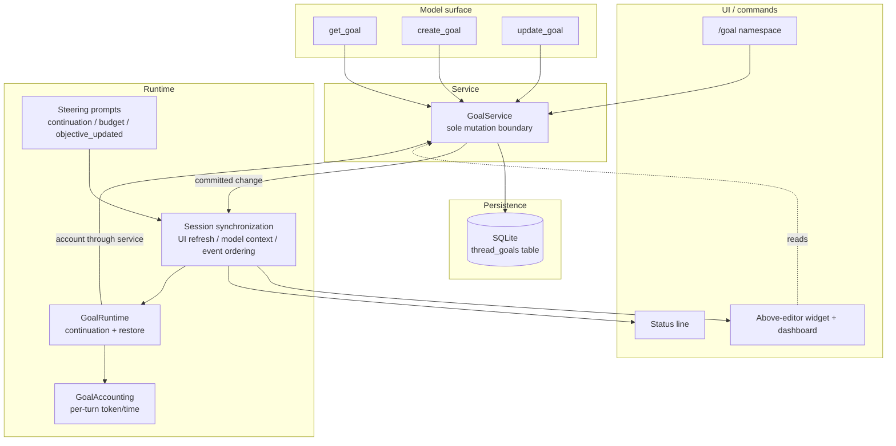
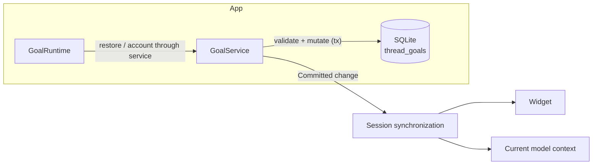
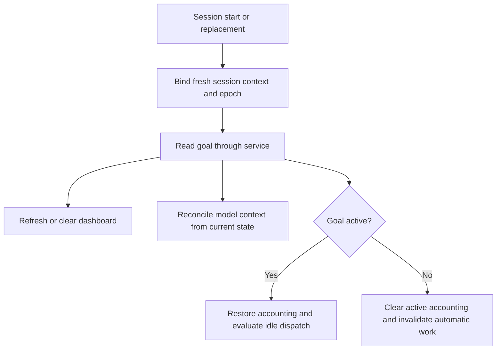
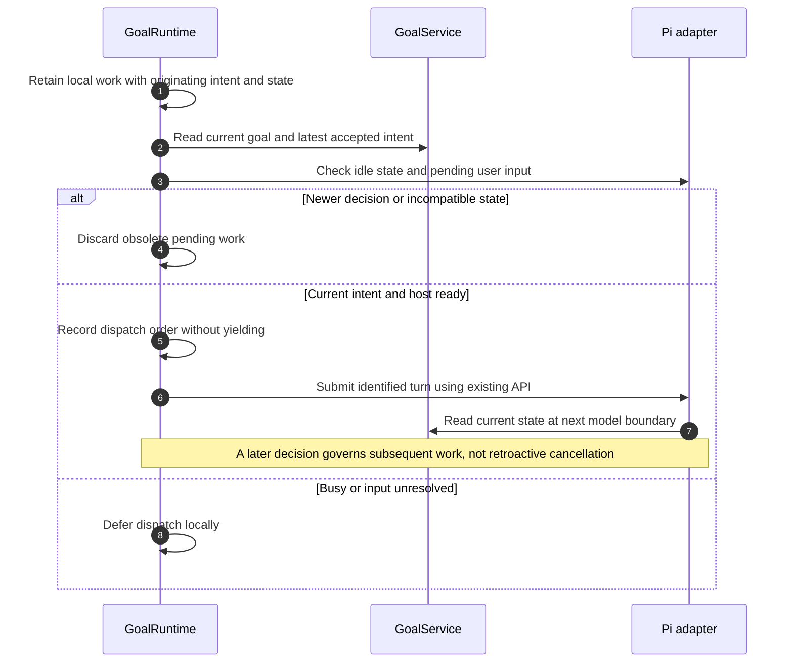
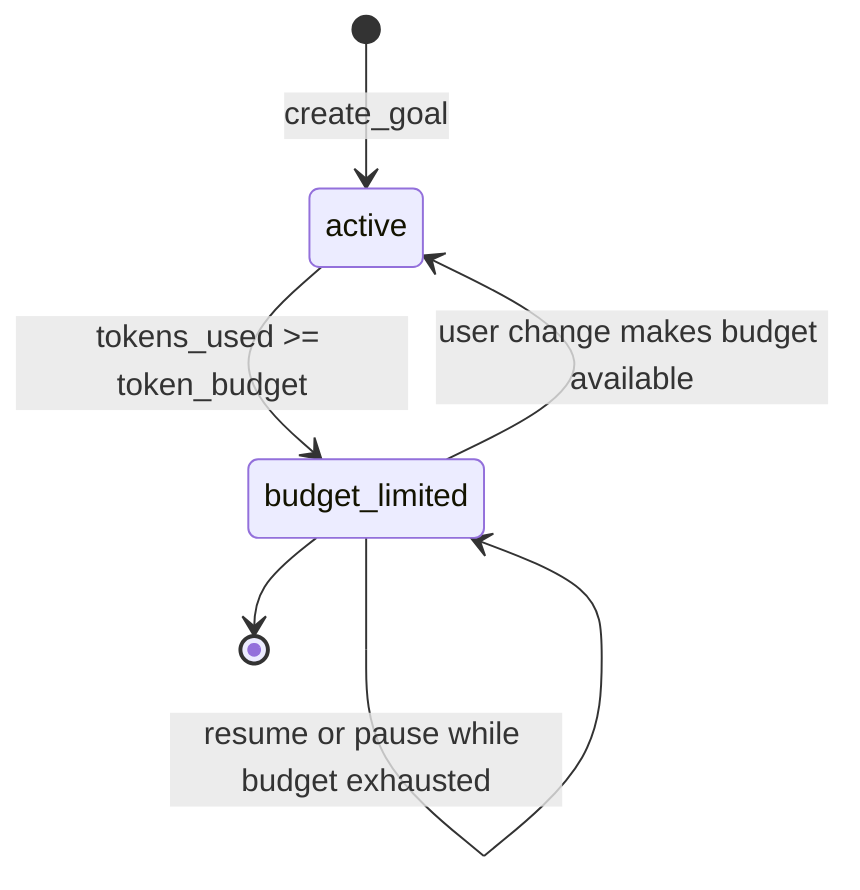
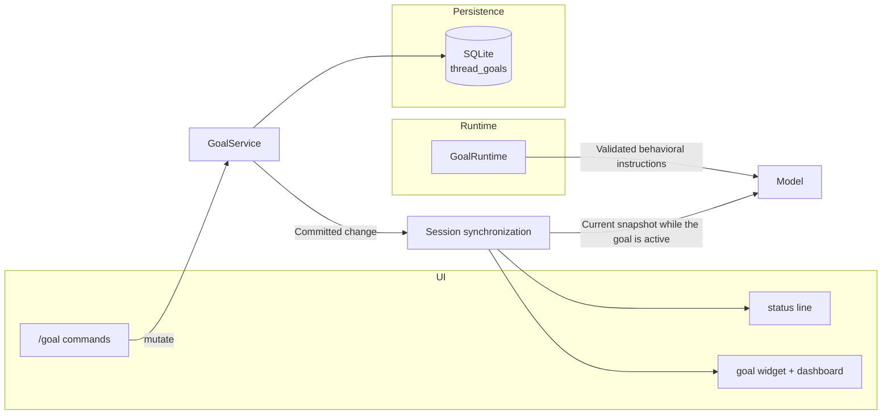
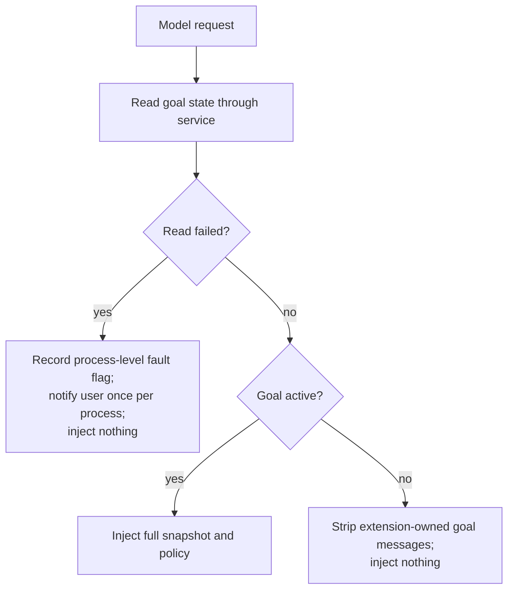

# Architecture: Codex Goal Replicate with pi-goal-x TUI

**Project:** pi-secretary — Codex goal replicate
**Document type:** System / Architecture Design
**Status:** Draft
**Date:** 2026-09-15
**Updated:** 2026-09-16
**Implementation status:** Shared events, input/intent ordering, UI/model projections, recovery, and finalization are implemented. Automatic continuation and reporting-only budget wrap-up use existing Pi facilities. Section 13.8 records implementation evidence and the conservative handling of uncorrelated input; the former host-cancellation prerequisite is removed.
**Audience:** Implementers and reviewers of goal-system correctness.
**Scope:** This document owns internal interfaces, state transitions, storage, event ordering, model context, continuation dispatch, and technical verification. User-facing interactions are defined in the [UX design](../ux/ux-design.md), and required outcomes are defined in the [user stories](../user-stories/user-stories.md).
**Related:** [Document responsibilities](../README.md) · [Synchronization implementation plan](../../.plans/2026-09-16-11-13-goal-state-synchronization.md)

---

## 1. Design Goal

Build a **high-fidelity replicate of OpenAI Codex's goal system** as a
pi-coding-agent extension, **presented through pi-goal-x's TUI**, inside the
`pi-secretary` project.

The core architectural rule, taken verbatim from the Codex-inspired design
record that pi-goal-x itself follows:

> **Tools express durable model intents; a service owns validated state
> mutation; runtime hooks own accounting and continuation; steering prompts
> own behavioral policy; UI and external commands mutate through the same
> service.**

The replicate is **Codex-faithful** on semantics (three tools, six statuses,
single goal per thread, SQLite) and **pi-goal-x-faithful** on presentation
(above-editor widget + dashboard, status line, command palette, keyboard
interactions).

---

## 2. Module Boundaries

### 2.1 Layering



### 2.2 Responsibility table

| Module | Responsibility |
| --- | --- |
| `extensions/secretary/index.ts` | The installer binds tools, session lifecycle, model context, and host events. |
| `extensions/secretary/goal-engine.ts` | The engine owns per-thread runtimes and coordinates service subscriptions. |
| `extensions/secretary/goal/goal-service.ts` | The service owns validated mutations and publishes committed change events. |
| `extensions/secretary/goal/runtime.ts` | The runtime owns continuation dispatch, originating-work identity, restore, and stop decisions. |
| `extensions/secretary/goal/accounting.ts` | Accounting owns per-turn baselines and idempotent token/time deltas. |
| `extensions/secretary/goal/tools/` | Tool specifications and executors expose the three existing goal tools. |
| `extensions/secretary/goal/steering.ts` | Prompt rendering separates current-state information from behavioral instructions. |
| `extensions/secretary/goal-ui.ts` | UI registration owns dashboard rendering and `/goal` commands. |
| `extensions/secretary/goal/storage/goal-db.ts` | Storage owns SQLite transactions and compare-and-apply operations. |
| `extensions/secretary/goal/synchronization.ts` | The existing coordinator owns UI and model projections; the revised design adds ordered input receipt, UI-publication records, and stale-work checks. |

**Invariant:** `GoalService` is the **only** module allowed to perform a
logical goal mutation. Tool handlers, command handlers, and runtime accounting
call it; the shared coordinator applies synchronization effects from the
committed result.

---

## 3. Data Model

### 3.1 Status enum (Codex-faithful)

```ts
type ThreadGoalStatus =
  | "active"          // only status that continues
  | "paused"          // user-initiated
  | "blocked"         // audited impasse or unrecovered runtime failure
  | "usage_limited"   // system usage limit
  | "budget_limited"  // system token budget reached
  | "complete";       // verified achievement
```

`is_active()` = only `active`. `is_terminal()` = `budget_limited` | `complete`.

### 3.2 `ThreadGoal` record

```ts
interface ThreadGoal {
  threadId: string;
  goalId: string;
  objective: string;         // non-empty, <= 4,000 chars
  status: ThreadGoalStatus;
  tokenBudget?: number;      // positive, optional
  tokensUsed: number;
  timeUsedSeconds: number;
  createdAt: number;         // epoch milliseconds
  updatedAt: number;
}
```

### 3.3 SQLite schema

```sql
CREATE TABLE IF NOT EXISTS thread_goals (
  thread_id        TEXT PRIMARY KEY,   -- one goal per thread
  goal_id          TEXT NOT NULL,
  objective        TEXT NOT NULL,
  status           TEXT NOT NULL,      -- active|paused|blocked|usage_limited|budget_limited|complete
  token_budget     INTEGER,            -- nullable, must be positive when set
  tokens_used      INTEGER NOT NULL DEFAULT 0,
  time_used_seconds INTEGER NOT NULL DEFAULT 0,
  created_at_ms    INTEGER NOT NULL,
  updated_at_ms    INTEGER NOT NULL
);
CREATE INDEX IF NOT EXISTS idx_thread_goals_thread ON thread_goals(thread_id);
```

- Writes are transactional, and `expected_goal_id` prevents a result for a replaced goal from mutating its replacement.
- Goal identity is not a revision: an objective or status can change while `goalId` remains the same. Committed change revisions and control generations are specified in §13.2; input and decision ordering are specified in §13.5.
- A synchronous per-thread dispatch check compares the work's originating intent with current intent and constraints immediately before submission to Pi. It does not require a host-wide provider-admission lock.

---

## 4. Tool Specifications

All schemas use `additionalProperties: false` and a strict small shape.

### 4.1 `get_goal`

```
parameters: {}
```

- The response contains `goal` and `remaining_tokens`, matching the existing executor contract.
- The model-visible text includes objective, status, budget, usage, and remaining tokens; required fields must not exist only in tool-result `details`.
- `completion_budget_report` is an optional result of a successful completion update, not a substitute for the current snapshot.

### 4.2 `create_goal`

```
{ "objective": string (required, 1..4000), "token_budget": integer (optional, positive) }
```

**Policy:**
- Only on explicit user/system/developer request; never infer from an ordinary
  task.
- `token_budget` legal only when explicitly requested.
- **Fails** if an unfinished goal exists (single-goal-per-thread invariant).
- Resets the accounting baseline so pre-goal tokens are not charged.

### 4.3 `update_goal`

```
{ "status": "complete" | "blocked" | "paused" }
```

**Policy:**
- Single field; no objective/reason/evidence/bypass.
- `paused` only at the user's explicit request.
- `complete` only after the requirement-by-requirement completion audit passes.
- `blocked` only after the same condition recurs 3 consecutive goal turns.
- Budget/usage status changes are system-controlled, never model-set.
- On `complete` of a budgeted goal, report final token usage.

---

## 5. Persistence Layer

### 5.1 Codex-style SQLite



#### 5.1.1 Multi-process access

- The goals database is a single file shared by every concurrently running pi session (`pi-secretary-goals.sqlite`); any session can write while others read. The connection must therefore be opened for multi-process access: WAL journal mode, so a writer does not exclude readers, plus a nonzero busy timeout, so the remaining writer-versus-writer waits resolve instead of returning `SQLITE_BUSY`.
- WAL persists in the database file, so a session opening an existing store inherits the mode without coordination. The store lives on a local filesystem; WAL's unsuitability for network filesystems is not a constraint here.
- A bounded `SQLITE_BUSY` surface can still occur (for example, a writer stalled past the busy timeout). Render paths must therefore never perform storage I/O per paint or tick: the goal widget and the Secretary agents display surfaces read in-memory projections of committed state (the agents projection is defined in the subagent architecture §6.2), so a contended store cannot block or fail a paint. Read sites that remain storage-authoritative must tolerate a transient read fault; the UI degradation contract is §13.6, and the context-injection fault policy is §13.3. A storage read fault is never a process-fatal condition.

### 5.2 Mutation ordering

1. Retain the receipt sequence for a user decision or the originating intent sequence for an automatic result; do not assign precedence from the time an asynchronous handler happens to finish.
2. Read the current goal under the per-thread mutation boundary, check target identity and causal freshness under §13.5, and account eligible progress belonging to the outgoing goal.
3. Validate the requested action against current constraints and commit through `GoalService`. A rejected or unresolved input is not a successful state change.
4. Record the accepted user decision's intent sequence even for a valid no-op decision; advance committed revision and control generation only when their respective state changes occur.
5. Publish a committed change for an actual mutation, including explicit absence after clear. Invalidate pending work based on superseded intent or constraints.
6. Refresh the current session UI and record which revision was published, then reconcile model context from the current service state. A UI-publication timestamp is not proof of human acknowledgment.
7. Request eligible continuation through the local ordering and dispatch protocol in §13.5. No asynchronous gap may separate the final dispatch check from submission to Pi.

- A failed write emits no success event, success confirmation, or continuation request.
- A notification failure does not roll back committed storage. It is reported diagnostically, and consumers recover by reading the service at lifecycle and model-request boundaries.
- Runtime effects are coordinated once per change, not duplicated across tool handlers, command handlers, and event listeners.

---

## 6. Runtime & Continuation

### 6.1 Restore on resume



- Startup, reload, new-session, resume, and fork must initialize the UI without requiring a `/goal` command.
- Lifecycle restore does not manufacture a goal mutation event. It performs an explicit snapshot reconciliation.
- Session replacement discards references to the previous UI, thread, and ordering epoch. Fork inheritance must finish through the service before the target snapshot is reconciled; old pending work is not replayed.
- Startup dispatch must be tested against Pi's actual lifecycle; it must not assume that a future `agent_settled` event will occur without any work starting.

### 6.2 Idle continuation



- Section 13.5 defines local dispatch as the ordering boundary, not as proof of provider execution. A later decision may overtake already-submitted work; reconcile its instructions and results without aborting unrelated user work.
- Preventing every obsolete wake-up from causing any model invocation is explicitly not required. Preventing stale intent from authorizing subsequent goal work or overwriting current intent is required.

### 6.3 Stop on error / empty / usage

| Reason | Status |
| --- | --- |
| Unrecovered run error, after host retry and recovery have settled. | `blocked` |
| repeated empty response | `blocked` |
| usage limit | `usage_limited` |

- A recoverable provider error records a pending failure for the originating goal/run but does not immediately persist `blocked` while Pi is retrying or compacting for recovery.
- A successful retry clears that pending failure. On settlement, an unrecovered failure may stop only the same still-eligible goal and originating intent. A newer user decision, including a valid no-op resume, supersedes the old failure; its later arrival time does not give it newer authority.
- A usage-limit classification requires host evidence; arbitrary provider errors must not be labeled as usage limits.
- Each committed stop accounts available progress, updates the goal through the service, invalidates automatic work, and synchronizes the UI and model context. Runtime failure and project impasse are distinct causes even though both may produce `blocked`.
- Tool-initiated completion and user pause/clear must still finalize the originating turn. A non-active current status must not bypass accounting cleanup or charge a replacement goal.

---

## 7. Accounting

### 7.1 Per-turn baselines

- Baseline resets at `create_goal` so pre-goal tokens in the creation turn are
  not charged.
- `progress_snapshot(turn_id)` captures `time_delta_seconds` and
  `token_delta`.
- `account_thread_goal_usage(...)` writes once per snapshot (idempotent).
- A `progress_accounting_permit` serializes concurrent tool-finish
  accounting.

### 7.2 Budget-limit transition



Budget exhaustion **never** calls completion nor bypasses the audit; it only
winds down with a wrap-up prompt.

---

## 8. Steering Prompts

- Pi custom messages carry bounded behavioral instructions with explicit untrusted-data framing for the objective.
- A separate, replaceable context message carries the current authoritative snapshot while the goal is active, as specified in §13.3. Historical steering is not the current state.
- Status synchronization alone must not start a model turn.

| Template | Trigger |
| --- | --- |
| `continuation.md` | Idle continuation when active. |
| `budget_limit.md` | One-time wrap-up on budget exhaustion. |
| `objective_updated.md` | After a user edits the objective. |

Each **escapes** the objective as untrusted data and **hard-caps** the fragment
length. The continuation prompt encodes:
- work-from-authoritative-state,
- no-progress detection,
- requirement-by-requirement completion audit,
- 3-consecutive-turn blocked rule.

---

## 9. TUI Integration

- The adapter implements the interactions in [UX §5–6](../ux/ux-design.md#5-command-palette). The service and host details below are technical mechanisms, not descriptions of user intent.



- The widget reads the authoritative service snapshot and re-renders on
  `ThreadGoalUpdated`.
- Keyboard bindings implement [UX §6.5](../ux/ux-design.md#65-escape-interaction) and must distinguish dashboard dismissal from a goal pause. A host abort alone does not establish a persisted paused status.
- Commands retain their input-receipt order, mutate through `GoalService`, and let the shared coordinator apply synchronization effects. Opening an editor or confirmation is not acceptance of a goal change; submission or confirmation supplies the decision's order.
- UI binding and initial rendering occur at session start, and both the widget and status line are cleared when there is no goal.
- Confirmations describe the committed result, not the requested verb. A rejected or budget-constrained resume must not display “Goal resumed.”
- Section 13 defines the shared notification contract, lifecycle recovery, and integration-test requirements.

### 9.1 Command adapter semantics

| Input | Service operation and constraints |
| --- | --- |
| `/goal` | Read the current snapshot without mutation, a new goal decision, or resumption. |
| `/goal <objective>` | Validate a non-empty objective of at most 4,000 characters. Create a goal if absent; otherwise set the existing objective with requested status `active`, subject to budget precedence. |
| `/goal edit` | Prefill an editor from the current snapshot. On submission, validate and set the objective with requested status `active`; cancellation performs no mutation. |
| `/goal pause` | Request a user-originated `paused` transition and use the returned snapshot, which may remain `budget_limited`, for feedback. |
| `/goal resume` | Record a user decision and request `active`; evaluate continuation only if the resulting state and the ordering checks in §13.5 permit it. |
| `/goal clear` | Confirm the intended target, then finalize available accounting and delete through the service with an expected-goal identity check. Cancellation or a stale target must not clear a different goal. |

- Direct user commands may update an existing objective. The model-facing `create_goal` tool remains subject to the unfinished-goal restriction in §4.2; the command adapter must not silently broaden that tool's authority.
- A no-goal response, validation failure, or write failure must not be formatted as a successful state transition.
- Command handlers consume mutation outcomes rather than applying duplicate runtime effects. The coordinator owns event-driven synchronization under §5.2 and §13.2.

### 9.2 UI API mapping and feedback

- Use `ctx.ui.setWidget` and `ctx.ui.setStatus` to render the same current service snapshot, or clear both for an absent goal.
- Use `ctx.ui.editor` for objective editing and `ctx.ui.confirm` for clear confirmation. Bind these operations to the current session context rather than a captured previous session.
- Use `ctx.ui.notify` for action feedback, deriving success or retained-status text from the returned mutation outcome. The wording and user recovery behavior are defined in [UX §5.2](../ux/ux-design.md#52-tab-completion--feedback) and [§6](../ux/ux-design.md#6-interaction-flows).
- Presentation APIs do not synchronize model context. Record the successfully published goal revision with its sequence and timestamp. The `context` hook in §13.3 supplies current model state, while §13.5 determines whether pending automatic work is still authorized.
- Isolate rendering failures from committed mutations. A missing UI or headless run must not prevent the service and model-context paths from working.

---

## 10. Deliberate Divergences from pi-goal-x

These are exactly the features we **drop** to remain Codex-faithful:

| pi-goal-x feature | Replicate decision | Reason |
| --- | --- | --- |
| Multiple open goals + focus model | Drop — single goal per thread | Codex semantics |
| Recursive task tree + evidence | Drop | Codex has no task model |
| Verification contracts | Drop | Not a Codex concept |
| Independent auditor agent | Drop | Completion is the model self-audit |
| Sisyphus / ordered mode | Drop | Not in Codex goal |
| `clear` archives | Change — `clear` deletes | Codex semantics |
| Markdown + ledger persistence | Replace with SQLite | Codex persistence |

**Kept from pi-goal-x:** the TUI (widget, dashboard, status line, command
palette, keybindings) and the interaction model.

---

## 11. Architecture Acceptance Criteria

1. Exactly three model-facing goal tools are installed statically.
2. `GoalService` is the sole mutation boundary.
3. SQLite `thread_goals` is the source of truth (single goal per thread).
4. Input receipt, accepted decisions, and local dispatch have a deterministic order; stale pending work is rejected before submission.
5. Status vocabulary matches Codex exactly (6 statuses).
6. All status transitions follow the state machine in §6/§7.
7. The TUI renders only from the authoritative service snapshot.
8. Prompts escape objective data and honor hard size caps.
9. Behavior is covered by unit + integration tests (serial mode).
10. Every model request while a goal is active receives one current goal snapshot; all other requests receive no goal message.
11. Every lifecycle entry initializes or clears the UI without a prior command.
12. Newer accepted decisions supersede older pending work and late control results. Work dispatched earlier may finish, but it cannot authorize subsequent work under obsolete intent or restore superseded goal state.
13. Command confirmations, tool text, and the dashboard agree with the resulting service state.
14. Notification tests exercise the installed adapter and host event ordering, not only pure renderers or manually supplied runtime callbacks.

---

## 12. Risks and Mitigations

| Risk | Mitigation |
| --- | --- |
| Static tools allow invalid phase calls | Small schemas + service validators + actionable tool results. |
| Prompt-only completion audit is inconsistent | Mirror Codex template wording exactly; gate on evaluations. |
| Single-goal-per-thread is limiting | Deliberate; matches Codex; documented in user stories. |
| SQLite migration/opacity | Inspectable DB; expose a read path in TUI/CLI; no schema churn. |
| Late async results clobber state | Compare originating goal and intent with current intent; receipt or completion time alone is not authority. |
| Removing pi-goal-x features surprises users | Guarded by the product vision (Codex-faithful replicate) + README. |
| The model retains an obsolete active-goal instruction. | Remove extension-owned state and steering messages from the outgoing context on every request; outside active pursuit, no goal text remains to steer from. |
| A UI listener fails after storage commits. | Isolate listener failures and reconcile from storage at the next lifecycle or request boundary. |
| A storage read fails during a periodic display refresh. | Open the store for multi-process access (§5.1.1) and treat a remaining transient read fault as the unavailable display state (§13.6); a refresh must never terminate the host process. |
| Run-wide cancellation disrupts unrelated input. | Resolve obsolete work by ordering and current-state reconciliation rather than blanket session abort. |
| Wall-clock timestamps tie or move backwards. | Use one monotonic sequence within the session epoch for ordering, and retain timestamps only for diagnostics. |
| UI publication is mistaken for user acknowledgment. | Record what was published and when, without claiming to observe the user's attention or Ghostty's actual paint time. |

---

## 13. Goal State Synchronization Contract

### 13.1 Scope and invariants

- SQLite remains the authoritative goal store. Neither assistant prose, UI confirmations, nor queued prompts can change goal status.
- The UI and agent consume projections of the same service snapshot. They do not infer status from whether useful work remains.
- State synchronization and execution control are separate. A notification that the goal is paused, cleared, blocked, or complete does not itself authorize another turn.
- The interaction model assumes that a user can inspect the published goal state before deciding what to do. The implementation records UI publication and input receipt; it does not infer that the user actually read the display.
- The guarantee is boundary-based: pending work is checked at local dispatch, and each new model request receives current goal state. A later decision governs subsequent work and acceptance of late control results, not retroactive cancellation of an already-dispatched call.
- Work already underway may finish. Its completion or error cannot overwrite a newer decision, and it does not authorize another action under the old objective. No rollback of completed side effects or zero-obsolete-model-call guarantee is promised.
- The three public tools and six statuses remain unchanged. This work does not add task trees, an independent completion auditor, or a new public resume tool.
- The supported ownership model is one live goal controller per session. Direct database edits and concurrent processes controlling the same session are outside the live-notification guarantee. Supporting those would require persisted revisions and cross-process coordination.

### 13.2 Committed change events and ownership

- `GoalService` publishes a typed change after every successful state-changing transaction, including accounting and fork import. The event must identify the thread even when the goal has been cleared.
- The proposed event has the following shape. Revisions belong to the current engine epoch; they are not persisted goal history.

```ts
interface GoalChangedEvent {
  threadId: string;
  sessionEpoch: string;
  revision: number;
  controlGeneration: number;
  eventSeq: number;
  occurredAtMs: number;
  originIntentSeq?: number;
  acceptedIntentSeq?: number;
  source: "user" | "agent" | "system";
  reason: "create" | "edit" | "status" | "clear" | "accounting" | "fork";
  previousGoal: ThreadGoal | null;
  goal: ThreadGoal | null;
  turnId?: string;
  stopCause?: "impasse" | "run_error" | "empty_response" | "usage_limit";
}
```

- `revision` advances for each committed change. Consumers ignore older or duplicate revisions within the same epoch.
- `controlGeneration` advances when identity, objective, status, or budget changes, and on clear or fork import. Pure usage increments do not invalidate an otherwise eligible automatic request; an accounting update that reaches the budget limit does.
- `eventSeq` orders this publication within the session epoch, while `occurredAtMs` is diagnostic wall-clock time. Neither field gives an old result new authority: `originIntentSeq` records the decision that authorized its work, and `acceptedIntentSeq` identifies an accepted user decision when applicable.
- No-op commands return the actual snapshot without fabricating a state transition. A valid new decision, such as resume while still active, nevertheless advances the accepted intent sequence so an older failure cannot undo it. The controller records that decision separately from state-change events.
- The session coordinator owns ordered input and decision records, UI publication, context formatting, and notification deduplication. The runtime owns local dispatch and turn accounting. Both consume the same current intent and committed state.
- Every mutation path, including `copyGoalToThread`, goes through the service. Fork import preserves the source snapshot's goal identity, objective, status, budget, usage, and timestamps, changes only the target thread identity, and never transfers queued requests or host references. Import must refuse to overwrite an unfinished target goal.
- A restored session starts a new epoch and reads storage. It does not require replaying old events to recover current status. If the cause of an old blocked state was not persisted, the model must report that the cause is unavailable rather than infer it.
- Delivery is idempotent, and listener failures are isolated. A committed mutation must not be reported as a failed write merely because a renderer failed.

### 13.3 Authoritative context before each model request

- Register a Pi `context` handler, not only `before_agent_start`, because tools, retries, and queued messages can cause multiple model requests within one run.
- At each request, read the current thread through the service and, when a goal exists with status `active`, append exactly one hidden extension-owned current-state message to the outgoing context. The message contains the thread and goal identifiers, status, objective, budget, usage, remaining tokens, and any known current stop cause.
- Context injection is positive-only: the handler appends goal context while a goal is active and appends nothing otherwise. The injection rules are:
  - While a goal has status `active`, inject the full snapshot and policy on every request. The snapshot supersedes any historical status or objective claims.
  - When no goal exists, or the goal's status is not `active`, inject nothing. The handler removes prior extension-owned state and steering messages from the outgoing copy, so no goal text remains in context outside active pursuit.
  - When the service read fails, treat it as a process-level fault rather than context. Record an in-process reported flag, surface one diagnostic notification to the user, and inject no goal message on that request or any later request in the same process. A session can outlive several process lifecycles, so the flag belongs to the process, not the session. A failed read is not evidence of absence: the model must not treat old state as current or infer that the goal was cleared, and automatic goal work stays suspended while reads fail.
- Remove prior extension-owned current-state messages from the outgoing copy, so repeated requests do not accumulate snapshots. Do not delete transcript entries or rewrite user messages, assistant prose, or tool results.
- Filter obsolete extension-owned behavioral messages using thread, epoch, goal identity, originating intent sequence, control generation, and instruction kind. Legacy `secretary:goal` messages without this metadata must not remain authoritative; remove them from the outgoing copy and regenerate any eligible instruction from current state.
- A wake-up already submitted before a newer decision may still produce a model invocation. Supply the newer state, remove its obsolete work instruction, and preserve unrelated user messages. Do not call run-wide abort merely to eliminate that invocation. A response to that wake-up does not authorize stale goal actions or another automatic retry loop.
- Keep static goal policy attached to the snapshot, and keep both out of requests that carry no active goal. The snapshot explicitly says that it supersedes historical status claims, that “work is possible” is not evidence of `active`, and that state changes require a successful command or tool result.
- Format objective text as quoted untrusted data. Bound the message size without dropping status or identity. Reuse the existing accounting quantities and formulas; do not introduce a second usage calculation for display.
- Model-visible tool text must include the fields promised by `get_goal`. Structured `details` alone are not a model notification. A fresh `get_goal` result remains the appropriate evidence for an explicit status answer.
- The Secretary agents roster message follows the same rule: inject it only when the thread has agents or undelivered outcomes to report.
- Process-level faults, including the goal-read failure above, are reported once per process and then recorded in memory. Repeated occurrences do not repeat user-facing alerts within the same process; diagnostics remain available in logs.
- This hook does not call `sendMessage` or start a turn. Notification delivery must not create an automatic loop.



### 13.4 Transition delivery matrix

| Event | UI behavior | Model behavior | Automatic-work behavior |
| --- | --- | --- | --- |
| A tool or command creates a goal. | The dashboard renders the committed snapshot without requiring a previous command. | The tool result, if applicable, and the next snapshot while the goal is active show the new goal. | Dispatch requires current intent, an active result, and an idle host with no unresolved user input. |
| A user changes the objective. | The dashboard shows the committed objective and status. | The next snapshot while the goal is active shows the new objective, and one current objective-update instruction replaces obsolete steering. | Pending work based on earlier intent is discarded; already-dispatched work cannot restore the old objective or authorize subsequent old-goal actions. |
| A tool or command pauses the goal. | The dashboard and confirmation show the resulting status, including budget precedence. | The tool result reports the resulting state; a status question is answered through `get_goal`, and no goal message is injected. | Pending continuation is discarded; older work may finish without overriding the pause or scheduling further goal work. |
| A user clears the goal. | The widget and footer are cleared after the service confirms deletion. | Old goal instructions and snapshots are removed from the outgoing context; no replacement message is injected. | Pending continuation and wrap-up are invalidated. |
| A user resumes the goal. | Feedback reports the actual result, including an already-active goal. | The next snapshot reports current state and accepted intent while the goal is active. | A valid new resume decision supersedes older failure judgments even without a status change; dispatch still requires available budget and current intent. |
| A tool completes or blocks the goal. | The dashboard reflects the result. | Tool text reports the result; a later status question is answered through `get_goal`, and no goal message is injected. | Pending continuation is invalidated, while originating-turn cleanup still runs. |
| An unrecovered runtime failure is reported. | The dashboard shows a stop only if the failure still applies to the current intent. | A still-active goal's next snapshot reports current status; an obsolete error is historical evidence, not a new blocker. | Only a still-current failure may stop the goal; its arrival time cannot override a newer decision. |
| Accounting reaches the token budget. | The dashboard shows `budget_limited` and current usage. | The next eligible request receives the snapshot and one budget wrap-up instruction. | Normal continuation stops; only the identified budget wrap-up may run. |
| A session starts, reloads, or resumes. | The fresh UI renders or clears immediately from storage. | An active goal's next request receives a fresh snapshot rather than trusting session history; otherwise no goal message is injected. | The new epoch evaluates fresh dispatch; no old pending request is replayed. |
| A session forks. | The target UI renders the imported snapshot. | Target context uses the target thread and inherited goal snapshot. | The target uses a new epoch and never inherits source requests. |

### 13.5 Intent ordering and continuation dispatch

#### Order records and UI publication

- Use one monotonically increasing sequence within each session epoch to order input receipt, accepted decisions, UI publication, local dispatch, and result arrival. Identify records by thread and epoch; never compare sequence numbers from different epochs as though they shared a clock.
- Retain timestamps for diagnostics, including when a goal display was published and when input was received. Sequence numbers resolve ties and remain ordered if the wall clock changes.
- On successful goal-display publication, retain its goal identity, revision, control generation, publication sequence, and timestamp. Repainting unchanged state does not create a new user intent.
- Ghostty is the presentation surface, not an authority to query. Pi can record publication to its UI, not the exact physical paint time or the user's attention. If publication fails or the session is headless, mark the displayed-state reference unavailable rather than inventing an acknowledgment.

#### Receiving and accepting user decisions

- Stamp input at the earliest supported ingress observable by secretary, before its asynchronous processing. This is receipt by the controller, not a claim about the exact time of a physical keystroke or a remote client's clock.
- Capture ordinary messages at input ingress and slash commands at command entry; Pi dispatches extension commands separately from ordinary input. Preserve the receipt stamp through later interpretation and any resulting goal-tool call.
- Opening an editor or confirmation is not a goal-changing decision. Stamp the submitted edit or affirmative confirmation before processing that decision; cancellation creates no goal intent.
- Record the most recently published goal reference alongside received input. If the user decides after that publication, the decision is later than the state they could inspect. Do not treat every later UI refresh as new authority over that decision.
- Input receipt and accepted goal intent are distinct. A status question or unrelated message does not advance goal intent or resume a stopped goal. An ambiguous message is clarified instead of guessed; no pending automatic work is dispatched ahead of unresolved input that might change its authorization.
- A valid goal-changing decision retains its receipt sequence when accepted. Later processing must not assign an older message a newer intent sequence. If a later accepted decision already supersedes it, reject the older change and explain rather than silently applying it to the current goal.
- A cancelled, invalid, or failed change is not accepted intent. Remove its pending-input hold and reassess work against the last accepted intent and current state. A valid no-op decision does count as new intent even though it does not require a storage-change event. Accepting newer intent also releases older authorization holds without removing the corresponding user messages; those messages can still be answered but cannot supersede the newer decision.
- Validate actions against current limits and target identity. Temporal precedence does not grant more budget, bypass permissions, or authorize a message aimed at a different or replaced goal.

#### Scheduling and dispatching work

- Keep at most one local dispatch evaluation pending while Pi is busy or input remains unresolved. A deferred timer carries only a request to reassess state, not authorization copied from an old goal. When a fresh candidate is formed, record its request ID, thread, epoch, goal ID, originating intent sequence, control generation, and kind (`continuation` or `budget_wrap_up`). Scheduling is not execution.
- Immediately before submission, compare that basis with the latest accepted intent and current constraints, and check host idleness, pending user input, and tool availability. Discard obsolete pending work; when appropriate, derive fresh work from the newer state rather than relabeling an old request.
- Perform the final check and submission without an asynchronous gap. Record a dispatch sequence for the submission. This local dispatch boundary orders authorization relative to subsequently received decisions; it is not an assertion that the provider has already run.
- Use existing Pi message and lifecycle facilities. Do not require `AutomaticGoalHost`, a cancellable provider handle, or an upstream host change merely to restore ordinary continuation.
- Correlate each submitted request with its actual model request and tool work. Do not mark an arbitrary next user turn automatic. Preserve origin metadata through retries and recovery, and check it again before starting subsequent goal actions.
- If newer intent arrives after dispatch, already-started work may finish. At the next model or tool boundary, do not start additional goal work solely on the superseded instruction. Keep unrelated user input available; do not use a blanket session abort or queue clearing to resolve this ordering conflict.
- An already-submitted stale wake-up may consume a model response after current-state reconciliation. Zero such model calls is not a correctness requirement. It must not restore old intent, start stale goal actions, or schedule an endless chain of wake-ups.
- Definite submission failure releases the reservation. An uncertain outcome is inspected through request identity and lifecycle evidence before any resubmission; timestamps alone do not make replay safe.

#### Late results and resource facts

- Accept automatic completion, blocking, or follow-up scheduling only if the result's goal identity and originating intent remain applicable. A later result-arrival sequence does not make a result based on older intent newer than a user decision.
- Apply this rule to agent goal-tool updates as well as runtime errors. A delayed tool call implementing a user decision must retain that decision's receipt sequence; it must not take the sequence of whichever user message happens to be most recent.
- Retain eligible usage and other factual evidence from earlier work. Such accounting is attributed to the originating goal and may enforce current resource limits; rejecting a stale completion or error judgment does not erase cost or restore spent budget.
- A budget wrap-up follows the same ordering checks and requires the same still-budget-limited goal. Track scheduled, dispatched, and settled outcomes separately so repeated idle signals do not duplicate a summary or confuse a failed dispatch with delivery. A later genuine exhaustion can receive a new wrap-up.
- Clear, replacement, and newly available budget invalidate pending wrap-up for the old condition. A summary already underway may finish as historical reporting, but cannot restart that goal or misreport its current status.

#### Example ordering

| Sequence | Event | Consequence |
| --- | --- | --- |
| 41 | The UI publishes active goal A, and a continuation is scheduled from its current intent. | The continuation remains pending; publication is not proof that the user read it. |
| 42 | The user submits a valid pause decision. | The controller retains receipt sequence 42 while processing the decision and holds pending automation. |
| 43 | The pause is accepted and the UI shows the result. | The pause's intent sequence remains 42; it is not replaced by the commit or UI timestamp. |
| 44 | The controller considers the earlier continuation for dispatch. | It discards the request because its originating intent precedes the accepted pause. |
| 45 | An error arrives from work dispatched before the pause. | The error cannot replace the newer pause with `blocked`; eligible usage is still accounted. |

- Conversely, if dispatch occurred before sequence 42, that work was authorized when dispatched. The pause governs subsequent work and late state-changing results rather than retroactively cancelling the dispatch.

### 13.6 Lifecycle, errors, and final accounting

- Bind a fresh `ExtensionContext` on `session_start` and detach listeners, pending requests, and UI references on shutdown. Session replacement must not reuse captured context from the previous session.
- Reconcile the UI on lifecycle entry and committed changes. A request-boundary reconciliation can repair a missed UI event; it must not mutate goal state.
- A periodic display refresh that re-reads the service must tolerate a transient storage read fault (§5.1.1). On such a fault the refresh keeps the last confirmed display or degrades to the unavailable display state and retries on a later refresh; it must not throw out of the host's render path. A display refresh is never allowed to terminate the host process.
- Restore accounting and explicitly evaluate eligible idle dispatch after startup is ready. Start a new ordering epoch, reconcile current state, and never replay pending requests from the old epoch. Test startup, reload, resume, new, and fork independently; a later `agent_settled` event is not guaranteed to bootstrap an idle session.
- Track provider failures by originating run, goal, and intent sequence. Use `agent_settled` plus verified host recovery information to distinguish an unrecovered failure from an intermediate `turn_end` error. A newer accepted decision supersedes an older failure even when no status field changed; outcome processing time is not its authority.
- Finalize each originating turn exactly once even if the current goal is no longer active. Account eligible late usage against the captured goal identity with the existing stopped/completed accounting rules, and never transfer it to a replacement goal.
- Clear finalizes available accounting before deletion. Late usage after deletion is not allowed to recreate the goal; cleanup and session-level usage recording still complete.
- In-flight usage can update a stopped goal and can trigger budget precedence under the existing storage rules. Such a resulting change must emit the same committed event and reach both consumers.
- Final tool responses and UI confirmations are snapshots at their response time. A later accounted change appears in the next authoritative snapshot rather than silently rewriting the earlier transcript.

### 13.7 Verification requirements

- These technical checks implement the observable outcomes in [US-D3](../user-stories/user-stories.md#us-d3-observe-goal-changes-consistently), [US-D4](../user-stories/user-stories.md#us-d4-keep-the-ui-and-agent-synchronized), and [UX §10](../ux/ux-design.md#10-ux-acceptance-criteria). Test construction belongs here and in the implementation plan rather than in the UX acceptance criteria.
- Build an integration harness around the real extension installer, registered tools and commands, service storage, UI callbacks, and host message delivery. Do not replace production wiring with manually constructed runtime callbacks in these tests.
- For every row of §13.4, assert the persisted state, rendered widget/footer, command or tool text, outgoing model context, and pending automatic requests together.
- Include tool creation before any `/goal` command, clear followed by a status question, non-active session restore, fork import, and pause/resume under budget precedence.
- Exercise decisions between scheduling and dispatch, decisions after dispatch, delayed processing of earlier user messages, valid no-op decisions, status-only questions, and unrelated input interleaved with automatic work. Verify that late completion and error judgments cannot override newer intent.
- Test equal timestamps, a backwards wall-clock adjustment, UI-publication failure, headless operation, and a new session epoch. Ordering must depend on the controller sequence rather than timestamps or an assumed human acknowledgment.
- Verify that pure accounting updates refresh usage without invalidating valid continuation and that reaching the limit does invalidate it.
- Verify multi-process store access (§5.1.1): while a second process holds a write transaction on the shared store, a display refresh degrades or waits without terminating the host process, and reads succeed again once the write completes. Exercise both the storage connection semantics and the interactive display path.
- Verify that state-only updates create no model turns and that ordinary continuation and budget wrap-up obey the ordering rules. An already-dispatched wake-up may receive a response; assert that it receives current state and cannot authorize obsolete goal work, not that every stale provider invocation is prevented.
- A successful mock test proves controller logic, not Pi's actual event ordering. Run supported-Pi integration tests with a deterministic fake provider and isolated state to verify input ingress, command handling, dispatch correlation, model/tool boundaries, retry, and preservation of unrelated user input.
- Release requires type checking, unit tests, adapter integration tests, host integration tests, Markdown-link checks, and Mermaid validation. A passing legacy component suite alone is not evidence of synchronization correctness.

### 13.8 Implemented ordering and verification boundary

- The implementation is characterized against Pi 0.85.1. `GoalOrdering` owns monotonic receipt and publication stamps, pending authorization holds, and accepted intent. `GoalSynchronization` performs local dispatch, current-context projection, and request correlation without `AutomaticGoalHost` or a host patch.
- Commands capture receipt before asynchronous handling; edits and confirmations receive a new stamp on submission. Valid no-op decisions advance intent without a fake goal-change event.
- Ordinary input is associated with a receipt when its user message enters Pi, not by scanning historical context for matching text. Restored history is marked as historical before new input arrives, so an old same-text message cannot borrow a new receipt.
- Where the existing API does not provide enough identity to distinguish concurrent identical or transformed input, the controller does not guess. Goal mutations from that uncorrelated request are refused with an explicit-command recovery path. This conservative case is not an upstream prerequisite for ordinary continuation.
- Each producing request retains its originating intent and goal. Goal tools recheck authority at execution, stale automatic actions are blocked before new tool work, and late errors or cancellation cannot undo a newer activation. Already-started work and unrelated queued user questions are not globally aborted.
- Reporting-only budget requests are tracked in private session entries with ready, dispatched, settled, and reset states. Seeing a stale marker without supplying an authorized wrap-up instruction does not count as delivery. A recorded unresolved dispatch is not blindly replayed after reload.
- Real SDK tests demonstrate automatic startup and command continuation, pre-dispatch pause, stale tool rejection, delayed-input ordering, preserved queued questions, budget wrap-up, retry/compaction recovery, and no-op resume. Adapter tests add clock changes, historical input, superseded summaries, late cancellation, and cross-epoch rejection.
- Signal-based cancellation classification is retained because Pi may report authentication-setup cancellation as `stopReason: "error"`; that is not a project impasse.
- The former requirement to suppress every obsolete provider invocation is superseded. The [old handoff](../../.handoff/pi-host-automatic-goal-admission.md) remains historical; the earlier cancellation tests remain evidence against blanket abort, not a release blocker.
- Initialization handlers and epoch isolation are verified independently of a full interactive terminal replacement workflow. Expanded dashboard and keyboard behavior remain outside this synchronization change.
