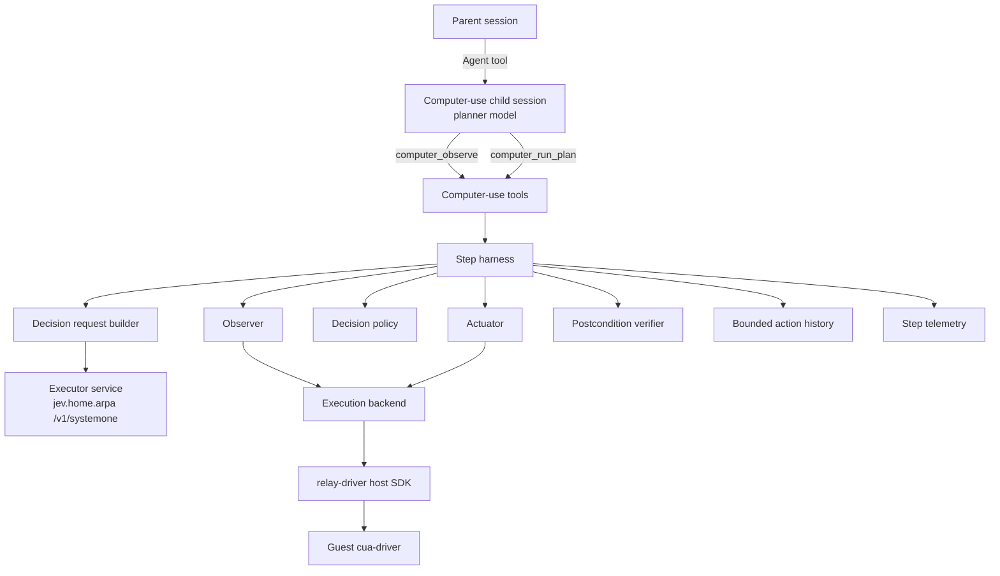
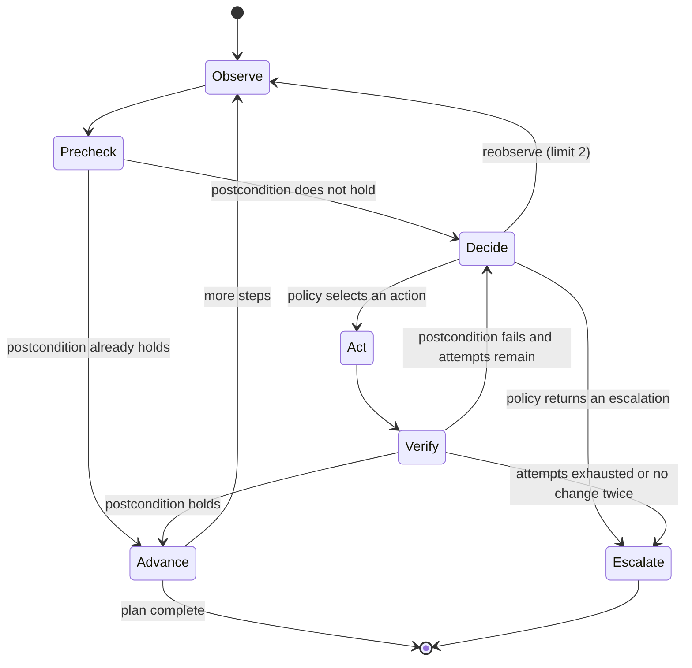
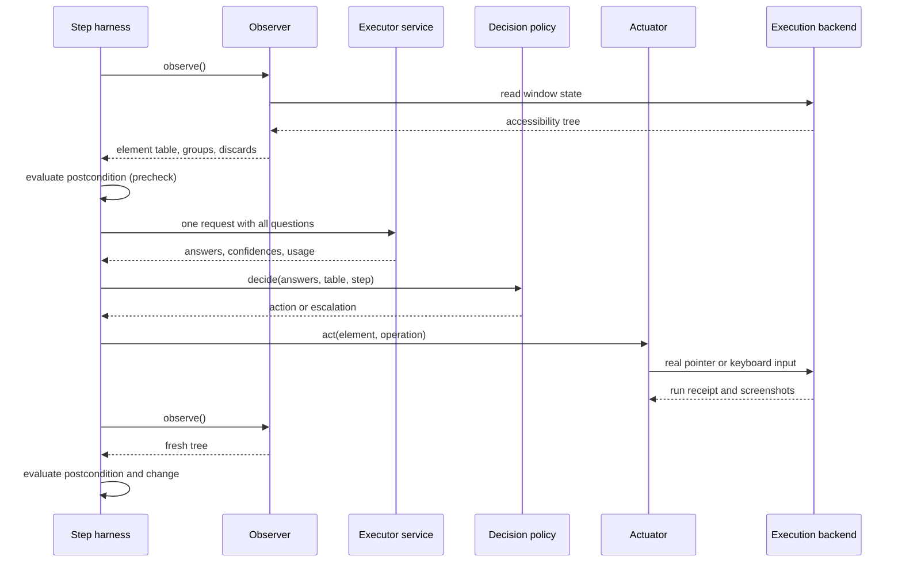

# Computer-Use Subagent: Planner and Executor Design

**Document type:** Software design specification.

**Status:** Draft for review, revised 2026-09-23 after rebasing onto `e382c85`. Nothing in this document is implemented. The revision corrects the relay integration in Sections 2.3 and 11.2, the agent definition in Section 4.3, and the tree input in Section 6.1. A second revision on the same day records the Phase 1 findings in Sections 4.3, 4.5, 6.1 and 11.1. Phase 1 of the plan implements `computer_observe` with the local driver backend; the remaining sections are not implemented. No requirement or interaction design for computer use has been approved yet. [Section 2.1](#21-required-outcomes-pending-approval) states the outcomes this design assumes, and those outcomes must move into the requirements document before implementation starts.

**Evidence:** [Planner and executor investigation](../research/computer-use-s0-s1.md), measured on 2026-09-22.

**Related documents:** [Subagent architecture](subagents.md), [request-time context injection](request-context.md), and [documentation responsibilities](../README.md).

## 1. Purpose and scope

This document specifies a computer-use subagent that operates a desktop application through its accessibility tree. It uses two model tiers and a deterministic harness.

- The **planner** is a large language model that runs as the subagent's own model. It reads the window, writes a plan, and handles escalations. The planner is called System 0 in the investigation.
- The **executor** is a structured-decision service that answers multiple-choice questions. It makes one decision per plan step. The executor is called System 1 in the investigation.
- The **harness** is ordinary code. It owns observation, routing, action execution, verification, memory and escalation.

The design goal is to keep per-step decisions out of the planner's conversation. Token savings are not the goal, because the executor spends more tokens per decision than the planner would ([research Section 5](../research/computer-use-s0-s1.md#5-findings)).

### 1.1 In scope

- The first release covers a planner tool contract, a plan schema, and postconditions that code can evaluate.
- It covers the observation pipeline from an accessibility tree to a numbered element table.
- It covers one executor request per step, the decision policy in code, and action execution through the virtual machine relay.
- It covers verification, bounded memory, a typed escalation contract, telemetry and a verification plan.

### 1.2 Out of scope

- The first release does not operate the user's own interactive desktop. It operates only a desktop inside a relay-managed virtual machine.
- It does not patch the executor service's 26-alternative limit ([Section 13](#13-open-questions)).
- It does not generate free text with the executor. Every literal value comes from the plan.
- It does not change the subagent runtime, the model fallback list semantics, or the shared inference services.
- It does not add a user interface beyond what the subagent fleet view already shows.

## 2. Design inputs

### 2.1 Required outcomes pending approval

These outcomes are assumptions of this design. They are not approved requirements.

- A parent agent can delegate a desktop task in natural language and receive a compact outcome report.
- The report states whether the task completed, which steps ran, and why work stopped when it stopped early.
- A wrong or uncertain action stops the run with a stated reason instead of continuing silently.
- The run never performs a destructive action that the plan did not authorize.
- Every step leaves evidence that lets a maintainer decide whether a failure came from finding the element or from choosing it.

### 2.2 Constraints from the executor service

These constraints come from the [research record](../research/computer-use-s0-s1.md).

- A choice question accepts at most 26 alternatives, labelled `A` to `Z`. A request with 27 alternatives fails validation with HTTP 422.
- The executor model length is 4,096 tokens for the whole request and answer.
- Several questions asked in one stage are faster and more accurate than questions staged with `depends_on` or `alone`.
- Confidences from independent questions are not comparable, and a wrong answer was observed at 0.99 confidence.
- A routing question with one speculative element question per group reached 12/12 end to end over 103 candidates.
- A name-only element list costs roughly seven input tokens per element.

### 2.3 Constraints from the relay

These constraints come from the `pi-vm-relay` and `relay-driver` repositories as of 2026-09-23.

- The relay runs guest commands through `run` actions. A `cua` run forwards one `cua-driver` tool call to the guest and returns its standard output, capped at 64 KiB.
- Each run captures a before screenshot and an after screenshot in PNG format, and each capture has a 60-second timeout.
- The relay refuses direct accessibility activation and value setting unless the run declares `inputMode: "accessibility"`.
- Owner decision D3 in `relay-driver/docs/decisions.md` says that ordinary interactions use real pointer and keyboard input. Accessibility may discover controls, resolve coordinates and observe state. Direct accessibility activation is reserved for tests of accessibility behavior and must be identified in the evidence.
- `pi-vm-relay` registers one model-facing `relay` tool and exports no library API.
- The `relay-driver` host SDK, `@relay-driver/host-sdk`, runs commands, scripts and evidence packaging on a session that is already connected. It does not acquire a virtual machine, stage `cua-driver`, or hold the owner lock. Those steps live in `pi-vm-relay/src/manager.ts` and `pi-vm-relay/src/vm-service.ts`.
- A `cua` run is an `exec` of `cua-driver call <tool> --json <args>` on the guest.
- A lease covers one virtual machine. Failed or uncertain operations are never replayed automatically, and the relay keeps the machine after a failure for repair.
- No per-operation latency of the relay has been measured.

#### 2.3.1 Constraints from `cua-driver`

These facts come from `cua-driver describe get_window_state` for version 0.12.6.

- The window-state call returns a structured `elements` array. Each entry has `element_index`, `role`, `label`, `value`, `frame` with `x`, `y`, `w` and `h`, `parent_index` and `depth`.
- The call also returns a Markdown rendering of the tree, which is kept for older callers.
- The call returns a screenshot unless `include_screenshot` is `false`. The tree-only form avoids the image cost and the capture latency.
- The walk is capped at 2,000 elements and a depth of 25 by default. The `max_elements` and `max_depth` inputs lower the caps, and both outputs are truncated together.
- The element index map is replaced by the next window-state call, so an index is valid only for the latest snapshot.
- The tool's own description warns that the tree can be wrong on some surfaces. Examples are Electron echo confirmations, null values in Catalyst apps, and virtualized off-screen rows whose frame height is 1.

### 2.4 Constraints from Secretary

- The subagent subsystem must not know other subsystems' tools by name ([subagent architecture Section 11](subagents.md#11-subsystem-independence)).
- Secretary ships no model fallback lists. The user's configuration already defines a `computer-use` list whose first member is `litellm/qwen3.8-27b`.
- Secretary configuration can assign a model to any definition name through `agents.subagentModels`, without editing the definition ([subagent architecture Section 5.3](subagents.md#53-model-fallback-lists)).
- Packaged definitions are files under `extensions/secretary/agents/definitions/`, which belongs to the subagent module ([subagent architecture Section 5.2](subagents.md#52-packaged-definitions)).
- Child sessions run headless and must not assume a user interface ([subagent architecture Section 8.3](subagents.md#83-child-ui-capabilities)).

## 3. Decisions

| Decision | Rationale | Evidence |
| --- | --- | --- |
| The planner runs once per plan and once per escalation, never once per step. | The design goal is to keep per-step decisions out of the planner's conversation. | [Research Section 5](../research/computer-use-s0-s1.md#5-findings) |
| The executor receives one request per step, and every question is answered in one stage. | Staged questions were slower and less accurate. | [Research Sections 4.2 and 4.3](../research/computer-use-s0-s1.md#42-question-coupling-on-a-list-of-buttons-n--12) |
| The element list uses name-only labels. | Accuracy was not separated, and the encoding used about 20 percent fewer tokens. | [Research Section 4.5](../research/computer-use-s0-s1.md#45-name-only-labels-compared-with-verbose-descriptors-n--8-26-candidates) |
| Lists longer than 26 use a routing question and one speculative element question per group. | This scored 12/12 and needs no service change. | [Research Section 4.8](../research/computer-use-s0-s1.md#48-a-routing-question-with-one-speculative-question-per-group-n--12) |
| Code never chooses between questions by comparing confidences. | A wrong answer was observed at 0.99 confidence while the correct question scored lower. | [Research Section 4.7](../research/computer-use-s0-s1.md#47-merging-independent-heads-by-confidence-n--8) |
| Confidence is a safety gate only. Errors are detected by postconditions and structural signals. | Wrong answers overlapped correct answers in confidence. | [Research Section 5](../research/computer-use-s0-s1.md#5-findings) |
| Actions use real pointer and keyboard input at coordinates resolved from the accessibility tree. | Owner decision D3 requires real input for ordinary work. This departs from the investigation's preference for accessibility activation. | [Section 2.3](#23-constraints-from-the-relay) |
| Every literal value comes from the plan. | The executor answers choices and cannot produce text. | [Research Section 6](../research/computer-use-s0-s1.md#6-prior-art-consulted) |
| Escalations are typed. | A typed reason tells the planner what kind of help is needed. | Cua `jev-use`, [research Section 6](../research/computer-use-s0-s1.md#6-prior-art-consulted) |
| Observation records the full tree, the reduced list and every discard reason. | Retrieval failure is the largest untested risk. | [Research Section 7](../research/computer-use-s0-s1.md#7-verification-limits) |

## 4. Architecture



### 4.1 Responsibilities

| Component | Responsibility |
| --- | --- |
| The child session | It runs the planner model through the existing subagent runtime. It calls the computer-use tools and reports the outcome to the parent. |
| The computer-use tools | They validate tool input, own the relay lease for the child session, and return compact results. |
| The step harness | It runs the per-step loop in [Section 9](#9-step-lifecycle), enforces budgets, and produces escalations. |
| The observer | It reads the accessibility tree, builds the element table, forms groups, and records discards. |
| The decision request builder | It composes one executor request per step and checks the request against the token budget. |
| The decision policy | It interprets executor answers, applies routing, compatibility and safety gates, and selects one action or one escalation. |
| The actuator | It performs the selected action with real input through the execution backend. |
| The postcondition verifier | It evaluates plan postconditions against a fresh tree, and it detects steps that changed nothing. |
| The bounded action history | It keeps the last few compact action records for the next executor request. |
| The step telemetry | It writes one record per step and one summary per plan run. |
| The execution backend | It hides the relay behind an interface so that tests can use a fake desktop. |

### 4.2 Module organization

The module is a new, independent capability. It does not import the subagent module, and the subagent module does not import it.

```text
extensions/secretary/computer-use/
  installation.ts        registers tools, reads configuration
  tools/
    schemas.ts           tool input and result schemas
    observe.ts
    run-plan.ts
  harness.ts             step loop and budgets
  observer.ts            tree parsing, element table, grouping
  request-builder.ts     executor request and token budget
  policy.ts              routing, gates, action selection
  actuator.ts            real-input actions
  verifier.ts            postconditions and change detection
  history.ts
  telemetry.ts
  executor-client.ts     HTTP client for /v1/systemone
  backend/
    backend.ts           execution backend interface
    relay-backend.ts     adapter for the pi-vm-relay enclosure manager
    local-backend.ts     development adapter for the host cua-driver
    cua-markdown.ts      descendant text from the driver's Markdown rendering
    fake-backend.ts      deterministic test desktop
  templates/
    computer-use.md      user-level agent definition template
```

### 4.3 Integration with the subagent subsystem

- The computer-use agent is a user-level definition in `<getAgentDir()>/agents/computer-use.md`. The computer-use module ships a template of this file and documents how to install it.
- The definition is not packaged with the subagent module. A packaged definition would place the computer-use tool names inside the subagent module, which [subagent architecture Section 11](subagents.md#11-subsystem-independence) forbids. It would also appear in the delegation catalog on machines where the relay and executor are not configured.
- The definition omits `model`. The user assigns the model with `agents.subagentModels`, for example `"computer-use": "computer-use"`, which resolves through the existing `computer-use` fallback list.
- The definition uses a `tools` allowlist, because this agent needs a hard capability bound ([subagent architecture Section 5.2](subagents.md#52-packaged-definitions)). The allowlist contains `computer_observe` and `computer_run_plan`. It excludes the model-facing `relay` tool, so that the child session has only one lease owner.
- The definition sets `background: true`, because a desktop task can take minutes.
- The subagent runtime launches, observes, cancels and resumes the child without any change. Cancellation of the child aborts the tool call in progress, and the harness stops at the next safe point defined in [Section 9](#9-step-lifecycle).
- `computer_observe` is registered only when `computerUse.backend` selects a backend. `computer_run_plan` additionally requires `executorUrl`. A missing configuration hides a tool rather than failing at call time, and an invalid configuration disables both tools with a diagnostic.

### 4.4 Planner model capability

- The planner benefits from a screenshot of the window. Qwen 3.8 27B accepts images ([research Section 2.1](../research/computer-use-s0-s1.md#21-planner-qwen-38-27b)).
- The current `computer-use` fallback list also contains models whose image support has not been checked. If the selected model does not accept images, `computer_observe` returns the element table without a screenshot and states that the screenshot was omitted.
- The tools read the resolved model's declared input types from the pi model registry. They do not guess from the model name.

### 4.5 Configuration

The module reads a top-level `computerUse` object from the same `secretary.json` files as the subagent configuration. Trusted project configuration overrides global configuration field by field. The subagent module does not read this object.

| Field | Meaning | Default |
| --- | --- | --- |
| `backend` | It selects `relay`, `local` or `none`. The value `none` leaves the tools unregistered. | `none` |
| `executorUrl` | It is the base address of the executor service. | None, so `computer_run_plan` stays unregistered. |
| `executorTimeoutMs` | It bounds one executor request. | 10,000, not measured. |
| `confidenceGate` | It is the gate in [Section 8](#8-decision-policy), rule 7. | 0.4, from prior art. |
| `answerReserveTokens` | It is the token reserve in [Section 7.3](#73-token-budget). | None. It must be calibrated in Phase 4 of the plan. |
| `maxElements` | It is the observer's element limit in [Section 6.3](#63-grouping). | 240, the largest measured list. |
| `maxTreeNodes` | It is the walk limit passed to `cua-driver` as `max_elements`. Reaching it marks the tree as truncated. | 2,000, the driver's own default. |
| `maxNameLength` | It truncates element names, because a text area's label can be the whole document. | 48, not measured. |
| `maxActionsPerPlan` | It is the action budget in [Section 9](#9-step-lifecycle). | 100, from prior art. |
| `maxEscalationsPerRun` | It is the escalation budget in [Section 9](#9-step-lifecycle). | 5, not measured. |
| `settleMs` | It is the wait between an action and the verifying observation. | 300, not measured. |
| `redactTypedText` | It replaces typed literals in telemetry with their length. | `true` |
| `allowLocalDesktop` | It acknowledges that the `local` backend operates this machine's desktop. | `false` |
| `localDriverPath` | It is the `cua-driver` executable used by the `local` backend. | `cua-driver` |

- Unknown fields in `computerUse` fail validation with an error that names the field.
- The `local` backend is accepted only when `allowLocalDesktop` is `true`, which is the developer setting in [Section 11.3](#113-local-driver-backend-for-development).

## 5. Planner contract

### 5.1 `computer_observe`

The planner calls this tool to see the target window before planning and after an escalation.

- **Input:** The input names the target application and, optionally, a window title.
- **Result:** The result contains the application name, the window title, the numbered element table in [Section 6.2](#62-element-table), the group names, an observation identifier, and a screenshot when the model accepts images.
- The element table in this result is the planner's view. It includes role and state, because the planner has a large context and the plan must name elements precisely.
- The observation identifier lets a later plan refer to the exact tree the planner saw.

### 5.2 `computer_run_plan`

The planner calls this tool with a complete plan. The tool returns only when the plan completes, when an escalation occurs, or when the call is cancelled.

**Plan fields:**

| Field | Meaning |
| --- | --- |
| `goal` | It is the task-level goal in one sentence. The executor sees it in every request. |
| `basedOn` | It is the observation identifier the plan was written against. |
| `steps` | It is an ordered list of steps with at most the configured step limit. |
| `allowDestructive` | It is a list of step identifiers that may perform destructive actions. It is empty by default. |

**Step fields:**

| Field | Meaning |
| --- | --- |
| `id` | It is a short identifier that is unique within the plan. |
| `intent` | It is one sentence that says what the step achieves, for example "Open the File menu." |
| `operation` | It is optional. It names the expected operation from [Section 7.2](#72-operations) when the planner knows it. |
| `text` | It is an optional literal string for text entry. It must be complete, because the executor cannot generate text. |
| `keys` | It is an optional key combination for a keyboard shortcut, for example `cmd+shift+n`. |
| `postcondition` | It is a predicate from [Section 5.3](#53-postconditions) that must hold after the step. |
| `maxAttempts` | It is optional. It limits how often the harness may retry the step after a failed postcondition. The default is 2. |

### 5.3 Postconditions

A postcondition is a small predicate over the accessibility tree. Code evaluates it, and the executor never judges it.

| Predicate | Holds when |
| --- | --- |
| `exists { name, role? }` | An element with this name, and this role when given, is present. |
| `absent { name, role? }` | No such element is present. |
| `value { name, equals }` | The named element's value equals the given string. |
| `window { titleContains }` | The frontmost window title contains the given string. |
| `changed` | The tree differs from the tree before the step. |
| `all [ ... ]` and `any [ ... ]` | All or any of the nested predicates hold. |

- The harness rejects a plan whose postconditions are malformed before it performs any action.
- A step whose only postcondition is `changed` is allowed, but its outcome is recorded as weakly verified.
- Predicates count only elements that are on screen, which means elements with a frame larger than 1 point in both dimensions. A closed menu's items are in the tree without frames, so `exists "Save"` would otherwise always hold.
- A name matches an element's label, value or descendant text ([Section 6.1](#61-reading-the-tree)), ignoring case and extra whitespace. `value` compares the value exactly.
- `changed` compares the role, label, value, state and rounded frame of every on-screen element before and after the step.
- A `focused` predicate was specified earlier and is withdrawn. `cua-driver` 0.12.6 reports no focus state, so code cannot evaluate it.

### 5.4 Result

The result is compact, because it enters the planner's conversation.

- The result states the outcome: `completed`, `escalated` or `cancelled`.
- The result lists each executed step with its identifier, the action taken, the element name, and the postcondition outcome.
- An escalated result includes the escalation from [Section 10](#10-escalation-contract) and a fresh observation, so the planner can replan without calling `computer_observe` again.
- The result states the number of executor decisions made during the call.

## 6. Observation

### 6.1 Reading the tree

- The observer reads the window through the `cua-driver` window-state call and parses the structured `elements` array ([Section 2.3.1](#231-constraints-from-cua-driver)).
- The structured array holds only indexed elements. The text that names many rows and cells, such as a sidebar's "Downloads", is an unindexed static-text child that appears only in the Markdown rendering. The backend therefore parses the Markdown for one purpose only: it attaches each unindexed static text to its nearest indexed ancestor. The observer uses that descendant text as a name when the element's own label and value are empty. The driver documents the Markdown shape as stable for text-parsing callers.
- The first read of each window in a backend's lifetime is a warm-up read, and its result is discarded. Safari's first read lacked the whole web area, and the second read had it.
- Step observations use the tree-only form. The planner's observation in `computer_observe` requests the screenshot.
- The relay caps standard output at 64 KiB, and `cua-driver` caps the walk at its element limit. When either cap truncates the tree, the observer must not treat the partial tree as complete. It returns the escalation `state_too_large`.
- A tree without a window element is a window that is still appearing. The observer returns `window_missing`, and the caller reads again after `settleMs`, at most twice. This was observed on the first read after a background launch of TextEdit.
- The observer discards every element that real input cannot target, and it records the reason:

| Reason | Condition |
| --- | --- |
| `container` | The role structures the window, for example `AXGroup`, `AXToolbar` or `AXMenu`. Containers are still used for grouping. |
| `no_frame` | The element has no frame, for example an item of a closed menu. |
| `collapsed_frame` | The frame is at most 1 point wide or high, for example a virtualized row. |
| `disabled` | The element reports `enabled: false`. |
| `inactive_menu_bar` | The element belongs to the menu bar of an application that is not active. |
| `outside_window` | The element's center lies outside the window frame, and it is not part of a menu. |
| `unnamed` | The element has no usable label or value. Automatic identifiers such as `_NS:834` do not count as names. |
| `behind_modal` | An open sheet covers the element. |

- The `inactive_menu_bar` rule exists because a background application's menu bar reports frames where the active application's menu bar is drawn. A real click there would reach another application. Window stacking order cannot replace this check, because a background launch raised TextEdit's window above the active application's window without activating TextEdit. Both behaviors were observed on 2026-09-23.
- Names collapse whitespace and are truncated to `maxNameLength`. A plain-text document's text area uses the document text as its label, so an untruncated name would copy the document into every request.
- The observer uses `parent_index` and `role` to find the containers used for grouping in [Section 6.3](#63-grouping).
- Each kept element keeps its `element_index` and its frame. The index is valid only for the snapshot that produced it, so an action always uses the frame from the latest snapshot.

### 6.2 Element table

- The executor's element table has one line per element. Each line holds a label letter and the element's name, without role or kind ([research Section 4.5](../research/computer-use-s0-s1.md#45-name-only-labels-compared-with-verbose-descriptors-n--8-26-candidates)).
- An element without an accessible name uses its value or its help text. An element with none of these is discarded with the reason `unnamed`.
- Elements are listed under their group name, in the same format that was measured in [research Section 4.8](../research/computer-use-s0-s1.md#48-a-routing-question-with-one-speculative-question-per-group-n--12).

### 6.3 Grouping

Groups exist so that no question exceeds 26 alternatives. Every element question reserves one alternative for `none` ([Section 7.1](#71-request-composition)), so a group holds at most 25 elements. The rule was evaluated on five recorded windows in Phase 2 and Phase 4 ([research Section 9](../research/computer-use-s0-s1.md#9-phase-2-to-4-observations-2026-09-23)).

1. A modal sheet or dialog, when present, is the only group. Elements behind it are discarded with the reason `behind_modal`.
2. An open menu, when present, forms its own group.
3. Otherwise, the observer forms groups from the nearest container with a landmark role, such as toolbar, outline or sidebar, tab group, table or list, and the remaining window content.
4. A group with more than 25 elements is split in reading order into consecutive groups, named `part 1`, `part 2` and so on.
5. A window with 25 elements or fewer forms a single group, and the request omits the routing question.
6. When the element count exceeds the configured maximum, the observer returns `state_too_large` rather than dropping elements silently.
7. A group records how many named elements of its container lie outside the window, such as rows below the visible part of a list.

- Real windows often lack landmark containers. Calculator's 106 buttons and a web page's links and form controls all fell into one content region, so the split parts carry no meaning. [Section 7.1](#71-request-composition) compensates by describing each region with its members' names.

### 6.4 Retrieval record

For every observation, the harness records the following items in the step telemetry.

- It records the full parsed tree.
- It records the element table in the form sent to the executor.
- It records every discarded element with its reason.
- It records the group assignment of every kept element.

With this record, a wrong answer can be classified as a retrieval failure, when the correct element was missing from the table, or as a judgment failure, when it was present but not chosen.

## 7. Executor request

### 7.1 Request composition

The harness sends one `POST /v1/systemone` request per step with `samples` set to 1.

**State fields:**

| Field | Contents |
| --- | --- |
| `goal` | It holds the plan goal. |
| `step` | It holds the current step's intent and, when given, the expected operation. |
| `app` and `window` | They hold the application name and window title. |
| `elements` | It holds the grouped element table from [Section 6.2](#62-element-table). |
| `recent` | It holds the last five action records, each with the step intent, the action, the element name and the postcondition outcome. |

**Questions, all answered in one stage:**

| Question | Present when | Alternatives |
| --- | --- | --- |
| `region` | The table has more than one group. | One alternative per group name. Each alternative's description lists the names of the group's elements and states how many more are hidden beyond the visible area. |
| `element_<n>` | Always, with one question per group. | The group's element letters, plus `none`, described as "None of these controls carries out the step." |
| `operation` | Always. | The operations in [Section 7.2](#72-operations), plus `reobserve` and `abstain`. |
| `risk` | Always. | `safe`, `reversible` and `destructive`. |

- The request never uses `depends_on` or `alone` ([research Section 4.3](../research/computer-use-s0-s1.md#43-question-coupling-on-a-mixed-role-list-of-26-candidates-n--48)).
- The `reobserve` alternative means that the window is changing or loading. The `abstain` alternative means that no listed element fits the step. Every question's instructions describe these meanings explicitly, because conventions must be stated rather than assumed.
- Region descriptions carry the member names because routing over meaningless part names failed. Over three seeds on recorded trees, judgment misses fell from 11 of 39 to 0 of 39 when the descriptions were added. The cost is more input tokens, up to 61 percent of the executor's model length on Calculator ([research Section 9.3](../research/computer-use-s0-s1.md#93-executor-decisions-on-recorded-trees)).
- Every element question offers `none` because the executor otherwise clicked some other control when the target was not listed. Over three seeds, such wrong actions fell from 16 of 18 to 7 of 18, while correct actions fell from 35 to 33 of 57.
- The request may carry the fork's `seed` extension for evaluation. Production requests omit it, so the server's default seed makes them deterministic.

### 7.2 Operations

| Operation | Effect | Literal source |
| --- | --- | --- |
| `press` | It clicks the element's frame center once. | None. |
| `double_press` | It double-clicks the element's frame center. | None. |
| `context_press` | It right-clicks the element's frame center. | None. |
| `enter_text` | It clicks the element's frame center, then presses one key per character. Characters outside the backend's key vocabulary are refused before any input. | The step's `text` field. |
| `key_combo` | It sends the key combination to the frontmost window. | The step's `keys` field. |
| `scroll_up` and `scroll_down` | They scroll by one page at the center of the chosen group's container. Containers are never element candidates, so a scroll targets a group rather than an element. This is how a target below the visible part of a list becomes reachable. | None. |

The builder offers only operations whose literal source is present. For example, `enter_text` is offered only when the step has a `text` field.

### 7.3 Token budget

- The builder estimates the request size before sending it. The estimate is calibrated to the measured cost of roughly seven tokens per element-table line ([research Section 4.6](../research/computer-use-s0-s1.md#46-cost-of-a-name-only-element-list-as-it-grows)).
- The request must leave the answer reserve free within the 4,096-token model length. The reserve is configurable and has no measured default yet.
- The harness first drops older `recent` records to fit the budget. If the request still does not fit, the harness returns `state_too_large`.
- After each response, telemetry records the service's `usage.input_tokens` next to the estimate, so that the estimator can be corrected from real data.

## 8. Decision policy

The policy runs in code after each response. It applies the following rules in order.

1. If the service is unreachable, times out, or returns an error, the policy returns `executor_unavailable`.
2. If `operation` is `reobserve`, the harness observes again and repeats the decision. It does this at most twice per step, and then it returns `no_progress`.
3. If `operation` is `abstain`, or the routed element question answers `none`, the policy returns `target_not_found`.
4. If the table has several groups, the policy reads the element answer from the question of the group chosen by `region`. It never compares confidences across questions ([research Section 4.7](../research/computer-use-s0-s1.md#47-merging-independent-heads-by-confidence-n--8)).
5. If the chosen element and operation are incompatible, the policy returns `uncertain`. For example, `enter_text` on an element that is not a text field is incompatible.
6. If `risk` is `destructive` and the step is not listed in `allowDestructive`, the policy returns `approval_required`. The risk answer can only add caution. It never authorizes an action.
7. If the confidence of the used `region`, element or `operation` answer is below the configured gate, the policy returns `uncertain` and includes the answers as a prior. The default gate is 0.4, which is taken from prior art and is not validated here.
8. Otherwise, the policy selects the element and operation for execution.

## 9. Step lifecycle



- **Observe:** The harness reads the tree. The after-tree of one step is reused as the before-tree of the next step, so one observation serves both.
- **Precheck:** The harness evaluates the postcondition before deciding. A step that is already satisfied is skipped without an executor request. This makes the "do nothing when the step is already done" convention explicit in code, following the lesson from Cua's forms specialist ([research Section 6](../research/computer-use-s0-s1.md#6-prior-art-consulted)).
- **Decide:** The harness sends one executor request and applies the policy.
- **Act:** The actuator performs one action.
- **Verify:** The harness waits for the configured settle interval, observes again, and evaluates the postcondition. It also compares the tree with the before-tree.
- **No change:** Two consecutive actions that change nothing in the tree end the step with `no_progress`, following `typesafe-computer-use`.
- **Budgets:** The harness stops with `budget_exhausted` when the plan exceeds the configured action limit. The default limit is 100 actions per `computer_run_plan` call, taken from prior art. A separate limit bounds escalations per child run, with a default of 5. Neither default is measured.
- **Cancellation:** The harness checks the tool's abort signal before each executor request and before each action. An action already sent to the relay is not interrupted, and its outcome is recorded.

### 9.1 One step in sequence



## 10. Escalation contract

An escalation ends the `computer_run_plan` call and returns control to the planner. The reasons adapt the typed contract from Cua `jev-use` and add reasons that this harness can detect.

| Reason | Raised when | Expected planner response |
| --- | --- | --- |
| `needs_text` | A step needs text that the plan did not supply. | Supply the literal text in a revised step. |
| `state_too_large` | The tree was truncated, or the table exceeds the element or token budget. | Narrow the target, for example by closing panels or choosing a smaller window. |
| `uncertain` | Confidence is below the gate, or the element and operation are incompatible. The answers are returned as a prior. | Confirm the prior or rewrite the step more specifically. |
| `target_not_found` | The executor abstained. | Check the returned observation and revise the step. |
| `postcondition_failed` | The postcondition still fails after all attempts. | Revise the step or the postcondition. |
| `no_progress` | Actions change nothing twice in a row, or the window keeps changing. | Inspect the returned screenshot and revise the approach. |
| `approval_required` | A destructive action was chosen for a step not listed in `allowDestructive`. | Add the step to `allowDestructive` only when the delegated task authorizes it. |
| `budget_exhausted` | The action limit was reached. | Report partial progress to the parent. |
| `executor_unavailable` | The executor service failed or timed out. | Report the failure. The planner must not perform the steps itself in this release. |
| `backend_failed` | The relay refused an action, reported an uncertain outcome, or lost the lease. | Report the failure. The harness never replays an uncertain action. |

- Every escalation carries the step identifier, the reason, the last executor answers, and a fresh observation when one can be taken.
- When the escalation limit is reached, the tool rejects further `computer_run_plan` calls in the child run, and the planner must report to the parent.

## 11. Execution backend

### 11.1 Interface

The backend interface has four operations.

- `readWindow(app, windowTitle?, withScreenshot)` returns the parsed elements, the screenshot when requested, whether the output was truncated, and whether the window's application is the active application.
- `act(action)` performs one real-input action and returns the relay's outcome kind.
- `screenshot()` returns the latest after-screenshot for the planner.
- `close(outcome)` finishes or releases the lease.

### 11.2 Relay backend

- The relay backend does not call the model-facing `relay` tool, because that tool is reachable only through a model.
- The host SDK alone is not enough, because acquisition, staging and the owner lock live in `pi-vm-relay`'s manager ([Section 2.3](#23-constraints-from-the-relay)). The recommended integration is a library entry point exported by `pi-vm-relay` that exposes its existing enclosure manager: acquire, stage, run, finish and release. This reuses the lease and evidence rules instead of copying them. It is a change to another repository and needs the owner's decision ([Section 13](#13-open-questions)).
- The backend acquires one lease on the first tool call of a child run and keeps it for the rest of that run.
- The backend releases the lease when the child run ends. It uses `finish` instead when the delegated task declares files to extract.
- Every read uses `inputMode: "ordinary"`. Every action uses real pointer or keyboard input at coordinates computed from the element's frame, as required by owner decision D3.
- The backend labels each relay step with the plan step identifier and intent, so that the relay's evidence package lines up with the step telemetry.
- An `uncertain` or `refused` outcome from the relay becomes `backend_failed`. The backend never retries such an action.
- Pixel actions take window-local screenshot pixels. The backend converts screen points by subtracting the window's current bounds and multiplying by a scale learned from a screenshot of that window. The driver's reported display scale cannot be used, because it reported 1.0 while a 656-point window produced a 1312-pixel screenshot.
- Text entry uses `press_key` once per character. `type_text` is not used, because it inserts text through accessibility first and falls back to keystrokes only when that fails. The documented `press_key` vocabulary covers letters, digits, space, return, tab and named keys, so other characters are refused until a real-keystroke path for them is found.

### 11.3 Local driver backend for development

- A second backend calls the host's own `cua-driver` directly. It exists so that the observer and the harness can be developed before the relay integration is available.
- It is a development backend. It is disabled unless a developer setting enables it, and it must target a disposable application window.
- It uses the same real-input policy as the relay backend.
- It finds the window through `list_windows`, checks the active application through `list_apps`, and reads the tree through `get_window_state`. It never launches, activates or clicks anything during observation.
- The `list_apps` call also scans installed applications and took about one second in Phase 1. A cheaper source of the active application is needed before per-step observation in Phase 5.

### 11.4 Accessibility activation mode

- Direct activation of an element by accessibility would avoid coordinate errors, and prior art prefers it.
- It is disabled by default because owner decision D3 reserves it for accessibility tests.
- If the user decides to allow it, it must be an explicit per-run option that the relay evidence labels as accessibility input.

## 12. Telemetry and metrics

### 12.1 Records

- Each step writes one record with the observation identifier, the retrieval record from [Section 6.4](#64-retrieval-record), the executor request and response, the policy result, the action, the relay execution identifier, and the postcondition result.
- Each `computer_run_plan` call writes a summary with the step count, the executor decision count, the escalation reason, and the latency totals.
- Records are written under the Secretary data directory, next to the agent records. Test runs write under the repository's ignored `test-results/` directory.
- Records may contain window contents and typed text. The configuration must allow text values to be redacted before they are written.

### 12.2 Metric definitions

Each metric has one formula for the life of this design, as required by the project's reporting rule.

| Metric | Formula |
| --- | --- |
| Executor decisions kept out of the planner | It is the count of executor requests whose answer was acted on or escalated, summed over a child run. |
| Planner turns per task | It is the count of planner model requests in the child run. |
| Executor round-trip latency, median (ms) | It is the harness-side time from sending a `/v1/systemone` request to receiving the full response, as the median over a run. This matches the formula in [research Section 3](../research/computer-use-s0-s1.md#3-measurement-method). |
| Step wall time, median (ms) | It is the time from the start of Observe to the end of Verify for one step, as the median over a run. |
| Retrieval miss rate | It is the fraction of reviewed wrong steps whose correct element was absent from the executor's table. |
| Judgment miss rate | It is the fraction of reviewed wrong steps whose correct element was present but not chosen. |

Step wall time includes the relay's screenshot captures, so it must not be compared with executor round-trip latency.

## 13. Open questions

| Question | Recommendation | Owner decision needed |
| --- | --- | --- |
| Should the 26-alternative limit be patched in the service? | Do not patch it. The routing question removes the need without changing shared infrastructure. | Yes, if a flat schema is preferred. |
| Is the grouping rule in [Section 6.3](#63-grouping) sound on real trees? | Validate it on recorded trees from at least three applications before implementing the executor path. | No. |
| How often is the correct element missing from the table? | Measured in Phase 2: 6 of 19 labelled intents, for four causes. The target was scrolled out of view, reachable only through a closed menu, disabled, or an unnamed title-bar button ([research Section 9.2](../research/computer-use-s0-s1.md#92-retrieval-on-recorded-trees)). The first three are correct exclusions, which the plan must handle with scroll, menu or shortcut steps. | No. |
| How does a step reach a target below the visible part of a list? | The executor never chose to scroll in 18 unlisted-target cases, even with the hidden count in the request. Scrolling must come from the plan or from a harness-side search of hidden names; this is unresolved. | No. |
| How does a step close or zoom a window? | The title-bar buttons have no name in the tree. The planner should use key combinations such as `cmd+w` until the driver exposes their names. | No. |
| Should actions use direct accessibility activation? | Keep real input by default, as owner decision D3 requires. | Yes, because D3 is an owner decision. |
| What does a real screenshot cost the planner? | Measured in Phase 1: the cost is proportional to pixel area, and a 1312×844 window screenshot costs 1,068 input tokens on Qwen 3.8 27B ([research Section 8](../research/computer-use-s0-s1.md#8-phase-1-observations-2026-09-23)). Choose the default image scale when the planner prompt is written in Phase 6. | No. |
| Should the executor also receive screenshots? | Do not send them in the first release. The accessibility tree is the executor's only input until screenshot cost is measured. | No. |
| Should the fallback list keep models without image input? | Remove them, or accept planning without screenshots when they are selected. | Yes, because the list is user configuration. |
| How does the computer-use module reach the relay's enclosure manager? | Export the existing manager from `pi-vm-relay` as a library entry point. Copying acquisition and staging into Secretary would create a second lease owner. | Yes, because it changes `pi-vm-relay`. |
| What does one relay run cost in latency? | Measure the relay round trip for a read and for an action before setting settle intervals and budgets. | No. |
| May the planner perform steps itself when the executor is unavailable? | Not in the first release. The escalation reports the failure instead. | Yes, if a degraded mode is wanted. |

## 14. Verification plan

- **Deterministic unit tests:** They cover the plan schema, postcondition evaluation, grouping, request building, token budgeting and every policy rule, with fixed trees and fixed executor answers.
- **Harness tests with the fake backend:** They run whole plans against a scripted desktop. They cover precheck skips, retries, both no-progress cases, every escalation reason, cancellation at each safe point, and the rule that uncertain relay outcomes are never replayed.
- **Recorded-tree evaluation:** It runs the observer and a live executor against accessibility trees recorded from real applications. It reports retrieval and judgment misses separately. This evaluation answers the grouping and near-miss questions in [Section 13](#13-open-questions).
- **Live acceptance:** It runs complete delegated tasks in a relay virtual machine with the real planner and executor. It must record the relay evidence package and the step telemetry.
- Generated output from every layer goes under `test-results/`, as required by the [test artifact policy](../testing/test-artifacts.md).
- None of these checks has been executed. This document is a design, and its claims are not verified behavior.

## 15. References

- [Planner and executor investigation](../research/computer-use-s0-s1.md) records the measurements and prior art.
- [Subagent architecture](subagents.md) defines definitions, model fallback lists, headless children and subsystem independence.
- `relay-driver/docs/decisions.md`, decision D3, defines the real-input policy.
- `pi-vm-relay/src/schema.ts` and `pi-vm-relay/src/manager.ts` define the relay actions, run kinds and input-mode checks.
- `mmastrac/djev-spark` at revision `1444f3e`, `server/structured_server.py`, defines the executor service's alternative limit.
