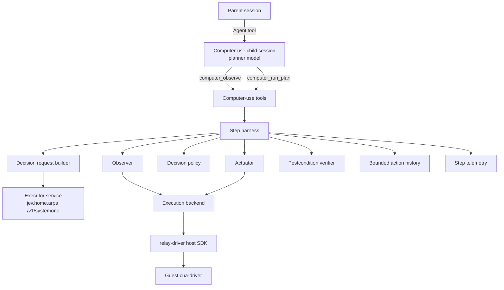
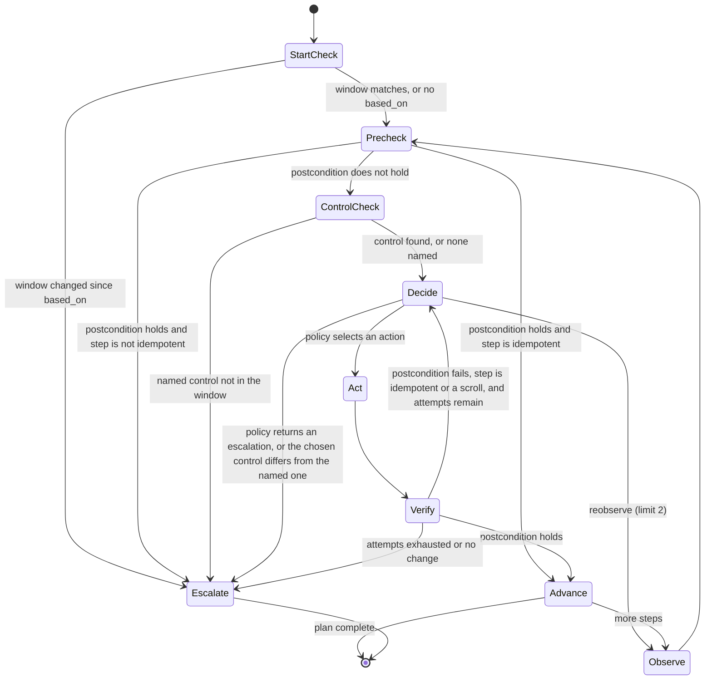
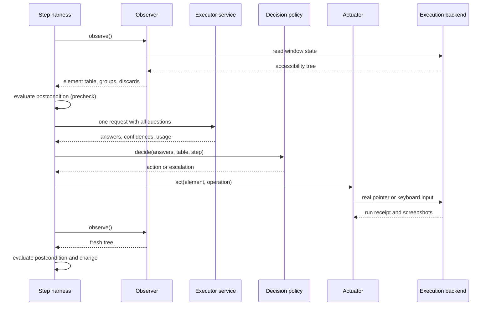

# Computer-Use Subagent: Planner and Executor Design

**Document type:** Software design specification.

**Status:** Draft for review, revised 2026-09-24. Plan phases 1 to 5 are implemented with the local driver backend, and Pi ran them in relay virtual machines ([research Sections 11 to 14](../research/computer-use-s0-s1.md#11-first-checks-through-pi-2026-09-23)). The requirements, CU-01 to CU-07, were approved on 2026-09-24 ([Section 2.1](#21-required-outcomes)). Sections 2.3 and 11.2 were revised on 2026-09-24 for the move from `pi-vm-relay` to `mcp-vm-relay`. The agent definition of Section 4.3 and the relay client of Section 11.2 are not implemented. No interaction design for computer use has been approved.

**Evidence:** [Planner and executor investigation](../research/computer-use-s0-s1.md), measured on 2026-09-22.

**Related documents:** [Subagent architecture](subagents.md), [request-time context injection](request-context.md), and [documentation responsibilities](../README.md).

## 1. Purpose and scope

This document specifies a computer-use subagent that operates a desktop application through its accessibility tree. It uses two model tiers and a deterministic harness.

- The **planner** is a large language model that runs as the subagent's own model. It reads the window, writes a plan, and handles escalations. The planner is called System 0 in the investigation.
- The **executor** is a structured-decision service that answers multiple-choice questions. It makes one decision per plan step. The executor is called System 1 in the investigation.
- The **harness** is ordinary code. It owns observation, routing, action execution, verification, memory and escalation.

The design goal is to keep per-step decisions out of the planner's conversation. Token savings are not the goal, because the executor spends more tokens per decision than the planner would ([research Section 5](../research/computer-use-s0-s1.md#5-findings)).

### 1.1 In scope

- The first release covers a planner tool contract, a plan schema, and postconditions that code can evaluate.
- It covers the observation pipeline from an accessibility tree to a numbered element table.
- It covers one executor request per step, the decision policy in code, and action execution through the virtual machine relay.
- It covers verification, bounded memory, a typed escalation contract, telemetry and a verification plan.

### 1.2 Out of scope

- The first release does not operate the user's own interactive desktop. It operates only a desktop inside a relay-managed virtual machine.
- It does not patch the executor service's 26-alternative limit ([Section 13](#13-open-questions)).
- It does not generate free text with the executor. Every literal value comes from the plan.
- It does not change the subagent runtime, the model fallback list semantics, or the shared inference services.
- It does not add a user interface beyond what the subagent fleet view already shows.

## 2. Design inputs

### 2.1 Required outcomes

These outcomes are approved requirements. The owner approved them on 2026-09-24 as stories CU-01 to CU-07 in the [requirements document](../user-stories/computer-use.md), which also adds outcomes learned from the live checks.

- A parent agent can delegate a desktop task in natural language and receive a compact outcome report.
- The report states whether the task completed, which steps ran, and why work stopped when it stopped early.
- A wrong or uncertain action stops the run with a stated reason instead of continuing silently.
- The run never performs a destructive action that the plan did not authorize.
- Every step leaves evidence that lets a maintainer decide whether a failure came from finding the element or from choosing it.

### 2.2 Constraints from the executor service

These constraints come from the [research record](../research/computer-use-s0-s1.md).

- A choice question accepts at most 26 alternatives, labelled `A` to `Z`. A request with 27 alternatives fails validation with HTTP 422.
- The executor model length is 4,096 tokens for the whole request and answer.
- Several questions asked in one stage are faster and more accurate than questions staged with `depends_on` or `alone`.
- Confidences from independent questions are not comparable, and a wrong answer was observed at 0.99 confidence.
- A routing question with one speculative element question per group reached 12/12 end to end over 103 candidates.
- A name-only element list costs roughly seven input tokens per element. The list with roles, used since 2026-09-26, cost 942 tokens for the live Calculator read against 881 for names only ([research Section 16.7](../research/computer-use-s0-s1.md#167-element-detail-for-the-executor)).

### 2.3 Constraints from the relay

These constraints come from the `mcp-vm-relay` and `relay-driver` repositories as of 2026-09-24. The owner retired `pi-vm-relay` in Pi on 2026-09-24. Pi now reaches the relay through `pi-mcp-adapter`, which runs the `mcp-vm-relay` server and exposes its `relay` tool to the model.

- The relay runs guest commands through `run` actions. A `cua` run forwards one `cua-driver` tool call to the guest and returns its standard output. The guest receiver stops the command once its output passes 64 KiB and reports `outputTruncated` (`mcp-vm-relay/src/guest/receiver.ts`, `MAX_OUTPUT_BYTES`). The cap is a constant, not a run option.
- The element array of one recorded Finder read, the fixture folder of the Pi batches with 379 elements, was 66,253 bytes as compact JSON, before the driver's Markdown rendering. A `cua` run of `get_window_state` would therefore be cut off for that window.
- Each run captures a before screenshot and an after screenshot in PNG format, and each capture has a 60-second timeout.
- The relay refuses direct accessibility activation and value setting unless the run declares `inputMode: "accessibility"`.
- Owner decision D3 in `relay-driver/docs/decisions.md` says that ordinary interactions use real pointer and keyboard input. Accessibility may discover controls, resolve coordinates and observe state. Direct accessibility activation is reserved for tests of accessibility behavior and must be identified in the evidence.
- `mcp-vm-relay` is a Model Context Protocol server over standard input and output. Its package has a binary and no library export. It offers one `relay` tool with the actions `acquire`, `stage`, `run`, `extract`, `finish` and `release`, among others.
- One server session owns at most one virtual machine. The environment variable `MCP_VM_RELAY_SESSION` names the session, and a restarted server with the same name reconciles its ownership without replaying work.
- When the server's standard input closes, lease renewal pauses and the machine is kept for an explicit `finish` or `release`. The lease's time limit is the backstop.
- Every run except a diagnostic `exec` captures a before and an after screenshot of the whole display, and each run must declare `snapshots.afterIntervalMs`. The display screenshots in the Pi batches were 4.8 to 11 MB each.
- `pi-mcp-adapter` lets other extensions register servers, read status snapshots and reuse OAuth tokens. It offers no way for another extension to call a server's tool.
- A `cua` run is an `exec` of `cua-driver call <tool> --json <args>` on the guest.
- A lease covers one virtual machine. Failed or uncertain operations are never replayed automatically, and the relay keeps the machine after a failure for repair.
- No per-operation latency of the relay has been measured.

#### 2.3.1 Constraints from `cua-driver`

These facts come from `cua-driver describe get_window_state` for version 0.12.6.

- The window-state call returns a structured `elements` array. Each entry has `element_index`, `role`, `label`, `value`, `frame` with `x`, `y`, `w` and `h`, `parent_index` and `depth`.
- The call also returns a Markdown rendering of the tree, which is kept for older callers.
- The call returns a screenshot unless `include_screenshot` is `false`. The tree-only form avoids the image cost and the capture latency.
- The walk is capped at 2,000 elements and a depth of 25 by default. The `max_elements` and `max_depth` inputs lower the caps, and both outputs are truncated together.
- The element index map is replaced by the next window-state call, so an index is valid only for the latest snapshot.
- The tool's own description warns that the tree can be wrong on some surfaces. Examples are Electron echo confirmations, null values in Catalyst apps, and virtualized off-screen rows whose frame height is 1.

### 2.4 Constraints from Secretary

- The subagent subsystem must not know other subsystems' tools by name ([subagent architecture Section 11](subagents.md#11-subsystem-independence)).
- Secretary ships no model fallback lists. The user's configuration already defines a `computer-use` list whose first member is `litellm/qwen3.8-27b`.
- Secretary configuration can assign a model to any definition name through `agents.subagentModels`, without editing the definition ([subagent architecture Section 5.3](subagents.md#53-model-fallback-lists)).
- Packaged definitions are files under `extensions/secretary/agents/definitions/`, which belongs to the subagent module ([subagent architecture Section 5.2](subagents.md#52-packaged-definitions)).
- Child sessions run headless and must not assume a user interface ([subagent architecture Section 8.3](subagents.md#83-child-ui-capabilities)).

## 3. Decisions

| Decision | Rationale | Evidence |
| --- | --- | --- |
| The planner runs once per plan and once per escalation, never once per step. | The design goal is to keep per-step decisions out of the planner's conversation. | [Research Section 5](../research/computer-use-s0-s1.md#5-findings) |
| The executor receives one request per step, and every question is answered in one stage. | Staged questions were slower and less accurate. | [Research Sections 4.2 and 4.3](../research/computer-use-s0-s1.md#42-question-coupling-on-a-list-of-buttons-n--12) |
| The element list gives each clickable control's role, full name and state (PS-D5). This replaced name-only labels on 2026-09-26. | Name-only labels were as accurate on lists of buttons and used about 20 percent fewer tokens. They hid TextEdit's text area, and the role raised correct actions from 176 to 201 of 280 replayed decisions. | [Research Sections 4.5](../research/computer-use-s0-s1.md#45-name-only-labels-compared-with-verbose-descriptors-n--8-26-candidates) and [16.7](../research/computer-use-s0-s1.md#167-element-detail-for-the-executor) |
| Lists longer than 26 use a routing question and one speculative element question per group. | This scored 12/12 and needs no service change. | [Research Section 4.8](../research/computer-use-s0-s1.md#48-a-routing-question-with-one-speculative-question-per-group-n--12) |
| Code never chooses between questions by comparing confidences. | A wrong answer was observed at 0.99 confidence while the correct question scored lower. | [Research Section 4.7](../research/computer-use-s0-s1.md#47-merging-independent-heads-by-confidence-n--8) |
| Confidence is a safety gate only. Errors are detected by postconditions and structural signals. | Wrong answers overlapped correct answers in confidence. | [Research Section 5](../research/computer-use-s0-s1.md#5-findings) |
| Actions use real pointer and keyboard input at coordinates resolved from the accessibility tree. | Owner decision D3 requires real input for ordinary work. This departs from the investigation's preference for accessibility activation. | [Section 2.3](#23-constraints-from-the-relay) |
| Only an accessibility test sends accessibility events. Ordinary work sends pointer input in screen coordinates, synthesized key events, or, for browser pages, Chrome DevTools Protocol input, and the harness checks the input path of every action (PS-D8). | The driver turned window-pixel clicks into accessibility presses on the iOS Simulator, and the menu bar is reachable only in screen coordinates. | [Section 11.4](#114-input-mode), [research Section 16.8](../research/computer-use-s0-s1.md#168-driver-input-probes-and-the-ios-simulator) |
| Every element has a platform, assigned by the harness from its position, and each platform has a closed action allowlist (PS-D6, PS-D7). | One Simulator window holds macOS and iOS elements with the same roles, and the planner confused a key press with a click. | [Sections 6.5](#65-platform-of-each-element) and [7.2](#72-actions) |
| Before a plan runs, the executor reads each step's intent against the allowlist, and code edits a step's action fields when the executor disagrees with confidence (PS-D7). | All 7 recorded steps that said "Press Return" with the click action clicked instead of pressing the key. | [Section 5.5](#55-intent-and-field-consistency) |
| Every literal value comes from the plan. | The executor answers choices and cannot produce text. | [Research Section 6](../research/computer-use-s0-s1.md#6-prior-art-consulted) |
| Escalations are typed. | A typed reason tells the planner what kind of help is needed. | Cua `jev-use`, [research Section 6](../research/computer-use-s0-s1.md#6-prior-art-consulted) |
| Observation records the full tree, the reduced list and every discard reason. | Retrieval failure is the largest untested risk. | [Research Section 7](../research/computer-use-s0-s1.md#7-verification-limits) |
| A check before a plan runs rejects only a plan that cannot run, or one that asks to repeat an action that could take effect twice. It never rejects a plan on a guess about what the planner meant or about a future screen. | A check before the run understands only part of what the runtime supports, so a guessing rule rejects correct plans. Owner decision [PS-D3](../decisions.md). | [Research Sections 16.2 and 16.3](../research/computer-use-s0-s1.md#162-calculator-with-thinking-off) |
| A step names its control from the observation, and the harness confirms that control in each fresh read before it acts. | The plan is built from controls the window offers. The planner's output is not bound by the tool schema, so the runtime check remains. Owner decision [PS-D4](../decisions.md). | [Research Section 16.3](../research/computer-use-s0-s1.md#163-review-of-the-plan-check) |
| A plan stops before its first action when its window changed since the observation it was written against. | A replay over 61 recorded plans stopped 3, all of which failed when they ran, and stopped no plan that completed. Owner decision [PS-D4](../decisions.md). | [Research Section 16.1](../research/computer-use-s0-s1.md#161-a-plan-start-window-check-replayed) |

## 4. Architecture



### 4.1 Responsibilities

| Component | Responsibility |
| --- | --- |
| The child session | It runs the planner model through the existing subagent runtime. It calls the computer-use tools and reports the outcome to the parent. |
| The computer-use tools | They validate tool input, own the relay lease for the child session, and return compact results. |
| The step harness | It runs the per-step loop in [Section 9](#9-step-lifecycle), enforces budgets, and produces escalations. |
| The observer | It reads the accessibility tree, builds the element table, forms groups, and records discards. |
| The decision request builder | It composes one executor request per step and checks the request against the token budget. |
| The decision policy | It interprets executor answers, applies routing, compatibility and safety gates, and selects one action or one escalation. |
| The actuator | It performs the selected action with real input through the execution backend. |
| The postcondition verifier | It evaluates plan postconditions against a fresh tree, and it detects steps that changed nothing. |
| The bounded action history | It keeps the last few compact action records for the next executor request. |
| The step telemetry | It writes one record per step and one summary per plan run. |
| The execution backend | It hides the relay behind an interface so that tests can use a fake desktop. |

### 4.2 Module organization

The module is a new, independent capability. It does not import the subagent module, and the subagent module does not import it.

```text
extensions/secretary/computer-use/
  installation.ts        registers tools, reads configuration
  tools/
    schemas.ts           tool input and result schemas
    observe.ts
    run-plan.ts
  harness.ts             step loop and budgets
  observer.ts            tree parsing, element table, grouping
  request-builder.ts     executor request and token budget
  policy.ts              routing, gates, action selection
  actuator.ts            real-input actions
  verifier.ts            postconditions and change detection
  history.ts
  telemetry.ts
  executor-client.ts     HTTP client for /v1/systemone
  backend/
    backend.ts           execution backend interface
    relay-client.ts     client of an mcp-vm-relay server session
    local-backend.ts     development adapter for the host cua-driver
    cua-markdown.ts      descendant text from the driver's Markdown rendering
    fake-backend.ts      deterministic test desktop
  templates/
    computer-use.md      user-level agent definition template
```

### 4.3 Integration with the subagent subsystem

- The computer-use agent is a user-level definition in `<getAgentDir()>/agents/computer-use.md`. The computer-use module ships the template `extensions/secretary/computer-use/templates/computer-use.md`, and the README documents how to install it.
- The template's instructions carry the planner lessons of the Pi batches ([research Section 14](../research/computer-use-s0-s1.md#14-pi-task-batch-2026-09-23)): do only what the task asks, check names of controls and files with `exists` or `selected`, pass `window_title` and `based_on`, and report only what code verified. They also carry CU-05: a result already on screen is reported as such.
- The definition is not packaged with the subagent module. A packaged definition would place the computer-use tool names inside the subagent module, which [subagent architecture Section 11](subagents.md#11-subsystem-independence) forbids. It would also appear in the delegation catalog on machines where the relay and executor are not configured.
- The definition omits `model`. The user assigns the model with `agents.subagentModels`, for example `"computer-use": "computer-use"`, which resolves through the existing `computer-use` fallback list.
- The definition uses a `tools` allowlist, because this agent needs a hard capability bound ([subagent architecture Section 5.2](subagents.md#52-packaged-definitions)). The allowlist contains `computer_observe` and `computer_run_plan`. It excludes the model-facing `relay` tool, so that the child session has only one lease owner.
- The definition sets `background: true`, because a desktop task can take minutes. Background agents need the interactive terminal or RPC mode, so a `pi --print` parent cannot delegate to this definition.
- The definition sets `thinking: off`, so the child does not think before each reply, whatever the parent's thinking level is. This is a temporary choice for `litellm/qwen3.8-27b`, which has a known problem with thinking, until enough run data exists to fine-tune the model. The model maps `off` to the reasoning effort `none`.
- A child's effective tools are the parent's tools intersected with the definition's allowlist ([subagent architecture Section 5](subagents.md#5-agent-definitions-and-model-resolution)). The computer-use tools are therefore registered in the parent session too, and the parent's own model can call them. CU-01 keeps per-step details out of the parent's conversation only when the parent delegates.
- The subagent runtime launches, observes, cancels and resumes the child without any change. Cancellation of the child aborts the tool call in progress, and the harness stops at the next safe point defined in [Section 9](#9-step-lifecycle).
- `computer_observe` is registered only when `computerUse.backend` selects a backend. `computer_run_plan` additionally requires `executorUrl`. A missing configuration hides a tool rather than failing at call time, and an invalid configuration disables both tools with a diagnostic.
- Tools are registered at the first session start of the extension instance. A later session whose configuration lacks the executor rejects `computer_run_plan` calls. A configuration that gains the executor takes effect after a reload.

### 4.4 Planner model capability

- The planner benefits from a screenshot of the window. Qwen 3.8 27B accepts images ([research Section 2.1](../research/computer-use-s0-s1.md#21-planner-qwen-38-27b)).
- The current `computer-use` fallback list also contains models whose image support has not been checked. If the selected model does not accept images, `computer_observe` returns the element table without a screenshot and states that the screenshot was omitted.
- The tools read the resolved model's declared input types from the pi model registry. They do not guess from the model name.

### 4.5 Configuration

The module reads a top-level `computerUse` object from the same `secretary.json` files as the subagent configuration. Trusted project configuration overrides global configuration field by field. The subagent module does not read this object.

| Field | Meaning | Default |
| --- | --- | --- |
| `backend` | It selects `relay`, `local` or `none`. The value `none` leaves the tools unregistered. | `none` |
| `executorUrl` | It is the base address of the executor service. | None, so `computer_run_plan` stays unregistered. |
| `executorTimeoutMs` | It bounds one executor request. | 10,000, not measured. |
| `confidenceGate` | It is the gate in [Section 8](#8-decision-policy), rule 7. | 0.4, from prior art. |
| `answerReserveTokens` | It is the answer reserve in [Section 7.3](#73-token-budget). | 128, the largest answer one executor read can need ([research Section 13](../research/computer-use-s0-s1.md#13-executor-token-budget-2026-09-23)). |
| `maxElements` | It is the observer's element limit in [Section 6.3](#63-grouping). | 240, the largest measured list. |
| `maxTreeNodes` | It is the walk limit passed to `cua-driver` as `max_elements`. Reaching it marks the tree as truncated. | 2,000, the driver's own default. |
| `maxNameLength` | It truncates element names, because a text area's label can be the whole document. | 48, not measured. |
| `maxActionsPerPlan` | It is the action budget in [Section 9](#9-step-lifecycle). | 100, from prior art. |
| `maxEscalationsPerRun` | It is the escalation budget in [Section 9](#9-step-lifecycle). | 5, not measured. |
| `settleMs` | It is the wait between an action and the verifying observation. | 300, not measured. |
| `redactTypedText` | It replaces typed literals in telemetry with their length. | `true` |
| `allowLocalDesktop` | It acknowledges that the `local` backend operates this machine's desktop. | `false` |
| `localDriverPath` | It is the `cua-driver` executable used by the `local` backend. | `cua-driver` |
| `foregroundDelivery` | It sends clicks and menu shortcuts with the driver's foreground delivery ([Section 11.3](#113-local-driver-backend-for-development)). | `true` |
| `stepPictures` | It records a picture of the target window before and after each action, and writes a review page ([Section 12.1](#121-records)). | `false` |
| `relayCommand` | It is the command that starts the relay client's own `mcp-vm-relay` server ([Section 11.2](#112-relay-client)). | `npx -y --prefer-offline @wezzard/mcp-vm-relay@0.6.1`, the version installed in Pi on 2026-09-26. The live checks up to 2026-09-26 ran on 0.4.0 ([research Section 16.6](../research/computer-use-s0-s1.md#166-relay-061)). Without `--prefer-offline`, a registry request reset by the network kept `npx` retrying past the client's 60-second start limit in 3 of 3 starts. |
| `relayImage` | It is the relay image key passed to `acquire`. | None; the `relay` backend requires it. |
| `relayEnv` | It is the relay credential pack passed to `acquire` as `env`. | None. |
| `relayPrepare` | It lists commands, each an argument array, that the relay client runs in the machine once after staging, such as `["/usr/bin/open", "-a", "Calculator"]`. The tools do not launch applications, so a task that needs one open declares it here. | Empty. |
| `relayTtlHours` | It is the lease time limit passed to `acquire`. It ends the machine if the child run ends without `finish`. | 2, not measured. |

- Unknown fields in `computerUse` fail validation with an error that names the field.
- The `local` backend is accepted only when `allowLocalDesktop` is `true`, which is the developer setting in [Section 11.3](#113-local-driver-backend-for-development).
- The `relay` backend is accepted only when `relayImage` is set.

## 5. Planner contract

### 5.1 `computer_observe`

The planner calls this tool to see the target window before planning and after an escalation.

- **Input:** The input names the target application and, optionally, a window title.
- **Result:** The result contains the application name, the window title, the numbered element table in [Section 6.2](#62-element-table), the group names, an observation identifier, and a screenshot when the model accepts images.
- The element table in this result is the planner's view. It includes role and state, because the planner has a large context and the plan must name elements precisely.
- The observation identifier lets a later plan refer to the exact tree the planner saw.

### 5.2 `computer_run_plan`

The planner calls this tool with a complete plan. The tool returns only when the plan completes, when an escalation occurs, or when the call is cancelled.

**Plan fields:**

| Field | Meaning |
| --- | --- |
| `app` and `window_title` | They name the target window, as for `computer_observe`. Without `window_title` or `based_on`, the plan escalates `window_unclear` when several windows of the app are on screen, instead of acting on the frontmost one. Every read in a plan after the first uses the same window. Through Pi, a Finder plan without a title read a second Finder window ([research Section 14](../research/computer-use-s0-s1.md#14-pi-task-batch-2026-09-23)). |
| `goal` | It is the task-level goal in one sentence. The executor sees it in every request. |
| `based_on` | It is optional. It names the observation the plan was written against. The plan acts on that observation's window. An unknown or expired identifier rejects the plan, and the session keeps the last 16 observations. |
| `steps` | It is an ordered list of at most 50 steps. |
| `allow_destructive` | It is a list of step identifiers that may perform destructive actions. It is empty by default. |

**Step fields:**

| Field | Meaning |
| --- | --- |
| `id` | It is a short identifier that is unique within the plan. |
| `intent` | It is one sentence that says what the step achieves, for example "Open the File menu." |
| `control` | It is optional. It names the control the step acts on, copied from a line of the observation: `name`, and optionally `role` and `region`, for example `{region: "content", role: "Button", name: "3"}`. The harness confirms the control in each fresh read before it acts ([Section 9](#9-step-lifecycle)). A step that acts on a control that no observation shows yet, such as an item of a menu that an earlier step opens, may still name it. |
| `action` | It is optional. It names the action from the allowlist of the control's platform ([Section 7.2](#72-actions)) when the planner knows it. The earlier field `operation` and its values `press`, `double_press`, `context_press`, `enter_text` and `key_combo` are accepted as aliases of `click`, `double_click`, `right_click`, `type` and `key`, so recorded plans still parse. |
| `text` | It is an optional literal string for text entry. It must be complete, because the executor cannot generate text. |
| `keys` | It is an optional key combination for a keyboard shortcut, for example `cmd+shift+n`. |
| `postcondition` | It is a predicate from [Section 5.3](#53-postconditions) that must hold after the step. |
| `idempotent` | It is optional. It states that repeating the step does no harm, so the harness may skip it when its postcondition already holds ([Section 9](#9-step-lifecycle)). The default is `false`. |
| `position` | It is optional, for `type` only: `end`, `start` or `replace`. It places the insertion point with keys after the click and before typing ([Section 7.2](#72-actions)). |
| `max_attempts` | It is optional, from 1 to 5. It limits how often the harness may act for the step before escalating `postcondition_failed`. The default is 1, 2 for an `idempotent` step, and 3 for a scroll. A value above 1 requires `idempotent` or a scroll operation. |

The harness checks the whole plan before any observation. The check follows one rule: it rejects only a plan that cannot run, or one that asks to repeat an action that could take effect twice. It never rejects a plan on a guess about what the planner meant or about a future screen ([decision PS-D3](../decisions.md)). A check before the run understands only part of what the runtime supports, so a guessing rule rejects correct plans ([research Section 16.2](../research/computer-use-s0-s1.md#162-calculator-with-thinking-off)).

**A plan that cannot run is rejected when:**

- It has no steps or more than 50 steps.
- A step identifier is repeated, or `allow_destructive` names an unknown step.
- A postcondition is malformed, or a `control` has an empty name or a role that is not an accessibility role.
- A `type` step has no `text`, or a `key` step has no `keys`.
- An `action` is not in the allowlist of any platform.
- A step has both `text` and `keys`.
- A key combination does not parse. The rejection lists the valid key names. The names `backspace`, `enter` and `esc` are accepted for `delete`, `return` and `escape`.
- `max_attempts` is outside 1 to 5, or `idempotent` is not a boolean.

**An unsafe request is rejected when:**

- `max_attempts` is above 1 for a step that is neither `idempotent` nor a scroll. Repeating an action that took effect could act twice.

**Rules removed on 2026-09-26.** The following rules rejected plans that could run. Their advice moved to the result the planner receives after the step runs.

| Removed rule | Why it was wrong | Where the advice is now |
| --- | --- | --- |
| A `text` predicate whose string is a control name in the `based_on` observation was rejected. | It could not tell a check of a control apart from text the window shows after the step, such as a digit on Calculator's display. It also rejected `text { endsWith }`, which the agent's instructions recommend ([research Section 16.3](../research/computer-use-s0-s1.md#163-review-of-the-plan-check)). | A failed text check names a control with a matching name and says to check it with `exists` ([Section 5.3](#53-postconditions)). |
| An `enter_text` (now `type`) step had to check the typed text with `text` or `value`. | A plan with a weaker check can run. In a live check, "the text contains Hello" was true although the words landed at the wrong place, which is a reason to write a better check, not to refuse the plan. | A typed step checked only by `changed` is weakly verified, and its detail says that typed text is verified only by a `text` or `value` check. |
| A `key_combo` (now `key`) step that sends only a navigation key, such as `cmd+down`, with only `changed` was rejected. | The rule predicted that the step could never be verified. | The `no_progress` detail of such a step says that the key moves only the insertion point and names the `position` field. |

- Each rejection is recorded with the rule that fired ([Section 12.1](#121-records)).

### 5.3 Postconditions

A postcondition is a small predicate over the accessibility tree. Code evaluates it, and the executor never judges it.

| Predicate | Holds when |
| --- | --- |
| `exists { name, role? }` | An element with this name, and this role when given, is present. |
| `absent { name, role? }` | No such element is present. |
| `value { name, equals }` | The named element's value equals the given string. |
| `selected { name }` | The named element is selected, such as a file in a Finder list. |
| `window { titleContains }` | The frontmost window title contains the given string. |
| `text { contains }` or `text { endsWith }` | The value or descendant text of some on-screen element, or the label of an on-screen heading or static text, contains, or ends with, the given string. Exactly one of the two is given. Labels of other roles are not searched, because they name controls rather than show content: Calculator's button "7" would otherwise satisfy "the display shows 7" before the key is pressed. A heading's label is shown text: through Pi, a check that the iOS Settings screen shows "Settings" failed because that title is an `AXHeading` label ([research Section 16.8](../research/computer-use-s0-s1.md#168-driver-input-probes-and-the-ios-simulator)). The string may equal a control's name when the window will show it as text, such as a digit on Calculator's display. When the check fails and a control with a matching name is on screen, the failure names that control and says to check it with `exists` ([research Section 14](../research/computer-use-s0-s1.md#14-pi-task-batch-2026-09-23)). |
| `changed` | The tree differs from the tree before the step. |
| `all [ ... ]` and `any [ ... ]` | All or any of the nested predicates hold. |

- The harness rejects a plan whose postconditions are malformed before it performs any action.
- A `role` must be an accessibility role, such as `Button` or `AXButton`. Through Pi, a planner wrote `role: "selected"` to check a selection, so the check could never hold, and a successful click was reported as failed ([research Section 14](../research/computer-use-s0-s1.md#14-pi-task-batch-2026-09-23)).
- A postcondition must be false before its step and true after it. A postcondition that already holds cannot show that the step worked, so the harness escalates instead of skipping the step ([Section 9](#9-step-lifecycle)).
- A step whose only postcondition is `changed` is allowed, but its outcome is recorded as weakly verified.
- Predicates count only elements that are on screen. An element is on screen when its frame is larger than 1 point in both dimensions and its center lies inside the window, or when it belongs to an open menu. This is the same rule the observer uses.
- A closed menu's items are in the tree without frames, so `exists "Save"` would otherwise always hold. A scroll container keeps reporting items that were scrolled out of the window, so a frame-only rule would also count those.
- A name matches an element's label, value or descendant text ([Section 6.1](#61-reading-the-tree)), ignoring case and extra whitespace. `value` compares the value exactly.
- `text` exists because some displayed values are not separate elements. Calculator's display is static text under the window, so after pressing Equals the window's descendant text is "7+3 10", and no element is named "10".
- Names and text are compared after removing Unicode bidirectional marks, which Calculator inserts before each number.
- `changed` compares the role, label, value, descendant text, state and rounded frame of every on-screen element before and after the step. Descendant text is included because a Calculator key press changes only the display text.
- A `focused` predicate was specified earlier and is withdrawn. `cua-driver` 0.12.6 reports no focus state, so code cannot evaluate it.

### 5.4 Result

The result is compact, because it enters the planner's conversation.

- The result states the outcome: `completed`, `escalated` or `cancelled`.
- The result lists each executed step with its identifier, the action taken, the element name, and the postcondition outcome.
- An escalated result includes the escalation from [Section 10](#10-escalation-contract) and a fresh observation, so the planner can replan without calling `computer_observe` again.
- The result states the number of executor decisions made during the call.
- The result ends with a list headed "Verified by code after the step". It names each step whose postcondition code evaluated, and a second list names the steps that were only seen to change something. The planner is told to report only the first list as checked. Through Pi, a final answer had claimed more than the harness verified ([research Section 11](../research/computer-use-s0-s1.md#11-first-checks-through-pi-2026-09-23)).

### 5.5 Intent and field consistency

**Decision [PS-D7](../decisions.md), 2026-09-26.** A step's intent and its action fields must describe the same action. The planner wrote "Press Return to create a new empty last line" with the click action and no `keys` in all 7 such steps of the 79 recorded steps, and each clicked the text area instead of pressing the key ([research Section 16.7](../research/computer-use-s0-s1.md#167-element-detail-for-the-executor)). This check is about meaning, which only a model can read, so the executor reads it and code applies the result.

- After the plan check of Section 5.2 and before the first read, the harness sends one executor request for the whole plan. The request holds each step's intent and platform, and asks one question per step: which action of that platform's allowlist the intent describes. A step whose answer is `key` gets a second question: which named key, from the named keys of [Section 7.2](#72-actions), or "a character or a combination".
- A plan of more than 26 steps is sent in requests of at most 26 steps, because the executor accepts at most 26 questions per request with this layout.
- Code compares each answer with the step's fields. A step with `keys` counts as `key`, a step with `text` as `type`, and a step with `action` as that action.
- When the answer agrees, or the step names no action, nothing changes.
- When the answer disagrees and its confidence is at or above the confidence gate of [Section 8](#8-decision-policy), code edits the step. It sets `action`, and for a named key it sets `keys`. The edit is recorded in the step's result as `edited: {from, to, confidence}`, so the planner sees it.
- When the answer disagrees below the gate, or the edit would need a value the answer does not give, such as the characters of a key combination, the plan is rejected with the rule `intent_mismatch`. The rejection names the step, the step's fields and the executor's reading.
- The check never edits `text`, `control` or `postcondition`, and it never adds or removes a step.
- The check is enabled only after a replay over the recorded plans edits the 7 known mismatches and changes none of the other 72 recorded steps. The replay result is recorded in the research log.

## 6. Observation

### 6.1 Reading the tree

- The observer reads the window through the `cua-driver` window-state call and parses the structured `elements` array ([Section 2.3.1](#231-constraints-from-cua-driver)).
- The structured array holds only indexed elements. The text that names many rows and cells, such as a sidebar's "Downloads", is an unindexed static-text child that appears only in the Markdown rendering. The backend therefore parses the Markdown for one purpose only: it attaches each unindexed static text to its nearest indexed ancestor. The observer uses that descendant text as a name when the element's own label and value are empty. The driver documents the Markdown shape as stable for text-parsing callers.
- The first read of each window in a backend's lifetime is a warm-up read, and its result is discarded. Safari's first read lacked the whole web area, and the second read had it.
- Step observations use the tree-only form. The planner's observation in `computer_observe` requests the screenshot.
- The relay caps standard output at 64 KiB, and `cua-driver` caps the walk at its element limit. When either cap truncates the tree, the observer must not treat the partial tree as complete. It returns the escalation `state_too_large`.
- A tree without a window element is a window that is still appearing. The observer returns `window_missing`, and the caller reads again after `settleMs`, at most twice. This was observed on the first read after a background launch of TextEdit.
- The observer discards every element that real input cannot target, and it records the reason:

| Reason | Condition |
| --- | --- |
| `container` | The role structures the window, for example `AXGroup`, `AXToolbar` or `AXMenu`. Containers are still used for grouping. |
| `no_frame` | The element has no frame, for example an item of a closed menu. |
| `collapsed_frame` | The frame is at most 1 point wide or high, for example a virtualized row. |
| `disabled` | The element reports `enabled: false`. |
| `inactive_menu_bar` | The element belongs to the menu bar of an application that is not active. |
| `outside_window` | The element's center lies outside the window frame, and it is not part of a menu. |
| `unnamed` | The element has no usable label or value. Automatic identifiers such as `_NS:834` do not count as names. |
| `behind_modal` | An open sheet covers the element. |

- The `inactive_menu_bar` rule exists because a background application's menu bar reports frames where the active application's menu bar is drawn. A real click there would reach another application. Window stacking order cannot replace this check, because a background launch raised TextEdit's window above the active application's window without activating TextEdit. Both behaviors were observed on 2026-09-23.
- Names collapse whitespace and are truncated to `maxNameLength`. A plain-text document's text area uses the document text as its label, so an untruncated name would copy the document into every request.
- The observer uses `parent_index` and `role` to find the containers used for grouping in [Section 6.3](#63-grouping).
- Each kept element keeps its `element_index` and its frame. The index is valid only for the snapshot that produced it, so an action always uses the frame from the latest snapshot.

### 6.2 Element table

**Decision [PS-D5](../decisions.md), 2026-09-26.** The window's content is ranked by priority. The request builder removes the lowest-priority content first when the request is too large ([Section 7.3](#73-token-budget)).

**Measured default: priority 1 alone.** The executor receives only the controls that can be clicked, each with its role, full name and state. Priorities 2 to 4 are implemented, and the evaluation script sends them with `--elements=priority`. On 280 replayed decisions, priority 1 alone had 201 correct actions, the full priority model 199, and the names-only table 176 ([research Section 16.7](../research/computer-use-s0-s1.md#167-element-detail-for-the-executor)). The rule agreed with the owner was to send the full model only if it was at least as accurate as priority 1 alone.

| Priority | Content | Format in `elements` | When the request is too large |
| --- | --- | --- | --- |
| 1 | Controls that can be clicked: the kept elements of Section 6.1, the only answers the executor may choose | `A Button "Save"`, with the role without its `AX` prefix, the name cut at 200 characters, and `selected` or `value="…"` when set | Never removed. A request that does not fit with priority 1 alone is sent, and the executor's rejection escalates `state_too_large`. |
| 2 | Text the window shows outside its controls, from Section 6.2 below | A `SHOWN TEXT` section, one quoted entry per line | Shortened to 60 characters per entry last |
| 3 | Elements in the window that cannot be clicked now: disabled or unnamed, with a frame | A `NOT CLICKABLE NOW` section, such as `MenuButton "document actions" disabled` or `Button (unnamed) ×3` | Removed after the history |
| 4 | Items of closed menu-bar menus, which have no frame | A `CLOSED MENUS` section with one path per line, such as `Format ▸ Text ▸ Align Left` | Removed first |

- Only priority 1 carries letters. The other sections are context, because an element without a frame has no point to click, and an element question offers at most 26 answers.
- The history of recent steps ([Section 7.1](#71-request-composition)) is removed after priority 4 and before priority 3, oldest first.
- Through Pi on 2026-09-26, the names-only table showed TextEdit's text area as `I Disposable document for the computer-use batch.…`, and the executor did not choose it for any step that named it. With the role on every line, it chose the text area in 10 of 10 replayed requests, and in 20 of 20 decisions of the evaluation ([research Section 16.7](../research/computer-use-s0-s1.md#167-element-detail-for-the-executor)).
- In the full model, the `NOT CLICKABLE NOW` line `Button (unnamed) ×3` led the executor to press TextEdit's text area for "Close the document window" in 8 of 10 decisions. Priority 1 alone pressed nothing.

**Common to every variant:**

- The names-only table, measured in [research Section 4.5](../research/computer-use-s0-s1.md#45-name-only-labels-compared-with-verbose-descriptors-n--8-26-candidates), had one line per element with a label letter and the element's name cut at the name length. That measurement used lists of buttons and no text area. It remains available to the evaluation script as `--elements=names`.
- An element without an accessible name uses its value or its help text. An element with none of these is discarded with the reason `unnamed`.
- Elements are listed under their group name, in the same format that was measured in [research Section 4.8](../research/computer-use-s0-s1.md#48-a-routing-question-with-one-speculative-question-per-group-n--12).
- In the planner's table, a text field or text area also shows the last 200 characters of its content. Its name is the start of its content and is cut at the name length, so without this line a planner could not see a line it had just added. Through Pi, a planner in that position typed probe letters into the document to find its own edit ([research Section 14](../research/computer-use-s0-s1.md#14-pi-task-batch-2026-09-23)).
- The planner's table in [Section 5.1](#51-computer_observe) ends with the text that the window shows outside its controls, under a line that says to check it with `text { contains }`. The text is the descendant text of the window and of on-screen containers, with at most 8 entries of at most 200 characters. Calculator's display is such text, and the planner could not read a result without it.
- A shown text is listed even when it equals a control name, because Calculator's display can read "0" while a button is also named "0".

### 6.3 Grouping

Groups exist so that no question exceeds 26 alternatives. Every element question reserves one alternative for `none` ([Section 7.1](#71-request-composition)), so a group holds at most 25 elements. The rule was evaluated on five recorded windows in Phase 2 and Phase 4 ([research Section 9](../research/computer-use-s0-s1.md#9-phase-2-to-4-observations-2026-09-23)).

1. A modal sheet or dialog, when present, is the only group. Elements behind it are discarded with the reason `behind_modal`.
2. An open menu, when present, forms its own group.
3. Otherwise, the observer forms groups from the nearest container with a landmark role, such as toolbar, outline or sidebar, tab group, table or list, and the remaining window content.
4. A group with more than 25 elements is split in reading order into consecutive groups, named `part 1`, `part 2` and so on.
5. A window with 25 elements or fewer forms a single group, and the request omits the routing question.
6. When the element count exceeds the configured maximum, the observer returns `state_too_large` rather than dropping elements silently.
   The observer also returns `state_too_large` when the window splits into more than 26 groups, because the routing question offers one option per group. The executor would otherwise reject the request, and the rejection would be reported as an unavailable executor.
7. A group records how many named elements of its container lie outside the window, such as rows below the visible part of a list.
8. A group's frame is its container's frame clipped to the window. A scroll container's frame spans its whole content, so its center can lie outside the window, as Finder's icon view showed in a standalone script check ([research Section 10.3](../research/computer-use-s0-s1.md#10-standalone-script-checks-in-a-macos-virtual-machine-2026-09-23)).

- Real windows often lack landmark containers. Calculator's 106 buttons and a web page's links and form controls all fell into one content region, so the split parts carry no meaning. [Section 7.1](#71-request-composition) compensates by describing each region with its members' names.

### 6.4 Retrieval record

For every observation, the harness records the following items in the step telemetry.

- It records the full parsed tree.
- It records the element table in the form sent to the executor.
- It records every discarded element with its reason.
- It records the group assignment of every kept element.

With this record, a wrong answer can be classified as a retrieval failure, when the correct element was missing from the table, or as a judgment failure, when it was present but not chosen.

### 6.5 Platform of each element

**Decision [PS-D6](../decisions.md), 2026-09-26.** Every kept element carries a platform. The harness assigns it from the element's position, and the planner never writes it.

- An element of an ordinary macOS application window is `macos`.
- The iOS Simulator's window holds two platforms. Its menu bar, toolbar and hardware buttons are macOS elements, and the device screen is an iOS guest whose elements the tree reports with the same roles, such as `AXButton "General"` ([research Section 16.8](../research/computer-use-s0-s1.md#168-driver-input-probes-and-the-ios-simulator)).
- For a window of the application with bundle identifier `com.apple.iphonesimulator`, the device screen is the rectangle spanned by the elements that are not menu, toolbar or hardware-button elements. An element whose centre lies inside that rectangle is `ios`, and every other element is `macos`.
- The platform appears in the planner's table next to each element, and each group has the platform of its elements. A group never mixes platforms, so the observer splits a group whose elements have two platforms.
- The executor's element question for a step offers only elements of the step's platform. The step's platform is the platform of its `control`, or the platform of the window's content when no control is named. In the Dark Mode task through Pi, the executor chose the Simulator's macOS search field for a step on the iOS search field. A per-platform question would not have offered it.
- The first read of a Simulator window showed only macOS elements, so a Simulator window with no iOS element is read once more before the observation is returned.
- Until the iOS actions of [Section 7.2](#72-actions) are built, a plan whose step targets an `ios` element is rejected with a message that iOS targets are not supported yet.

## 7. Executor request

### 7.1 Request composition

The harness sends one `POST /v1/systemone` request per step with `samples` set to 1.

**State fields:**

| Field | Contents |
| --- | --- |
| `goal` | It holds the plan goal. |
| `step` | It holds the current step's intent and, when given, the expected operation. |
| `app` and `window` | They hold the application name and window title. |
| `elements` | It holds the grouped element table from [Section 6.2](#62-element-table). |
| `recent` | It holds the last five action records, each with the step intent, the action, the element name and the postcondition outcome. |

**Questions, all answered in one stage:**

| Question | Present when | Alternatives |
| --- | --- | --- |
| `region` | The table has more than one group. | One alternative per group name. Each alternative's description lists the names of the group's elements and states how many more are hidden beyond the visible area. |
| `element_<n>` | Always, with one question per group. | The group's element letters, plus `none`, described as "None of these controls carries out the step." |
| `operation` | The step does not fix the operation. | The operations that the step allows ([Section 7.2](#72-actions)), plus `reobserve` and `abstain`. |
| `risk` | Always. | `safe`, `reversible` and `destructive`. |

- The request never uses `depends_on` or `alone` ([research Section 4.3](../research/computer-use-s0-s1.md#43-question-coupling-on-a-mixed-role-list-of-26-candidates-n--48)).
- The `reobserve` alternative means that the window is changing or loading. The `abstain` alternative means that no listed element fits the step. Every question's instructions describe these meanings explicitly, because conventions must be stated rather than assumed.
- Region descriptions carry the member names because routing over meaningless part names failed. Over three seeds on recorded trees, judgment misses fell from 11 of 39 to 0 of 39 when the descriptions were added. The cost is more input tokens, up to 61 percent of the executor's model length on Calculator ([research Section 9.3](../research/computer-use-s0-s1.md#93-executor-decisions-on-recorded-trees)).
- Every element question offers `none` because the executor otherwise clicked some other control when the target was not listed. Over three seeds, such wrong actions fell from 16 of 18 to 7 of 18, while correct actions fell from 35 to 33 of 57.
- The request may carry the fork's `seed` extension for evaluation. Production requests omit it, so the server's default seed makes them deterministic.

### 7.2 Actions

**Decision [PS-D7](../decisions.md), 2026-09-26.** Every action comes from a closed allowlist for its platform. Each entry has a name, a definition that the planner sees in the tool schema, and the host input the harness sends. The executor's `operation` question offers only the entries of the step's platform.

**macOS allowlist:**

| Action | Definition | Host input |
| --- | --- | --- |
| `click` | Click the control once with the left button. | A left click in screen coordinates at the element's frame centre (Section 11.4). |
| `double_click` | Click the control twice quickly, for example to open a file. | Two left clicks in screen coordinates. |
| `right_click` | Click the control with the right button to open its context menu. | A right click in screen coordinates. |
| `type` | Type the step's `text` into the control. | A click on the control, then one key event per character. With `position`, it first sends Cmd+Down for `end`, Cmd+Up for `start`, or Cmd+Up and then Shift+Cmd+Down for `replace`. Characters outside the key vocabulary of Section 11.2 are refused before any input. |
| `key` | Press the key or key combination in the step's `keys`, such as `return` or `cmd+down`. | Key events to the frontmost window. |
| `scroll_up` and `scroll_down` | Scroll the region of the chosen group by one page. | A scroll-wheel event at the centre of the group's visible frame; a page moves about 80 percent of that frame's height. |

**iOS allowlist, for elements inside the iOS Simulator's device screen.** It is not built yet.

| Action | Definition | Host input |
| --- | --- | --- |
| `tap` | Touch the control once. | A left click in screen coordinates. The Simulator turns it into a touch. |
| `type` | Type the step's `text` into the focused field. | One key event per character, as on macOS. `type_text` is not used, because it delivered "aa" for "bt" ([research Section 16.8](../research/computer-use-s0-s1.md#168-driver-input-probes-and-the-ios-simulator)). |
| `swipe_up` and `swipe_down` | Move the content of the chosen group by most of its height, as a finger swipe. | A foreground mouse drag inside the group, away from floating controls, of at least 300 points, lasting 1,500 ms with 60 steps. The scroll wheel does nothing on an iPhone simulator. One drag with these values scrolled the Settings list; the values are to be measured over 10 repetitions before they are relied on. |
| `home` | Go to the Home screen. | The Simulator shortcut Cmd+Shift+H, a macOS key event. |

- Long press is not in the allowlist, because `click` has no hold time and a held drag has not been tried.
- A name appears once per platform. `type` appears on both platforms with the same definition.

**Which actions a step is offered:**

- A step with `keys` is offered only `key`, and a step with `text` is offered only `type`.
- A step that names an `action` is offered only that action.
- Only a step with none of these is offered its platform's pointer and scroll actions: `click`, `double_click`, `right_click`, `scroll_up` and `scroll_down` on macOS, and `tap`, `swipe_up` and `swipe_down` on iOS.
- The reason is a Pi run in which a step with the key "Backspace" was answered with a click, which clicked the text area instead of pressing the key ([research Section 14](../research/computer-use-s0-s1.md#14-pi-task-batch-2026-09-23)).
- When the step fixes the action, the request has no `operation` question. Through Pi, the executor answered `abstain` to such a question for a clear text-entry step. A missing target is still reported through each element question's `none`.
- The `risk` question is always asked, so a key combination is still judged for destructive risk.

### 7.3 Token budget

- The executor accepts a request when its input tokens plus its answer tokens are at most 4,096 ([research Section 13.1](../research/computer-use-s0-s1.md#13-executor-token-budget-2026-09-23)).
- The answer length depends only on the questions, and the questions depend only on the group count. The largest answer one read can need is 127 tokens, so the answer reserve is 128 tokens ([research Section 13.2](../research/computer-use-s0-s1.md#13-executor-token-budget-2026-09-23)).
- The builder estimates the request size as the request body's characters divided by three. The estimate was off by −17 to +26 percent against the service's count, depending on the window's text ([research Section 13.3](../research/computer-use-s0-s1.md#13-executor-token-budget-2026-09-23)). It therefore decides only how much history to send, and it never refuses a request.
- Each way of making the request smaller is a trim step. With priority 1 alone, the trim steps drop the oldest `recent` record, one at a time. The builder sends the first trim step whose estimate fits within 4,096 tokens minus the reserve. When no trim step is left, it sends the request anyway.
- With the full priority table of [Section 6.2](#62-element-table), the trim steps remove content in this order: closed menus, then history records from the oldest, then elements that cannot be clicked now, then they shorten each shown text to 60 characters. Controls that can be clicked are never removed.
- The executor is the only exact counter. When it rejects a request as longer than its model length, the harness builds the request again from the next trim step and sends it. A rejection at the last trim step escalates `state_too_large`. The retry is safe, because a decision request acts on nothing.
- The estimate undercounts closed-menu paths: a TextEdit request estimated at 3,092 tokens was counted at more than 4,079. With the retry, one extra request was enough for every live TextEdit and Finder read ([research Section 16.7](../research/computer-use-s0-s1.md#167-element-detail-for-the-executor)).
- After each response, telemetry records the service's input and answer tokens next to the estimate and the number of history records sent.

## 8. Decision policy

The policy runs in code after each response. It applies the following rules in order.

1. If the service is unreachable, times out, or returns an error, the policy returns `executor_unavailable`.
2. If `operation` is `reobserve`, the harness observes again and repeats the decision. It does this at most twice per step, and then it returns `no_progress`.
3. If `operation` is `abstain`, or the routed element question answers `none`, the policy returns `target_not_found`.
4. If the table has several groups, the policy reads the element answer from the question of the group chosen by `region`. It never compares confidences across questions ([research Section 4.7](../research/computer-use-s0-s1.md#47-merging-independent-heads-by-confidence-n--8)).
5. If the chosen element and operation are incompatible, the policy returns `uncertain`. For example, `type` on an element that is not a text field is incompatible.
6. If `risk` is `destructive` and the step is not listed in `allow_destructive`, the policy returns `approval_required`. The risk answer can only add caution. It never authorizes an action.
7. If the confidence of the used `region`, element or `operation` answer is below the configured gate, the policy returns `uncertain` and includes the answers as a prior. The default gate is 0.4, which is taken from prior art and is not validated here.
8. Otherwise, the policy selects the element and operation for execution.

## 9. Step lifecycle



- **Start check:** The harness reads the tree once before the first step. When the plan names its observation in `based_on`, the harness compares that observation with this first read. Both reads are reduced to the same comparison: the window identifier, the window title, the kept controls outside the menu bar as a list of role and name, and the elements outside the menu bar that open over the window, whose roles are sheet, dialog, popover, menu and system dialog.
  - The plan stops with `window_changed`, before any executor request, when the window or its title differs, when a control of the observation is gone, or when a new element opened over the window. Values and shown text are ignored, because a step is expected to change them.
  - A control that was added does not stop the plan, because it cannot make a step act on the wrong control.
  - When the window differs from the observation but matches the last read of the previous plan in this session, and that plan ran after the observation, the plan continues. The harness made that change itself.
  - In a replay over 61 recorded plans, this check stopped 3 plans, all of which failed when they ran, and stopped no plan that completed ([research Section 16.1](../research/computer-use-s0-s1.md#161-a-plan-start-window-check-replayed)).
- **Observe:** The harness reads the tree. The after-tree of one step is reused as the before-tree of the next step, so one observation serves both.
- **Precheck:** The harness evaluates the postcondition before deciding. When it already holds, the result depends on the step's `idempotent` field.
  - An idempotent step is skipped without an executor request, and the record says why. This keeps the "do nothing when the step is already done" convention of Cua's forms specialist ([research Section 6](../research/computer-use-s0-s1.md#6-prior-art-consulted)) for steps that are safe to skip.
  - Any other step escalates `already_satisfied`. A postcondition that holds before the step cannot show that the step worked. In a standalone script check, a stale Calculator display satisfied every postcondition, and the plan completed without acting ([research Section 10.4](../research/computer-use-s0-s1.md#10-standalone-script-checks-in-a-macos-virtual-machine-2026-09-23)). Through Pi, the planner wrote "text contains 7" for the Add step, which was skipped, and the sum was wrong ([research Section 11](../research/computer-use-s0-s1.md#11-first-checks-through-pi-2026-09-23)).
- **Control check:** When the step names a `control`, the harness looks for it in the current read. An element matches when its name matches as in [Section 5.3](#53-postconditions) and its role matches when a role is given. When several elements match and a region is given, the matches in that region are kept. A region that matches none of them is not a reason to stop, because group names change with the window's size: a small window is one group named `window`, and a large one splits into `content`, `content 2` and so on ([Section 6.3](#63-grouping)). When no element matches, the step escalates `target_not_found` without an executor request.
- **Decide:** The harness sends one executor request and applies the policy. When the step names a `control` and the executor chose an element that does not match it, the step escalates `uncertain` with the executor's answer as a prior, and no action is taken. The executor still chooses the element and the operation, and the named control is a cross-check on that choice ([decision PS-D4](../decisions.md)).
- **Act:** The actuator performs one action.
- **Verify:** The harness waits for the configured settle interval, observes again, and evaluates the postcondition. It also compares the tree with the before-tree.
- **No repeat after an effect:** An action that changed the screen but missed its postcondition ends the step with `postcondition_failed`, unless the step is `idempotent`. Through Pi, a planner checked Calculator's Add with a predicate that cannot hold, and the harness pressed Add a second time after the first press had taken effect ([research Section 14](../research/computer-use-s0-s1.md#14-pi-task-batch-2026-09-23)). A second press of a Send button would send twice. A scroll is exempt, because it only moves the view: it acts up to 3 times by default, and it stops with `no_progress` when the view stops moving. Through Pi, every scroll toward a file below the visible list needed a new plan before this exemption ([research Section 14.6](../research/computer-use-s0-s1.md#146-fourth-batch-on-the-fixes)).
- **A key whose effect the tree cannot show:** A `key` step whose only postcondition is `changed`, and after which the tree did not change, is recorded as `unverified` instead of `no_progress`, and the plan continues. The key is not sent again. The insertion point and the selection are not in the tree: `cmd+down` moved the insertion point and `cmd+a` selected all text, and in both cases only the snapshot identifier changed ([research Section 16.8](../research/computer-use-s0-s1.md#168-driver-input-probes-and-the-ios-simulator)). The next step's postcondition verifies the combined effect, and the result lists the step under the steps not verified by code.
- **No change:** Any other action that changes nothing in the tree ends the step with `no_progress`. The action is not repeated, because the tree cannot show every effect, and a repeat could act twice. Through Pi, a Cmd+Down key moved the insertion point but changed nothing in the tree, and the earlier limit of two sent it twice ([research Section 11](../research/computer-use-s0-s1.md#11-first-checks-through-pi-2026-09-23)).
- **Budgets:** The harness stops with `budget_exhausted` when the plan exceeds the configured action limit. The default limit is 100 actions per `computer_run_plan` call, taken from prior art. A separate limit bounds escalations per child run, with a default of 5. Neither default is measured.
- **Cancellation:** The harness checks the tool's abort signal before each executor request and before each action. An action already sent to the relay is not interrupted, and its outcome is recorded.

### 9.1 One step in sequence



## 10. Escalation contract

An escalation ends the `computer_run_plan` call and returns control to the planner. The reasons adapt the typed contract from Cua `jev-use` and add reasons that this harness can detect.

| Reason | Raised when | Expected planner response |
| --- | --- | --- |
| `needs_text` | The step's text contains characters that the backend cannot type with real key presses. A step without `text` is never offered `type`, so missing text cannot reach the executor. | Rewrite the text with typeable characters, or split the step. |
| `state_too_large` | The tree was truncated, the table exceeds the element limit, or the executor rejects the request as too long at the last trim step of [Section 7.3](#73-token-budget). | Narrow the target, for example by closing panels or choosing a smaller window. |
| `uncertain` | Confidence is below the gate, the element and operation are incompatible, or the executor chose a control other than the one the step names. The answers are returned as a prior. | Confirm the prior or rewrite the step more specifically. |
| `target_not_found` | The executor abstained, or the control the step names is not in the window. | Check the returned observation and revise the step. |
| `already_satisfied` | The postcondition held before the step, and the step is not marked `idempotent`. No action was taken. | Write a postcondition that is false before the step, or mark the step `idempotent` when repeating it does no harm. |
| `postcondition_failed` | The postcondition still fails after all attempts. | Revise the step or the postcondition. |
| `no_progress` | An action changed nothing in the tree, or the window keeps changing. | Inspect the returned screenshot and revise the approach. |
| `approval_required` | A destructive action was chosen for a step not listed in `allow_destructive`. | Add the step to `allow_destructive` only when the delegated task authorizes it. |
| `budget_exhausted` | The action limit was reached. | Report partial progress to the parent. |
| `executor_unavailable` | The executor service failed or timed out. | Report the failure. The planner must not perform the steps itself in this release. |
| `backend_failed` | The relay refused an action, reported an uncertain outcome, or lost the lease. | Report the failure. The harness never replays an uncertain action. |
| `window_unclear` | Several windows of the app match and none was named, or the window the plan started on has closed. No action was taken on another window. | Name the window with `window_title`, or observe it and plan with `based_on`. |
| `input_mode` | In ordinary mode, the driver reported that it performed an action through accessibility (Section 11.4). The action may have taken effect. | Report the failure. The planner cannot change the input path. |
| `window_changed` | Before the first step, the window differs from the `based_on` observation: another window or title, a control gone, or a sheet, dialog, popover or menu opened over it. No action was taken. | Plan again from the returned observation. |

- Every escalation carries the step identifier, the reason, the last executor answers, and a fresh observation when one can be taken.
- When the escalation limit is reached, the tool rejects further `computer_run_plan` calls in the child run, and the planner must report to the parent.

## 11. Execution backend

### 11.1 Interface

The backend interface has four operations.

- `readWindow(app, windowTitle?, withScreenshot)` returns the parsed elements, the screenshot when requested, whether the output was truncated, and whether the window's application is the active application.
- `act(action)` performs one real-input action and returns the relay's outcome kind.
- `screenshot()` returns the latest after-screenshot for the planner.
- `close(outcome)` finishes or releases the lease.
- Each action may carry a delivery mode, `background` or `foreground`. The local driver backend also offers two optional read-and-raise operations: `foreground(window, point)` reports whether the app is active and which windows are drawn over the point, and `bringToFront(window)` activates the app.

### 11.2 Relay client

The relay client is the part of Secretary that sends the harness's reads and actions to the relay. It is not the relay's own driver: the relay chooses how it performs a run, for example with `cua-driver` for a desktop or a browser engine for a page, and Secretary does not depend on that choice. The configuration value that selects it is `computerUse.backend: "relay"`.


- The relay client does not call the model-facing `relay` tool, because `pi-mcp-adapter` gives other extensions no way to call it, and because that tool's server session belongs to the parent's conversation, which may own its own virtual machine.
- The backend is its own Model Context Protocol client. It starts one `mcp-vm-relay` server per child run over standard input and output, with a fresh `MCP_VM_RELAY_SESSION` and `MCP_VM_RELAY_PROJECT` set to the working directory. It calls the server's tools, such as `relay_acquire` and `relay_code`, as a model would. Relay 0.6 replaced the single `relay` tool of 0.4 with one tool per operation. The lease, owner lock and evidence rules therefore stay in `mcp-vm-relay`, and no second lease owner is written.
- The server command is configuration, with the command that `pi-mcp-adapter` uses for the `vm-relay` server as the default: `npx -y @wezzard/mcp-vm-relay@<version>`.
- The backend acquires one lease on the first tool call of a child run and keeps it for the rest of that run. The acquisition declares one extraction, `computer-use-screenshots`, for the directory that receives window screenshots. The backend then stages the relay runtime with `relay_stage`.
- The backend ends the lease with `relay_finish` when the child run ends, which delivers the evidence package and releases the machine. If `relay_finish` fails, the backend calls `relay_release` and reports that the package was not delivered. With relay 0.4, `finish` pulled the whole guest recording in one transfer capped at 512 MiB, and a run of about 40 relay runs passed that cap. Relay 0.6 delivers the whole workspace only on request. It closes the server afterwards.
- The subagent subsystem gives a child's shutdown handlers 5 s, and `relay_finish` took about a minute, so the finish continues after the child session is disposed. The relay server completes it even when Pi exits first.
- A server that never received a finish or a release is stopped, with the `npm exec` wrapper's children, when the Pi process exits. On 2026-09-26, Pi was stopped during a child run, and that server kept renewing its lease for over an hour, holding one of the host's two macOS machines. After the stop, the lease's time limit ends the machine.
- A parent that delegates again right after a child run ends can find both macOS machines taken, one of them by the previous child's lease that is still finishing. The acquisition then fails with the service's limit message, and the new child's calls report it.
- Every relay run takes several seconds, so the relay client makes as few as it can. A read is one relay run, and a click is one relay run.
- A read is one `relay_code` call. The code is a JavaScript program that calls the guest's `cua-driver` at the path the relay sets in `RELAY_CUA_DRIVER`. It lists the windows, chooses the target with the same `selectWindow` function as the local backend, reads the active application with `lsappinfo`, makes the warm-up read of a window it has not read before, reads the tree with a screenshot, and measures the screenshot's width. It prints the result as gzip-compressed, base64-encoded JSON. A plain driver call cannot carry a read, because the guest receiver stops a process whose output passes 64 KiB, and one Finder read was 66,253 bytes (Section 2.3). A read whose encoded output still passes the cap escalates `state_too_large`. Relay 0.6 reports that case as an `uncertain` outcome with the diagnostic "execution exceeded output bound".
- The change from three relay runs per read to one cut the median read from 22,891 ms to 5,042 ms ([research Section 15.1](../research/computer-use-s0-s1.md#151-one-relay-run-per-read)).
- An action goes through the local driver backend (Section 11.3), with each driver call sent as one `relay_run` call to the `cua` target, the relay's own `cua-driver` server in the guest. A `relay_run` result reports the driver tool's own outcome separately, and a tool that did not complete is a backend failure. It takes the window's bounds and scale from the window's latest read instead of reading the bounds again. If the window moved after that read, the click lands where the window was, and the step's postcondition reports the miss.
- A window screenshot is written by `get_window_state` into the declared screenshot directory in the guest workspace. The client retrieves it with `relay_image` and the source `application`, and reads the untouched original from the host path the relay reports in `image.originalPath`. The image block in the tool result is not used, because the relay resamples an image wider or taller than 2000 pixels for presentation, and scale learning needs the original width.
- Each relay run captures two display screenshots. With one relay run per read, a read took a median of 5,042 ms and a click 7,127 ms ([research Section 15.1](../research/computer-use-s0-s1.md#151-one-relay-run-per-read)), against well under 2 seconds locally. Budgets must allow for this.
- The guest read program removes a screenshot's `iCCP`, `zTXt`, `iTXt`, `eXIf` and `iDOT` chunks, because the relay 0.4 `image` action refused a PNG with compressed metadata, and every macOS window screenshot has it.
- Every read and action passes the run's input mode to the relay as `inputMode` ([Section 11.4](#114-input-mode)).
- The backend labels each relay step with a sequence identifier, such as `cu-0007`. The harness passes a step label with every read and action, made of the run identifier, the plan step identifier and, for an action, the action and the control's name, for example `run-muhqd509 new_line: key return`. The relay step's title is the sequence identifier followed by that label, shortened to 200 characters, because the relay refuses a title over 500 characters with a generic input error. A `relay_run` call takes no title, so the same text is its reason.
- The backend returns the sequence identifier with every read and action, and the step record stores it ([Section 12.1](#121-records)). The relay's evidence package and the step records are therefore joined by identifier instead of by time.
- An `uncertain` or `refused` outcome from the relay becomes `backend_failed`. The backend never retries such an action.
- Pointer actions take screen coordinates ([Section 11.4](#114-input-mode)). The driver's desktop scope takes desktop-screenshot pixels, which were 2 × screen points in the probe machine while `get_screen_size` reported a scale factor of 1. The backend therefore learns the display scale once per lease from a display screenshot: the screenshot's pixel width divided by the width of the menu bar element in points, which spans the display.
- The earlier window-pixel path is kept only for the local development backend, where the driver's window-local screenshot scale is learned from a window screenshot. The driver's reported display scale cannot be used there either, because it reported 1.0 while a 656-point window produced a 1312-pixel screenshot.
- Text entry uses `press_key` once per character. `type_text` is not used, because it inserts text through accessibility first and falls back to keystrokes only when that fails.
- The key vocabulary covers printable US-layout ASCII. A character is sent as its own key name, such as `-` or `/`, or as the key name of its unshifted character with Shift, such as `1` with Shift for `!`. The driver refused spelled-out names such as `minus` ([research Section 16.8](../research/computer-use-s0-s1.md#168-driver-input-probes-and-the-ios-simulator)). Characters outside printable ASCII are refused before any input. A check that types all 95 printable characters in a machine must pass before the vocabulary is enabled, because only 11 were tried.

### 11.3 Local driver backend for development

- A second backend calls the host's own `cua-driver` directly. It exists so that the observer and the harness can be developed before the relay integration is available.
- It is a development backend. It is disabled unless a developer setting enables it, and it must target a disposable application window.
- It uses the same real-input policy as the relay client.
- It finds the window through `list_windows`, checks the active application through `list_apps`, and reads the tree through `get_window_state`. It never launches, activates or clicks anything during observation.
- The active application comes from `lsappinfo front` and `lsappinfo info -only pid`, which took 6 to 8 ms. `list_apps` also scans installed applications and took 438 to 630 ms, so it is only the fallback when `lsappinfo` fails. The two sources agreed in 24 of 28 readings; the 4 disagreements came from the first pass in a new virtual machine, where `list_apps` still named the previous application ([research Section 14.6](../research/computer-use-s0-s1.md#146-fourth-batch-on-the-fixes)).
- With `foregroundDelivery` on, clicks and shortcuts with Command, Control or Option use the driver's `foreground` delivery. The driver brings the window forward for the action and then restores the previous app. Scrolls, plain keys and arrow, Home, End and Page keys with any modifier, such as Cmd+Up and Cmd+Down, stay in `background` delivery, because text-navigation keys worked there.
- The reason is that a background click into a TextEdit document moved the insertion point in 0 of 3 trials in one lease and 3 of 3 in another, while foreground delivery moved it in 6 of 6 ([research Section 12.1](../research/computer-use-s0-s1.md#12-fix-checks-through-pi-2026-09-23)). A background click depends on hidden app state, and the covering window is not the cause.
- `list_windows` reports a `z_index`, and a lower value is nearer the front. The driver's own tool description says the opposite, but a virtual machine screenshot showed Safari at 13 drawn over TextEdit at 36, and the covering check then named Safari in every trial of the second click lease ([research Section 12.1](../research/computer-use-s0-s1.md#12-fix-checks-through-pi-2026-09-23)). Without a window identifier, the backend picks the frontmost matching window, unless the harness asks it to refuse a choice among several. It ignores the driver's own full-screen overlay window, named `cua-driver`, when it looks for covering windows.
- `bring_to_front` activates the app but did not raise its window above Safari, so it is not used for actions.

### 11.4 Input mode

**Decision [PS-D8](../decisions.md), 2026-09-26.** A delegation runs in one of two input modes, and only an accessibility test sends accessibility events.

| Mode | Used for | Allowed input |
| --- | --- | --- |
| `ordinary` | Every task, unless the delegation says otherwise. | Pointer events in screen coordinates, synthesized key events, and for browser pages the Chrome DevTools Protocol `Input` events, which the page receives as trusted user input. |
| `accessibility-test` | A delegation that tests an application's accessibility behaviour. | Accessibility actions, such as a press or a value set, in addition to the ordinary input. The relay evidence labels these steps as accessibility input. |

- The mode is configuration, `computerUse.inputMode`, with `ordinary` as the default. It is not a field of the delegation tool, because the subagent subsystem must not know this subsystem's options ([Section 2.4](#24-constraints-from-secretary)). It is fixed for the child run, and the backend passes it to the relay on every run as `inputMode`.
- **Pointer input in screen coordinates.** Every click, double click, right click, scroll and drag is sent in screen coordinates: `click` and `scroll` with `scope: "desktop"`, and `drag` with foreground delivery. The menu bar and open menus are outside the window and can be clicked only this way. A window-pixel click on the iOS Simulator was performed as an accessibility press, twice ([research Section 16.8](../research/computer-use-s0-s1.md#168-driver-input-probes-and-the-ios-simulator)).
- A click in screen coordinates reaches whatever window is at that point. Before each pointer action, the backend brings the target application to the front, and the existing coverage check refuses a point that another window covers ([Section 11.3](#113-local-driver-backend-for-development)).
- A pointer action in screen coordinates moves the real pointer. This is acceptable in a relay machine, which is its purpose.
- **Input path check.** Every driver result reports a `path`. In `ordinary` mode, `ax` is not allowed. An action whose result reports `ax` stops the plan with `input_mode`, because the action may already have taken effect and must not be sent again. The step record stores the path of every action.
- **Browser pages.** A task that drives a page through Playwright or Chrome DevTools uses their mouse and keyboard input, which the browser treats as trusted user input. DOM-level shortcuts, such as calling `element.click()` in page JavaScript, are not ordinary input.
- Key events from `press_key` and `hotkey` reported `path: "key_events"`. They are synthesized events posted to the application, not accessibility actions, and they are ordinary input.

## 12. Telemetry and metrics

### 12.1 Records

- Each step writes one record with the observation identifier, the retrieval record from [Section 6.4](#64-retrieval-record), the executor request and response, the policy result, the action, the driver's input path, the relay step identifiers of its reads and action, and the postcondition result.
- `report.html` is one page for a set of child runs. For each plan step it shows the intent, the control, the executor's questions and answers, the action and its input path, the before and after screenshots, and the postcondition result. The screenshots come from the relay's evidence package, found by relay step identifier and by the run identifier in the step's title or reason ([Section 11.2](#112-relay-client)). The report is recorded evidence, not human review.
- The report needs the finished evidence package, and the relay finishes a lease after the child session ends, which took about a minute in live runs. So a child run cannot write the report when it ends. The live delegation script writes it into its `test-results/` directory after every lease is finished. Writing it for production runs is open: the relay would have to tell the extension when a package is finished.
- Each `computer_run_plan` call writes a summary with the step count, the executor decision count, the escalation reason, and the latency totals.
- Each rejected `computer_run_plan` call writes a rejection record with the rule that fired, its message and the plan. Rejections are therefore counted, and a rule that rejects correct plans can be found in the records ([research Section 16.3](../research/computer-use-s0-s1.md#163-review-of-the-plan-check)).
- Records are written under the Secretary data directory, next to the agent records. Test runs write under the repository's ignored `test-results/` directory.
- Records may contain window contents and typed text. The configuration must allow text values to be redacted before they are written.
- With `stepPictures` on, the harness records a picture of the target window before and after each action. The pictures are saved in the run's `pictures/` directory with a SHA-256 hash. The step outcome names them, and the executor request records do not.
- The run then writes `review.md`, which lists each step with its intent, postcondition, result and two pictures. The relay's desktop screenshots showed Safari in front of the target, so they could not show the result. A picture is recorded evidence, not human approval.
- Pictures can show typed text and window contents, so they stay in ignored directories and are reviewed before they are shared.

### 12.2 Metric definitions

Each metric has one formula for the life of this design, as required by the project's reporting rule.

| Metric | Formula |
| --- | --- |
| Executor decisions kept out of the planner | It is the count of executor requests whose answer was acted on or escalated, summed over a child run. |
| Planner turns per task | It is the count of planner model requests in the child run. |
| Executor round-trip latency, median (ms) | It is the harness-side time from sending a `/v1/systemone` request to receiving the full response, as the median over a run. This matches the formula in [research Section 3](../research/computer-use-s0-s1.md#3-measurement-method). |
| Step wall time, median (ms) | It is the time from the start of Observe to the end of Verify for one step, as the median over a run. |
| Retrieval miss rate | It is the fraction of reviewed wrong steps whose correct element was absent from the executor's table. |
| Judgment miss rate | It is the fraction of reviewed wrong steps whose correct element was present but not chosen. |
| Plan rejections per child run | It is the count of `computer_run_plan` calls in a child run that were rejected before any read, counted per rule. |

Step wall time includes the relay's screenshot captures, so it must not be compared with executor round-trip latency.

## 13. Open questions

| Question | Recommendation | Owner decision needed |
| --- | --- | --- |
| Should the 26-alternative limit be patched in the service? | Do not patch it. The routing question removes the need without changing shared infrastructure. | Yes, if a flat schema is preferred. |
| Is the grouping rule in [Section 6.3](#63-grouping) sound on real trees? | Validate it on recorded trees from at least three applications before implementing the executor path. | No. |
| How often is the correct element missing from the table? | Measured in Phase 2: 6 of 19 labelled intents, for four causes. The target was scrolled out of view, reachable only through a closed menu, disabled, or an unnamed title-bar button ([research Section 9.2](../research/computer-use-s0-s1.md#92-retrieval-on-recorded-trees)). The first three are correct exclusions, which the plan must handle with scroll, menu or shortcut steps. | No. |
| How does a step reach a target below the visible part of a list? | The executor never chose to scroll in 18 unlisted-target cases, even with the hidden count in the request. When the plan's step asked for a scroll, the executor routed to the list and chose `scroll_down` in 2 of 2 decisions of a standalone script run ([research Section 10.4](../research/computer-use-s0-s1.md#10-standalone-script-checks-in-a-macos-virtual-machine-2026-09-23)). Scrolling should come from the plan. A harness-side search of hidden names remains an option. | No. |
| Does a click reach a covered window? | Closed. A background click depends on whether the app was recently active, not on the covering window. Foreground delivery moved the insertion point in 6 of 6 trials, and it is now the default for clicks ([Section 11.3](#113-local-driver-backend-for-development), [research Section 12.1](../research/computer-use-s0-s1.md#12-fix-checks-through-pi-2026-09-23)). A `type` step places the insertion point with its `position` field. | No. |
| How does a step close or zoom a window? | The title-bar buttons have no name in the tree. The planner should use key combinations such as `cmd+w` until the driver exposes their names. Menu shortcuts had no effect in the checks so far, so this depends on the next question. | No. |
| How does a step run a menu command, such as Save? | Closed by PS-D8 on 2026-09-26. With clicks in screen coordinates, the menu bar item and then the menu item are clicked as two steps, and an open menu's items are in the tree with frames ([Section 11.4](#114-input-mode)). Before that change, Cmd+A and Cmd+S had no effect in 0 of 12 trials, and menu bar items were not in the element table ([research Section 14.6](../research/computer-use-s0-s1.md#146-fourth-batch-on-the-fixes)). | No. |
| Should actions use direct accessibility activation? | Closed by PS-D8 on 2026-09-26: only a delegation in `accessibility-test` mode sends accessibility events ([Section 11.4](#114-input-mode)). | No. |
| What does a real screenshot cost the planner? | Measured in Phase 1: the cost is proportional to pixel area, and a 1312×844 window screenshot costs 1,068 input tokens on Qwen 3.8 27B ([research Section 8](../research/computer-use-s0-s1.md#8-phase-1-observations-2026-09-23)). Choose the default image scale when the planner prompt is written in Phase 6. | No. |
| Should the executor also receive screenshots? | Do not send them in the first release. The accessibility tree is the executor's only input until screenshot cost is measured. | No. |
| Should the fallback list keep models without image input? | Remove them, or accept planning without screenshots when they are selected. | Yes, because the list is user configuration. |
| How does the relay client reach the relay? | Closed on 2026-09-24. The backend is its own client of an `mcp-vm-relay` server session per child run ([Section 11.2](#112-relay-client)). The retired `pi-vm-relay` export is no longer needed. | No. |
| Should the relay client use the official `@modelcontextprotocol/sdk` client? | Closed on 2026-09-24: the owner chose `@modelcontextprotocol/sdk`. It is only the client side of the protocol in Secretary, and it does not change how the relay performs a run. | No. |
| What does one relay run cost in latency? | Measure the relay round trip for a read and for an action before setting settle intervals and budgets. | No. |
| Should rejected plans count against a limit? | Not yet. Rejections are now recorded per rule. Set a limit when the records show how often a planner repeats a rejected plan. In the Calculator run of 2026-09-25, three rejections cost about 4 s each ([research Section 16.2](../research/computer-use-s0-s1.md#162-calculator-with-thinking-off)). | No. |
| Should a predicate check that shown text changed? | Consider it. When a text check cannot be written, `{changed:true}` accepts any change, including a press of the wrong button. A predicate that holds only when the window's shown text changed would be a stronger fallback. | Yes, because it adds a predicate. |
| How does the executor find a text area whose label is its content? | Closed by PS-D5 on 2026-09-26: the executor's lines carry each control's role, and it chose TextEdit's text area in every decision that needed it ([research Section 16.7](../research/computer-use-s0-s1.md#167-element-detail-for-the-executor)). | No. |
| Should a failed relay start stop the child run? | A failed start is not kept, so each later tool call acquires and releases another machine. One refused preparation cost five machines. Keep the failure for the rest of the child run. | No. |
| Should a resumed agent keep its escalation count? | The limit counts per run, and a parent that resumes the agent gives it a new budget. Count per agent, or report the earlier escalations to the parent. | Yes, because it changes a documented limit. |
| Which drag values scroll an iOS list reliably? | One drag of 300 points in 1,500 ms and 60 steps scrolled the Settings list once. Repeat it 10 times, varying one value at a time, before `swipe_up` and `swipe_down` are enabled. | No. |
| Should the guest's `cua-driver` be upgraded from 0.12.6 to 0.29.1? | Check the release notes for changes to the `path` behaviour and to desktop-scope scaling first, because this design depends on both. | Yes, because it changes the relay image. |
| May the planner perform steps itself when the executor is unavailable? | Not in the first release. The escalation reports the failure instead. | Yes, if a degraded mode is wanted. |

## 14. Verification plan

- **Deterministic unit tests:** They cover the plan schema, postcondition evaluation, grouping, request building, token budgeting and every policy rule, with fixed trees and fixed executor answers.
- **Harness tests with the fake backend:** They run whole plans against a scripted desktop. They cover precheck skips, retries, both no-progress cases, every escalation reason, cancellation at each safe point, and the rule that uncertain relay outcomes are never replayed.
- **Recorded-tree evaluation:** It runs the observer and a live executor against accessibility trees recorded from real applications. It reports retrieval and judgment misses separately. This evaluation answers the grouping and near-miss questions in [Section 13](#13-open-questions).
- **Live acceptance:** It runs complete delegated tasks in a relay virtual machine with the real planner and executor. It must record the relay evidence package and the step telemetry.
- Generated output from every layer goes under `test-results/`, as required by the [test artifact policy](../testing/test-artifacts.md).
- The deterministic unit tests and the harness tests with the fake backend run in `npm run verify`.
- The recorded-tree evaluation ran in Phase 2 and Phase 4 ([research Section 9](../research/computer-use-s0-s1.md#9-phase-2-to-4-observations-2026-09-23)).
- Standalone scripts ran the harness modules once each in a relay virtual machine, with Pi stubbed, hand-written plans and the live executor ([research Section 10](../research/computer-use-s0-s1.md#10-standalone-script-checks-in-a-macos-virtual-machine-2026-09-23)).
- These script runs are not live checks. A live check counts only when Pi loads the extension and runs the task.
- Pi ran three Calculator tasks and two TextEdit tasks in a relay virtual machine, each once, with the local driver backend inside the guest ([research Sections 11](../research/computer-use-s0-s1.md#11-first-checks-through-pi-2026-09-23) and [12](../research/computer-use-s0-s1.md#12-fix-checks-through-pi-2026-09-23)). The step pictures from those runs have not been reviewed by a person.
- Live acceptance with the relay client has not been executed, because that backend is not built. The remaining claims of this document are design, not verified behavior.

## 15. References

- [Planner and executor investigation](../research/computer-use-s0-s1.md) records the measurements and prior art.
- [Subagent architecture](subagents.md) defines definitions, model fallback lists, headless children and subsystem independence.
- `relay-driver/docs/decisions.md`, decision D3, defines the real-input policy.
- `mcp-vm-relay/src/schema.ts`, `mcp-vm-relay/src/manager.ts` and `mcp-vm-relay/README.md` define the relay actions, run kinds, input-mode checks and session ownership.
- `pi-mcp-adapter/README.md`, version 2.36.0, defines runtime registration, status snapshots and direct tools for other extensions.
- `mmastrac/djev-spark` at revision `1444f3e`, `server/structured_server.py`, defines the executor service's alternative limit.
