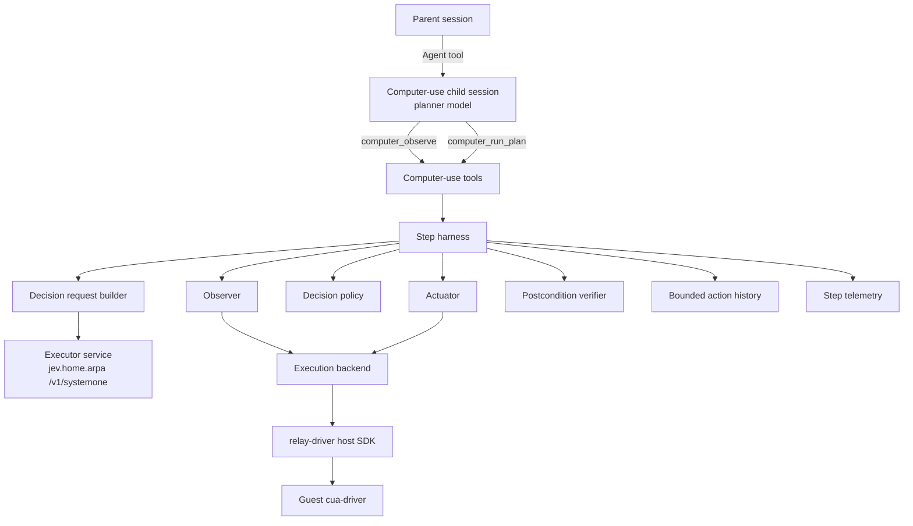
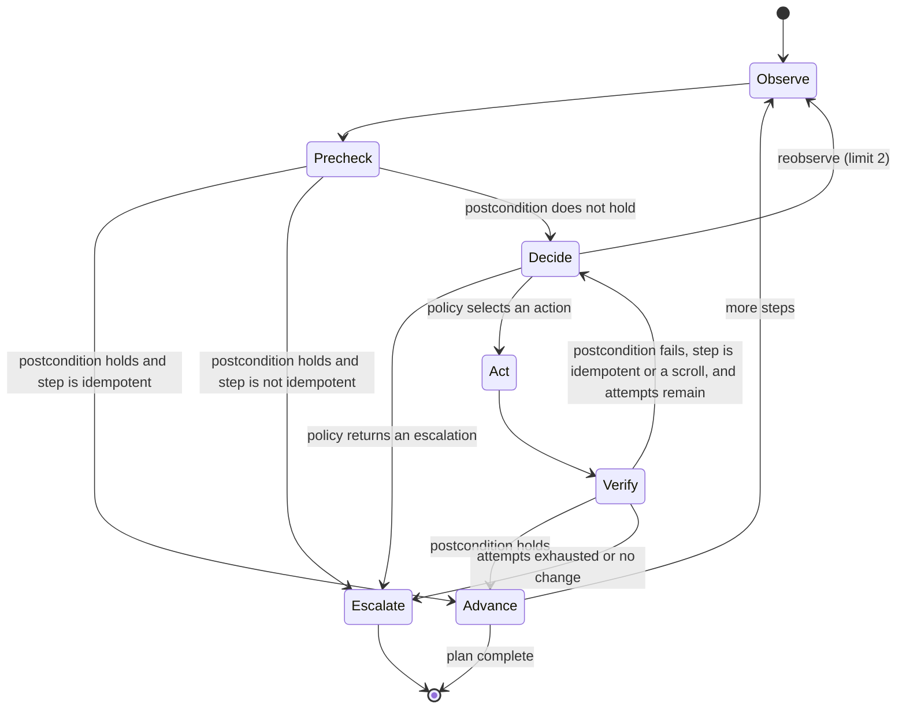
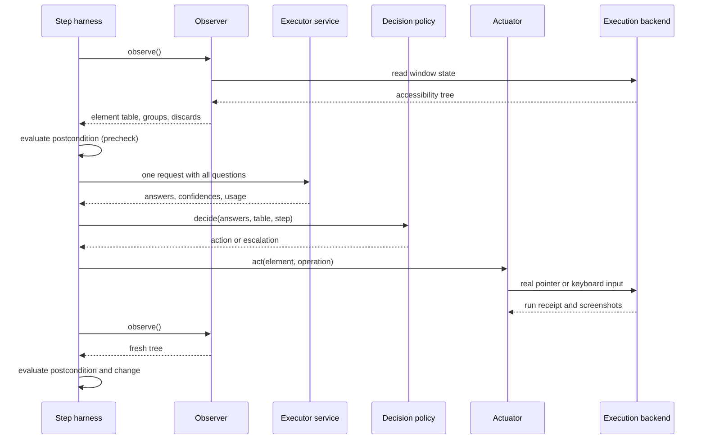

# Computer-Use Subagent: Planner and Executor Design

**Document type:** Software design specification.

**Status:** Draft for review, revised 2026-09-24. Plan phases 1 to 5 are implemented with the local driver backend, and Pi ran them in relay virtual machines ([research Sections 11 to 14](../research/computer-use-s0-s1.md#11-first-checks-through-pi-2026-09-23)). The requirements, CU-01 to CU-07, were approved on 2026-09-24 ([Section 2.1](#21-required-outcomes)). Sections 2.3 and 11.2 were revised on 2026-09-24 for the move from `pi-vm-relay` to `mcp-vm-relay`. The agent definition of Section 4.3 and the relay client of Section 11.2 are not implemented. No interaction design for computer use has been approved.

**Evidence:** [Planner and executor investigation](../research/computer-use-s0-s1.md), measured on 2026-09-22.

**Related documents:** [Subagent architecture](subagents.md), [request-time context injection](request-context.md), and [documentation responsibilities](../README.md).

## 1. Purpose and scope

This document specifies a computer-use subagent that operates a desktop application through its accessibility tree. It uses two model tiers and a deterministic harness.

- The **planner** is a large language model that runs as the subagent's own model. It reads the window, writes a plan, and handles escalations. The planner is called System 0 in the investigation.
- The **executor** is a structured-decision service that answers multiple-choice questions. It makes one decision per plan step. The executor is called System 1 in the investigation.
- The **harness** is ordinary code. It owns observation, routing, action execution, verification, memory and escalation.

The design goal is to keep per-step decisions out of the planner's conversation. Token savings are not the goal, because the executor spends more tokens per decision than the planner would ([research Section 5](../research/computer-use-s0-s1.md#5-findings)).

### 1.1 In scope

- The first release covers a planner tool contract, a plan schema, and postconditions that code can evaluate.
- It covers the observation pipeline from an accessibility tree to a numbered element table.
- It covers one executor request per step, the decision policy in code, and action execution through the virtual machine relay.
- It covers verification, bounded memory, a typed escalation contract, telemetry and a verification plan.

### 1.2 Out of scope

- The first release does not operate the user's own interactive desktop. It operates only a desktop inside a relay-managed virtual machine.
- It does not patch the executor service's 26-alternative limit ([Section 13](#13-open-questions)).
- It does not generate free text with the executor. Every literal value comes from the plan.
- It does not change the subagent runtime, the model fallback list semantics, or the shared inference services.
- It does not add a user interface beyond what the subagent fleet view already shows.

## 2. Design inputs

### 2.1 Required outcomes

These outcomes are approved requirements. The owner approved them on 2026-09-24 as stories CU-01 to CU-07 in the [requirements document](../user-stories/computer-use.md), which also adds outcomes learned from the live checks.

- A parent agent can delegate a desktop task in natural language and receive a compact outcome report.
- The report states whether the task completed, which steps ran, and why work stopped when it stopped early.
- A wrong or uncertain action stops the run with a stated reason instead of continuing silently.
- The run never performs a destructive action that the plan did not authorize.
- Every step leaves evidence that lets a maintainer decide whether a failure came from finding the element or from choosing it.

### 2.2 Constraints from the executor service

These constraints come from the [research record](../research/computer-use-s0-s1.md).

- A choice question accepts at most 26 alternatives, labelled `A` to `Z`. A request with 27 alternatives fails validation with HTTP 422.
- The executor model length is 4,096 tokens for the whole request and answer.
- Several questions asked in one stage are faster and more accurate than questions staged with `depends_on` or `alone`.
- Confidences from independent questions are not comparable, and a wrong answer was observed at 0.99 confidence.
- A routing question with one speculative element question per group reached 12/12 end to end over 103 candidates.
- A name-only element list costs roughly seven input tokens per element.

### 2.3 Constraints from the relay

These constraints come from the `mcp-vm-relay` and `relay-driver` repositories as of 2026-09-24. The owner retired `pi-vm-relay` in Pi on 2026-09-24. Pi now reaches the relay through `pi-mcp-adapter`, which runs the `mcp-vm-relay` server and exposes its `relay` tool to the model.

- The relay runs guest commands through `run` actions. A `cua` run forwards one `cua-driver` tool call to the guest and returns its standard output. The guest receiver stops the command once its output passes 64 KiB and reports `outputTruncated` (`mcp-vm-relay/src/guest/receiver.ts`, `MAX_OUTPUT_BYTES`). The cap is a constant, not a run option.
- The element array of one recorded Finder read, the fixture folder of the Pi batches with 379 elements, was 66,253 bytes as compact JSON, before the driver's Markdown rendering. A `cua` run of `get_window_state` would therefore be cut off for that window.
- Each run captures a before screenshot and an after screenshot in PNG format, and each capture has a 60-second timeout.
- The relay refuses direct accessibility activation and value setting unless the run declares `inputMode: "accessibility"`.
- Owner decision D3 in `relay-driver/docs/decisions.md` says that ordinary interactions use real pointer and keyboard input. Accessibility may discover controls, resolve coordinates and observe state. Direct accessibility activation is reserved for tests of accessibility behavior and must be identified in the evidence.
- `mcp-vm-relay` is a Model Context Protocol server over standard input and output. Its package has a binary and no library export. It offers one `relay` tool with the actions `acquire`, `stage`, `run`, `extract`, `finish` and `release`, among others.
- One server session owns at most one virtual machine. The environment variable `MCP_VM_RELAY_SESSION` names the session, and a restarted server with the same name reconciles its ownership without replaying work.
- When the server's standard input closes, lease renewal pauses and the machine is kept for an explicit `finish` or `release`. The lease's time limit is the backstop.
- Every run except a diagnostic `exec` captures a before and an after screenshot of the whole display, and each run must declare `snapshots.afterIntervalMs`. The display screenshots in the Pi batches were 4.8 to 11 MB each.
- `pi-mcp-adapter` lets other extensions register servers, read status snapshots and reuse OAuth tokens. It offers no way for another extension to call a server's tool.
- A `cua` run is an `exec` of `cua-driver call <tool> --json <args>` on the guest.
- A lease covers one virtual machine. Failed or uncertain operations are never replayed automatically, and the relay keeps the machine after a failure for repair.
- No per-operation latency of the relay has been measured.

#### 2.3.1 Constraints from `cua-driver`

These facts come from `cua-driver describe get_window_state` for version 0.12.6.

- The window-state call returns a structured `elements` array. Each entry has `element_index`, `role`, `label`, `value`, `frame` with `x`, `y`, `w` and `h`, `parent_index` and `depth`.
- The call also returns a Markdown rendering of the tree, which is kept for older callers.
- The call returns a screenshot unless `include_screenshot` is `false`. The tree-only form avoids the image cost and the capture latency.
- The walk is capped at 2,000 elements and a depth of 25 by default. The `max_elements` and `max_depth` inputs lower the caps, and both outputs are truncated together.
- The element index map is replaced by the next window-state call, so an index is valid only for the latest snapshot.
- The tool's own description warns that the tree can be wrong on some surfaces. Examples are Electron echo confirmations, null values in Catalyst apps, and virtualized off-screen rows whose frame height is 1.

### 2.4 Constraints from Secretary

- The subagent subsystem must not know other subsystems' tools by name ([subagent architecture Section 11](subagents.md#11-subsystem-independence)).
- Secretary ships no model fallback lists. The user's configuration already defines a `computer-use` list whose first member is `litellm/qwen3.8-27b`.
- Secretary configuration can assign a model to any definition name through `agents.subagentModels`, without editing the definition ([subagent architecture Section 5.3](subagents.md#53-model-fallback-lists)).
- Packaged definitions are files under `extensions/secretary/agents/definitions/`, which belongs to the subagent module ([subagent architecture Section 5.2](subagents.md#52-packaged-definitions)).
- Child sessions run headless and must not assume a user interface ([subagent architecture Section 8.3](subagents.md#83-child-ui-capabilities)).

## 3. Decisions

| Decision | Rationale | Evidence |
| --- | --- | --- |
| The planner runs once per plan and once per escalation, never once per step. | The design goal is to keep per-step decisions out of the planner's conversation. | [Research Section 5](../research/computer-use-s0-s1.md#5-findings) |
| The executor receives one request per step, and every question is answered in one stage. | Staged questions were slower and less accurate. | [Research Sections 4.2 and 4.3](../research/computer-use-s0-s1.md#42-question-coupling-on-a-list-of-buttons-n--12) |
| The element list uses name-only labels. | Accuracy was not separated, and the encoding used about 20 percent fewer tokens. | [Research Section 4.5](../research/computer-use-s0-s1.md#45-name-only-labels-compared-with-verbose-descriptors-n--8-26-candidates) |
| Lists longer than 26 use a routing question and one speculative element question per group. | This scored 12/12 and needs no service change. | [Research Section 4.8](../research/computer-use-s0-s1.md#48-a-routing-question-with-one-speculative-question-per-group-n--12) |
| Code never chooses between questions by comparing confidences. | A wrong answer was observed at 0.99 confidence while the correct question scored lower. | [Research Section 4.7](../research/computer-use-s0-s1.md#47-merging-independent-heads-by-confidence-n--8) |
| Confidence is a safety gate only. Errors are detected by postconditions and structural signals. | Wrong answers overlapped correct answers in confidence. | [Research Section 5](../research/computer-use-s0-s1.md#5-findings) |
| Actions use real pointer and keyboard input at coordinates resolved from the accessibility tree. | Owner decision D3 requires real input for ordinary work. This departs from the investigation's preference for accessibility activation. | [Section 2.3](#23-constraints-from-the-relay) |
| Every literal value comes from the plan. | The executor answers choices and cannot produce text. | [Research Section 6](../research/computer-use-s0-s1.md#6-prior-art-consulted) |
| Escalations are typed. | A typed reason tells the planner what kind of help is needed. | Cua `jev-use`, [research Section 6](../research/computer-use-s0-s1.md#6-prior-art-consulted) |
| Observation records the full tree, the reduced list and every discard reason. | Retrieval failure is the largest untested risk. | [Research Section 7](../research/computer-use-s0-s1.md#7-verification-limits) |

## 4. Architecture



### 4.1 Responsibilities

| Component | Responsibility |
| --- | --- |
| The child session | It runs the planner model through the existing subagent runtime. It calls the computer-use tools and reports the outcome to the parent. |
| The computer-use tools | They validate tool input, own the relay lease for the child session, and return compact results. |
| The step harness | It runs the per-step loop in [Section 9](#9-step-lifecycle), enforces budgets, and produces escalations. |
| The observer | It reads the accessibility tree, builds the element table, forms groups, and records discards. |
| The decision request builder | It composes one executor request per step and checks the request against the token budget. |
| The decision policy | It interprets executor answers, applies routing, compatibility and safety gates, and selects one action or one escalation. |
| The actuator | It performs the selected action with real input through the execution backend. |
| The postcondition verifier | It evaluates plan postconditions against a fresh tree, and it detects steps that changed nothing. |
| The bounded action history | It keeps the last few compact action records for the next executor request. |
| The step telemetry | It writes one record per step and one summary per plan run. |
| The execution backend | It hides the relay behind an interface so that tests can use a fake desktop. |

### 4.2 Module organization

The module is a new, independent capability. It does not import the subagent module, and the subagent module does not import it.

```text
extensions/secretary/computer-use/
  installation.ts        registers tools, reads configuration
  tools/
    schemas.ts           tool input and result schemas
    observe.ts
    run-plan.ts
  harness.ts             step loop and budgets
  observer.ts            tree parsing, element table, grouping
  request-builder.ts     executor request and token budget
  policy.ts              routing, gates, action selection
  actuator.ts            real-input actions
  verifier.ts            postconditions and change detection
  history.ts
  telemetry.ts
  executor-client.ts     HTTP client for /v1/systemone
  backend/
    backend.ts           execution backend interface
    relay-client.ts     client of an mcp-vm-relay server session
    local-backend.ts     development adapter for the host cua-driver
    cua-markdown.ts      descendant text from the driver's Markdown rendering
    fake-backend.ts      deterministic test desktop
  templates/
    computer-use.md      user-level agent definition template
```

### 4.3 Integration with the subagent subsystem

- The computer-use agent is a user-level definition in `<getAgentDir()>/agents/computer-use.md`. The computer-use module ships the template `extensions/secretary/computer-use/templates/computer-use.md`, and the README documents how to install it.
- The template's instructions carry the planner lessons of the Pi batches ([research Section 14](../research/computer-use-s0-s1.md#14-pi-task-batch-2026-09-23)): do only what the task asks, check names of controls and files with `exists` or `selected`, pass `window_title` and `based_on`, and report only what code verified. They also carry CU-05: a result already on screen is reported as such.
- The definition is not packaged with the subagent module. A packaged definition would place the computer-use tool names inside the subagent module, which [subagent architecture Section 11](subagents.md#11-subsystem-independence) forbids. It would also appear in the delegation catalog on machines where the relay and executor are not configured.
- The definition omits `model`. The user assigns the model with `agents.subagentModels`, for example `"computer-use": "computer-use"`, which resolves through the existing `computer-use` fallback list.
- The definition uses a `tools` allowlist, because this agent needs a hard capability bound ([subagent architecture Section 5.2](subagents.md#52-packaged-definitions)). The allowlist contains `computer_observe` and `computer_run_plan`. It excludes the model-facing `relay` tool, so that the child session has only one lease owner.
- The definition sets `background: true`, because a desktop task can take minutes. Background agents need the interactive terminal or RPC mode, so a `pi --print` parent cannot delegate to this definition.
- A child's effective tools are the parent's tools intersected with the definition's allowlist ([subagent architecture Section 5](subagents.md#5-agent-definitions-and-model-resolution)). The computer-use tools are therefore registered in the parent session too, and the parent's own model can call them. CU-01 keeps per-step details out of the parent's conversation only when the parent delegates.
- The subagent runtime launches, observes, cancels and resumes the child without any change. Cancellation of the child aborts the tool call in progress, and the harness stops at the next safe point defined in [Section 9](#9-step-lifecycle).
- `computer_observe` is registered only when `computerUse.backend` selects a backend. `computer_run_plan` additionally requires `executorUrl`. A missing configuration hides a tool rather than failing at call time, and an invalid configuration disables both tools with a diagnostic.
- Tools are registered at the first session start of the extension instance. A later session whose configuration lacks the executor rejects `computer_run_plan` calls. A configuration that gains the executor takes effect after a reload.

### 4.4 Planner model capability

- The planner benefits from a screenshot of the window. Qwen 3.8 27B accepts images ([research Section 2.1](../research/computer-use-s0-s1.md#21-planner-qwen-38-27b)).
- The current `computer-use` fallback list also contains models whose image support has not been checked. If the selected model does not accept images, `computer_observe` returns the element table without a screenshot and states that the screenshot was omitted.
- The tools read the resolved model's declared input types from the pi model registry. They do not guess from the model name.

### 4.5 Configuration

The module reads a top-level `computerUse` object from the same `secretary.json` files as the subagent configuration. Trusted project configuration overrides global configuration field by field. The subagent module does not read this object.

| Field | Meaning | Default |
| --- | --- | --- |
| `backend` | It selects `relay`, `local` or `none`. The value `none` leaves the tools unregistered. | `none` |
| `executorUrl` | It is the base address of the executor service. | None, so `computer_run_plan` stays unregistered. |
| `executorTimeoutMs` | It bounds one executor request. | 10,000, not measured. |
| `confidenceGate` | It is the gate in [Section 8](#8-decision-policy), rule 7. | 0.4, from prior art. |
| `answerReserveTokens` | It is the answer reserve in [Section 7.3](#73-token-budget). | 128, the largest answer one executor read can need ([research Section 13](../research/computer-use-s0-s1.md#13-executor-token-budget-2026-09-23)). |
| `maxElements` | It is the observer's element limit in [Section 6.3](#63-grouping). | 240, the largest measured list. |
| `maxTreeNodes` | It is the walk limit passed to `cua-driver` as `max_elements`. Reaching it marks the tree as truncated. | 2,000, the driver's own default. |
| `maxNameLength` | It truncates element names, because a text area's label can be the whole document. | 48, not measured. |
| `maxActionsPerPlan` | It is the action budget in [Section 9](#9-step-lifecycle). | 100, from prior art. |
| `maxEscalationsPerRun` | It is the escalation budget in [Section 9](#9-step-lifecycle). | 5, not measured. |
| `settleMs` | It is the wait between an action and the verifying observation. | 300, not measured. |
| `redactTypedText` | It replaces typed literals in telemetry with their length. | `true` |
| `allowLocalDesktop` | It acknowledges that the `local` backend operates this machine's desktop. | `false` |
| `localDriverPath` | It is the `cua-driver` executable used by the `local` backend. | `cua-driver` |
| `foregroundDelivery` | It sends clicks and menu shortcuts with the driver's foreground delivery ([Section 11.3](#113-local-driver-backend-for-development)). | `true` |
| `stepPictures` | It records a picture of the target window before and after each action, and writes a review page ([Section 12.1](#121-records)). | `false` |
| `relayCommand` | It is the command that starts the relay client's own `mcp-vm-relay` server ([Section 11.2](#112-relay-client)). | `npx -y --prefer-offline @wezzard/mcp-vm-relay@0.4.0`, the version `pi-mcp-adapter` runs. Without `--prefer-offline`, a registry request reset by the network kept `npx` retrying past the client's 60-second start limit in 3 of 3 starts. |
| `relayImage` | It is the relay image key passed to `acquire`. | None; the `relay` backend requires it. |
| `relayEnv` | It is the relay credential pack passed to `acquire` as `env`. | None. |
| `relayTtlHours` | It is the lease time limit passed to `acquire`. It ends the machine if the child run ends without `finish`. | 2, not measured. |

- Unknown fields in `computerUse` fail validation with an error that names the field.
- The `local` backend is accepted only when `allowLocalDesktop` is `true`, which is the developer setting in [Section 11.3](#113-local-driver-backend-for-development).
- The `relay` backend is accepted only when `relayImage` is set.

## 5. Planner contract

### 5.1 `computer_observe`

The planner calls this tool to see the target window before planning and after an escalation.

- **Input:** The input names the target application and, optionally, a window title.
- **Result:** The result contains the application name, the window title, the numbered element table in [Section 6.2](#62-element-table), the group names, an observation identifier, and a screenshot when the model accepts images.
- The element table in this result is the planner's view. It includes role and state, because the planner has a large context and the plan must name elements precisely.
- The observation identifier lets a later plan refer to the exact tree the planner saw.

### 5.2 `computer_run_plan`

The planner calls this tool with a complete plan. The tool returns only when the plan completes, when an escalation occurs, or when the call is cancelled.

**Plan fields:**

| Field | Meaning |
| --- | --- |
| `app` and `window_title` | They name the target window, as for `computer_observe`. Without `window_title` or `based_on`, the plan escalates `window_unclear` when several windows of the app are on screen, instead of acting on the frontmost one. Every read in a plan after the first uses the same window. Through Pi, a Finder plan without a title read a second Finder window ([research Section 14](../research/computer-use-s0-s1.md#14-pi-task-batch-2026-09-23)). |
| `goal` | It is the task-level goal in one sentence. The executor sees it in every request. |
| `based_on` | It is optional. It names the observation the plan was written against. The plan acts on that observation's window. An unknown or expired identifier rejects the plan, and the session keeps the last 16 observations. |
| `steps` | It is an ordered list of at most 50 steps. |
| `allow_destructive` | It is a list of step identifiers that may perform destructive actions. It is empty by default. |

**Step fields:**

| Field | Meaning |
| --- | --- |
| `id` | It is a short identifier that is unique within the plan. |
| `intent` | It is one sentence that says what the step achieves, for example "Open the File menu." |
| `operation` | It is optional. It names the expected operation from [Section 7.2](#72-operations) when the planner knows it. |
| `text` | It is an optional literal string for text entry. It must be complete, because the executor cannot generate text. |
| `keys` | It is an optional key combination for a keyboard shortcut, for example `cmd+shift+n`. |
| `postcondition` | It is a predicate from [Section 5.3](#53-postconditions) that must hold after the step. |
| `idempotent` | It is optional. It states that repeating the step does no harm, so the harness may skip it when its postcondition already holds ([Section 9](#9-step-lifecycle)). The default is `false`. |
| `position` | It is optional, for `enter_text` only: `end`, `start` or `replace`. It places the insertion point with keys after the click and before typing ([Section 7.2](#72-operations)). |
| `max_attempts` | It is optional, from 1 to 5. It limits how often the harness may act for the step before escalating `postcondition_failed`. The default is 1, 2 for an `idempotent` step, and 3 for a scroll. A value above 1 requires `idempotent` or a scroll operation. |

- The harness validates the whole plan before any observation. Repeated step identifiers, malformed postconditions, `enter_text` without `text`, `key_combo` without `keys`, and unknown `allow_destructive` identifiers reject the plan.
- A step has `text` or `keys`, not both. Each key combination is parsed during validation, and an unknown key name rejects the plan with the list of valid names. The names `backspace`, `enter` and `esc` are accepted for `delete`, `return` and `escape`.
- An `enter_text` step must check the typed text with `text { endsWith }`, `text { contains }` or `value { name, equals }`. In a live check, "the text contains Hello" was true although the words landed at the wrong place.
- A `key_combo` step that sends only a navigation key, such as `cmd+down`, is rejected when its only postcondition is `changed`. Such a key moves the insertion point, which the tree does not show, so the step could never be verified. The validator names the `position` field instead.
- When the plan names its observation in `based_on`, a `text` predicate whose string is the name of a control in that observation is rejected. The validator names `exists` instead. Through Pi, the planner wrote "text contains All Clear" to check a button, and a successful press was reported as failed ([research Section 11](../research/computer-use-s0-s1.md#11-first-checks-through-pi-2026-09-23)).

### 5.3 Postconditions

A postcondition is a small predicate over the accessibility tree. Code evaluates it, and the executor never judges it.

| Predicate | Holds when |
| --- | --- |
| `exists { name, role? }` | An element with this name, and this role when given, is present. |
| `absent { name, role? }` | No such element is present. |
| `value { name, equals }` | The named element's value equals the given string. |
| `selected { name }` | The named element is selected, such as a file in a Finder list. |
| `window { titleContains }` | The frontmost window title contains the given string. |
| `text { contains }` or `text { endsWith }` | The value or descendant text of some on-screen element contains, or ends with, the given string. Exactly one of the two is given. Labels are not searched, because they name controls rather than show content. When the check fails and a control with a matching name is on screen, the failure names that control and says to check it with `exists` ([research Section 14](../research/computer-use-s0-s1.md#14-pi-task-batch-2026-09-23)). |
| `changed` | The tree differs from the tree before the step. |
| `all [ ... ]` and `any [ ... ]` | All or any of the nested predicates hold. |

- The harness rejects a plan whose postconditions are malformed before it performs any action.
- A `role` must be an accessibility role, such as `Button` or `AXButton`. Through Pi, a planner wrote `role: "selected"` to check a selection, so the check could never hold, and a successful click was reported as failed ([research Section 14](../research/computer-use-s0-s1.md#14-pi-task-batch-2026-09-23)).
- A postcondition must be false before its step and true after it. A postcondition that already holds cannot show that the step worked, so the harness escalates instead of skipping the step ([Section 9](#9-step-lifecycle)).
- A step whose only postcondition is `changed` is allowed, but its outcome is recorded as weakly verified.
- Predicates count only elements that are on screen. An element is on screen when its frame is larger than 1 point in both dimensions and its center lies inside the window, or when it belongs to an open menu. This is the same rule the observer uses.
- A closed menu's items are in the tree without frames, so `exists "Save"` would otherwise always hold. A scroll container keeps reporting items that were scrolled out of the window, so a frame-only rule would also count those.
- A name matches an element's label, value or descendant text ([Section 6.1](#61-reading-the-tree)), ignoring case and extra whitespace. `value` compares the value exactly.
- `text` exists because some displayed values are not separate elements. Calculator's display is static text under the window, so after pressing Equals the window's descendant text is "7+3 10", and no element is named "10".
- Names and text are compared after removing Unicode bidirectional marks, which Calculator inserts before each number.
- `changed` compares the role, label, value, descendant text, state and rounded frame of every on-screen element before and after the step. Descendant text is included because a Calculator key press changes only the display text.
- A `focused` predicate was specified earlier and is withdrawn. `cua-driver` 0.12.6 reports no focus state, so code cannot evaluate it.

### 5.4 Result

The result is compact, because it enters the planner's conversation.

- The result states the outcome: `completed`, `escalated` or `cancelled`.
- The result lists each executed step with its identifier, the action taken, the element name, and the postcondition outcome.
- An escalated result includes the escalation from [Section 10](#10-escalation-contract) and a fresh observation, so the planner can replan without calling `computer_observe` again.
- The result states the number of executor decisions made during the call.
- The result ends with a list headed "Verified by code after the step". It names each step whose postcondition code evaluated, and a second list names the steps that were only seen to change something. The planner is told to report only the first list as checked. Through Pi, a final answer had claimed more than the harness verified ([research Section 11](../research/computer-use-s0-s1.md#11-first-checks-through-pi-2026-09-23)).

## 6. Observation

### 6.1 Reading the tree

- The observer reads the window through the `cua-driver` window-state call and parses the structured `elements` array ([Section 2.3.1](#231-constraints-from-cua-driver)).
- The structured array holds only indexed elements. The text that names many rows and cells, such as a sidebar's "Downloads", is an unindexed static-text child that appears only in the Markdown rendering. The backend therefore parses the Markdown for one purpose only: it attaches each unindexed static text to its nearest indexed ancestor. The observer uses that descendant text as a name when the element's own label and value are empty. The driver documents the Markdown shape as stable for text-parsing callers.
- The first read of each window in a backend's lifetime is a warm-up read, and its result is discarded. Safari's first read lacked the whole web area, and the second read had it.
- Step observations use the tree-only form. The planner's observation in `computer_observe` requests the screenshot.
- The relay caps standard output at 64 KiB, and `cua-driver` caps the walk at its element limit. When either cap truncates the tree, the observer must not treat the partial tree as complete. It returns the escalation `state_too_large`.
- A tree without a window element is a window that is still appearing. The observer returns `window_missing`, and the caller reads again after `settleMs`, at most twice. This was observed on the first read after a background launch of TextEdit.
- The observer discards every element that real input cannot target, and it records the reason:

| Reason | Condition |
| --- | --- |
| `container` | The role structures the window, for example `AXGroup`, `AXToolbar` or `AXMenu`. Containers are still used for grouping. |
| `no_frame` | The element has no frame, for example an item of a closed menu. |
| `collapsed_frame` | The frame is at most 1 point wide or high, for example a virtualized row. |
| `disabled` | The element reports `enabled: false`. |
| `inactive_menu_bar` | The element belongs to the menu bar of an application that is not active. |
| `outside_window` | The element's center lies outside the window frame, and it is not part of a menu. |
| `unnamed` | The element has no usable label or value. Automatic identifiers such as `_NS:834` do not count as names. |
| `behind_modal` | An open sheet covers the element. |

- The `inactive_menu_bar` rule exists because a background application's menu bar reports frames where the active application's menu bar is drawn. A real click there would reach another application. Window stacking order cannot replace this check, because a background launch raised TextEdit's window above the active application's window without activating TextEdit. Both behaviors were observed on 2026-09-23.
- Names collapse whitespace and are truncated to `maxNameLength`. A plain-text document's text area uses the document text as its label, so an untruncated name would copy the document into every request.
- The observer uses `parent_index` and `role` to find the containers used for grouping in [Section 6.3](#63-grouping).
- Each kept element keeps its `element_index` and its frame. The index is valid only for the snapshot that produced it, so an action always uses the frame from the latest snapshot.

### 6.2 Element table

- The executor's element table has one line per element. Each line holds a label letter and the element's name, without role or kind ([research Section 4.5](../research/computer-use-s0-s1.md#45-name-only-labels-compared-with-verbose-descriptors-n--8-26-candidates)).
- An element without an accessible name uses its value or its help text. An element with none of these is discarded with the reason `unnamed`.
- Elements are listed under their group name, in the same format that was measured in [research Section 4.8](../research/computer-use-s0-s1.md#48-a-routing-question-with-one-speculative-question-per-group-n--12).
- In the planner's table, a text field or text area also shows the last 200 characters of its content. Its name is the start of its content and is cut at the name length, so without this line a planner could not see a line it had just added. Through Pi, a planner in that position typed probe letters into the document to find its own edit ([research Section 14](../research/computer-use-s0-s1.md#14-pi-task-batch-2026-09-23)).
- The planner's table in [Section 5.1](#51-computer_observe) ends with the text that the window shows outside its controls, under a line that says to check it with `text { contains }`. The text is the descendant text of the window and of on-screen containers, with at most 8 entries of at most 200 characters. Calculator's display is such text, and the planner could not read a result without it.
- A shown text is listed even when it equals a control name, because Calculator's display can read "0" while a button is also named "0".

### 6.3 Grouping

Groups exist so that no question exceeds 26 alternatives. Every element question reserves one alternative for `none` ([Section 7.1](#71-request-composition)), so a group holds at most 25 elements. The rule was evaluated on five recorded windows in Phase 2 and Phase 4 ([research Section 9](../research/computer-use-s0-s1.md#9-phase-2-to-4-observations-2026-09-23)).

1. A modal sheet or dialog, when present, is the only group. Elements behind it are discarded with the reason `behind_modal`.
2. An open menu, when present, forms its own group.
3. Otherwise, the observer forms groups from the nearest container with a landmark role, such as toolbar, outline or sidebar, tab group, table or list, and the remaining window content.
4. A group with more than 25 elements is split in reading order into consecutive groups, named `part 1`, `part 2` and so on.
5. A window with 25 elements or fewer forms a single group, and the request omits the routing question.
6. When the element count exceeds the configured maximum, the observer returns `state_too_large` rather than dropping elements silently.
   The observer also returns `state_too_large` when the window splits into more than 26 groups, because the routing question offers one option per group. The executor would otherwise reject the request, and the rejection would be reported as an unavailable executor.
7. A group records how many named elements of its container lie outside the window, such as rows below the visible part of a list.
8. A group's frame is its container's frame clipped to the window. A scroll container's frame spans its whole content, so its center can lie outside the window, as Finder's icon view showed in a standalone script check ([research Section 10.3](../research/computer-use-s0-s1.md#10-standalone-script-checks-in-a-macos-virtual-machine-2026-09-23)).

- Real windows often lack landmark containers. Calculator's 106 buttons and a web page's links and form controls all fell into one content region, so the split parts carry no meaning. [Section 7.1](#71-request-composition) compensates by describing each region with its members' names.

### 6.4 Retrieval record

For every observation, the harness records the following items in the step telemetry.

- It records the full parsed tree.
- It records the element table in the form sent to the executor.
- It records every discarded element with its reason.
- It records the group assignment of every kept element.

With this record, a wrong answer can be classified as a retrieval failure, when the correct element was missing from the table, or as a judgment failure, when it was present but not chosen.

## 7. Executor request

### 7.1 Request composition

The harness sends one `POST /v1/systemone` request per step with `samples` set to 1.

**State fields:**

| Field | Contents |
| --- | --- |
| `goal` | It holds the plan goal. |
| `step` | It holds the current step's intent and, when given, the expected operation. |
| `app` and `window` | They hold the application name and window title. |
| `elements` | It holds the grouped element table from [Section 6.2](#62-element-table). |
| `recent` | It holds the last five action records, each with the step intent, the action, the element name and the postcondition outcome. |

**Questions, all answered in one stage:**

| Question | Present when | Alternatives |
| --- | --- | --- |
| `region` | The table has more than one group. | One alternative per group name. Each alternative's description lists the names of the group's elements and states how many more are hidden beyond the visible area. |
| `element_<n>` | Always, with one question per group. | The group's element letters, plus `none`, described as "None of these controls carries out the step." |
| `operation` | The step does not fix the operation. | The operations that the step allows ([Section 7.2](#72-operations)), plus `reobserve` and `abstain`. |
| `risk` | Always. | `safe`, `reversible` and `destructive`. |

- The request never uses `depends_on` or `alone` ([research Section 4.3](../research/computer-use-s0-s1.md#43-question-coupling-on-a-mixed-role-list-of-26-candidates-n--48)).
- The `reobserve` alternative means that the window is changing or loading. The `abstain` alternative means that no listed element fits the step. Every question's instructions describe these meanings explicitly, because conventions must be stated rather than assumed.
- Region descriptions carry the member names because routing over meaningless part names failed. Over three seeds on recorded trees, judgment misses fell from 11 of 39 to 0 of 39 when the descriptions were added. The cost is more input tokens, up to 61 percent of the executor's model length on Calculator ([research Section 9.3](../research/computer-use-s0-s1.md#93-executor-decisions-on-recorded-trees)).
- Every element question offers `none` because the executor otherwise clicked some other control when the target was not listed. Over three seeds, such wrong actions fell from 16 of 18 to 7 of 18, while correct actions fell from 35 to 33 of 57.
- The request may carry the fork's `seed` extension for evaluation. Production requests omit it, so the server's default seed makes them deterministic.

### 7.2 Operations

| Operation | Effect | Literal source |
| --- | --- | --- |
| `press` | It clicks the element's frame center once. | None. |
| `double_press` | It double-clicks the element's frame center. | None. |
| `context_press` | It right-clicks the element's frame center. | None. |
| `enter_text` | It clicks the element's frame center, then presses one key per character. Characters outside the backend's key vocabulary are refused before any input. With `position`, it first sends Cmd+Down for `end`, Cmd+Up for `start`, or Cmd+Up and then Shift+Cmd+Down for `replace`. Cmd+A is not used, because it did not select all text in either delivery mode ([research Section 12.1](../research/computer-use-s0-s1.md#12-fix-checks-through-pi-2026-09-23)). | The step's `text` field and its `position` field. |
| `key_combo` | It sends the key combination to the frontmost window. | The step's `keys` field. |
| `scroll_up` and `scroll_down` | They scroll by one page at the center of the chosen group's visible frame. A page moves about 80 percent of that frame's height. Containers are never element candidates, so a scroll targets a group rather than an element. This is how a target below the visible part of a list becomes reachable. | None. |

The planner decides the operation whenever the step states it, and the executor then chooses only the element and the risk.

- A step with `keys` is offered only `key_combo`, and a step with `text` is offered only `enter_text`.
- A step that names an `operation` is offered only that operation.
- Only a step with none of these is offered the full set of `press`, `double_press`, `context_press`, `scroll_up` and `scroll_down`.
- The reason is a Pi run in which a step with the key "Backspace" was answered with `press`, which clicked the text area instead of pressing the key ([research Section 14](../research/computer-use-s0-s1.md#14-pi-task-batch-2026-09-23)).
- When the step fixes the operation, the request has no `operation` question. Through Pi, the executor answered `abstain` to such a question for a clear `enter_text` step. A missing target is still reported through each element question's `none`.
- The `risk` question is always asked, so a key combination is still judged for destructive risk.

### 7.3 Token budget

- The executor accepts a request when its input tokens plus its answer tokens are at most 4,096 ([research Section 13.1](../research/computer-use-s0-s1.md#13-executor-token-budget-2026-09-23)).
- The answer length depends only on the questions, and the questions depend only on the group count. The largest answer one read can need is 127 tokens, so the answer reserve is 128 tokens ([research Section 13.2](../research/computer-use-s0-s1.md#13-executor-token-budget-2026-09-23)).
- The builder estimates the request size as the request body's characters divided by three. The estimate was off by −17 to +26 percent against the service's count, depending on the window's text ([research Section 13.3](../research/computer-use-s0-s1.md#13-executor-token-budget-2026-09-23)). It therefore decides only how much history to send, and it never refuses a request.
- The builder drops the oldest `recent` records until the estimate fits within 4,096 tokens minus the reserve. When no history is left, it sends the request anyway.
- The executor is the only exact counter. When it rejects a request as longer than its model length, the harness sends the request once more without history. A second rejection, or a first rejection without history, escalates `state_too_large`. The retry is safe, because a decision request acts on nothing.
- After each response, telemetry records the service's input and answer tokens next to the estimate and the number of history records sent.

## 8. Decision policy

The policy runs in code after each response. It applies the following rules in order.

1. If the service is unreachable, times out, or returns an error, the policy returns `executor_unavailable`.
2. If `operation` is `reobserve`, the harness observes again and repeats the decision. It does this at most twice per step, and then it returns `no_progress`.
3. If `operation` is `abstain`, or the routed element question answers `none`, the policy returns `target_not_found`.
4. If the table has several groups, the policy reads the element answer from the question of the group chosen by `region`. It never compares confidences across questions ([research Section 4.7](../research/computer-use-s0-s1.md#47-merging-independent-heads-by-confidence-n--8)).
5. If the chosen element and operation are incompatible, the policy returns `uncertain`. For example, `enter_text` on an element that is not a text field is incompatible.
6. If `risk` is `destructive` and the step is not listed in `allow_destructive`, the policy returns `approval_required`. The risk answer can only add caution. It never authorizes an action.
7. If the confidence of the used `region`, element or `operation` answer is below the configured gate, the policy returns `uncertain` and includes the answers as a prior. The default gate is 0.4, which is taken from prior art and is not validated here.
8. Otherwise, the policy selects the element and operation for execution.

## 9. Step lifecycle



- **Observe:** The harness reads the tree. The after-tree of one step is reused as the before-tree of the next step, so one observation serves both.
- **Precheck:** The harness evaluates the postcondition before deciding. When it already holds, the result depends on the step's `idempotent` field.
  - An idempotent step is skipped without an executor request, and the record says why. This keeps the "do nothing when the step is already done" convention of Cua's forms specialist ([research Section 6](../research/computer-use-s0-s1.md#6-prior-art-consulted)) for steps that are safe to skip.
  - Any other step escalates `already_satisfied`. A postcondition that holds before the step cannot show that the step worked. In a standalone script check, a stale Calculator display satisfied every postcondition, and the plan completed without acting ([research Section 10.4](../research/computer-use-s0-s1.md#10-standalone-script-checks-in-a-macos-virtual-machine-2026-09-23)). Through Pi, the planner wrote "text contains 7" for the Add step, which was skipped, and the sum was wrong ([research Section 11](../research/computer-use-s0-s1.md#11-first-checks-through-pi-2026-09-23)).
- **Decide:** The harness sends one executor request and applies the policy.
- **Act:** The actuator performs one action.
- **Verify:** The harness waits for the configured settle interval, observes again, and evaluates the postcondition. It also compares the tree with the before-tree.
- **No repeat after an effect:** An action that changed the screen but missed its postcondition ends the step with `postcondition_failed`, unless the step is `idempotent`. Through Pi, a planner checked Calculator's Add with a predicate that cannot hold, and the harness pressed Add a second time after the first press had taken effect ([research Section 14](../research/computer-use-s0-s1.md#14-pi-task-batch-2026-09-23)). A second press of a Send button would send twice. A scroll is exempt, because it only moves the view: it acts up to 3 times by default, and it stops with `no_progress` when the view stops moving. Through Pi, every scroll toward a file below the visible list needed a new plan before this exemption ([research Section 14.6](../research/computer-use-s0-s1.md#146-fourth-batch-on-the-fixes)).
- **No change:** One action that changes nothing in the tree ends the step with `no_progress`. The action is not repeated, because the tree cannot show every effect, and a repeat could act twice. Through Pi, a Cmd+Down key moved the insertion point but changed nothing in the tree, and the earlier limit of two sent it twice ([research Section 11](../research/computer-use-s0-s1.md#11-first-checks-through-pi-2026-09-23)).
- **Budgets:** The harness stops with `budget_exhausted` when the plan exceeds the configured action limit. The default limit is 100 actions per `computer_run_plan` call, taken from prior art. A separate limit bounds escalations per child run, with a default of 5. Neither default is measured.
- **Cancellation:** The harness checks the tool's abort signal before each executor request and before each action. An action already sent to the relay is not interrupted, and its outcome is recorded.

### 9.1 One step in sequence



## 10. Escalation contract

An escalation ends the `computer_run_plan` call and returns control to the planner. The reasons adapt the typed contract from Cua `jev-use` and add reasons that this harness can detect.

| Reason | Raised when | Expected planner response |
| --- | --- | --- |
| `needs_text` | The step's text contains characters that the backend cannot type with real key presses. A step without `text` is never offered `enter_text`, so missing text cannot reach the executor. | Rewrite the text with typeable characters, or split the step. |
| `state_too_large` | The tree was truncated, the table exceeds the element limit, or the executor rejects the request as too long even without history. | Narrow the target, for example by closing panels or choosing a smaller window. |
| `uncertain` | Confidence is below the gate, or the element and operation are incompatible. The answers are returned as a prior. | Confirm the prior or rewrite the step more specifically. |
| `target_not_found` | The executor abstained. | Check the returned observation and revise the step. |
| `already_satisfied` | The postcondition held before the step, and the step is not marked `idempotent`. No action was taken. | Write a postcondition that is false before the step, or mark the step `idempotent` when repeating it does no harm. |
| `postcondition_failed` | The postcondition still fails after all attempts. | Revise the step or the postcondition. |
| `no_progress` | An action changed nothing in the tree, or the window keeps changing. | Inspect the returned screenshot and revise the approach. |
| `approval_required` | A destructive action was chosen for a step not listed in `allow_destructive`. | Add the step to `allow_destructive` only when the delegated task authorizes it. |
| `budget_exhausted` | The action limit was reached. | Report partial progress to the parent. |
| `executor_unavailable` | The executor service failed or timed out. | Report the failure. The planner must not perform the steps itself in this release. |
| `backend_failed` | The relay refused an action, reported an uncertain outcome, or lost the lease. | Report the failure. The harness never replays an uncertain action. |
| `window_unclear` | Several windows of the app match and none was named, or the window the plan started on has closed. No action was taken on another window. | Name the window with `window_title`, or observe it and plan with `based_on`. |

- Every escalation carries the step identifier, the reason, the last executor answers, and a fresh observation when one can be taken.
- When the escalation limit is reached, the tool rejects further `computer_run_plan` calls in the child run, and the planner must report to the parent.

## 11. Execution backend

### 11.1 Interface

The backend interface has four operations.

- `readWindow(app, windowTitle?, withScreenshot)` returns the parsed elements, the screenshot when requested, whether the output was truncated, and whether the window's application is the active application.
- `act(action)` performs one real-input action and returns the relay's outcome kind.
- `screenshot()` returns the latest after-screenshot for the planner.
- `close(outcome)` finishes or releases the lease.
- Each action may carry a delivery mode, `background` or `foreground`. The local driver backend also offers two optional read-and-raise operations: `foreground(window, point)` reports whether the app is active and which windows are drawn over the point, and `bringToFront(window)` activates the app.

### 11.2 Relay client

The relay client is the part of Secretary that sends the harness's reads and actions to the relay. It is not the relay's own driver: the relay chooses how it performs a run, for example with `cua-driver` for a desktop or a browser engine for a page, and Secretary does not depend on that choice. The configuration value that selects it is `computerUse.backend: "relay"`.


- The relay client does not call the model-facing `relay` tool, because `pi-mcp-adapter` gives other extensions no way to call it, and because that tool's server session belongs to the parent's conversation, which may own its own virtual machine.
- The backend is its own Model Context Protocol client. It starts one `mcp-vm-relay` server per child run over standard input and output, with a fresh `MCP_VM_RELAY_SESSION` and `MCP_VM_RELAY_PROJECT` set to the working directory. It calls the server's `relay` tool with the same actions a model would use. The lease, owner lock and evidence rules therefore stay in `mcp-vm-relay`, and no second lease owner is written.
- The server command is configuration, with the command that `pi-mcp-adapter` uses for the `vm-relay` server as the default: `npx -y @wezzard/mcp-vm-relay@<version>`.
- The backend acquires one lease on the first tool call of a child run and keeps it for the rest of that run. The acquisition declares one extraction, `computer-use-screenshots`, for the directory that receives window screenshots. The backend then stages the relay runtime with `stage`.
- The backend ends the lease with `finish` when the child run ends, which delivers the evidence package and releases the machine. If `finish` fails, the backend calls `release` and reports that the package was not delivered. `finish` pulls the whole guest recording in one transfer capped at 512 MiB, and a run of about 40 relay runs passed that cap. It closes the server afterwards; if the child run ends without either, the server's closed input pauses renewal and the lease's time limit ends the machine.
- The relay client reuses the local driver backend (Section 11.3) and replaces only the function that calls the driver. Window lookup, warm-up reads, scale learning and point conversion therefore behave the same in both backends.
- A driver call that provides input, such as a click, key press or scroll, is a `run` of kind `cua`. Its output is small.
- A driver call that only reads, such as `list_windows` or `get_window_state`, is a `run` of kind `code`. The code is a short JavaScript program that calls the guest's `cua-driver` at the path the relay sets in `RELAY_CUA_DRIVER` and prints the result as gzip-compressed, base64-encoded JSON. A plain `cua` run cannot carry a read, because the guest receiver stops a process whose output passes 64 KiB, and one Finder read was 66,253 bytes (Section 2.3). A read whose encoded output still passes the cap escalates `state_too_large`.
- The active application comes from an `exec` run of `/usr/bin/lsappinfo`, as in the local backend.
- A window screenshot is written by `get_window_state` into the declared screenshot directory in the guest workspace. The client retrieves it with the `image` action and the source `application`, and reads the untouched original from the host path the relay reports in `image.originalPath`. The image block in the tool result is not used, because the relay resamples an image wider or taller than 2000 pixels for presentation, and scale learning needs the original width.
- Each relay run captures two display screenshots. In the first live check, a read took a median of 22,891 ms and a click 14,052 ms ([research Section 15](../research/computer-use-s0-s1.md#15-relay-client-checks-2026-09-24)), against well under 2 seconds locally. The number of relay runs per read is therefore the main cost, and budgets must allow for it.
- The guest read program removes a screenshot's `iCCP`, `zTXt`, `iTXt`, `eXIf` and `iDOT` chunks, because the relay's `image` action refuses a PNG with compressed metadata, and every macOS window screenshot has it.
- Every read uses `inputMode: "ordinary"`. Every action uses real pointer or keyboard input at coordinates computed from the element's frame, as required by owner decision D3.
- The backend labels each relay step with a sequence identifier, such as `cu-0007`, and the driver tool it calls. The relay's evidence package and the step telemetry are matched by time, because the backend interface does not pass the plan step to the backend.
- An `uncertain` or `refused` outcome from the relay becomes `backend_failed`. The backend never retries such an action.
- Pixel actions take window-local screenshot pixels. The backend converts screen points by subtracting the window's current bounds and multiplying by a scale learned from a screenshot of that window. The driver's reported display scale cannot be used, because it reported 1.0 while a 656-point window produced a 1312-pixel screenshot.
- Text entry uses `press_key` once per character. `type_text` is not used, because it inserts text through accessibility first and falls back to keystrokes only when that fails. The documented `press_key` vocabulary covers letters, digits, space, return, tab and named keys, so other characters are refused until a real-keystroke path for them is found.

### 11.3 Local driver backend for development

- A second backend calls the host's own `cua-driver` directly. It exists so that the observer and the harness can be developed before the relay integration is available.
- It is a development backend. It is disabled unless a developer setting enables it, and it must target a disposable application window.
- It uses the same real-input policy as the relay client.
- It finds the window through `list_windows`, checks the active application through `list_apps`, and reads the tree through `get_window_state`. It never launches, activates or clicks anything during observation.
- The active application comes from `lsappinfo front` and `lsappinfo info -only pid`, which took 6 to 8 ms. `list_apps` also scans installed applications and took 438 to 630 ms, so it is only the fallback when `lsappinfo` fails. The two sources agreed in 24 of 28 readings; the 4 disagreements came from the first pass in a new virtual machine, where `list_apps` still named the previous application ([research Section 14.6](../research/computer-use-s0-s1.md#146-fourth-batch-on-the-fixes)).
- With `foregroundDelivery` on, clicks and shortcuts with Command, Control or Option use the driver's `foreground` delivery. The driver brings the window forward for the action and then restores the previous app. Scrolls, plain keys and arrow, Home, End and Page keys with any modifier, such as Cmd+Up and Cmd+Down, stay in `background` delivery, because text-navigation keys worked there.
- The reason is that a background click into a TextEdit document moved the insertion point in 0 of 3 trials in one lease and 3 of 3 in another, while foreground delivery moved it in 6 of 6 ([research Section 12.1](../research/computer-use-s0-s1.md#12-fix-checks-through-pi-2026-09-23)). A background click depends on hidden app state, and the covering window is not the cause.
- `list_windows` reports a `z_index`, and a lower value is nearer the front. The driver's own tool description says the opposite, but a virtual machine screenshot showed Safari at 13 drawn over TextEdit at 36, and the covering check then named Safari in every trial of the second click lease ([research Section 12.1](../research/computer-use-s0-s1.md#12-fix-checks-through-pi-2026-09-23)). Without a window identifier, the backend picks the frontmost matching window, unless the harness asks it to refuse a choice among several. It ignores the driver's own full-screen overlay window, named `cua-driver`, when it looks for covering windows.
- `bring_to_front` activates the app but did not raise its window above Safari, so it is not used for actions.

### 11.4 Accessibility activation mode

- Direct activation of an element by accessibility would avoid coordinate errors, and prior art prefers it.
- It is disabled by default because owner decision D3 reserves it for accessibility tests.
- If the user decides to allow it, it must be an explicit per-run option that the relay evidence labels as accessibility input.

## 12. Telemetry and metrics

### 12.1 Records

- Each step writes one record with the observation identifier, the retrieval record from [Section 6.4](#64-retrieval-record), the executor request and response, the policy result, the action, the relay execution identifier, and the postcondition result.
- Each `computer_run_plan` call writes a summary with the step count, the executor decision count, the escalation reason, and the latency totals.
- Records are written under the Secretary data directory, next to the agent records. Test runs write under the repository's ignored `test-results/` directory.
- Records may contain window contents and typed text. The configuration must allow text values to be redacted before they are written.
- With `stepPictures` on, the harness records a picture of the target window before and after each action. The pictures are saved in the run's `pictures/` directory with a SHA-256 hash. The step outcome names them, and the executor request records do not.
- The run then writes `review.md`, which lists each step with its intent, postcondition, result and two pictures. The relay's desktop screenshots showed Safari in front of the target, so they could not show the result. A picture is recorded evidence, not human approval.
- Pictures can show typed text and window contents, so they stay in ignored directories and are reviewed before they are shared.

### 12.2 Metric definitions

Each metric has one formula for the life of this design, as required by the project's reporting rule.

| Metric | Formula |
| --- | --- |
| Executor decisions kept out of the planner | It is the count of executor requests whose answer was acted on or escalated, summed over a child run. |
| Planner turns per task | It is the count of planner model requests in the child run. |
| Executor round-trip latency, median (ms) | It is the harness-side time from sending a `/v1/systemone` request to receiving the full response, as the median over a run. This matches the formula in [research Section 3](../research/computer-use-s0-s1.md#3-measurement-method). |
| Step wall time, median (ms) | It is the time from the start of Observe to the end of Verify for one step, as the median over a run. |
| Retrieval miss rate | It is the fraction of reviewed wrong steps whose correct element was absent from the executor's table. |
| Judgment miss rate | It is the fraction of reviewed wrong steps whose correct element was present but not chosen. |

Step wall time includes the relay's screenshot captures, so it must not be compared with executor round-trip latency.

## 13. Open questions

| Question | Recommendation | Owner decision needed |
| --- | --- | --- |
| Should the 26-alternative limit be patched in the service? | Do not patch it. The routing question removes the need without changing shared infrastructure. | Yes, if a flat schema is preferred. |
| Is the grouping rule in [Section 6.3](#63-grouping) sound on real trees? | Validate it on recorded trees from at least three applications before implementing the executor path. | No. |
| How often is the correct element missing from the table? | Measured in Phase 2: 6 of 19 labelled intents, for four causes. The target was scrolled out of view, reachable only through a closed menu, disabled, or an unnamed title-bar button ([research Section 9.2](../research/computer-use-s0-s1.md#92-retrieval-on-recorded-trees)). The first three are correct exclusions, which the plan must handle with scroll, menu or shortcut steps. | No. |
| How does a step reach a target below the visible part of a list? | The executor never chose to scroll in 18 unlisted-target cases, even with the hidden count in the request. When the plan's step asked for a scroll, the executor routed to the list and chose `scroll_down` in 2 of 2 decisions of a standalone script run ([research Section 10.4](../research/computer-use-s0-s1.md#10-standalone-script-checks-in-a-macos-virtual-machine-2026-09-23)). Scrolling should come from the plan. A harness-side search of hidden names remains an option. | No. |
| Does a click reach a covered window? | Closed. A background click depends on whether the app was recently active, not on the covering window. Foreground delivery moved the insertion point in 6 of 6 trials, and it is now the default for clicks ([Section 11.3](#113-local-driver-backend-for-development), [research Section 12.1](../research/computer-use-s0-s1.md#12-fix-checks-through-pi-2026-09-23)). An `enter_text` step places the insertion point with its `position` field. | No. |
| How does a step close or zoom a window? | The title-bar buttons have no name in the tree. The planner should use key combinations such as `cmd+w` until the driver exposes their names. Menu shortcuts had no effect in the checks so far, so this depends on the next question. | No. |
| How does a step run a menu command, such as Save? | Cmd+A and Cmd+S had no effect through the driver with either delivery mode, and menu bar items are not in the element table ([research Section 14.3](../research/computer-use-s0-s1.md#143-escalations-in-the-third-batch)). Measured: `press_key` and `hotkey`, each with background and foreground delivery or after `open -a`, cleared TextEdit's "Edited" label in 0 of 12 trials. The control through AppleScript timed out, so the label is not yet proven to clear on a real save ([research Section 14.6](../research/computer-use-s0-s1.md#146-fourth-batch-on-the-fixes)). Add a menu operation that opens the menu bar item and presses the named menu item, after a control confirms the label. | Yes, because a menu operation adds an operation and a table source. |
| Should actions use direct accessibility activation? | Keep real input by default, as owner decision D3 requires. | Yes, because D3 is an owner decision. |
| What does a real screenshot cost the planner? | Measured in Phase 1: the cost is proportional to pixel area, and a 1312×844 window screenshot costs 1,068 input tokens on Qwen 3.8 27B ([research Section 8](../research/computer-use-s0-s1.md#8-phase-1-observations-2026-09-23)). Choose the default image scale when the planner prompt is written in Phase 6. | No. |
| Should the executor also receive screenshots? | Do not send them in the first release. The accessibility tree is the executor's only input until screenshot cost is measured. | No. |
| Should the fallback list keep models without image input? | Remove them, or accept planning without screenshots when they are selected. | Yes, because the list is user configuration. |
| How does the relay client reach the relay? | Closed on 2026-09-24. The backend is its own client of an `mcp-vm-relay` server session per child run ([Section 11.2](#112-relay-backend)). The retired `pi-vm-relay` export is no longer needed. | No. |
| Should the relay client use the official `@modelcontextprotocol/sdk` client? | Closed on 2026-09-24: the owner chose `@modelcontextprotocol/sdk`. It is only the client side of the protocol in Secretary, and it does not change how the relay performs a run. | No. |
| What does one relay run cost in latency? | Measure the relay round trip for a read and for an action before setting settle intervals and budgets. | No. |
| May the planner perform steps itself when the executor is unavailable? | Not in the first release. The escalation reports the failure instead. | Yes, if a degraded mode is wanted. |

## 14. Verification plan

- **Deterministic unit tests:** They cover the plan schema, postcondition evaluation, grouping, request building, token budgeting and every policy rule, with fixed trees and fixed executor answers.
- **Harness tests with the fake backend:** They run whole plans against a scripted desktop. They cover precheck skips, retries, both no-progress cases, every escalation reason, cancellation at each safe point, and the rule that uncertain relay outcomes are never replayed.
- **Recorded-tree evaluation:** It runs the observer and a live executor against accessibility trees recorded from real applications. It reports retrieval and judgment misses separately. This evaluation answers the grouping and near-miss questions in [Section 13](#13-open-questions).
- **Live acceptance:** It runs complete delegated tasks in a relay virtual machine with the real planner and executor. It must record the relay evidence package and the step telemetry.
- Generated output from every layer goes under `test-results/`, as required by the [test artifact policy](../testing/test-artifacts.md).
- The deterministic unit tests and the harness tests with the fake backend run in `npm run verify`.
- The recorded-tree evaluation ran in Phase 2 and Phase 4 ([research Section 9](../research/computer-use-s0-s1.md#9-phase-2-to-4-observations-2026-09-23)).
- Standalone scripts ran the harness modules once each in a relay virtual machine, with Pi stubbed, hand-written plans and the live executor ([research Section 10](../research/computer-use-s0-s1.md#10-standalone-script-checks-in-a-macos-virtual-machine-2026-09-23)).
- These script runs are not live checks. A live check counts only when Pi loads the extension and runs the task.
- Pi ran three Calculator tasks and two TextEdit tasks in a relay virtual machine, each once, with the local driver backend inside the guest ([research Sections 11](../research/computer-use-s0-s1.md#11-first-checks-through-pi-2026-09-23) and [12](../research/computer-use-s0-s1.md#12-fix-checks-through-pi-2026-09-23)). The step pictures from those runs have not been reviewed by a person.
- Live acceptance with the relay client has not been executed, because that backend is not built. The remaining claims of this document are design, not verified behavior.

## 15. References

- [Planner and executor investigation](../research/computer-use-s0-s1.md) records the measurements and prior art.
- [Subagent architecture](subagents.md) defines definitions, model fallback lists, headless children and subsystem independence.
- `relay-driver/docs/decisions.md`, decision D3, defines the real-input policy.
- `mcp-vm-relay/src/schema.ts`, `mcp-vm-relay/src/manager.ts` and `mcp-vm-relay/README.md` define the relay actions, run kinds, input-mode checks and session ownership.
- `pi-mcp-adapter/README.md`, version 2.36.0, defines runtime registration, status snapshots and direct tools for other extensions.
- `mmastrac/djev-spark` at revision `1444f3e`, `server/structured_server.py`, defines the executor service's alternative limit.
