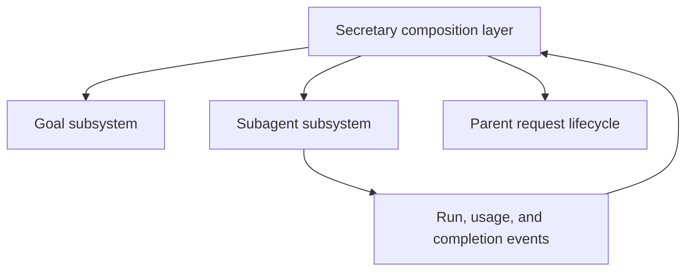

# Goal and Subagent Composition

**Document type:** Software design specification.

**Status:** Implemented in the working tree with deterministic real-SDK, standalone, migration, and acceptance verification. The [verification report](../testing/subagent-verification.md#2026-09-20-goal-independent-subagents-and-external-composition) records executed checks and deployment limits. This contract supersedes the goal-aware subagent design formerly specified in Subagent Architecture §11.

**Related documents:** [Subagent requirements](../user-stories/subagents.md#sa-08-compose-delegation-with-goals), [recovery interaction](../ux/subagents.md#53-work-while-a-goal-is-blocked), [subagent boundary](subagents.md#11-subsystem-independence), and [goal ordering](architecture.md#14-composition-with-subagents).

## 1. Decision

- The subagent subsystem must not know the goal subsystem. Its tools, service, runner, records, persistence, installation, and child context must not import goal types, read goal state, interpret goal statuses, or enforce goal policies.
- Goal management and delegation are independent capabilities. Secretary composes them outside both subsystems through their public interfaces.
- The presence of a stored goal does not make that goal the authority for every request in the conversation.
- A blocked goal stops automatic pursuit of that goal. It does not restrict the user's ability to request work, delegate, guide a running agent, or resume a finished agent.
- Recovery can require work beyond the goal's objective. Admission must not require the user or model to classify that work as related, unrelated, or eligible for a special recovery exception.
- This decision replaces the earlier proposal to make user-directed delegation conditional on goal association or goal-budget eligibility.

## 2. Dependency and ownership boundary



- The composition layer may depend on both subsystems. Neither subsystem depends on the other's internal implementation.
- The subagent subsystem owns run identity, parent-child relationships, admission provenance, permissions, capacity, cancellation, guidance, persistence, usage facts, and completion records.
- The goal subsystem owns goal state, automatic continuation, goal intent ordering, and goal-budget accounting.
- The composition layer owns request-to-goal associations, run-to-goal associations, and translation between agent events and goal operations. These associations are stored outside agent-owned records and tables.
- Generic request, operation, run, and usage-event identifiers allow correlation. Agent APIs must not require a goal ID, goal status, goal intent sequence, or a goal-specific authorization callback, even under a renamed wrapper.
- Agent lifecycle and usage events remain useful without any subscriber. Running the subagent subsystem alone must not require a goal service, a goal database, or a fake goal implementation.
- Child tool restrictions are supplied through the host's ordinary capability policy. Knowledge of which tools mutate goals belongs to the host composition, not to hard-coded goal-tool lists in the subagent module.

## 3. Request execution and control

- Ordinary user-directed requests use delegation under the same subagent contract whether a goal is absent, active, blocked, paused, complete, or limited. A goal status or goal budget is not a session-wide tool restriction.
- User-directed work does not implicitly change goal state or enable goal continuation. Session permissions, explicit cancellation, branch validity, and subagent limits still apply.
- The host correlates automatic goal requests with their actual producing requests. It must not infer automatic authority from whichever goal happens to be stored when a tool runs.
- Before dispatching additional work originating solely from automatic goal continuation, the composition layer consults the goal subsystem's ordering and continuation rules. This is a parent request execution policy, not an `Agent`-specific status check.
- For ordinary host tools, Secretary's supported admission boundary is its synchronous `tool_call` check. A call admitted there may finish through later third-party hooks even if a newer goal decision arrives. This is not a provider-wide or host-wide lock, and it does not imply that side effects began before the decision. Secretary-owned delegation additionally rechecks at execution and carries a standard cancellation signal through asynchronous admission. The implementation does not abort the whole parent session or clear unrelated queued input to close a third-party execution gap.
- Request source follows actual SDK message ingestion, not a scan of historical context. A deferred `nextTurn` completion appended after a fresh user prompt remains result data. Low-level `agent_end` does not discard source provenance during provider retry or compaction recovery; actual settlement or new ingress ends that provenance.
- Notification-originated and unresolved requests cannot use historical user receipts to authorize goal mutations. Budget wrap-up retains its separate reporting-only permission while the goal is budget-limited.
- When that automatic authority expires, the composition layer prevents further automatic dispatch and uses ordinary cancellation operations for the affected run identities. The subagent subsystem handles cancellation without interpreting its goal-related cause. Already-started side effects are not rolled back.
- The composition layer must preserve request provenance across retries, asynchronous admission, nested delegation, and completion handling. A later user message must not relabel an older automatic request as user-directed.
- New assignments to finished agents use the new request's provenance. Saved conversation history does not confer continuing authority from an old goal.
- Guidance to a running agent is admitted without consulting goal status. Guidance does not retroactively change the provenance of earlier actions or undo an already accepted cancellation. A stopping run retains the ordinary rule that resumption waits for settlement.
- A child completion is result data, not a user request or permission to resume a goal. The host decides whether to schedule a parent follow-up; the agent subsystem retains the result independently of that decision.
- Automatic goal continuation waits when its outstanding child dependencies have not materially changed. A wait timeout alone does not justify another automatic delegation cycle.

## 4. Usage and goal accounting

- The subagent subsystem records normalized usage facts with stable source-event and run identities. It does not calculate goal budgets or store goal attribution.
- The composition layer associates eligible usage with the originating goal using its own durable request and run mappings. A current-goal lookup at result arrival is not a substitute for provenance.
- Goal association is an accounting concern, not permission to execute. A missing association must not block ordinary user-directed delegation.
- Fresh user-directed requests use the existing active-at-capture accounting policy: when the producing request has a resolved association with an active goal, composition captures it once for descendant usage. A fresh request received while the goal is stopped has no such association. The parent runtime already starts goal accounting only for active goals; the new descendant behavior preserves that boundary without requiring task classification. Goal activation during a request affects subsequent captures, not previously admitted runs.
- Accounting association does not impose goal execution authority. A user-originated run may finish after its associated goal stops; eligible late usage is still recorded against the captured goal. Only automatic-origin work is cancelled because goal continuation authority expires.
- The existing **goal-budget token usage** formula remains:

```text
goal-budget token usage =
    max(inputTokens - cachedInputTokens, 0)
  + max(outputTokens, 0)
```

- The goal accounting consumer applies each source event at most once. Its usage-application marker and goal update commit atomically, or it records why no eligible goal can receive the event.
- Clearing or replacing a goal does not erase incurred usage, recreate the old goal, or transfer its costs to the replacement.
- Parent session usage reporting and goal charging are separate consumers. A foreground tool's aggregate report must not charge the underlying source events again.
- Agent context-window usage, cumulative usage, and goal-budget usage remain separately labeled quantities. Agent display formulas are not substituted for the goal-budget formula.

### 4.1 Durable correlation and replay

- `composition/association-store.ts` owns immutable request and run mappings. The coordinator persists a request before handing its generic request ID to an agent operation. The agent persists that ID in its run record without interpreting it.
- Agent admission and usage events are published after the corresponding facts commit. Subscriber failure is diagnostic and does not erase those facts. Composition reconstructs a failed run mapping from the persisted request ID before consuming usage, and startup replays both root and descendant owners.
- `execution-context.ts` carries only request correlation and a standard cancellation signal through the host's tool adapter. It contains no goal policy. The agent module does not receive a goal-specific authorization function.
- Direct UI assignments are user-originated operations. Saved child history never supplies their authority. Guidance cancellation is checked at admission and does not gain lifetime cancellation authority over an already running recipient.
- Live scope controllers are retained while owned child work is active and retired at actual settlement when no active child needs them. Durable association records remain accounting and audit facts, not permission to replay requests.

## 5. Required verification

- A dependency check must reject goal imports, goal-specific API fields, and goal-state checks in the subagent module, including installation and child execution paths.
- Standalone tests must exercise launch, guidance, resumption, nested delegation, cancellation, usage recording, and completion without initializing the goal subsystem.
- A real Pi SDK integration test must create a goal, block it, ingest a new user request, and successfully execute `Agent` and resuming `SendMessage` through the registered tools. The goal must remain blocked, and automatic continuation must remain disabled.
- The recovery request must include work beyond the original objective, without an association decision or resume command being required for admission.
- Composition tests must cover guidance to running agents, generic cancellation during asynchronous admission, nested execution, branch changes, and a fresh assignment to an agent whose earlier run was associated with a goal.
- Delayed automatic tool calls, retry callbacks, and completion notifications must not acquire authority from later user input. Tests must establish that the composition layer rejects stale automatic dispatch rather than relying on goal checks inside agent code.
- Accounting tests must cover duplicate events, recovery, cleared and replaced goals, and separation of attribution from admission.

## 6. Migration and verification limits

- Cross-subsystem orchestration and association storage now live under `composition/`. The agent installation, run records, usage records, and child execution paths contain no goal-specific policy.
- The composition migration captures legacy associations and removes their old fields atomically while preserving usage identities and execution evidence. It runs before composed agent recovery; standalone agent installation does not initialize goal management.
- Existing historical verification reports and implementation plans describe what was tested or delivered at the time. They do not establish conformance to this revised boundary.
- Deterministic regression results do not establish deployment into an already running session or migration of the user's live database. No live reload, production-data migration, paid-provider run, or human acceptance is claimed.
