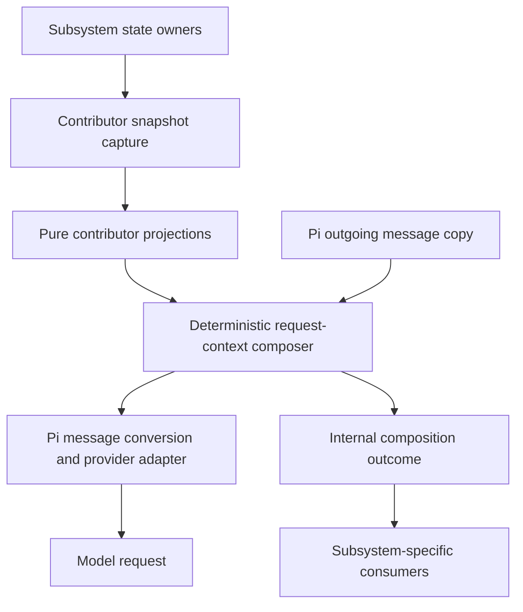

# Request-Time Context Injection

**Document type:** Software design specification.

**Status:** Implemented in `extensions/secretary/context/`, with deterministic unit and real-Pi SDK verification. The [verification report](../testing/subagent-verification.md#2026-09-20-request-context-composition-and-agent-discovery) records executed checks and limits. Hosted-provider serialization and cache measurements remain unverified.

## 1. Purpose and boundary

Secretary needs a reusable way to provide deterministic application state to a model without accumulating copies in conversational history. This document specifies that mechanism independently of any particular contributor.

- This document owns contributor registration, request preparation, deterministic serialization, message placement, lifecycle isolation, generic failure reporting, and preservation of conversation history.
- A contributing subsystem owns its data sources, schema, refresh policy, validation, disclosure policy, and interpretation of the published data.
- A consuming subsystem owns tool schemas, authorization, admission rules, and any binding between a model response and the state that response saw. The composer does not execute or authorize operations.
- The mechanism does not define filesystem discovery, configuration precedence, domain-specific catalogs, or the meaning of an unavailable capability.
- The initial registration API is internal to Secretary. A public cross-extension protocol, background polling, filesystem watchers, and automatic model calls are outside this design.
- Existing context projections are not automatically migrated. The one-envelope invariant applies only to contributors registered with this composer; other projections retain their own contracts.

[Subagent definition discovery](subagents.md#54-request-scoped-definition-catalog) is one application of this mechanism. Its catalog and execution policies belong to the subagent architecture, not to this document.

## 2. Host integration boundary

- Pi's documented `context` event runs before each agent-loop model call and supplies a deep copy of the messages. It is the supported boundary for this non-persistent projection.
- The composer returns a request-only message view. It does not call `sendMessage`, `sendUserMessage`, or a session append operation to install the envelope.
- There is no post-response cleanup handler because no saved message is changed.
- An implementation must verify hook behavior and message conversion against the project's supported Pi version. Newer documentation alone does not establish compatibility.
- Direct summarization calls or other model calls that bypass the agent-loop context hook are outside the coverage of this integration.

## 3. Invariants

1. Persisted user messages, attachments, assistant messages, and tool results are not rewritten to install or remove context.
2. Each applicable outgoing request contains one owned envelope when at least one contributor supplies data or reports failure. With no applicable contributors, it contains no envelope.
3. The envelope derives from application-owned snapshots, not from previous envelope text, model prose, or a model-generated summary.
4. Equal contributor snapshots produce identical model-visible bytes. Internal request identifiers and diagnostic timestamps do not appear in those bytes.
5. The composer treats each contributor's payload as opaque JSON data. It does not inspect domain fields or infer execution policy from them.
6. Composition does not trigger a model call, execute a tool, or grant authority to perform an operation.
7. Contributor failure is explicit rather than replaced with an undisclosed stale value. Operational consequences belong to the consuming subsystem.
8. Registrations and prepared state are isolated by session and activation. State from a previous activation does not silently become current.
9. A request-only envelope is absent from persisted conversation history. Its absence from storage does not imply that a provider never received it.

## 4. Composition architecture



### 4.1 State owners and contributors

- Each contributor has a unique namespaced identifier and an explicit integer order. Duplicate registration fails rather than replacing an existing contributor.
- Registration returns an unregister operation. A session owner disposes registrations on teardown; contributors are not stored in an unscoped process-global registry.
- Request preparation captures each applicable contributor's immutable state before rendering. Capture delegates to that contributor's state owner, which determines whether to refresh or reuse its source state.
- Capture may perform the state owner's asynchronous work. Rendering is synchronous and pure: it does not read files, query providers, call models, generate identifiers, or mutate messages.
- The mechanism does not promise an atomic snapshot across independent state owners. Subsystems that require cross-source consistency must provide it within their own capture operation.
- A contributor declares its data schema and disclosure rules in its owning technical documentation. The composer knows only the shared registration and result contracts.

The following interface describes the internal implementation, not a public cross-extension API. `S` is contributor-owned state, not a shared application catalog:

```ts
interface ContextContributor<S> {
  id: string;
  order: number;
  capture(context: RequestContext): Promise<S | undefined>;
  project(snapshot: Readonly<S>): JsonValue;
}

interface RequestContext {
  // These fields are internal and are not automatically serialized.
  sessionId: string;
  activationEpoch: number;
  requestId: string;
  signal: AbortSignal;
}
```

- An undefined capture means the contributor is inapplicable. Capture or projection failure produces an unavailable contribution rather than being treated as inapplicability.
- The shared envelope wraps each applicable contribution as either `ready` with opaque `data`, or `unavailable` with a bounded error code. Raw exception text is not sent to the model.
- Domain states belong inside ready contributor data. Successful composition says that data was projected correctly; it does not say a domain capability is ready or authorized.

### 4.2 One composer

- One composer owns hook integration. It processes contributors in ascending order and breaks ties by identifier using a locale-independent comparison.
- The envelope has a format version, composition status, and an ordered contributions array. Object keys use canonical ordering; the array retains contributor order.
- The serializer preserves payload array order. Contributors normalize unordered domain collections before projection; the composer cannot know which arrays are semantically ordered.
- The composer emits one physical line of compact JSON inside a fixed `<secretary-runtime-state>` wrapper. JSON string escaping and escaping of `<`, `>`, and `&` prevent field values from closing the wrapper. Newlines within strings remain escaped characters.
- The envelope limit is 32 KiB of UTF-8, including the wrapper. This is a design bound, not a measured optimum or a token-count guarantee.
- Overflow produces a small envelope with composition status `unavailable` and a bounded error code. It does not cut JSON, drop selected contributors, or claim a partial result is complete.
- Deduplication uses owned custom-message metadata in the outgoing copy, not a regular expression over conversational text. User text resembling the wrapper is preserved.
- Reapplying composition with the same prepared state replaces its own envelope. It does not remove other context projections or notifications.

### 4.3 Message placement and provider compatibility

- The envelope is appended to the outgoing message copy after Secretary's existing context projections. After tool execution it follows the complete tool-result sequence, rather than rewriting an earlier user message.
- The initial adapter uses one non-persisted Pi custom message with a reserved Secretary custom type and `display: false`.
- In the inspected Pi message conversion, custom messages become user-role model messages. This is a transport representation, not a claim that the human typed the data or that an XML-style tag creates system-message authority.
- The host integration provides stable instructions identifying the envelope as application state. Contributor-specific interpretation belongs in the consuming subsystem's instructions, not in the generic composer.
- The adapter preserves assistant tool-call/result pairing, multiple tool results, image blocks, and provider-specific ordering. An incompatible provider requires a tested adapter or an explicit unsupported outcome, not silent relocation into an earlier system prompt.
- Pi invokes extension handlers in load order. Secretary can control ordering among its own projections, but it cannot claim global last-position control over arbitrary later hooks or provider rewrites. Supported integration tests inspect the final serialized payload.

## 5. Request lifecycle and composition outcomes

- Each preparation has a session-scoped identity. Its captured inputs and projection outcomes remain associated with that prepared request rather than a mutable global latest-state variable.
- A raw transport retry reuses the prepared message view. A newly prepared model request captures state again according to each contributor's policy.
- Cancellation stops preparation through the request signal. Late results from an obsolete activation are discarded rather than attached to another request.
- Internal outcomes distinguish ready contributions, omitted contributions, unavailable contributions, and whole-composition failure. Request identity and these outcomes are available to subsystem integrations but are not automatically exposed in model-visible payloads.
- A subsystem that must correlate later operations with published state retains its own immutable data and binds the resulting model response through the supported host lifecycle. Tool-call correlation, retention through execution, and replay behavior are not composer policies.
- The composer releases its prepared resources when the request finishes or is abandoned. Longer-lived subsystem records have their own documented owner and disposal rules.
- Session replacement and teardown dispose registrations and pending preparation. They do not rewrite persisted history.

## 6. Safety and failure boundaries

- One contributor failing does not corrupt another contributor's payload. The envelope records the failed contribution as unavailable and preserves other valid contributions within the overall size bound.
- Whole-composition failure is reported through the internal outcome as well as a bounded unavailable envelope when the adapter can emit one. The composer does not substitute previous request data.
- Pi can report an extension-hook exception and continue processing. Throwing from `context` therefore does not guarantee that a model call or a later tool operation is blocked. Consumers requiring fail-closed behavior must check the associated preparation outcome independently.
- The composer does not decide which operation to disable after a failure. Such decisions belong in the consuming subsystem's technical contract.
- Application-owned data is not automatically privileged instruction text. Escaping, delimiters, and deterministic serialization do not confer authority or replace runtime permission checks.
- Contributors exclude secrets and minimize disclosed data. Diagnostics use bounded codes and fingerprints by default rather than copying payloads or exceptions into logs.
- Tool output and user-supplied lookalike tags do not become registered state. The original conversation remains intact on success, transport failure, cancellation, and crash.

## 7. Example integration

Subagent definition injection illustrates the boundary without defining it:

- The subagent subsystem discovers and validates definitions, captures its catalog, and registers a contributor that projects selection metadata.
- The composer sees only a contributor identifier and opaque JSON data. It serializes that data in the same way as any other contributor.
- The subagent subsystem interprets composition failure, correlates resulting tool calls, and enforces launch permissions.
- The [subagent technical contract](subagents.md#54-request-scoped-definition-catalog) owns discovery precedence, payload fields, refresh timing, and launch consistency. Adding another contributor does not require adding domain fields to `RequestContext` or domain branches to the composer.

## 8. History, diagnostics, and caching

- The transcript retains human input and normal assistant/tool events. Reopening, branching, or exporting it must not show request-only envelopes as human-authored text.
- Diagnostic metadata correlates a request with contributor identifiers, content fingerprints, and composition outcomes. A fingerprint alone cannot reconstruct the original payload; diagnostics must state when reconstruction is unavailable.
- Opt-in request captures may retain the envelope and final provider payload under explicit access and retention controls. Test captures belong under ignored `test-results/`; production prompts are not persisted by default.
- Compaction summaries are not the authoritative source of contributor state. The next ordinary model request captures state again through its owners.
- Stable early instructions and deterministic serialization avoid unnecessary prefix changes. This mechanism does not require changes to any particular tool schema.
- A moving transient suffix can still reduce prefix reuse. `H + R` followed by `H + A + T + R` diverges after `H`; the second request is not an append-only extension of the first.
- This design prioritizes one current bounded projection. It does not claim better cache reuse than append-only state updates, and one physical line does not imply a particular token saving.
- Cache evaluation inspects actual serialized requests and provider-reported usage under matched models, configuration, and workloads. Cache reads, cache writes, context size, and latency remain separate quantities using the project's established measurement formulas.

## 9. Verification contract

These cases define verification obligations. `tests/context/composer.test.ts` and `tests/context/sdk.test.ts` exercise synthetic contributors without subagent definitions. The verification report distinguishes executed coverage from remaining provider, compaction, and cache checks.

| Case | Required evidence |
| --- | --- |
| RC-01 | The real Pi hook projects multiple synthetic contributors, omits inapplicable ones, and produces no envelope when none apply. |
| RC-02 | Equal prepared state produces identical bytes, ordering is stable, owned-envelope replacement is idempotent, and lookalike user text is preserved. |
| RC-03 | Final provider payloads preserve images and complete tool-call/result sequences, including continuations and later extension hooks. |
| RC-04 | Success, cancellation, transport failure, recovery, and compaction leave saved conversation content unchanged and contain no persisted envelope. |
| RC-05 | Capture errors, projection errors, overflow, unsupported transport, and hook exceptions produce the specified internal outcomes without stale substitution. |
| RC-06 | Transport retries reuse prepared state, new preparations can capture updated state, and session replacement rejects late results from old activations. |
| RC-07 | A consumer can observe the outcome for its prepared request without relying on a mutable latest-result variable. Consumer-specific tool correlation is tested separately. |
| RC-08 | A matched cache comparison reports serialized-prefix divergence and provider cache counters without asserting an unmeasured benefit. |

- Serializer tests supplement real Pi hook and provider-serialization tests. A deterministic provider establishes runtime integration, not hosted cache behavior.
- Each contributing subsystem owns additional integration tests for its data and operational consequences. Passing these generic tests does not establish domain-specific behavior.
- The [testing guide](../testing/README.md#request-context-verification) distinguishes these planned checks from executed evidence.

## 10. References and limits

- Pi's [extension documentation](https://github.com/earendil-works/pi/blob/main/packages/coding-agent/docs/extensions.md#context) describes the non-destructive hook. Installed-version compatibility remains a verification obligation.
- Anthropic's [prompt-caching article](https://claude.com/blog/lessons-from-building-claude-code-prompt-caching-is-everything) describes reminders in later user messages or tool results. It does not establish post-response removal.
- LangChain's [context engineering documentation](https://docs.langchain.com/oss/python/langchain/context-engineering) distinguishes transient model context from persistent state. It is a conceptual reference, not a dependency.
- OpenAI's [Prompt Caching 201](https://developers.openai.com/cookbook/examples/prompt_caching_201) describes exact-prefix reuse and append-only updates. It does not prove a cache improvement for this design.
