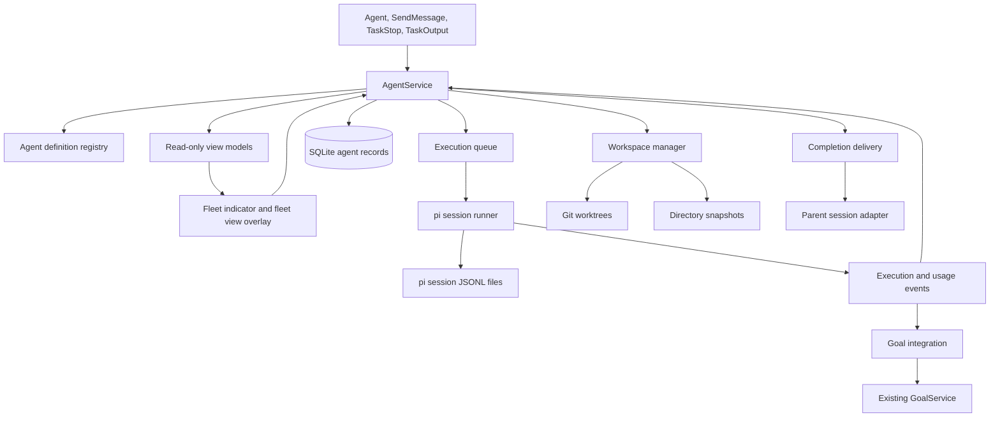
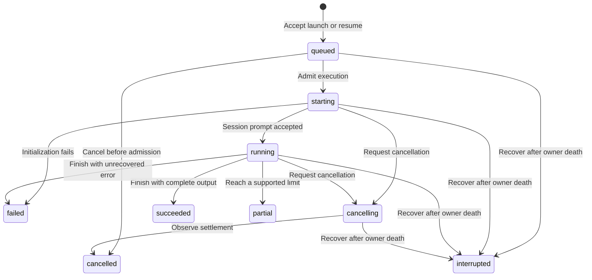
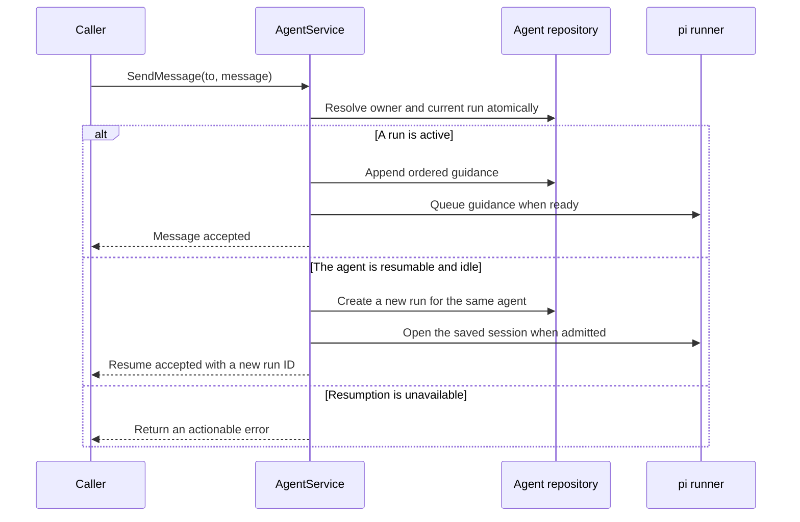
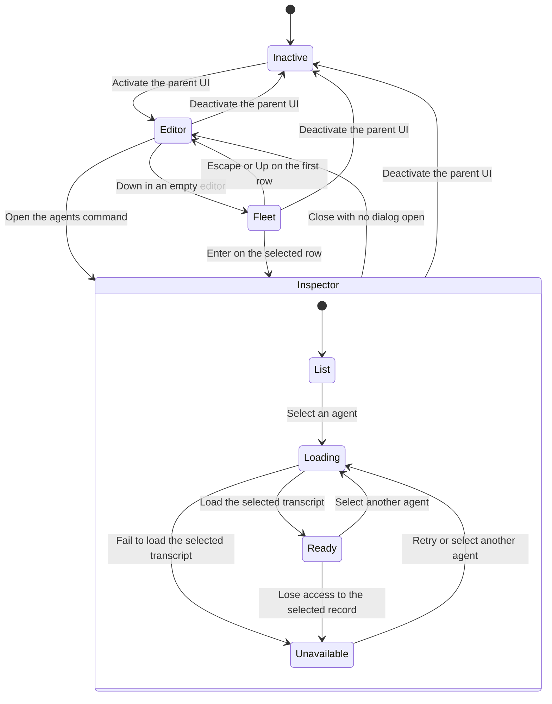
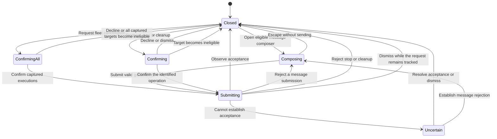
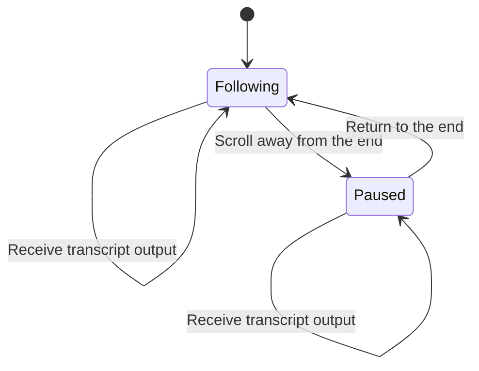

# Subagent Architecture and Runtime Contracts

**Document type:** Software design specification.

**Status:** Maintained architectural contract for the subagent subsystem. Verification results and known gaps are recorded separately in the [verification report](../testing/subagent-verification.md). Normative requirements in this document are not evidence that every host integration has been verified. Revised 2026-09-19: [Section 12](#12-tui-implementation-boundary) now specifies the unified fleet indicator and the split fleet view overlay in place of the former FleetView and async widget, and nested delegation is added to the runtime contract; both revisions are implemented.

**Implementation baseline:** `01f851a`, tested with Pi 0.85.1. Claude Code 2.1.272 supplies the tool-contract reference; the [historical research](../research/subagent-system-comparison.md) records the original source revisions.

**Related documents:** [Requirements](../user-stories/subagents.md), [interaction design](../ux/subagents.md), [research](../research/subagent-system-comparison.md), [goal architecture](architecture.md), and [documentation responsibilities](../README.md).

## 1. Decisions and Scope

### 1.1 Confirmed decisions

- Claude Code defines the reference tool names and input schemas.
- Nicobailon's implementation defines the TUI reference. Its inline display, fleet navigation, and inspector surfaces are ported onto Secretary's runtime. The ported FleetView summary and async widget are superseded by a single unified fleet indicator, and the inspector becomes a split fleet view overlay. Surfaces that depend on out-of-scope runtime features are excluded; [Section 12.6](#126-ported-surfaces-and-mapping) defines the mapping and the exclusions.
- Tintinweb's implementation is a reference for pi SDK integration, not a dependency or API authority.
- Child execution stops when the parent pi process exits. Conversation persistence supports explicit resumption, not continued execution after exit.
- `Agent.model` first matches the value against the models available in the session and then against the configured model fallback lists. The field has a stable string schema; configured list names are published through the [request-scoped catalog](#542-stable-delegation-schema) rather than an enum. `inherit` is also valid in agent definitions.
- The scope includes delegation, foreground/background execution, nested delegation, messaging, cancellation, output retrieval, custom agent definitions, worktrees, and inspection.
- Conversation forks, agent teams, remote execution, scheduling, and workflow orchestration are excluded.

### 1.2 Implemented defaults

- The compatibility baseline is Claude Code 2.1.272 with fork mode, agent teams, and cross-session messaging disabled.
- Four tools are registered: `Agent`, `SendMessage`, `TaskStop`, and `TaskOutput`.
- A background run is the default in TUI and persistent RPC sessions.
- Normal print and JSON invocations use foreground execution when neither the caller nor the definition requires background execution. An explicit background request or a definition that requires background execution is rejected in those modes. `SendMessage` resumption of an idle agent is also rejected there because that operation starts background work and has no foreground parameter. This avoids accepting work that the host will immediately terminate.
- Reload, new-session, resume-to-another-session, and parent-session fork stop the departing session's children rather than transferring live execution.
- The initial concurrency limit is four active child executions, and the pending queue limit is sixteen. These are configurable limits, not measured performance claims.
- The TUI uses Pi's compact/full state for inline tool detail, the unified fleet indicator below the editor, and the split fleet view overlay with configurable overlay keybindings. Inline tools have no independent Secretary display-mode selector. The revised inline rendering contract in Section 12.6.7 is pending implementation and user review; no execution capability is added for display purposes.
- A child conversation retains its resolved definition and model across resumption, subject to current permission and trust checks.
- Agent records and transcripts are retained until explicit removal outside this release. The host does not perform automatic transcript deletion or worktree commits.

### 1.3 Compatibility boundary

The implementation follows Claude's canonical names, core field shapes, and the selected feature profile. It does not emulate the entire Claude environment.

- Tool input for the model field accepts an exact identifier of a model available in the session or the name of a configured model fallback list. The available-model match takes precedence over a fallback list with the same name. Values that match neither are rejected rather than silently resolved to a different model.
- The default is the parent's working directory, independently of foreground or background execution. No Git initialization or commit is required for ordinary spawning.
- The optional invocation `isolation` accepts `none` or `worktree`. Omission uses the agent definition's setting, then defaults to `none`. An explicit `none` overrides an isolated definition. It is an explicit pi compatibility addition that gives model callers an unambiguous opt-out; it is not advertised as a Claude Code enum value.
- Unsupported `remote` isolation is not advertised. A legacy or invalid request for it still fails rather than silently changing execution mode.
- `subagent_type: "fork"` is rejected because conversation forks are out of scope.
- `team_name` and `mode` are accepted as deprecated, ignored fields, as in the inspected baseline. They never grant permissions or create a team.
- `SendMessage` exposes only the required-string-message variant. It does not expose team protocol objects or `notify_when_idle`.
- Existing pi tools are not renamed. Output files can be read with pi's `read` tool.
- `TaskStop` and `TaskOutput` resolve Secretary-owned child work only. They do not control unrelated shell tasks.
- The initial result and error structures are Secretary contracts described below. Exact Claude output-schema compatibility is not claimed.
- Unsupported and unknown parameters are rejected rather than silently ignored, except the two documented deprecated `Agent` fields. This stricter policy is an explicit deviation where the upstream schema permits or normalizes additional input.

## 2. Architecture



### 2.1 Responsibilities

| Component | Responsibility |
| --- | --- |
| `AgentService` | It validates operations, owns lifecycle transitions, and coordinates persistent changes. |
| The agent registry | It discovers definitions, resolves precedence, validates configuration, and records provenance. |
| The execution queue | It admits work under concurrency and shutdown constraints. |
| The pi session runner | It creates sessions, executes prompts, collects events, applies cancellation, and disposes resources. |
| The workspace manager | It selects Git worktrees or directory snapshots, verifies ownership, and performs conservative cleanup. |
| The repository layer | It stores agent, run, message, usage, and delivery records with schema migrations. |
| The completion delivery component | It reconciles pending results with the correct parent session without treating uncertain delivery as success. |
| The goal integration component | It attributes usage and validates whether further goal-related work remains authorized. |
| The TUI components | They render snapshots and submit actions through `AgentService`. They do not mutate runtime state directly. |

### 2.2 Module organization

The implementation is organized as follows. Queue admission and completion delivery are coordinated by `service.ts`; tool registration and goal integration are composed by `installation.ts`.

```text
extensions/secretary/agents/
  service.ts
  records.ts
  registry.ts
  configuration.ts
  installation.ts
  presentation.ts
  runner.ts
  child-context.ts
  workspaces.ts
  worktrees.ts
  transcript-format.ts
  storage/
    agent-repository.ts
    migrations.ts
    parent-lock.ts
  tools/
    schemas.ts
    rendering.ts
  ui/
    fleet-view.ts
    async-widget.ts
    inspector.ts
    transcript.ts
    transcript-events.ts
    usage-labels.ts
    keybindings.ts
    state.ts
    reducer.ts
    effects.ts
    commands.ts
```

The existing extension entry point composes these modules alongside goal management. Factories register tools and handlers but do not start timers, model calls, or child sessions. Session-scoped resources start during session activation or the operation that needs them.

## 3. Invariants

1. Each agent belongs to one parent session, and each run belongs to one agent.
2. At most one nonterminal run exists for an agent.
3. A tool invocation identifier identifies at most one accepted launch within its parent session.
4. A resumed agent preserves its agent identifier and receives a new run identifier.
5. Cancellation targets the run captured when the request was accepted, not an arbitrary later run.
6. A background launch is not successful completion.
7. No completion, usage, or messaging event changes ownership based on arrival time.
8. Child tool access cannot exceed the parent's allowed tool access and applicable permission policy.
9. Children cannot invoke delegation tools or goal-mutation tools in this release.
10. A worktree is not removed while its runner or tools may still be executing.
11. Usage is recorded once per source event and is never reassigned to a replacement goal.
12. Model notifications are untrusted result data, not authorization to resume a paused goal.
13. No agent starts automatically because a parent session was restored.

## 4. Model-Facing Tools

### 4.1 `Agent`

The following type shows the supported input superset. `createAgentSchema()` narrows the advertised `model` field to configured model fallback-list names, or removes that field when none are configured:

```ts
interface AgentInput {
  description: string;
  prompt: string;
  subagent_type?: string;
  model?: string; // configured fallback-list names are published in runtime context
  run_in_background?: boolean;
  name?: string;
  isolation?: "none" | "worktree";
  team_name?: string;
  mode?: "acceptEdits" | "auto" | "bypassPermissions"
    | "default" | "dontAsk" | "plan";
}
```

- The description and prompt are required strings. Empty or whitespace-only values fail runtime validation.
- Omitted `subagent_type` resolves to the enabled `general-purpose` definition. An explicit unknown type fails.
- Names follow the researched 64-character pattern and reserved-recipient restrictions. Names are unique among the parent session's branch-visible agents. Abandoned admissions retain their identities but do not reserve names on a sibling branch. Section 6.4 defines the durable uniqueness key and visibility rules.
- Type matching is exact. The implementation does not silently convert an unknown specialist into a general-purpose agent.
- An explicit isolation field takes precedence over the definition's isolation. If neither specifies isolation, execution uses the parent's working directory. Requested worktree isolation is never silently downgraded.
- The `manual` permission-mode compatibility spelling is normalized to `default` before validation, but the field remains ignored.
- The model string has no schema default or enum. Configured fallback-list names are advertised through request context; runtime validation rejects unknown models and lists. Definition selection and inheritance follow Section 5.
- The boolean background field does not acquire a schema default. A definition with `background: true` requires background execution even if the caller supplies false, following the researched Claude behavior. Otherwise the explicit invocation value wins, followed by the host-mode default in Section 1.2. A definition with `background: false` does not force foreground execution. Host restrictions are checked after resolution and reject unsupported background execution.
- Launch validates configuration, ownership, capacity, trust, and model availability before allocating a worktree or contacting a provider.

An accepted background response contains the agent identifier, run identifier, status, resolved model, and output path in both model-visible text and structured details. A foreground response contains the same identity and the final outcome. A foreground error can include partial output but is not represented as a successful completed run.

### 4.2 `SendMessage`

```ts
interface SendMessageInput {
  to: string;
  message: string;
  summary?: string;
}
```

- `to` is a required single-line recipient string with the researched length bound. Only a current-parent agent ID or exact name is accepted.
- `message` is required and must contain non-whitespace guidance for this local-only profile.
- `summary` is optional with the researched maximum. It is a display label rather than a separate instruction.
- The handler resolves the recipient once and serializes the decision against launch, cancellation, and completion.
- Queued or starting runs retain guidance for delivery after initialization.
- Running sessions receive guidance through the SDK steering mechanism at a supported turn/tool boundary. Tool execution is not represented as instantly interrupted.
- A finished resumable agent starts a new background run with the message as its next user instruction in TUI or persistent RPC mode. Print and JSON mode reject this operation before creating a run, reserving capacity, or acknowledging acceptance.
- A stopping agent rejects resumption until termination is observed.
- Messages to one-shot agents, unknown recipients, unrelated sessions, or missing saved conversations fail without spawning replacements.
- An acknowledgment reports acceptance or queueing. It does not claim consumption or compliance when the SDK cannot prove those events.

Concurrent `SendMessage` calls to an idle agent are serialized. The first creates the new run; later calls join that run's guidance queue in acceptance order. They do not create concurrent sessions. A pending worktree cleanup reservation rejects resumption as described in Section 9.2.

### 4.3 `TaskStop`

```ts
interface TaskStopInput {
  task_id?: string;
  shell_id?: string;
}
```

- Runtime requires a truthy `task_id ?? shell_id`, matching the researched precedence.
- The target can be a run ID, an agent ID, or a name. An agent reference resolves to its current run at acceptance time.
- `shell_id` is accepted as the deprecated spelling, but it can still refer only to Secretary-owned work.
- Stopping an already terminal run is an idempotent no-op with its actual outcome.
- A queued run transitions directly to cancelled. A starting or running execution enters cancelling and stays there until settlement is observed.
- A successful stop request does not promise rollback of file changes or immediate termination of a noncooperative extension tool.
- An explicit later `SendMessage` can resume an eligible cancelled agent after it has settled. Cancellation never triggers automatic resumption.
- The UI's internal `stopMany` operation validates every captured run ID as parent-owned before mutating any run. It commits the complete batch's cancellation states and durable receipt before notifying subscribers or invoking child abort callbacks. Captured queued runs cannot start between individual cancellation requests. Already terminal runs remain terminal, and noncooperative active runs remain cancelling until settlement. This operation does not add a public model-facing tool.
- Installed fleet cancellation uses that batch operation. An alternate UI port may use stable per-run operation IDs and aggregate individual receipts, but that fallback does not provide the queue-admission barrier.

### 4.4 `TaskOutput`

```ts
interface TaskOutputInput {
  task_id: string;
  block?: boolean;
  timeout?: number;
}
```

- `task_id` is required. It accepts a run ID or an agent ID; an agent ID selects the latest run at call acceptance.
- `block` defaults to true. `timeout` defaults to 30000 milliseconds and accepts numbers from zero through 600000 inclusive.
- A nonblocking call returns the current recorded outcome and bounded output immediately.
- A blocking call waits for that captured run to settle or for the wait timeout to expire.
- Timeout and cancellation of the wait do not cancel the agent.
- Reading output is not an acknowledgment that a completion notification was delivered. Deduplication belongs to the delivery component.
- All text outputs are bounded by pi's existing truncation utilities. A truncated response identifies the full output file.

### 4.5 Result and error handling

Successful launch and output handlers return bounded text plus the captured `AgentRun` as structured `details`. `presentation.ts` adds model and workspace information from `AgentRecord` to the text. These are Secretary contracts, not Claude output-schema compatibility claims. Errors propagated through Pi may have empty `details`, so callers must not require structured success fields on an error result.

- Input errors and rejected operations throw through pi's supported error path so `isError` is set correctly.
- Accepted asynchronous work can later fail. Its launch result remains an accepted launch; its final failure is persisted and delivered separately.
- User-visible text includes identity, status, failure reason, partial-output status, and relevant paths. These fields are not hidden solely in `details`.
- Child output is delimited as untrusted task data. It cannot manufacture a tool result or goal instruction.
- No compatibility claim is made about historical aliases or undocumented preprocessing beyond the explicitly listed cases.

## 5. Agent Definitions and Model Resolution

### 5.1 Discovery and trust

Definitions use Markdown with YAML frontmatter. The Markdown body is an optional custom role prompt; metadata-only definitions and whitespace-only bodies are valid. An empty body contributes no custom role prompt, while the normal pi instructions, applicable project instructions, and delegated task remain in effect. This does not make the `Agent.prompt` task argument optional.

Discovery order, from highest to lowest precedence, is:

1. Trusted project definitions are read from `<project>/<CONFIG_DIR_NAME>/agents/`.
2. User definitions are read from `<getAgentDir()>/agents/`.
3. Packaged definitions provide `general-purpose`, `Explore`, and `Plan`.

- The registry rejects duplicate names within one scope and invalid frontmatter.
- The initial frontmatter subset includes `name`, `description`, `tools`, `disallowedTools`, `model`, `maxTurns`, `background`, and `isolation`.
- Tool lists use actual pi tool names. This is an explicit agent-definition adaptation, not a tool-schema change.
- Unsupported behavioral fields such as permission overrides, hooks, or remote execution fail validation rather than being ignored.
- The definition's `background` field is a boolean with the resolution rules in Section 4.1. The definition's `isolation` field accepts `none` or `worktree`; unsupported values fail registry validation. Explicit invocation isolation wins over the definition default, but an explicit unsupported value is rejected rather than replaced.
- Project trust is checked before project definitions, extensions, and configuration are honored.
- A user definition can override a packaged agent; the inspector records the selected source and content hash.
- Changes to definitions affect new agents. Resumption uses the stored definition snapshot, while current trust and permissions may narrow or refuse it.

### 5.2 Packaged definitions

- `general-purpose` receives the parent's authorized tool names after the runner removes its prohibited delegation, workflow, and goal-control tools. The runner rechecks permissions at execution boundaries. It does not infer whether an arbitrary third-party tool requires a UI; those tools must honor the headless contract in Section 8.3.
- `Explore` and `Plan` initially use `read`, `grep`, `find`, and `ls`. They do not receive unrestricted shell access under a read-only label.
- Packaged `Explore` and `Plan` are one-shot and cannot be resumed, following the current documented Claude behavior. Their retained identifiers support inspection and output retrieval only.
- A project override is a custom definition with its own recorded capabilities; it is not silently treated as the packaged read-only implementation.
- System prompts retain applicable project instructions and child-specific role instructions. Conversation history is not copied.

### 5.3 Model fallback lists

**Status:** Implemented. This section supersedes the former `agents.modelAliases` contract.

Secretary configuration supplies an `agents.modelFallbackLists` object whose keys are list names and whose values are ordered arrays of exact pi `provider/modelId` identifiers. A list's array order is the resolution order: models are tried from first to last, following the same fallback semantics as a CSS `font-family` list.

- Global configuration is read from `<getAgentDir()>/secretary.json`.
- Trusted project configuration is read from `<cwd>/<CONFIG_DIR_NAME>/secretary.json` and overrides corresponding global agent settings. A project list with the same name replaces the global list entirely; lists are never merged.
- Both files contain an `agents` object. Unsupported agent configuration fields fail validation.
- List names follow the agent-name pattern: an alphanumeric first character followed by letters, digits, `-`, or `_`, up to 64 characters. The name `inherit` is reserved and cannot name a list.
- The plugin ships with no model fallback lists. A fresh installation has an absent or empty `modelFallbackLists` object, and every list is user-created.
- Users can create and remove lists. Removing a list does not rewrite definitions that reference it.
- Duplicate entries within one list fail configuration validation. An empty list is valid configuration; a launch that resolves to an empty list fails as described below.
- The former `agents.modelAliases` object and its four fixed alias names are removed. A configuration file that still contains `modelAliases` fails validation with an error that names `modelFallbackLists` as the replacement.

A definition or invocation model value is interpreted as follows:

1. The value `inherit` contributes the active parent's model captured when the launch specification is resolved. This includes model changes after session startup; it does not mean the configured default for new pi sessions.
2. A value that exactly matches a model available in the session forms a single-candidate chain. The available-model match takes precedence over a fallback list with the same name.
3. Otherwise, the value names a model fallback list, and the list's members form the candidate chain in configured order.
4. A value that matches neither an available model nor a configured list fails the launch with an error naming the unmatched value.

The model source is selected in the following order:

1. An explicit `Agent.model` value.
2. Otherwise, the definition's model value.
3. Otherwise, `inherit`.

Each candidate is checked in order against the model registry, the parent's scoped-model restrictions, and credential availability. The first candidate that passes every check is selected.

- Credential availability is a configured-credential check: a candidate whose provider declares API-key or OAuth authentication but has no configured credentials is skipped. The registry's request-auth probe alone is not sufficient, because it reports success for a builtin provider that has no credentials at all.
- A named list that is not configured fails the launch with an error naming the missing list. There is no fuzzy matching and no silent provider fallback.
- If every candidate fails its checks, the launch fails with an actionable error that lists each attempted model and its failure reason.
- If candidate setup or disposal aborts the chain before it is exhausted, the failure report retains each attempted candidate with its reason alongside the aborting error.
- If the selected candidate fails during launch or on the run's first provider request with an availability failure — rate limiting, quota exhaustion, provider-side cooldown, an unknown-model response, or a credential rejection such as a missing or provider-rejected API key — the runner discards the pre-work session state and attempts the next candidate. Errors that are not availability failures, such as content rejections or tool errors, fail the run without advancing the chain.
- Each candidate attempt loads its own extension resources. Disposing a failed attempt's session invalidates that attempt's extension runtime, so a later attempt must not share it.
- The chain is evaluated only before the run's first successful provider response. Once execution begins, the selected model is fixed for the run, and mid-run provider errors keep the existing fail-fast behavior.
- A per-parent-session availability cache records candidates observed to be cooling down or quota-limited, including the provider-reported reset time when one is available. Later launches in the same parent session skip those candidates until the reset time passes.
- The launch result and the run record state the resolved model. When the first candidate was not used, they also state which candidates were skipped and why.
- Resumption retains the recorded model and does not re-evaluate the chain. A missing credential or unavailable model on resumption requires an explicit configuration correction, not a different model selected silently.
- The child inherits the parent's thinking level unless a supported future definition field explicitly changes it. The initial public tool has no `thinking` parameter.
- Provider registrations and credentials must be obtained through supported pi facilities. Access to an undocumented model-registry backing field is not an accepted permanent integration strategy.

### 5.4 Request-scoped definition catalog

**Status:** Implemented for [SA-13](../user-stories/subagents.md#sa-13-discover-agent-definitions-without-filesystem-probing), with deterministic SDK integration tests. The [verification report](../testing/subagent-verification.md#2026-09-20-request-context-composition-and-agent-discovery) records coverage and unexecuted live-provider checks.

**Boundary:** This section owns subagent discovery, selection metadata, catalog lifecycle, and consistency between advertisement and launch. [Request-Time Context Injection](request-context.md) supplies only the generic contributor and composition mechanism. It does not know agent definitions or decide whether a launch is allowed.

- Before this change, `agents/installation.ts` discovered definitions inside `Agent.execute` without publishing the inventory. The separate `secretary:agents-state` projection still reports instances and outcomes, not selectable definitions.
- The catalog publishes identifiers and descriptions before the first delegation decision, without model-issued filesystem discovery. Full role prompts remain child instructions.
- The subagent session owner registers `secretary.agent-catalog` with the request-context composer. Capture delegates to the catalog owner; pure projection returns only selection metadata. The generic request interface contains no catalog field.
- The subagent integration retains the captured full definitions and checks the associated composition outcome before admitting launches. It does not rely on the composer to enforce delegation policy.
- This change adds no discovery tool, editor, filesystem watcher, automatic child launch, or goal resumption. Existing status projection and completion delivery remain separate.

#### 5.4.1 Selection metadata

- Each entry publishes the exact definition name as `type`, the resolved description, and the model policy with an omitted definition model normalized to `inherit`.
- The catalog publishes `defaultType: "general-purpose"`. If that definition is unavailable, omission fails explicitly rather than substituting a different type.
- Model policies distinguish exact identifiers, fallback-list references, and inheritance. They do not claim provider health or report a fallback candidate as already selected.
- Configured fallback-list names are published for `Agent.model`. Ordered chain contents stay in the captured execution configuration rather than being duplicated in the prompt.
- Entries use the resolved override's metadata. A custom replacement of a packaged name must not be advertised with the packaged description.
- Definition bodies, credentials, source contents, complete filesystem paths, and execution artifacts are excluded. Source identity and definition hashes remain internal provenance.
- Entries and fallback-list names are sorted by exact identifier before projection. Execution chains retain their configured order.
- A ready catalog is complete for its authorized scope. Ready-empty, disabled delegation, and unavailable discovery are distinct domain states inside contributor data; the generic composition status does not replace them.
- An instance name is not a definition type. A label such as `Explore` is not a runtime read-only guarantee; actual tool enforcement remains in the runner.

This synthetic example shows contributor data only, not the generic envelope or a captured request. Its descriptions do not redefine packaged agents:

```json
{
  "status": "ready",
  "defaultType": "general-purpose",
  "definitions": [
    {"type": "Explore", "description": "Find files and symbols using read-only tools.", "modelPolicy": "inherit"},
    {"type": "Plan", "description": "Develop an implementation plan.", "modelPolicy": "inherit"},
    {"type": "general-purpose", "description": "Handle research and implementation tasks.", "modelPolicy": "superior"}
  ],
  "modelFallbackLists": ["superior"]
}
```

#### 5.4.2 Stable delegation schema

- `Agent.subagent_type` remains an optional string. Its fixed description directs the model to the current catalog and states the default. Catalog edits do not regenerate an enum.
- `Agent.model` is an optional string with a fixed description rather than an enum of configured list names. Existing runtime matching of available models and configured list names remains unchanged. Only the advertised-enum policy is superseded.
- The model should omit `Agent.model` unless the user requests an override. Publishing model policy does not authorize overriding a definition.
- Runtime validation still rejects unknown types, unknown lists, and unsupported parameters. A stable schema does not authorize guessing values.
- Unknown-type errors name the requested identifier and bounded valid alternatives from that request's catalog. A missing request receipt produces a correlation error, not a new filesystem lookup.
- Stable tool instructions explain how to use `secretary.agent-catalog` as selection data. Arbitrary definition descriptions cannot override higher-priority instructions or runtime checks.

#### 5.4.3 Request-boundary discovery and refresh

- Discovery retains Section 5.1 precedence: trusted `<project>/.pi/agents/`, then `<getAgentDir()>/agents/`, then packaged definitions. It does not add a project-local `.pi/agent/agents/` directory.
- The first ordinary model request receives a prepared catalog even if no child exists. At each later request boundary, the catalog owner checks definition files and relevant fallback-list configuration for changes.
- Discovery is plugin-side work, not a model filesystem tool call. Added, edited, renamed, and removed definitions become visible together in the next successfully prepared request, without requiring a watcher or restart.
- Refresh builds an immutable candidate without mutating the active snapshot. Changed file contents or directory membership during reading cause unstable refresh to fail; the implementation does not claim an atomic filesystem transaction.
- Invalid YAML, unreadable sources, duplicate names within a scope, and invalid configuration produce an unavailable catalog and prevent fresh launch admission. Previous snapshots may remain for existing receipts or diagnostics, but are not advertised as current.
- Correcting the sources permits recovery on the next request. The catalog does not silently omit invalid entries and label the remaining inventory complete.
- Fallback-list menu edits remain durable immediately, but model-originated launches use the configuration captured for their producing request. This refines the earlier phrase "subsequent launches" without changing an already issued response's selected policy.

#### 5.4.4 Request receipts and launch consistency

- Each generation captures a subagent-owned receipt containing session identity, activation epoch, immutable definitions, fallback-list configuration, catalog fingerprint, and the associated generic preparation outcome. The receipt is not a model-facing tool argument.
- The subagent adapter correlates returned assistant tool-call identifiers with their producing receipt at assistant `message_end`, which the supported Pi host processes before tool execution. Only that generation's pending receipt is used; `Agent.execute` looks up the exact call binding, not a mutable latest catalog.
- `turn_start` and context preparation clear pending generation state. Tool settlement releases individual bindings; turn completion, agent completion, tree navigation, and shutdown clear remaining references. These lifecycle rules do not add a model-facing receipt field.
- All sibling calls in a parallel batch use the same captured configuration even if files or menu values change during execution.
- A raw transport retry retains its prepared context and receipt. A newly prepared request after recovery may capture newer state; neither path changes the meaning of a response already received.
- The selected full definition is captured before queueing. File deletion after publication affects future requests, not an already advertised launch. Current trust, permissions, goal authorization, cancellation, and tool restrictions can still reject execution.
- Resumption retains the saved agent's definition and recorded model under Section 7.5 rather than selecting by name from the current catalog.
- Existing launch idempotency remains in force. A completed tool invocation is not launched again; an unaccepted historical call without its producing receipt is not interpreted using current files.
- Receipts remain until associated dispatches settle, including delayed siblings. They are disposed on safe teardown and never cross session or branch activation boundaries as new execution authority.
- Receipt diagnostics may include definition fingerprints. Such metadata does not reconstruct an unavailable original request or authorize its replay.

#### 5.4.5 Admission failures and nested delegation

- Fresh launch admission requires a ready catalog and a valid producing receipt whose contribution was successfully composed. Unavailable contribution, envelope overflow, whole-composition failure, or missing outcome rejects new launches rather than silently using stale definitions.
- Throwing from the context hook is not sufficient because Pi may report the exception and continue. The subagent admission guard independently checks the receipt and preparation outcome.
- Cancellation, current trust, tool availability, and nesting authorization are rechecked after asynchronous model resolution and after asynchronous workspace admission before a new run is committed. A background launch must not escape a cancellation received while resolving credentials.
- Invalid startup configuration initializes inspection with default service limits, but discovery remains unavailable and blocks fresh launches until the source is corrected. Definitions and fallback lists recover at the next request; service concurrency limits remain session-initialized.
- A child allowed to delegate receives an independent catalog and receipt lifecycle rooted in its authorized scope. It does not share a mutable parent receipt through process-global state.
- At maximum nesting depth, or when `Agent` is unavailable because of policy or a tool collision, the contributor reports disabled delegation without advertising callable definitions.
- Discovery failure does not terminate unrelated parent work or existing children. Inspection and cancellation retain their existing semantics.
- Trusted discovery does not make description text privileged instruction. Runtime enforcement remains independent of whether the model obeys the catalog.

#### 5.4.6 Discovery verification

These cases define verification obligations. `tests/agents/discovery.test.ts` and `tests/acceptance/discovery.test.ts` exercise the new discovery path; the verification report identifies remaining checks. Generic composition coverage belongs to [request-context verification](request-context.md#9-verification-contract).

| Case | Required evidence |
| --- | --- |
| SA-DISC-01 | The first real Pi request advertises packaged, user, and trusted-project definitions with exact precedence and descriptions, before any model filesystem-discovery call. |
| SA-DISC-02 | An edit while a model response is held does not change the definition used by that response's parallel launches; the next request sees the edit. |
| SA-DISC-03 | Addition, removal, renaming, model-policy changes, fallback-list edits, malformed sources, unstable reads, and recovery obey the discovery publication policy. |
| SA-DISC-04 | Untrusted project sources, revoked permissions, tool collisions, nesting limits, and child-session isolation cannot expand advertised execution authority. |
| SA-DISC-05 | Missing receipts, unavailable contributions, envelope overflow, and composition-hook failures cannot admit stale or uncorrelated launches. |
| SA-DISC-06 | Definition snapshots survive queueing and resumption; reload and session replacement retain the existing shutdown contract and discard old request authority. |
| SA-DISC-07 | A real-provider request delegates to a configured custom agent without parent filesystem discovery and observes the final child result, not just launch acknowledgment. |

- Tests exercise the real Pi context hook, registered `Agent` handler, registry, runner, and provider serialization boundary. A direct registry unit test does not establish model-visible discovery.
- A deterministic provider holds responses to exercise configuration races without mocking the registry or runner. This establishes runtime integration, not real-model selection quality.
- The incident-shaped integration case launches ten read-only child tasks after the initial request exposes the custom definition. External quota failures remain distinct from discovery failures.
- `doc/acceptance/agent-discovery.feature` has executable bindings and a reviewed source hash. Its cases cover first-request visibility, edited-definition consistency, and recovery. Existing registry and runner tests supplement rather than replace this request-boundary evidence.

## 6. Data Model and Persistence

### 6.1 Entities

| Entity | Key fields and responsibility |
| --- | --- |
| `AgentRecord` | It stores `agentId`, parent session identity, parent agent identity for nested delegation, optional name and immutable admission name scope, definition snapshot, model, tool policy, session path, resumability, and optional worktree ID. |
| `AgentRun` | It stores `runId`, `agentId`, status, launch origin, timestamps, output paths, partial-result metadata, and error or cancellation reason. |
| `GuidanceRecord` | It stores an accepted guidance ID, target run, order, text, and delivery state. States distinguish pending, transport-accepted, consumed when provable, undelivered, and uncertain. |
| `UsageRecord` | It stores a unique source event ID, run identity, normalized usage, and optional originating goal identity. |
| `CompletionRecord` | It stores run identity, destination parent, delivery ID, and pending/submitted/observed/uncertain state. |
| `WorkspaceRecord` | It distinguishes a Git `WorktreeRecord` from a `DirectorySnapshotRecord`. Both retain source, path, identity, and cleanup state; only Git worktrees have a branch and base commit. |

An agent ID names a conversation. A run ID names one execution. A source tool-call ID deduplicates a launch; it is not reused as either identity. The historical `AgentRecord.worktree` and `requestedWorktree` keys now hold discriminated workspace records and plans; their names do not imply Git isolation.

### 6.2 Storage ownership

- SQLite agent tables are added through additive migrations in the existing Secretary database. The agent repository does not repurpose `thread_goals` for agent state.
- `AgentService` is the single writer for its parent's agent tables: it runs only after acquiring the exclusive parent lock, and `recover()` executes before any display read. The service therefore maintains an in-memory projection of its parent's agents, runs, and usage events, loaded once at recovery and updated write-through in the same commit as every mutation. Snapshot and view-model reads (§12.6.3) serve this projection and never re-read storage; explicit lookups (target resolution, receipts, transcript parsing) remain authoritative storage reads and stay fail-fast.
- pi `SessionManager` remains responsible for session JSONL history. Secretary stores references and its own execution metadata, not a competing conversation format.
- Each run has a plain-text output artifact for model retrieval. The inspector reads the pi transcript and does not infer current status from output text.
- State directories use owner-only permissions where supported. Credentials are not copied into records, configuration snapshots, or notifications.
- Storage root configuration is shared with the existing Secretary data-directory setting. Artifact names use generated identifiers rather than prompts or agent names.
- Database schema versions and snapshot versions are explicit. Unknown future versions fail safely.

### 6.3 Transactions and recovery

- A short transaction creates the accepted agent/run record and reserves its name and launch key. No transaction remains open while awaiting a model, filesystem operation, Git command, or user input.
- A partial unique index or equivalent transaction check enforces one nonterminal run per agent.
- Worktree allocation is a recoverable step after acceptance. Allocation failure records a failed run and cleans up only resources proven to belong to that allocation.
- Session history and SQLite cannot be assumed to commit atomically. Startup reconciles their identifiers and recorded outcomes.
- A per-parent exclusive ownership lock prevents two Secretary controllers from resuming the same parent's child sessions simultaneously. A live conflict disables mutations for that parent's agents and reports the owner.
- The implementation must use an OS-supported lock or a tested lock implementation with process-liveness validation. A timestamp-only lease or PID file is insufficient to prove a previous owner has died.
- After a proven dead owner, nonterminal runs become interrupted. They are not replayed automatically.
- A missing output artifact may be rebuilt from a retained transcript. A missing conversation cannot be replaced silently when resuming.

### 6.4 Branch and session ownership

- Parent session identity, not the working directory, is the ownership boundary.
- A new or forked parent session does not inherit control of the source session's agent records.
- Navigation within one parent session tree does not undo external execution. Durable ownership remains session-wide, while context, fleet navigation, and name resolution follow selected-branch admission ancestry. The [rewind interaction](../ux/subagents.md#52-rewind-the-parent-conversation) defines the user-facing behavior.
- Historical tool calls are never executed merely because a transcript is replayed or a branch is selected.

#### 6.4.1 Branch visibility and rewind cancellation

- The user selected cancellation of abandoned work on 2026-09-20. This implements [SA-05](../user-stories/subagents.md#sa-05-retain-and-recover-conversations). The [investigation](../research/subagent-session-rewind.md) records the reproduced context leak and the independent name conflict.
- Each new run retains an immutable `parentEntryId`. Tool admissions use the structured generating assistant entry; direct UI admissions use the selected leaf. `AgentBranchScope` compares that identity with the full selected ancestry, rather than the compacted model context. A missing generating tool entry is rejected instead of inventing provenance.
- The service selects each agent's latest visible run for current context, fleet rows, name resolution, and named output inspection. Exact owned agent and run identifiers retain historical access and cleanup authority. Tool output labels an explicitly requested off-branch run as historical execution.
- Agent operation keys contain both the generating assistant entry and tool-call ID. Messaging and cancellation receipts use the same admission-scoped identity. Retrying an accepted operation is idempotent; a sibling branch can reuse a provider's tool-call ID without reusing the earlier execution.
- New agents retain an immutable `nameScope` equal to their admission entry. The repository serializes `[nameScope, name]` into the existing SQL uniqueness column while keeping the public name in the record payload. The service separately rejects collisions among visible names. Legacy index values and all historical rows remain unchanged; no destructive SQL migration is required.
- `session_tree` clears catalog authority and reconciles branch visibility. Each proven-outside nonterminal run receives an idempotent stop request. A shared-ancestor run is retained. Cancellation remains pending until execution settles; statuses, usage, output, and filesystem effects are never rolled back.
- Completion callbacks and pending-outcome enumeration require current visibility. Context preparation also removes stale completion messages whose run is not visible, protecting against previously queued messages. This does not retract messages already displayed or claim to cancel a parent turn already handed to pi before navigation.
- A resumption records its own admission entry. If the saved child conversation's latest run is outside the selected ancestry, further messaging is refused rather than resuming a future transcript. Inspection shows the retained earlier output with a notice, and the advanced descendant roster is omitted. Child transcript rollback is not implemented.
- For legacy runs, provenance recovery accepts only a unique structured historical `Agent` or resumption `SendMessage` call matching the stored operation key. It never searches arbitrary output text for identifiers. Unknown provenance is excluded from current state and does not authorize automatic cancellation.
- Verification covers repeated launches, same-name and repeated-call-ID isolation, returning to the old branch, shared ancestry, live cancellation and completion suppression, resumption rejection, compacted ancestry, reopened JSONL ancestry, and conservative legacy handling. The verification report distinguishes these checks from process-restart and hosted-provider coverage.

## 7. Execution Lifecycle



The status vocabulary is internal. A new run is created for resumption; terminal runs never return to `running`.

### 7.1 Admission and event handling

- Queue admission checks ownership, shutdown state, capacity, current permissions, model availability, and applicable goal authorization.
- The queue is FIFO among eligible work. Foreground work consumes the same execution capacity as background work.
- A full queue rejects a launch before consuming provider resources.
- SDK initialization and resource loading are abort-aware. Cancelling during startup prevents later prompt submission.
- The runner subscribes before submitting the prompt and records terminal outcome only after retries and compaction recovery have settled.
- A low-level `agent_end` event alone does not prove the complete operation has settled.
- `prompt()` resolving is checked alongside message stop reasons, cancellation state, and pending accepted guidance. Empty output after an unrecovered error is not successful completion.
- Only supported provider retry behavior is automatic. The host does not replay an entire task after uncertain tool side effects.

### 7.2 Guidance settlement

- Each accepted message remains attributable to one run. A later resume does not silently retarget it to another run.
- Messages not submitted to the SDK when startup fails, cancellation settles, goal authority expires, or shutdown completes become undelivered with a reason.
- Messages accepted by the SDK are marked consumed only when a correlated event establishes consumption. Otherwise they become uncertain when the run settles.
- Both undelivered and uncertain messages remain inspectable. Neither is automatically resubmitted or used to create a new run.
- Resumption clears any residual SDK steering queue and submits only the new explicit message. Previously persisted conversation entries remain historical context, but unconsumed queue entries are not replayed as new instructions.
- The resumed prompt states that the new guidance controls the next execution and identifies unresolved old guidance as historical rather than newly authorized work.
- The UI reports unresolved delivery and allows the user to copy the text for an explicit resend. It does not label transport acceptance as model compliance.

### 7.3 Limits and partial output

- A definition's `maxTurns` is a positive integer configuration value; it is not added to the `Agent` schema.
- Reaching a turn limit stops further ordinary work and records available output as partial.
- The implementation may request a bounded final summary before a hard stop, but it must not represent a missing summary as complete output.
- Definition limits, queue bounds, nesting depth, and goal budgets have distinct purposes and are reported separately.
- Nested delegation is bounded by a maximum depth below the main session, configured by `agents.maxNestingDepth` with a default of three levels. A child session below the maximum depth receives the delegation tools; at the maximum depth the delegation tools are not registered, and a direct launch attempt beyond it fails with an actionable error.

### 7.4 Shutdown and cancellation

- Cancelling a foreground `Agent` tool handler propagates cancellation to its captured child run. This applies while queued, starting, or running; it is not the wait-only cancellation behavior of `TaskOutput`.
- The service records the foreground waiter's cancellation independently of the child's outcome. If completion already committed, the final outcome remains completed rather than being overwritten by cancellation.
- If the foreground waiter disappears before receiving the outcome, the service retains a completion-delivery record. The result is shown in the UI and included in the next parent context without requesting an automatic turn after a user abort. It is not lost because the run originally used foreground execution.
- Session shutdown first refuses new launches and messages that would resume work.
- Stopping an agent requests cancellation of its nested children before the parent settles; session shutdown stops the whole tree. A nested child never outlives its parent's session.
- It cancels queued runs, requests cancellation of active runs, waits for observable settlement, flushes records, runs extension cleanup, and disposes sessions.
- SDK resources are constructed under an async-context-local child marker so Secretary does not initialize another root controller inside a child.
- Cleanup is idempotent and applies to partially initialized sessions as well as completed ones.
- The runner bounds extension shutdown handlers to five seconds after active execution settles. Separately, `shutdownTimeoutMs` controls how long service shutdown waits before reporting that settlement remains incomplete. Neither timeout proves that an external tool has stopped.
- If a tool remains active, the record remains cancelling or is reported as interrupted when the process exits. Its worktree is retained, and the agent cannot be resumed concurrently.
- Reload or session replacement must not abandon a live in-process runner and then create a second runner for the same agent. If safe teardown cannot be established, the adapter refuses the replacement when the host permits it and reports that restarting pi is required.
- Arbitrary extension tools can spawn detached external jobs. Stopping an SDK session cannot guarantee termination of every external side effect. Only child sessions and managed tool processes are within this cancellation guarantee.

### 7.5 Resumption



- Resumption verifies saved history, definition snapshot, current trust, model availability, tool restrictions, and worktree identity.
- Current policy may remove tools but must not widen a saved agent's privileges implicitly.
- A materially changed policy that prevents the task from continuing produces a diagnostic before a provider request.
- A cancelled agent is resumable only after its previous runner and managed tools have settled.

## 8. pi Host Integration

### 8.1 Resource and tool policy

- A child receives a fresh event bus unless an explicitly scoped bridge is required. Root extension events are not broadcast indiscriminately into children.
- The selected resource loader retains applicable project instructions and trusted resources while preventing Secretary's root initialization in a child.
- Delegation tools, workflow tools, and goal-mutation tools are removed from both discovery and execution paths.
- The effective tool set is the intersection of parent-authorized tools and the definition's allowlist, minus explicit denials and child-incompatible operations.
- Late-registered tools undergo the same checks. Descriptions or active-tool filtering alone are not sufficient enforcement.
- Safety and permission hooks must not be dropped merely to simplify child startup.
- Tools that require human interaction must check UI availability and reject unsupported headless execution explicitly. This release does not route child dialogs to the parent or auto-approve child prompts. The SDK's cancellation defaults for optional dialogs are not permission grants.

### 8.2 Supported pi APIs and compatibility tests

- Session creation uses `createAgentSession`, resource loading uses `DefaultResourceLoader` or the supported resource-loader interface, and restoration uses `SessionManager`.
- Live guidance uses supported steering APIs. Cancellation uses the session's abort operation, followed by settlement and disposal.
- UI rendering uses `setWidget`, custom components, tool renderers, and configured keybindings.
- Extension shutdown must run exactly once for each initialized child. Prefer supported runtime disposal when it provides this guarantee; otherwise encapsulate the required lifecycle sequence in one adapter and verify it against the supported pi version.
- Model-runtime inheritance, permission propagation, lifecycle teardown, and editor composition are implementation prerequisites to test against the installed SDK. The design does not assume that a private getter or internal field is a stable API.
- The implementation must either pass the supported package-version matrix or narrow its peer dependency range. Passing only the installed version is not evidence for the full declared range.

### 8.3 Child UI capabilities

- The parent owns the terminal. An interactive parent retains `mode: "tui"`, its real UI context, and its widgets while child execution proceeds independently.
- Every fresh child SDK session binds extensions in `mode: "print"` without supplying `uiContext`. This also applies when restoring a saved conversation into a new SDK session. Omitting a context on a session that was already bound to a custom UI does not clear that earlier binding.
- Pi's native headless context supplies the complete UI interface and reports `hasUI: false`. Optional widget and notification methods are no-ops, confirmation returns `false`, and input dialogs return `undefined`. Interactive-only extensions must not interpret these cancellation results as approval or successful input.
- Secretary must not supply a synthetic UI merely to intercept notifications. Pi treats a supplied context as UI availability, regardless of print mode. In Pi 0.85.1, its object-spread wrapper also drops methods supplied only by a proxy's property getter.
- Child tool activity, text, and completion flow through the session event subscription and service records. The parent renders that progress. Child UI methods do not borrow the parent's editor, terminal subscriptions, or widgets.
- The normal extension error listener remains active. Headless operation does not justify swallowing unrelated initialization or execution errors.
- Real-SDK regression tests cover startup, resumption, concurrent sessions, cancellation, idempotent shutdown, and dialog cancellation defaults. The real-provider interactive E2E test additionally verifies that the parent remains a TUI while the child completes with installed widget extensions. See the [E2E testing instructions](../testing/subagent-e2e.md).

### 8.4 Parent authentication delegation

- Each child creates a model runtime with an empty in-memory credential store and delegates authentication through the parent's public model registry. It does not load a second copy of the user's credential files.
- `createAgentSession()` flushes provider registrations queued by loaded extensions. The runner reinstalls its stable parent-authentication adapter after that construction step and refreshes the selected provider without network discovery before invoking startup handlers.
- The runner checks adapter identity after startup and before subsequent model or tool actions. A later provider replacement fails explicitly rather than silently changing authentication.
- This ordering is verified against Pi 0.85.1. The regression tests include constructor-time, startup-time, and later provider registration, as well as resumed sessions.

### 8.5 Tool-name collisions

- Secretary does not silently override another extension's `Agent`, `SendMessage`, `TaskStop`, or `TaskOutput` tool.
- A collision disables Secretary's delegation execution for the session and reports which extension must be disabled or reconfigured.
- No child run starts while the public control tools are ambiguous.
- Existing goal tools remain available; the collision does not disable unrelated goal management.

## 9. Workspace Isolation

### 9.1 Allocation

- Ordinary spawning uses the parent's current working directory. The background flag does not request isolation, and no Git command is needed on this default path.
- Explicit invocation settings take precedence over definition settings. Only effective `worktree` isolation allocates another workspace; effective `none` uses the parent directory.
- For a Git checkout with a valid `HEAD`, the host captures that commit at launch acceptance and creates a unique branch and linked worktree from it. Uncommitted parent changes remain excluded from this mode.
- For a project without Git, or a Git checkout whose current branch has no initial commit, the host creates an owned directory snapshot containing its current regular files and directories. Git metadata is excluded. This fallback includes current uncommitted files, does not initialize or commit the original project, and is reported as `directory-snapshot`, not as a Git worktree.
- Repository corruption, permission errors, and other failed Git operations are not treated as evidence of an unborn or absent repository. They remain explicit errors.
- A snapshot copies from the project directory for non-Git projects and from the repository root for an unborn checkout. The child retains the parent's relative working-directory location within the isolated copy.
- Snapshot copying is bounded to 10,000 files and 128 MiB. Symbolic links and special files are rejected rather than followed into the parent or outside directories. Source files that change during copying cause an explicit failure. These safeguards prevent unsafe or unbounded copies; a directory snapshot is not a security sandbox or an atomic filesystem snapshot.
- Managed snapshot storage must be outside the copied source tree. Failed allocations preserve their owned artifacts for diagnosis rather than deleting uncertain evidence.
- The result and inspector report the actual mechanism, workspace path, and source. Only a genuine Git worktree reports a branch and base commit.
- Configuration discovery remains rooted at the trusted source project. The host never falls back to the parent directory if an isolated workspace disappears.

Using `HEAD` for committed Git repositories remains a deliberate difference from Claude versions that default worktrees to the repository's default branch. The shared-directory default matches Claude Code's documented default behavior.

### 9.2 Retention and cleanup

- Worktrees remain available after execution to support inspection and resumption.
- The host does not auto-commit agent edits. Existing commits created deliberately by the agent remain on its branch.
- Cleanup is permitted only for an idle agent with a verified owned workspace. A Git worktree must be unchanged, remain at its base commit, and retain matching Git metadata. A directory snapshot must match its recorded initial file hashes, permissions, and directory inventory; changed or unverifiable snapshots are retained.
- Confirmation captures the agent, worktree, and record revision without holding a database transaction open. After confirmation, a transaction rechecks those identities and the absence of an active run, then persists a cleanup reservation. A stale confirmation fails.
- The cleanup reservation excludes new runs and resumption. After reserving, the manager revalidates Git metadata and filesystem state before removal. It does not rely on the checks performed before the dialog opened.
- Successful removal and non-resumability are recorded before the reservation is released. Failure before removal releases the reservation only if the intact worktree is verified.
- Recovery of an interrupted cleanup checks the recorded reservation against Git and filesystem state. An absent worktree is recorded as removed and non-resumable. An intact, verified worktree can have its reservation released. Partial or uncertain removal retains the reservation and requires manual recovery; resumption remains blocked.
- Cleanup checks staged, unstaged, untracked, ignored files, and submodule state. Uncertain or nonempty states are refused rather than force-deleted.
- Successful cleanup marks the associated agent non-resumable and preserves its transcript and outcome.
- The command never removes a branch or directory merely because its name has a familiar prefix.
- No automatic merge, cherry-pick, force-delete, or dirty-worktree recovery is included.

Retaining even unchanged isolated workspaces until explicit cleanup differs from upstream automatic cleanup policies. This implemented policy makes resumption predictable and avoids automatic removal of an agent's working directory.

## 10. Completion Delivery and Model Context

### 10.1 Delivery protocol

- A run's terminal transition and pending completion record are committed together.
- Completion records are keyed by run ID so a resumed agent can produce another distinct completion.
- Foreground outcomes are returned by the waiting tool handler and do not also trigger an ordinary background completion turn. If the waiter is cancelled or delivery to it becomes uncertain, the service retains the outcome and uses the non-triggering recovery path in Section 7.4.
- Background outcomes are delivered as bounded extension-owned messages to the owning parent, using the host's follow-up mechanism rather than impersonating user input.
- Delivery records progress from pending to submitted and then observed when matching parent transcript evidence exists.
- Submission failure leaves the record pending. A crash or uncertain acknowledgment leaves it uncertain until reconciliation.
- Reconciliation searches by the stable delivery identifier, not by result prose or timestamps.
- If the host cannot establish whether a message was observed, the next parent model context includes the result once in a replaceable current-status projection. The implementation does not blindly trigger duplicate turns.
- Exactly-once provider execution is not promised. The design uses deduplicated state and conservative recovery to avoid repeated execution and misleading delivery claims.

### 10.2 Turn policy

- A normal background result can request one parent follow-up turn in a live owning session.
- A result associated with a paused, cleared, replaced, or otherwise non-active goal is retained and shown in the UI but does not automatically resume goal work.
- Restoring a parent session does not replay old automatic follow-up requests. Undelivered outcomes become available in its next context or explicit inspection.
- A parent request receives one bounded current-agent snapshot listing relevant active runs and undelivered outcomes. Historical snapshots are replaced in the outgoing copy, not appended indefinitely.
- Status refreshes do not start model turns, and rendered assistant claims do not change agent records.

### 10.3 Transient definition metadata

- The running-agent status projection and the definition catalog serve different purposes. The former reports instances and outcomes; the latter identifies types available for new delegation.
- The [composition contract](request-context.md#4-composition-architecture) produces one new request-only envelope after Secretary's existing projections. It does not replace completion delivery or add automatic follow-up turns.
- The [history and caching contract](request-context.md#8-history-diagnostics-and-caching) forbids append-then-delete mutation of saved user messages. A transient suffix limits stale-context accumulation but does not promise an append-only provider prefix or improved cache reuse.
- Goal authorization remains governed by Section 11. An advertised definition, catalog update, or contributor snapshot is state rather than permission to resume a goal.

## 11. Goal Integration

### 11.1 Origin and ordering

- An agent launch inherits goal attribution from its producing parent request, not from an unqualified read of the currently focused goal at completion time.
- Attribution stores the originating thread, goal ID, accepted intent sequence, control generation, and session epoch where available.
- A launch unrelated to goal work has no goal attribution. Ambiguous attribution is not guessed.
- The existing goal ordering and synchronization components remain authoritative for whether further goal-related actions are allowed.
- Newer user intent can invalidate subsequent child work without reclassifying already incurred usage.

### 11.2 Usage accounting

The existing **goal-budget token usage** formula remains:

```text
goal-budget token usage =
    max(inputTokens - cachedInputTokens, 0)
  + max(outputTokens, 0)
```

- Usage from completed assistant messages and reported compaction operations is normalized to the existing `TokenUsage` representation.
- Each source usage event is persisted with a unique identity. A transaction records its application to the originating goal or records why no live goal can receive it.
- The goal update and usage-application marker must commit atomically in the shared database, through a new idempotent `GoalService` accounting operation. An in-memory counter followed by an unrelated database write is insufficient for crash recovery.
- This new operation preserves existing budget precedence and publishes the normal goal change event after commit.
- An event for a cleared or replaced goal remains in the run's usage history but cannot recreate that goal or charge its replacement.
- Parent session usage reporting and goal-budget charging are separate consumers of the same usage event. A foreground tool's aggregated `usage` must not cause a second goal charge.
- The existing unattributed descendant accumulator is not used as the sole integration interface. It cannot by itself distinguish executions belonging to different goal identities after replacement.
- Execution duration, context-window usage, provider token totals, and goal-budget usage remain separate quantities with explicit labels.

### 11.3 Continuation and limits

- Completion messages cannot mark goals complete, blocked, or active. The parent must use the existing goal contract under current authorization.
- At an idle boundary, one current continuation can tell the parent about outstanding attributed work and permit independent work. If the parent yields without new work while the same child set is outstanding, automatic goal continuation waits for a material child event or new user input instead of repeating the same wake-up.
- A wait timeout alone is not a material child event and does not cause repeated delegation.
- Parent work that is explicitly requested by the user is not blocked merely because a child exists.
- Goal pause, clear, replacement, or budget exhaustion prevents new child actions authorized solely by the obsolete goal at the next supported model/tool boundary. Already-started tool side effects are not rolled back.
- An attributed child that cannot continue under current goal authority ends with available partial output. A reporting-only budget summary may be requested under the existing goal policy, but ordinary tools remain unavailable for that summary.
- A later explicit resume captures new authorization for the new run. Its prior conversation is context, not continuing permission to pursue an old goal.

## 12. TUI Implementation Boundary

The [interaction design](../ux/subagents.md) owns visible behavior. The following are technical mechanisms:

- The fleet indicator is a session-owned widget under a distinct Secretary key and does not replace the goal widget or the global footer. Its placement is configurable between below and above the editor; the default is below.
- The fleet indicator is the single below-editor agent list. It renders only while at least one top-level agent execution is non-terminal, shows the main row first, appends non-terminal top-level agents in creation order, and removes a row immediately when its run reaches a terminal status. When the last row leaves, the surface renders nothing and list focus returns to the editor. Enter on the main row returns focus to the prompt input; Enter on an agent row opens the overlay. The async widget is removed; background executions no longer have a second list.
- The fleet view overlay is an in-process custom TUI component rendered as a bordered overlay. It does not depend on Herdr, Ghostty automation, or opening another terminal.
- View models are immutable snapshots obtained from `AgentService`; progress events invalidate affected components. The fleet indicator polls on a bounded interval so elapsed time advances between service events; rendering is deduplicated by a render key so unchanged state does not repaint. Display reads never touch storage per paint or tick: `AgentService` publishes view models from an in-memory projection of committed state (§6.2), so a contended shared store cannot block or fail a paint (goal architecture §5.1.1, §13.6).
- The editor integration composes with an existing editor factory. It captures navigation only when the editor is empty and the agent component can receive focus.
- If editor composition is unavailable, the `/agents` command remains functional and the adapter reports the missing shortcut integration rather than replacing another editor silently.
- Transcript rendering uses structured events parsed from the persisted pi session file, bounded windows, and strips untrusted terminal control sequences. Raw artifacts are not interpreted as UI commands.
- Scrolling, selection, and draft guidance remain stable across progress updates and terminal resize.
- Stop confirmation retains the selected run ID and observed revision; it does not re-resolve a name to a new run after confirmation. Revalidation checks target identity and current eligibility. A revision change caused only by transcript progress is not a reason to reject the same eligible target.
- State changes are delivered to the TUI only after service commit. Rendering failures do not roll back accepted work.

### 12.1 UI state model

- This section is the authoritative definition of the UI state machines. The [UX interaction flow](../ux/subagents.md#5-visible-interaction-flow) describes the corresponding user experience.
- Navigation, dialog interaction, and transcript following have separate state machines. Agent execution remains independent and follows Section 7.
- Sections 12.1.1 through 12.1.5 define diagrams, transitions, and invariants. Section 12.1.6 defines their internal representation.

#### 12.1.1 Navigation state machine



- `Inactive` means no current parent TUI is bound. It does not mean that a particular agent is stopped.
- `Editor` means the main editor owns keyboard focus. The fleet indicator is visible only while a non-terminal top-level agent exists.
- `Fleet` means the fleet indicator list owns keyboard focus.
- `Inspector.List` presents the overlay's navigation list at the current drill level. A direct agent command proceeds from this state to `Loading` with the requested selection.
- The drill path and the terminal-agent filter are presentation state orthogonal to the inspector's inner states. Drilling in or out and toggling the filter do not change the `List`/`Loading`/`Ready`/`Unavailable` state kind.
- `Inspector.Loading` shows which transcript is loading and allows the user to close the view or select another agent.
- `Inspector.Ready` displays the selected agent's available transcript and actions.
- `Inspector.Unavailable` displays a missing-record or load-failure diagnostic. It does not silently select a different agent.
- A terminal agent outcome updates the visible status without leaving `Inspector.Ready`. Transcript loading does not infer that an agent is running.
- Closing the overlay returns focus to the editor, including when it was opened through the fleet indicator. The main editor draft is preserved.

#### 12.1.2 Dialog state machine



- This machine describes messaging, individual or fleet-wide stop confirmation, and cleanup confirmation. The action and target are shown explicitly; the diagram does not make the operations interchangeable.
- The dialog remembers whether it was opened from the editor or inspector and returns focus there when dismissed. A direct stop or cleanup command does not need to open the inspector first.
- `Composing` retains the selected recipient and draft. Empty submissions stay in this state with a validation message.
- `Confirming` retains the exact run or worktree selected before the dialog opened. A newer run is not substituted automatically.
- `ConfirmingAll` retains a fixed set of active top-level run identities from the current fleet. Later launches and replacement runs are not added. Confirmation operates only on captured runs that remain eligible. Nested work stops through the existing parent cancellation cascade; unrelated sessions are never included.
- `Submitting` disables duplicate submission. It remains distinct from the agent's running or stopping state.
- Dismissing a submitted request does not retract it, cancel the child, or authorize a retry. Its outcome remains available in the owning session.
- `Uncertain` means the interface cannot yet establish whether the request was accepted. The text and target remain inspectable, and a new submission is disabled until the original request is resolved.
- A message rejected definitively returns to `Composing` with its draft intact. A rejected stop or cleanup closes confirmation and displays the reason at the originating view.
- Agent completion while a composer is open does not close it or discard text. Its action label changes to indicate resumption when that is available; otherwise submission is disabled with a reason.
- Escape closes only the currently focused dialog. A subsequent Escape can close the inspector. Escape in the main editor keeps its normal host behavior, including foreground interruption where applicable.

#### 12.1.3 Transcript-following state machine



- `Following` keeps the end of the selected transcript visible as output arrives.
- `Paused` preserves the user's reading position while output continues.
- Wheel scrolling in a mouse-enabled host drives the same transitions as keyboard scrolling; it adds no states.
- These states apply while a selected transcript is ready. Selecting a different transcript initially follows its end; retrying the same transcript preserves the prior reading anchor when it can be recovered.
- Resize and theme changes do not switch the following state. Agent completion does not reset it.

#### 12.1.4 Transition rules and feedback

| ID | Current state and event | Guard | Next state and observable effect |
| --- | --- | --- | --- |
| UI-01 | The editor receives fleet indicator activation. | The editor is empty, no dialog is open, and at least one indicator row exists. | The fleet indicator receives focus and selects its first row without starting a model turn. |
| UI-02 | The user opens an agent. | The agent belongs to the current parent session. | The fleet view overlay loads that agent and shows its identity during loading. |
| UI-03 | Transcript loading succeeds or fails. | The response still belongs to the visible selection. | The inspector shows the selected transcript or its diagnostic without changing selection. |
| UI-04 | The user opens the composer. | The selected agent can receive guidance or resume. | The composer receives focus with a stable recipient and draft. |
| UI-05 | The user submits guidance. | The draft is nonempty and no submission for that composer is pending. | The dialog enters `Submitting` and sends one request. |
| UI-06 | Guidance is definitively rejected. | The response belongs to the open submission. | The composer reopens with the same draft and an actionable error. |
| UI-07 | The user confirms stop or cleanup. | The originally selected target remains eligible. | The dialog enters `Submitting`; the resulting status is reported without assuming the operation has finished. |
| UI-08 | A confirmation target becomes ineligible. | The selected run finished, another run started, or worktree eligibility changed. | Confirmation closes with an explanation and no replacement operation is submitted. |
| UI-09 | The user dismisses a pending or uncertain submission. | The dialog has focus. | The originating view regains focus while the request remains tracked. No retry or cancellation is inferred. |
| UI-10 | Progress, resize, or theme updates arrive. | The update belongs to the current session and selected record where applicable. | The view refreshes without discarding the draft, changing focus, or leaving paused transcript following. |
| UI-11 | The user closes the fleet view overlay. | No dialog is open. | The editor and its draft are restored without cancelling work. |
| UI-12 | The parent UI is deactivated. | The host is leaving or replacing the session. | Views and drafts are cleared, and late responses cannot reopen them. Child shutdown follows the separate execution contract. |
| UI-13 | The user drills into the selected agent. | The overlay is open and the selected agent has at least one nested child visible under the current filter. | The drill path gains the agent, the list shows its children, and the first child is selected. The transcript follows the new selection. |
| UI-14 | The user returns to the parent level. | The drill path is nonempty. | The drill path drops its last entry, and the agent the user came from is re-selected. |
| UI-15 | The user toggles terminal-agent visibility. | The overlay is open. | The filter flips, and the selection moves to the nearest remaining row only if the selected row left the list. |

#### 12.1.5 Focus and race-condition invariants

- Exactly one editor, list, inspector, or dialog receives keyboard input at a time.
- Selection follows stable agent identity rather than list position. Reordering rows does not redirect a message or confirmation.
- Agent progress does not invalidate a confirmation by itself. A change to the selected execution or action eligibility does.
- A service rejection takes precedence over an earlier enabled button. The interface does not retry against a different target automatically.
- Delayed transcript results cannot overwrite a more recently selected transcript.
- Delayed operation acknowledgments may update the owning agent's status but cannot close a different dialog or move focus from a newer view.
- Main-editor text and rejected message drafts are retained while the current UI session remains active. Message drafts are not persisted across session deactivation in this release.
- Non-TUI clients use the same operation semantics without constructing a UI state machine.

#### 12.1.6 Internal state representation

```ts
type NavigationState =
  | { kind: "inactive" }
  | { kind: "editor" }
  | { kind: "fleet"; selectedAgentId: string | null } // null selects the main row
  | { kind: "inspector"; detail: InspectorState };

type InspectorLevel = { path: string[]; includeFinished: boolean };

type InspectorState =
  | { kind: "list"; level: InspectorLevel }
  | { kind: "loading"; level: InspectorLevel; agentId: string; requestId: string }
  | { kind: "ready"; level: InspectorLevel; agentId: string; transcript: TranscriptView }
  | { kind: "unavailable"; level: InspectorLevel; agentId: string; reason: string };

type DialogState =
  | { kind: "closed" }
  | { kind: "composing"; agentId: string; draft: string; error?: string }
  | { kind: "confirming"; target: ActionTarget }
  | { kind: "confirming-all"; targets: readonly StopTarget[] }
  | { kind: "submitting"; operation: PendingOperation }
  | { kind: "uncertain"; operation: PendingOperation; reason: string };

type ControlAction = "stop" | "cleanup";
type TranscriptFollowMode = "following" | "paused";
```

- The types are discriminated unions. `TranscriptView`, `ActionTarget`, and `PendingOperation` are internal records described below, not additional public tool parameters.
- A transcript view retains its follow mode, stable message anchor, relative display offset, tool-expansion setting, and bounded rendered window.
- An action target retains the parent session, agent ID, and the relevant run ID or worktree ID. It records the revision observed when confirmation opened, but the service evaluates actual identity and eligibility at execution.
- A pending operation retains an operation ID, action, target, submitted text where applicable, and the view instance that originated it. A `stop-all` operation retains its captured run targets rather than resolving the fleet again at submission or receipt reconciliation.
- The enclosing UI state retains the parent session ID, activation epoch, view instance ID, originating focus, and a monotonically increasing state revision.
- Confirmation is rendered in the inspector overlay, not inside the bottom indicator. Indicator shortcuts can open that confirmation surface. Opening a direct command's dialog from the editor retains the editor as its return location.
- `inactive` requires a closed dialog and no bound terminal references. `composing` requires an inspector with a selected record. Both confirmation forms support editor-originated shortcuts or commands and the inspector.
- These constraints are checked by the reducer. The Cartesian product of the unions is not a declaration that every combination is legal.
- Renderer state never writes an `AgentRun` status. A submitted stop request and a cancelling agent remain different records with different state machines.

### 12.2 Events, guards, and effects

The controller uses a pure transition function:

```ts
transition(state, event, serviceSnapshot): {
  state: UiState;
  effects: UiEffect[];
}
```

- Input events include activation, navigation, selection, composer editing, submission, confirmation, dismissal, transcript scrolling, and deactivation.
- External events include transcript load completion, operation acknowledgment, operation rejection, uncertain operation outcome, service snapshot changes, resize, and theme changes.
- Guards implement the transition table in Section 12.1.4, including empty-editor activation, ownership, message eligibility, nonempty drafts, and stable confirmation targets.
- Effects include loading a transcript, submitting guidance, requesting cancellation or cleanup, restoring focus, publishing feedback, and requesting a render.
- The reducer performs no filesystem access, service mutation, asynchronous work, clock reads, or identifier generation. The adapter supplies identifiers and event metadata explicitly.
- The controller records the returned state before dispatching effects. Repeated Enter events therefore encounter `submitting` and cannot emit a second submission.
- Effects return outcome events instead of mutating components directly. Exceptions become explicit rejection or uncertainty events, not unhandled callbacks.
- Invalid events leave protected state unchanged and emit actionable feedback when appropriate. Normal editor input that is not handled by the agent UI is delegated to the existing editor.
- Service-side validation remains authoritative. An enabled UI action is not a reservation or a permission grant.

### 12.3 Correlation and operation recovery

- Every transcript request carries the parent activation epoch, view instance, agent ID, and request ID. A response is applied only if all four still match the loading state.
- A service snapshot update can refresh status independently of a transcript response. It does not change the currently selected recipient or modal target.
- Every UI-originated mutation has a stable operation ID. The internal service accepts that ID as an idempotency key within the parent session; this does not extend the Claude-facing input schemas.
- Guidance acceptance records its message ID or resumed run ID together with the operation receipt. Stop acceptance records the captured run, and cleanup acceptance records its reservation. Repeated dispatch of the same internal operation returns its recorded receipt rather than performing it twice.
- Work continuing after an accepted receipt is tracked by the existing run, message, or cleanup state. Acceptance is not completion.
- If an acknowledgment cannot be classified, the controller enters `uncertain` and reconciles the receipt by operation ID. It does not send a new mutation to discover whether the first succeeded.
- A definitively rejected guidance operation can return to the composer. A subsequent user submission uses a new operation ID.
- Dismissing `submitting` or `uncertain` closes the dialog but does not discard its service receipt or pending-operation tracking. A late result updates current service views without reopening a dismissed dialog.
- Only a matching open operation may restore its draft, close its dialog, or produce dialog-local feedback. Results for an earlier view cannot affect a newer modal interaction.
- On deactivation, the UI increments or replaces its activation identity, disposes terminal subscriptions, clears drafts, and ignores old view events. The service independently completes cancellation and persistent outcome handling under Section 7.4.
- This design requires internal operation receipts for reliable uncertain-outcome recovery. It does not promise exactly-once external tool side effects or provider execution.

### 12.4 State persistence and focus

- Navigation, dialog drafts, scroll anchors, and focus are session-local presentation state. They are not stored as execution authority in SQLite.
- Operation receipts and execution outcomes remain durable service state where required by the delivery and recovery contracts.
- A background snapshot refresh does not acquire focus. Focus changes occur only through the reducer's explicit effects after user navigation or a matching dialog transition.
- While a dialog is open, Escape is handled by that dialog. It must not fall through to the inspector or the host's foreground-abort key handler in the same input event.
- The controller preserves the host editor instance and its draft; it does not reconstruct the editor from transcript text.
- Transcript following uses a stable message anchor rather than an absolute rendered line number. Width changes may alter wrapping without forcing the user to the end.
- Missing anchors fall back to the nearest retained content with an explicit indication that older content is unavailable, not a fabricated scroll position.
- Direct stop and cleanup commands use the same confirmation states and operation tracking as inspector actions. They preserve their editor-origin focus without requiring an inspector to be open.

### 12.5 State-machine verification

- Table-driven reducer tests exercise every transition in Section 12.1.4 and each guard's rejection path. They also verify that unrelated state remains unchanged.
- Tests assert both the resulting state and emitted effects. A correct rendered label does not compensate for an unintended service request.
- Model-based tests traverse legal event sequences and assert focus uniqueness, target stability, one submission per operation, draft preservation, and absence of service effects after UI deactivation.
- Adversarial event sequences include selecting B before A finishes loading, repeated Enter during submission, cancelling a modal during a pending response, a target finishing during confirmation, and session replacement before an acknowledgment arrives.
- Runner settlement and UI navigation are tested independently. Closing the overlay must emit no cancellation effect; stopping a run must not close the overlay automatically.
- Adapter integration tests verify that key events are consumed once and that effect outcomes carry correlation metadata. Pure reducer tests alone do not establish correct pi keyboard behavior.
- The [UI state-machine feature](../../doc/acceptance/ui-state-machine.feature) provides user-visible acceptance coverage. It complements, rather than replaces, transition and effect tests.

### 12.6 Ported surfaces and mapping

This section defines how nicobailon's TUI surfaces map onto Secretary components. The upstream baseline is nicobailon/pi-subagents at commit `07bd09e0f93a19caee3c39e3cf4069c70ee8dbcd` (v0.68.0), the same revision pinned by the [research report](../research/subagent-system-comparison.md). Ported behavior is reimplemented against Secretary's `AgentService` and records; upstream source is reference material, not a dependency.

#### 12.6.1 Surface mapping

| Upstream surface | Upstream source | Secretary component | Data source |
| --- | --- | --- | --- |
| Inline tool display, using Pi compact/full state | `src/tui/render.ts` is the historical reference; the revised UX wireframes define the target layout. | `tools/rendering.ts` and registered tool rendering hooks | Execution-bound presentation details and the actual tool arguments, as specified in Section 12.6.7 |
| Fleet indicator widget | `src/tui/fleet-status.ts` | `ui/fleet-view.ts` | `AgentService` view-model snapshots |
| Async widget | `src/tui/render.ts` (`buildWidgetLines`, `renderWidget`) | Removed; its rows are merged into the fleet indicator | `AgentService` view-model snapshots |
| Fleet view overlay (inspector) | `src/tui/fleet.ts` | `ui/inspector.ts` | `AgentService` view-model snapshots and the structured transcript reader |
| Structured transcript rendering | `src/tui/fleet-transcript.ts` | `ui/transcript-events.ts` and `ui/transcript.ts` | The persisted pi session JSONL |
| Usage labels | `src/tui/fleet-status.ts` (`formatFleetTokens`) and `docs/observability.md` | `ui/usage-labels.ts` | Derived from persisted usage events |
| Configurable inspector keybindings | `src/tui/fleet.ts` (`FleetKeybindingsConfig`) and `src/extension/config.ts` | `ui/keybindings.ts` and `configuration.ts` | The `agents.ui` configuration object |

#### 12.6.2 Structured transcript events

The inspector transcript is parsed from the persisted pi session JSONL into a typed event sequence before rendering:

```ts
type TranscriptEvent =
  | { kind: "assistant"; entryId?: string; text: string; timestamp?: number }
  | { kind: "user"; entryId?: string; text: string; timestamp?: number }
  | { kind: "tool"; entryId?: string; name: string; status: "running" | "complete" | "error";
      argsPreview?: string; output?: string; truncated?: boolean }
  | { kind: "notice"; entryId?: string; tone: "muted" | "warning" | "error"; text: string; timestamp?: number };
```

- Tool events pair each tool call with its tool result. A call without an observed result renders as running; a recorded result renders complete or error with bounded output.
- Guidance records whose delivery state is visible to the user render as notices; the notice states the delivery disposition and never claims model compliance.
- Each event retains its stable entry identifier for the transcript-following anchor defined in Section 12.4. An identifier is derived deterministically from the session line index when the persisted row does not carry one.
- Parsing is bounded by line count and byte size, with an explicit truncation marker. A partial trailing line from concurrent writing is ignored rather than rendered as content.
- All event text passes through the existing terminal-control sanitization before rendering. Assistant text renders as Markdown; tool arguments and outputs render as bounded plain or fenced text.

#### 12.6.3 Fleet indicator and overlay view models

`AgentService` publishes immutable view-model snapshots for the widgets in addition to the existing `AgentSnapshot` list. A row view model carries the agent identifier, parent agent identifier, name, explicit status, description, resolved model, `startedAt` timestamp, current activity, and optional usage labels. While at least one top-level execution is non-terminal, the fleet indicator renders the main row followed by rows whose parent is the main session and whose status is non-terminal; it renders no other rows, and it renders nothing when no such execution exists. The overlay groups rows by parent agent identifier to build its drill-down levels, and its filter drops or retains terminal statuses. Widgets never compute state; they render the snapshot.

Usage labels follow the [interaction design](../ux/subagents.md#22-fleet-indicator):

- **Context-window usage** is the latest assistant turn's input plus cache-read tokens. It requires per-turn reporting; when the host does not report it, the label is omitted rather than shown as zero.
- **Cumulative usage** is the accumulated input-plus-output total derived from persisted usage events.
- Neither label is the goal-budget usage formula of Section 11.2. Goal charging continues to use the established formula on the same underlying usage events, and the widget labels must not be reused for it.

While the indicator is visible, it prepends exactly one clipped hint line to the bounded row window. Fleet navigation selects the cancellation hint; editor focus selects the empty-editor Down-arrow hint defined in UX Section 2.2. Both occupy the same single row, and the hint disappears with the last active agent. Plain `x` is captured only with fleet or inspector focus, and Ctrl+X is captured only while the current fleet has active work and no modal or host prompt owns input. This intentionally overrides pi's default Ctrl+X message-copy action while that fleet is active; idle editing retains the host action.

The fleet indicator maintains a bounded polling timer and a render key. The timer is unreferenced so it cannot keep the process alive, is disposed on deactivation, and a repaint is skipped when the render key is unchanged and no row is running.

View models are served from the in-memory projection defined in §6.2. A paint or poll tick is a non-blocking, total operation: it performs no shared-store I/O and therefore cannot observe `SQLITE_BUSY`, and it must not throw out of the host's render path (goal architecture §13.6). Resolving the Section 12.6.5 UI options is part of this path, so that resolution is guarded against configuration failure as defined there. Storage reads belong to commit and recovery boundaries, where a failure is a genuine mutation failure that propagates to the caller rather than reaching the TUI.

#### 12.6.4 Fleet view overlay presentation components

The fleet view overlay adds presentation-layer components that upstream implements as layout functions:

- A bordered frame with a title row showing the bounded drill-path breadcrumb and the active agent count, the selection-position indicator, and a footer of currently available keys. Below a minimum width of 36 columns the overlay renders a single diagnostic line instead of panes.
- The frame height is `min(terminalRows, max(18, floor(terminalRows * 0.618)))`, with a lower bound of one row. The host adapter reads the current terminal height on each render and uses a full-terminal clipping limit so the 18-row minimum is not cut off. The component pads all body states, including loading, empty transcripts, feedback, and dialogs, to this budget. Below four available rows it renders a diagnostic instead of a frame.
- A vertical split applies at widths of at least 100 columns. The list content width is `max(20, min(40, width - 7 - ceil(width * 0.618)))`; the detail content width is `width - 7 - listWidth`. Navigation's bounds take precedence over proportional sizing, and the detail pane receives all remaining columns. The 0.618 ratio is a minimum target for detail content, not a maximum. Seven columns are reserved for the outer borders, padding, and pane divider. This replaces the former label-dependent 32-column cap. Narrow terminals use the stacked layout with four columns reserved for borders and padding. Every framed row, including feedback and blank padding, occupies exactly the available display width without truncating its right border.
- Dialogs and inspection share the top-border formatter, which clips the title and fills all remaining cells with a horizontal rule rather than spaces. Dialog Enter and Escape use pi-tui's `matchesKey`, not literal byte comparisons, to accept both legacy and CSI-u keyboard encodings. Escape closes only the focused dialog; pending operations are not cancelled by dismissal.
- The list viewport scrolls to retain the selected row when the roster exceeds its height. Agent selection and changes in label length do not move the divider.
- Selection circles per row so the filled circle marks the selected row and the hollow circle marks the rest. List rows carry only the circle and the agent name; run status, stats, and activity render in the transcript pane's status header. The former status-glyph alphabet is not used on these rows, and color is never the only channel.
- The navigation list presents exactly one drill level at a time, derived from the `InspectorLevel` of Section 12.1.6, and renders the bounded breadcrumb for that level.
`agents.ui.inlineToolDisplay` is retired. Pi's `expanded` rendering state alone selects compact (`false`) or full (`true`) presentation; there is no replacement mode setting. Known legacy values are validated and ignored rather than copied into `AgentUiConfiguration`, allowing existing files to load without preserving old rendering behavior. Unknown values remain validation errors.

- The transcript viewport, scrolling, and follow behavior of Sections 12.1.3 and 12.4 render the structured events of Section 12.6.2. A fixed status header renders above the viewport: name, status label, and stats on the first line, current activity on the second, and a single divider between the header and the viewport. The header is not part of the scroll anchor or the follow state. Tool-detail expansion toggles the bounded argument and output blocks. In the mouse-enabled alternate-screen host, SGR wheel events over the transcript pane scroll the transcript and wheel events over the list move the selection; both reuse the existing state machines and add no states. Dialogs return a handled result for wheel events so the host cannot forward the raw mouse sequence into the text input. Main-screen mode retains terminal-owned wheel scrolling; keyboard scrolling remains available in both modes.
- The footer enumerates only the actions available for the selected record and reflects configured keybindings. It prioritizes page-scroll and close hints when the width cannot accommodate every action.

These components consume state from the Section 12.1 state machines. They do not add navigation, dialog, or execution states, and they emit no service effects of their own.

#### 12.6.5 UI configuration

The `agents` configuration object gains an optional `ui` object with validated keys. Unknown keys and invalid values fail configuration validation rather than being ignored.

| Key | Values | Default |
| --- | --- | --- |
| `agents.ui.fleetViewPlacement` | `"belowEditor"` or `"aboveEditor"` | `"belowEditor"` |
| `agents.ui.fleetKeybindings` | Overlay-level action-to-key-list overrides | Upstream defaults |

The removed `agents.ui.asyncWidget` key is recognized and ignored so that configurations written by earlier builds remain valid; it is not treated as an unknown key.

The overlay-level actions are `close`, `scrollUp`, `scrollDown`, `selectUp`, `selectDown`, `selectFirst`, `selectLast`, `pageUp`, `pageDown`, `refresh`, `steer`, `stop`, `stopAll`, `toggleTools`, `drillIn`, `drillOut`, and `toggleFinished`, matching the upstream action set minus the plugin and prompt-audit actions plus the drill-down and filter actions. Prompt interactions such as composer Enter and Escape keep fixed keys. Configuration follows the existing global and trusted-project precedence of Section 5.3; project configuration overrides global values, and the editor-activation keys are not configurable in this release.

The `agents.ui` values are consumed on the display path: the widgets re-resolve them whenever a paint or poll refresh runs, so resolution failure handling is part of the display contract of Section 12.6.3. A configuration that fails validation — including a key written into the shared user-global file by a different Secretary build — degrades the surfaces to the documented defaults of this section and produces one diagnostic notification per distinct fault; the notification state re-arms after a successful resolution, so a fault that clears and recurs is reported again. Validation failure stays decisive at the file-loading and menu-write boundaries; on the paint and poll path it is never a process-fatal condition (goal architecture §13.6).

The `/secretary` configuration menu edits the user-global `secretary.json`. Each menu mutation validates the resulting `agents` object against the same rules as file loading, including unknown-key rejection, before writing it; a failed validation or write leaves the previous configuration in effect. Project-level overrides are not edited through the menu in this release. Menu navigation and editing keys are fixed and are specified in the [interaction design's navigation table](../ux/subagents.md#4-navigation-and-accessibility).

#### 12.6.6 Excluded surfaces
#### 12.6.7 Inline compact/full rendering contract

**Status:** This is the implemented technical boundary for the revised [UX Section 2.1](../ux/subagents.md#21-inline-tool-display). Verification evidence and its limits are recorded separately in the testing report.

- The host's expansion state is the only detail selector. Registered `Agent` and `SendMessage` call/result hooks compose one destination header and the appropriate body, without an additional host-name header or separate Secretary mode.
- `Agent` uses the type/name/model header shown in A–F. `SendMessage` uses the type/name header shown in H/I and omits the model. The header and body contents follow the edited wireframes rather than a generic prefix of the model-facing text report.
- `InlineAgentDetails` retains every existing `AgentRun` field at the top level and adds optional `presentation` metadata with `version: 1`, definition type, instance name, recorded model, cwd, workspace lines, input artifact paths, artifact failure information, and an optional operation acknowledgment. `installation.ts` captures this snapshot at the operation boundary; renderers do not resolve mutable live identity. Legacy results without the metadata use call arguments and explicit unavailable labels rather than parsing the generic text report.
- The actual call arguments supply the delegated prompt and sent message. The optional `SendMessage.summary` field and child output are not substitutes for sent guidance. An operation acknowledgment distinguishes queued guidance from accepted resumption and does not assert instruction compliance.
- A successful compact background result is the one-line identity header with the `background` suffix. Later completion does not rewrite that historical launch result. Pending headers do not assume a requested model is resolved. Thrown errors render explicit bounded error text; a row retains an identity snapshot already observed in progress, while replay of an error without such metadata uses only available call arguments.
- Full `Agent` shows the bounded metadata, prompt, and result in D's order. Full `SendMessage` replaces the preview with the original message, followed by `Run` and acknowledgment as in I. Expansion during foreground execution reveals available details without changing execution state.
- Untrusted content is sanitized before trusted theme styling. Compact message previews collapse whitespace to one line and use a visible ellipsis when clipped. Full content preserves line structure and wraps by terminal display width.
- Each unbounded prompt, sent-message, and output section is limited to 200 wrapped display lines at the current width. Its label and omission notice are outside the content limit. Bounded metadata is wrapped completely rather than charged against a global card limit.
- The exact original prompt and each individual sent message are retained as separate text artifacts associated with the relevant operation. Full output retains its existing output artifact. An omission notice names the correct artifact for that field; output is not presented as a substitute for a message artifact.
- Artifact generation belongs to operation handling, not painting. Rendering must not write files, perform shared-store reads, or create new work. Artifact paths must refer to successfully retained content; unavailable historical content must not be represented as a file that exists.
- Input files live beside the execution's output file as `prompt-<sha256>.txt` or `message-<sha256>.txt`. The digest covers the operation identifier and original text; retries reuse matching regular files, while distinct guidance operations receive distinct files. Files are created exclusively with mode `0600`; newly created directories use `0700`. Existing files are opened without following symlinks and verified before reuse. They share the existing run-artifact retention boundary and may contain sensitive instructions.
- Retention failure after acceptance does not turn an accepted launch/message into a rejected operation. The result omits the failed path, records an artifact diagnostic, and full rendering explains unavailable retention. Truncated legacy fields without a retained path likewise state that the artifact is unavailable.
- Compact completion selects the statistics variant when `turnCount > 0 || toolCount > 0`; elapsed time alone does not select it. Both variants have the same full view. All header and bounded metadata values wrap by terminal display width; an ellipsis represents a glyph wider than the entire available width.
- The call-hook component reads shared row state at paint time, after the result hook has published the current snapshot. This prevents a first-paint stale header without scheduling a second repaint. The result hook renders only the body. Neither hook reads configuration on the display path, since there is no inline display selector.
- Tool schemas, model-facing text, headless output, runtime state transitions, and `TaskStop`/`TaskOutput` behavior remain unchanged by the layout revision. Compatibility work must preserve existing result-detail consumers and saved sessions.
- Verification must exercise registered hooks through the real host tool-row component, including first result paint, later updates, compact/full toggling, and replay. Component checks do not replace a keyboard-driven TUI walkthrough or human approval.


The following upstream surfaces are not ported because they require runtime features outside Section 1.1. No placeholder or disabled control is shown for them.

| Upstream surface | Blocking runtime feature |
| --- | --- |
| Foreground detach hint and `foregroundDetachShortcut` | Detaching a foreground run into a background run |
| Prompt Audit and redo-with-guidance | Live prompt snapshots and replay |
| External job rows and project panes | External job providers and Herdr integration |
| Enter/H external inspector action | Ghostty and Herdr inspector plugins |
| Steering delivery modes (`steer`, `follow_up`, `auto`) | A second messaging contract beyond the selected Claude Code behavior |
| Workflow, chain, mission, and schedule rows | Orchestration and scheduling runtimes |

If a future release adds one of these runtime features, its surface is designed in the owning document first and this table is updated.

## 13. Failure Handling and Security

| Failure | Required behavior |
| --- | --- |
| Model or authentication setup fails. | The candidate chain defined in Section 5.3 advances on availability failures. When no candidate remains, the run fails with a diagnostic that lists each attempted model and its failure reason. |
| Session initialization is cancelled. | No later asynchronous callback may submit its prompt. |
| Output persistence fails. | The run reports degraded evidence storage; it does not claim a durable output path that was not written. |
| The database write fails before acceptance. | No run is launched. |
| The database fails during execution. | Further launches stop, current evidence is retained where possible, and the UI reports the failure. |
| The provider recovers through an SDK retry. | The final outcome reflects settlement rather than the intermediate error. |
| A tool ignores cancellation. | The execution remains stopping or interrupted, and its worktree and ownership are retained. |
| A message races with completion or cancellation. | The service records its target and delivery disposition. It either queues guidance, creates an eligible run, or reports undelivered/uncertain guidance without automatically replaying it. |
| A worktree is missing or foreign. | Execution and cleanup fail without falling back to the parent checkout. |
| A second process opens the same parent. | Only one process can mutate or run its agents; the other receives a conflict diagnostic. |
| A stale callback arrives after session replacement. | Ownership checks prevent delivery or control through the new session context. |

- Agent prompts, names, transcripts, and result text are untrusted data.
- User text is never interpolated into shell commands for worktree allocation or cleanup. Git commands use argument arrays and validated references.
- Generated artifact paths cannot escape the storage root through traversal or symlinks.
- Tool restrictions are enforced at execution time and are not described as host isolation.
- Child sessions do not receive broader credentials or tools merely because a definition requests them.
- The host cannot undo commands already executed by an agent. Cancellation and goal invalidation do not promise rollback.

## 14. Verification and Traceability

| Requirement | Main verification |
| --- | --- |
| SA-01 | Schema fixtures, launch validation, foreground/background execution, model resolution, and launch deduplication tests cover delegation. |
| SA-02 | Snapshot and interaction tests cover live status, historical results, errors, and inspector retention. |
| SA-03 | Race tests cover ordered messaging, completion during send, concurrent resumption, and policy revalidation. |
| SA-04 | Startup cancellation, queue cancellation, foreground handler abort, abort-versus-settlement races, repeated stop, stale confirmation, and noncooperative tool tests cover stopping. |
| SA-05 | Crash recovery, ownership locking, reload, session replacement, missing files, and no-auto-resume tests cover persistence. |
| SA-06 | Disposable Git and non-Git projects cover shared-directory defaults, captured-HEAD worktrees, unborn and non-Git snapshots, copy bounds, ownership checks, retained changes, and conservative cleanup. |
| SA-07 | Registry precedence, project trust, fallback-list resolution, missing and empty lists, candidate ordering, availability-cache behavior, and late tool registration tests cover configuration. |
| SA-08 | Atomic usage application, event replay, goal replacement, stopped goals, and continuation waiting tests cover goal integration. |
| SA-09 | SDK and adapter tests cover host-mode restrictions and child UI lifecycles. Real-provider CLI tests separately exercise print-mode spawning and interactive-parent spawning with widget extensions. These do not establish every RPC client or extension combination. |
| SA-10 | Structured-transcript parsing tests cover tool pairing, guidance notices, truncation bounds, and sanitization. View-model tests cover usage-label derivation, the no-zero-for-unknown rule, indicator row filtering, and overlay level grouping. Render-key tests cover deduplication and timer disposal. Keybinding-configuration tests cover validation, precedence, and hint consistency. Border and layout snapshot tests cover minimum width, narrow and wide panes, the split layout's 20–40-column navigation bounds and transcript minimum, constant frame height through selection and loading, and resize. Real main-screen and alternate-screen TUI composition tests inspect the resulting terminal cells for complete borders and stable coordinates. The recorded UI walkthrough additionally covers the fleet indicator and both display modes. |
| SA-12 | Launch tests cover delegation-tool registration by depth, the maximum-depth rejection, parent-agent recording, and tree-wide shutdown. Reducer and layout tests cover drill-in, drill-out, selection restoration, and the terminal-agent filter. |
| SA-11 | Configuration-schema validation, menu interaction and persistence tests, rendered-layout baselines, headless text-behavior tests, and the recorded UI walkthrough cover model fallback list management, including creation, renaming, removal, ordering, and picker filtering. The model-resolution scenarios in `agent-configuration.feature` cover fallback lists. |

Additional release conditions are:

- Tool fixtures compare the advertised schema to the researched baseline plus the documented deviations.
- Tests use isolated temporary state and never open the user's persistent Secretary database.
- Real SDK integration tests verify model/runtime inheritance and extension cleanup; adapter mocks alone are insufficient.
- The implementation does not add duplicate completion turns or double-charge foreground nested usage.
- Markdown links, Mermaid diagrams, type checking, unit tests, host integration tests, and TUI interaction tests pass.
- A recorded UI walkthrough verifies the required interactions. Recording completeness, observed execution, and human review are reported separately.

## 15. Known Limitations and Release Review

- Human visual approval, real IME composition, screen-reader behavior, and additional terminal emulators remain separate from automated terminal tests.
- Rediscovered trusted extension hooks are preserved. Arbitrary parent-only inline tools or permission hooks are not generically transferable to a child, so complete custom-host policy parity is not claimed.
- Native headless UI behavior does not guarantee that every third-party extension supports headless execution or concurrent SDK sessions.
- Retention is explicit. There is no automatic transcript purge, complete historical-record deletion interface, force cleanup, or automatic merge operation.
- Noncooperative tools, detached external jobs, uncertain locks, and partial allocation or cleanup can require manual recovery. A timeout does not establish that side effects have stopped.
- The supported SDK baseline is Pi 0.85.1. The current tests do not establish a broader version matrix or full Claude Code compatibility.
- The [verification report](../testing/subagent-verification.md) records executed checks and their limits. The [delivery record](../../.plans/2026-09-17-subagent-support.md) separates implemented work from remaining release review; neither is a declaration of human approval or package publication.
