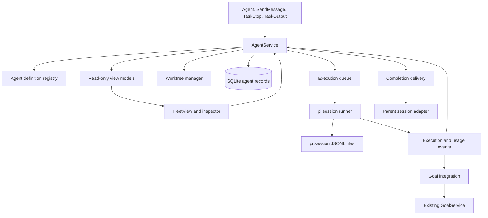
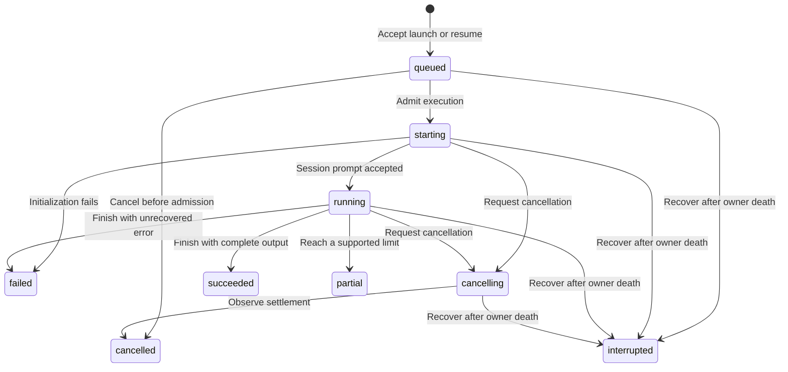
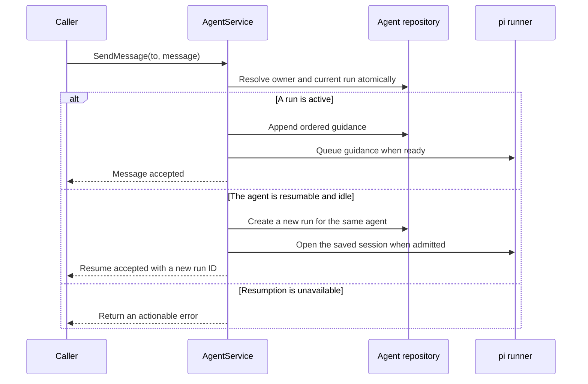
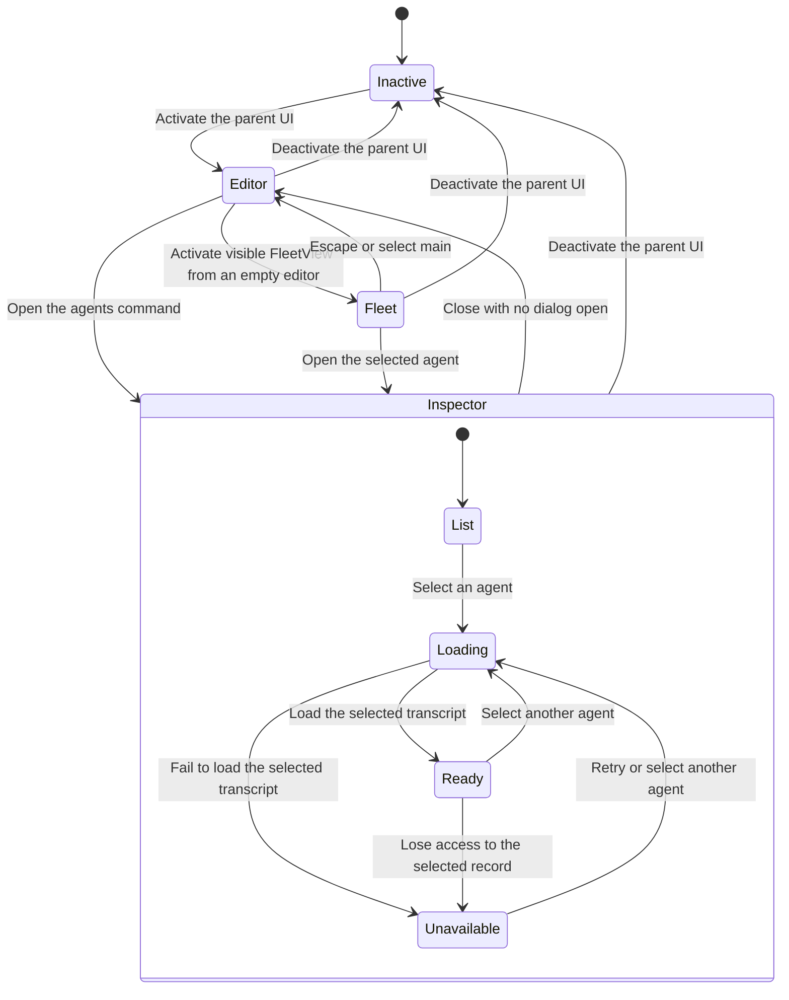
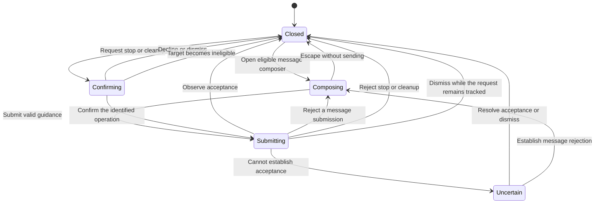
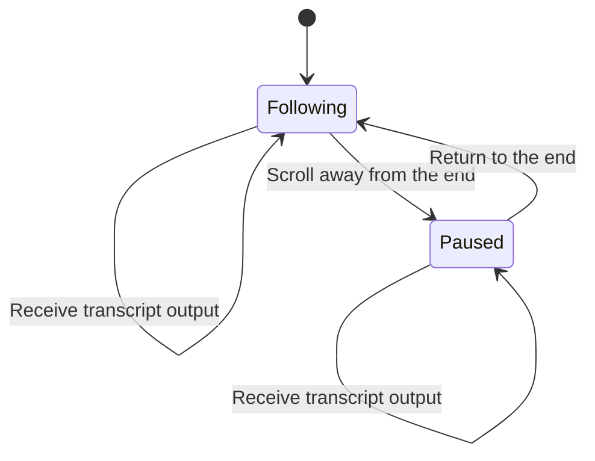

# Subagent Support: Software Design

**Document type:** Software design specification.

**Status:** Design specification. This document defines intended behavior; observed implementation and remaining verification gaps are recorded separately in the [implementation evidence](../research/subagent-implementation-evidence.md).

**Design baseline:** Claude Code 2.1.272 provides the input-schema reference. The research report pins both pi-subagents repositories. The Secretary checkout inspected for this design is `dfd4580`.

**Related documents:** [Requirements](../user-stories/subagents.md), [interaction design](../ux/subagents.md), [research](../research/subagent-system-comparison.md), [goal architecture](architecture.md), and [documentation responsibilities](../README.md).

## 1. Decisions and Scope

### 1.1 Confirmed decisions

- Claude Code defines the reference tool names and input schemas.
- Nicobailon's implementation defines the TUI reference.
- Tintinweb's implementation is a reference for pi SDK integration, not a dependency or API authority.
- Child execution stops when the parent pi process exits. Conversation persistence supports explicit resumption, not continued execution after exit.
- `Agent.model` retains the Claude alias enum. Model mappings belong in configuration outside the invocation schema.
- The initial scope includes delegation, foreground/background execution, messaging, cancellation, output retrieval, custom agent definitions, worktrees, and inspection.
- Conversation forks, nested delegation, agent teams, remote execution, scheduling, and workflow orchestration are excluded.

### 1.2 Proposed defaults requiring design review

- The compatibility baseline is Claude Code 2.1.272 with fork mode, agent teams, and cross-session messaging disabled.
- Four tools are registered: `Agent`, `SendMessage`, `TaskStop`, and `TaskOutput`.
- A background run is the default in TUI and persistent RPC sessions.
- Normal print and JSON invocations use foreground execution when neither the caller nor the definition requires background execution. An explicit background request or a definition that requires background execution is rejected in those modes. `SendMessage` resumption of an idle agent is also rejected there because that operation starts background work and has no foreground parameter. This avoids accepting work that the host will immediately terminate.
- Reload, new-session, resume-to-another-session, and parent-session fork stop the departing session's children rather than transferring live execution.
- The initial concurrency limit is four active child executions, and the pending queue limit is sixteen. These are configurable limits, not measured performance claims.
- A child conversation retains its resolved definition and model across resumption, subject to current permission and trust checks.
- Agent records and transcripts are retained until explicit removal outside this release. The host does not perform automatic transcript deletion or worktree commits.

### 1.3 Compatibility boundary

The implementation follows Claude's canonical names, core field shapes, and the selected feature profile. It does not emulate the entire Claude environment.

- `model` accepts only `sonnet`, `opus`, `haiku`, and `fable`. It does not accept arbitrary provider identifiers in tool input.
- `isolation: "remote"` remains in the source-compatible enum but returns an unsupported-feature error before creating resources.
- `subagent_type: "fork"` is rejected because conversation forks are out of scope.
- `team_name` and `mode` are accepted as deprecated, ignored fields, as in the inspected baseline. They never grant permissions or create a team.
- `SendMessage` exposes only the required-string-message variant. It does not expose team protocol objects or `notify_when_idle`.
- Existing pi tools are not renamed. Output files can be read with pi's `read` tool.
- `TaskStop` and `TaskOutput` resolve Secretary-owned child work only. They do not control unrelated shell tasks.
- The initial result and error structures are Secretary contracts described below. Exact Claude output-schema compatibility is not claimed.
- Unsupported and unknown parameters are rejected rather than silently ignored, except the two documented deprecated `Agent` fields. This stricter policy is an explicit deviation where the upstream schema permits or normalizes additional input.

## 2. Architecture



### 2.1 Responsibilities

| Component | Responsibility |
| --- | --- |
| `AgentService` | It validates operations, owns lifecycle transitions, and coordinates persistent changes. |
| The agent registry | It discovers definitions, resolves precedence, validates configuration, and records provenance. |
| The execution queue | It admits work under concurrency and shutdown constraints. |
| The pi session runner | It creates sessions, executes prompts, collects events, applies cancellation, and disposes resources. |
| The worktree manager | It creates and verifies owned worktrees and performs conservative cleanup. |
| The repository layer | It stores agent, run, message, usage, and delivery records with schema migrations. |
| The completion delivery component | It reconciles pending results with the correct parent session without treating uncertain delivery as success. |
| The goal integration component | It attributes usage and validates whether further goal-related work remains authorized. |
| The TUI components | They render snapshots and submit actions through `AgentService`. They do not mutate runtime state directly. |

### 2.2 Module organization

The following paths are proposed additions, not existing files:

```text
extensions/secretary/agents/
  service.ts
  records.ts
  registry.ts
  configuration.ts
  scheduler.ts
  runner.ts
  child-context.ts
  worktrees.ts
  delivery.ts
  goal-integration.ts
  storage/
    agent-repository.ts
    migrations.ts
  tools/
    schemas.ts
    handlers.ts
    rendering.ts
  ui/
    fleet-view.ts
    inspector.ts
    transcript.ts
    state.ts
    reducer.ts
    effects.ts
    commands.ts
```

The existing extension entry point composes these modules alongside goal management. Factories register tools and handlers but do not start timers, model calls, or child sessions. Session-scoped resources start during session activation or the operation that needs them.

## 3. Invariants

1. Each agent belongs to one parent session, and each run belongs to one agent.
2. At most one nonterminal run exists for an agent.
3. A tool invocation identifier identifies at most one accepted launch within its parent session.
4. A resumed agent preserves its agent identifier and receives a new run identifier.
5. Cancellation targets the run captured when the request was accepted, not an arbitrary later run.
6. A background launch is not successful completion.
7. No completion, usage, or messaging event changes ownership based on arrival time.
8. Child tool access cannot exceed the parent's allowed tool access and applicable permission policy.
9. Children cannot invoke delegation tools or goal-mutation tools in this release.
10. A worktree is not removed while its runner or tools may still be executing.
11. Usage is recorded once per source event and is never reassigned to a replacement goal.
12. Model notifications are untrusted result data, not authorization to resume a paused goal.
13. No agent starts automatically because a parent session was restored.

## 4. Model-Facing Tools

### 4.1 `Agent`

The schema preserves the selected baseline's field names and value domains:

```ts
interface AgentInput {
  description: string;
  prompt: string;
  subagent_type?: string;
  model?: "sonnet" | "opus" | "haiku" | "fable";
  run_in_background?: boolean;
  name?: string;
  isolation?: "worktree" | "remote";
  team_name?: string;
  mode?: "acceptEdits" | "auto" | "bypassPermissions"
    | "default" | "dontAsk" | "plan";
}
```

- The description and prompt are required strings. Empty or whitespace-only values fail runtime validation.
- Omitted `subagent_type` resolves to the enabled `general-purpose` definition. An explicit unknown type fails.
- Names follow the researched 64-character pattern and reserved-recipient restrictions. Names are unique within the parent session and remain reserved while their agent record exists.
- Type matching is exact. The implementation does not silently convert an unknown specialist into a general-purpose agent.
- An explicit isolation field takes precedence over the definition's isolation. If neither specifies isolation, execution uses the parent's working directory. Requested worktree isolation is never silently downgraded.
- The `manual` permission-mode compatibility spelling is normalized to `default` before validation, but the field remains ignored.
- The model enum does not have a schema default. Resolution is defined in Section 5.
- The boolean background field does not acquire a schema default. A definition with `background: true` requires background execution even if the caller supplies false, following the researched Claude behavior. Otherwise the explicit invocation value wins, followed by the host-mode default in Section 1.2. A definition with `background: false` does not force foreground execution. Host restrictions are checked after resolution and reject unsupported background execution.
- Launch validates configuration, ownership, capacity, trust, and model availability before allocating a worktree or contacting a provider.

An accepted background response contains the agent identifier, run identifier, status, resolved model, and output path in both model-visible text and structured details. A foreground response contains the same identity and the final outcome. A foreground error can include partial output but is not represented as a successful completed run.

### 4.2 `SendMessage`

```ts
interface SendMessageInput {
  to: string;
  message: string;
  summary?: string;
}
```

- `to` is a required single-line recipient string with the researched length bound. Only a current-parent agent ID or exact name is accepted.
- `message` is required and must contain non-whitespace guidance for this local-only profile.
- `summary` is optional with the researched maximum. It is a display label rather than a separate instruction.
- The handler resolves the recipient once and serializes the decision against launch, cancellation, and completion.
- Queued or starting runs retain guidance for delivery after initialization.
- Running sessions receive guidance through the SDK steering mechanism at a supported turn/tool boundary. Tool execution is not represented as instantly interrupted.
- A finished resumable agent starts a new background run with the message as its next user instruction in TUI or persistent RPC mode. Print and JSON mode reject this operation before creating a run, reserving capacity, or acknowledging acceptance.
- A stopping agent rejects resumption until termination is observed.
- Messages to one-shot agents, unknown recipients, unrelated sessions, or missing saved conversations fail without spawning replacements.
- An acknowledgment reports acceptance or queueing. It does not claim consumption or compliance when the SDK cannot prove those events.

Concurrent `SendMessage` calls to an idle agent are serialized. The first creates the new run; later calls join that run's guidance queue in acceptance order. They do not create concurrent sessions. A pending worktree cleanup reservation rejects resumption as described in Section 9.2.

### 4.3 `TaskStop`

```ts
interface TaskStopInput {
  task_id?: string;
  shell_id?: string;
}
```

- Runtime requires a truthy `task_id ?? shell_id`, matching the researched precedence.
- The target can be a run ID, an agent ID, or a name. An agent reference resolves to its current run at acceptance time.
- `shell_id` is accepted as the deprecated spelling, but it can still refer only to Secretary-owned work.
- Stopping an already terminal run is an idempotent no-op with its actual outcome.
- A queued run transitions directly to cancelled. A starting or running execution enters cancelling and stays there until settlement is observed.
- A successful stop request does not promise rollback of file changes or immediate termination of a noncooperative extension tool.
- An explicit later `SendMessage` can resume an eligible cancelled agent after it has settled. Cancellation never triggers automatic resumption.

### 4.4 `TaskOutput`

```ts
interface TaskOutputInput {
  task_id: string;
  block?: boolean;
  timeout?: number;
}
```

- `task_id` is required. It accepts a run ID or an agent ID; an agent ID selects the latest run at call acceptance.
- `block` defaults to true. `timeout` defaults to 30000 milliseconds and accepts numbers from zero through 600000 inclusive.
- A nonblocking call returns the current recorded outcome and bounded output immediately.
- A blocking call waits for that captured run to settle or for the wait timeout to expire.
- Timeout and cancellation of the wait do not cancel the agent.
- Reading output is not an acknowledgment that a completion notification was delivered. Deduplication belongs to the delivery component.
- All text outputs are bounded by pi's existing truncation utilities. A truncated response identifies the full output file.

### 4.5 Result and error handling

These are internal result fields, not a claim about Claude's exact output schema:

```ts
interface AgentOperationResult {
  agentId: string;
  runId: string;
  status: RunStatus;
  outputPath?: string;
  sessionPath?: string;
  resolvedModel?: string;
  partial: boolean;
  message: string;
}
```

- Input errors and rejected operations throw through pi's supported error path so `isError` is set correctly.
- Accepted asynchronous work can later fail. Its launch result remains an accepted launch; its final failure is persisted and delivered separately.
- User-visible text includes identity, status, failure reason, partial-output status, and relevant paths. These fields are not hidden solely in `details`.
- Child output is delimited as untrusted task data. It cannot manufacture a tool result or goal instruction.
- No compatibility claim is made about historical aliases or undocumented preprocessing beyond the explicitly listed cases.

## 5. Agent Definitions and Model Resolution

### 5.1 Discovery and trust

Definitions use Markdown with YAML frontmatter. The Markdown body is an optional custom role prompt; metadata-only definitions and whitespace-only bodies are valid. An empty body contributes no custom role prompt, while the normal pi instructions, applicable project instructions, and delegated task remain in effect. This does not make the `Agent.prompt` task argument optional.

Discovery order, from highest to lowest precedence, is:

1. Trusted project definitions are read from `<project>/<CONFIG_DIR_NAME>/agents/`.
2. User definitions are read from `<getAgentDir()>/agents/`.
3. Packaged definitions provide `general-purpose`, `Explore`, and `Plan`.

- The registry rejects duplicate names within one scope and invalid frontmatter.
- The initial frontmatter subset includes `name`, `description`, `tools`, `disallowedTools`, `model`, `maxTurns`, `background`, and `isolation`.
- Tool lists use actual pi tool names. This is an explicit agent-definition adaptation, not a tool-schema change.
- Unsupported behavioral fields such as permission overrides, hooks, nested delegation, or remote execution fail validation rather than being ignored.
- The definition's `background` field is a boolean with the resolution rules in Section 4.1. The definition's `isolation` field accepts `worktree` in this release; unsupported values fail registry validation. Explicit invocation isolation wins over the definition default, but an explicit unsupported value is rejected rather than replaced.
- Project trust is checked before project definitions, extensions, and configuration are honored.
- A user definition can override a packaged agent; the inspector records the selected source and content hash.
- Changes to definitions affect new agents. Resumption uses the stored definition snapshot, while current trust and permissions may narrow or refuse it.

### 5.2 Packaged definitions

- `general-purpose` receives the parent's authorized tool set after removing delegation, workflow, goal mutation, and interactive-only tools that cannot be safely routed.
- `Explore` and `Plan` initially use `read`, `grep`, `find`, and `ls`. They do not receive unrestricted shell access under a read-only label.
- Packaged `Explore` and `Plan` are one-shot and cannot be resumed, following the current documented Claude behavior. Their retained identifiers support inspection and output retrieval only.
- A project override is a custom definition with its own recorded capabilities; it is not silently treated as the packaged read-only implementation.
- System prompts retain applicable project instructions and child-specific role instructions. Conversation history is not copied.

### 5.3 Model aliases

Secretary configuration supplies an `agents.modelAliases` object whose keys are the four Claude aliases and whose values are exact pi `provider/modelId` identifiers.

- Global configuration is read from `<getAgentDir()>/secretary.json`.
- Trusted project configuration is read from `<cwd>/<CONFIG_DIR_NAME>/secretary.json` and overrides corresponding global agent settings.
- Both files contain an `agents` object. Unsupported agent configuration fields fail validation.

Resolution order is:

1. An explicit `Agent.model` alias resolves through the configured mapping.
2. Otherwise, a definition's model resolves as an alias, an exact pi identifier, or `inherit`.
3. Otherwise, the child inherits the parent's model captured at launch.

- Explicit aliases with no mapping produce an error naming the missing configuration.
- There is no fuzzy matching or silent provider fallback.
- Authentication and the parent's scoped-model restrictions are checked before execution.
- The child inherits the parent's thinking level unless a supported future definition field explicitly changes it. The initial public tool has no `thinking` parameter.
- Resumption retains the resolved model. A missing credential or unavailable model requires an explicit configuration correction, not a different model selected silently.
- Provider registrations and credentials must be obtained through supported pi facilities. Access to an undocumented model-registry backing field is not an accepted permanent integration strategy.

## 6. Data Model and Persistence

### 6.1 Entities

| Entity | Key fields and responsibility |
| --- | --- |
| `AgentRecord` | It stores `agentId`, parent session identity, optional name, definition snapshot, model, tool policy, session path, resumability, and optional worktree ID. |
| `AgentRun` | It stores `runId`, `agentId`, status, launch origin, timestamps, output paths, partial-result metadata, and error or cancellation reason. |
| `AgentMessage` | It stores an accepted guidance ID, target run, order, text, and delivery state. States distinguish pending, transport-accepted, consumed when provable, undelivered, and uncertain. |
| `AgentUsageEvent` | It stores a unique source event ID, run identity, normalized usage, and optional originating goal identity. |
| `CompletionDelivery` | It stores run identity, destination parent, delivery ID, and pending/submitted/observed/uncertain state. |
| `WorktreeRecord` | It stores repository identity, path, branch, base commit, owner, and cleanup state. |

An agent ID names a conversation. A run ID names one execution. A source tool-call ID deduplicates a launch; it is not reused as either identity.

### 6.2 Storage ownership

- SQLite agent tables are added through additive migrations in the existing Secretary database. The agent repository does not repurpose `thread_goals` for agent state.
- pi `SessionManager` remains responsible for session JSONL history. Secretary stores references and its own execution metadata, not a competing conversation format.
- Each run has a plain-text output artifact for model retrieval. The inspector reads the pi transcript and does not infer current status from output text.
- State directories use owner-only permissions where supported. Credentials are not copied into records, configuration snapshots, or notifications.
- Storage root configuration is shared with the existing Secretary data-directory setting. Artifact names use generated identifiers rather than prompts or agent names.
- Database schema versions and snapshot versions are explicit. Unknown future versions fail safely.

### 6.3 Transactions and recovery

- A short transaction creates the accepted agent/run record and reserves its name and launch key. No transaction remains open while awaiting a model, filesystem operation, Git command, or user input.
- A partial unique index or equivalent transaction check enforces one nonterminal run per agent.
- Worktree allocation is a recoverable step after acceptance. Allocation failure records a failed run and cleans up only resources proven to belong to that allocation.
- Session history and SQLite cannot be assumed to commit atomically. Startup reconciles their identifiers and recorded outcomes.
- A per-parent exclusive ownership lock prevents two Secretary controllers from resuming the same parent's child sessions simultaneously. A live conflict disables mutations for that parent's agents and reports the owner.
- The implementation must use an OS-supported lock or a tested lock implementation with process-liveness validation. A timestamp-only lease or PID file is insufficient to prove a previous owner has died.
- After a proven dead owner, nonterminal runs become interrupted. They are not replayed automatically.
- A missing output artifact may be rebuilt from a retained transcript. A missing conversation cannot be replaced silently when resuming.

### 6.4 Branch and session ownership

- Parent session identity, not the working directory, is the ownership boundary.
- A new or forked parent session does not inherit control of the source session's agent records.
- Navigation within one parent session tree does not rewind external agent execution. The inspector lists owned agents across that session, and current context identifies pending work without fabricating history on the selected branch.
- Historical tool calls are never executed merely because a transcript is replayed or a branch is selected.

## 7. Execution Lifecycle



The status vocabulary is internal. A new run is created for resumption; terminal runs never return to `running`.

### 7.1 Admission and event handling

- Queue admission checks ownership, shutdown state, capacity, current permissions, model availability, and applicable goal authorization.
- The queue is FIFO among eligible work. Foreground work consumes the same execution capacity as background work.
- A full queue rejects a launch before consuming provider resources.
- SDK initialization and resource loading are abort-aware. Cancelling during startup prevents later prompt submission.
- The runner subscribes before submitting the prompt and records terminal outcome only after retries and compaction recovery have settled.
- A low-level `agent_end` event alone does not prove the complete operation has settled.
- `prompt()` resolving is checked alongside message stop reasons, cancellation state, and pending accepted guidance. Empty output after an unrecovered error is not successful completion.
- Only supported provider retry behavior is automatic. The host does not replay an entire task after uncertain tool side effects.

### 7.2 Guidance settlement

- Each accepted message remains attributable to one run. A later resume does not silently retarget it to another run.
- Messages not submitted to the SDK when startup fails, cancellation settles, goal authority expires, or shutdown completes become undelivered with a reason.
- Messages accepted by the SDK are marked consumed only when a correlated event establishes consumption. Otherwise they become uncertain when the run settles.
- Both undelivered and uncertain messages remain inspectable. Neither is automatically resubmitted or used to create a new run.
- Resumption clears any residual SDK steering queue and submits only the new explicit message. Previously persisted conversation entries remain historical context, but unconsumed queue entries are not replayed as new instructions.
- The resumed prompt states that the new guidance controls the next execution and identifies unresolved old guidance as historical rather than newly authorized work.
- The UI reports unresolved delivery and allows the user to copy the text for an explicit resend. It does not label transport acceptance as model compliance.

### 7.3 Limits and partial output

- A definition's `maxTurns` is a positive integer configuration value; it is not added to the `Agent` schema.
- Reaching a turn limit stops further ordinary work and records available output as partial.
- The implementation may request a bounded final summary before a hard stop, but it must not represent a missing summary as complete output.
- Definition limits, queue bounds, and goal budgets have distinct purposes and are reported separately.

### 7.4 Shutdown and cancellation

- Cancelling a foreground `Agent` tool handler propagates cancellation to its captured child run. This applies while queued, starting, or running; it is not the wait-only cancellation behavior of `TaskOutput`.
- The service records the foreground waiter's cancellation independently of the child's outcome. If completion already committed, the final outcome remains completed rather than being overwritten by cancellation.
- If the foreground waiter disappears before receiving the outcome, the service retains a completion-delivery record. The result is shown in the UI and included in the next parent context without requesting an automatic turn after a user abort. It is not lost because the run originally used foreground execution.
- Session shutdown first refuses new launches and messages that would resume work.
- It cancels queued runs, requests cancellation of active runs, waits for observable settlement, flushes records, runs extension cleanup, and disposes sessions.
- SDK resources are constructed under an async-context-local child marker so Secretary does not initialize another root controller inside a child.
- Cleanup is idempotent and applies to partially initialized sessions as well as completed ones.
- A proposed five-second cleanup deadline prevents an extension cleanup handler from hanging shutdown indefinitely. This is a policy limit, not proof that every tool has stopped.
- If a tool remains active, the record remains cancelling or is reported as interrupted when the process exits. Its worktree is retained, and the agent cannot be resumed concurrently.
- Reload or session replacement must not abandon a live in-process runner and then create a second runner for the same agent. If safe teardown cannot be established, the adapter refuses the replacement when the host permits it and reports that restarting pi is required.
- Arbitrary extension tools can spawn detached external jobs. Stopping an SDK session cannot guarantee termination of every external side effect. Only child sessions and managed tool processes are within this cancellation guarantee.

### 7.5 Resumption



- Resumption verifies saved history, definition snapshot, current trust, model availability, tool restrictions, and worktree identity.
- Current policy may remove tools but must not widen a saved agent's privileges implicitly.
- A materially changed policy that prevents the task from continuing produces a diagnostic before a provider request.
- A cancelled agent is resumable only after its previous runner and managed tools have settled.

## 8. pi Host Integration

### 8.1 Resource and tool policy

- A child receives a fresh event bus unless an explicitly scoped bridge is required. Root extension events are not broadcast indiscriminately into children.
- The selected resource loader retains applicable project instructions and trusted resources while preventing Secretary's root initialization in a child.
- Delegation tools, workflow tools, and goal-mutation tools are removed from both discovery and execution paths.
- The effective tool set is the intersection of parent-authorized tools and the definition's allowlist, minus explicit denials and child-incompatible operations.
- Late-registered tools undergo the same checks. Descriptions or active-tool filtering alone are not sufficient enforcement.
- Safety and permission hooks must not be dropped merely to simplify child startup.
- Interactive prompts that cannot be routed safely to the parent fail explicitly. This release does not build a separate permission system or auto-approve child prompts.

### 8.2 Supported pi APIs and compatibility tests

- Session creation uses `createAgentSession`, resource loading uses `DefaultResourceLoader` or the supported resource-loader interface, and restoration uses `SessionManager`.
- Live guidance uses supported steering APIs. Cancellation uses the session's abort operation, followed by settlement and disposal.
- UI rendering uses `setWidget`, custom components, tool renderers, and configured keybindings.
- Extension shutdown must run exactly once for each initialized child. Prefer supported runtime disposal when it provides this guarantee; otherwise encapsulate the required lifecycle sequence in one adapter and verify it against the supported pi version.
- Model-runtime inheritance, permission propagation, lifecycle teardown, and editor composition are implementation prerequisites to test against the installed SDK. The design does not assume that a private getter or internal field is a stable API.
- The implementation must either pass the supported package-version matrix or narrow its peer dependency range. Passing only the installed version is not evidence for the full declared range.

### 8.3 Tool-name collisions

- Secretary does not silently override another extension's `Agent`, `SendMessage`, `TaskStop`, or `TaskOutput` tool.
- A collision disables Secretary's delegation execution for the session and reports which extension must be disabled or reconfigured.
- No child run starts while the public control tools are ambiguous.
- Existing goal tools remain available; the collision does not disable unrelated goal management.

## 9. Worktree Isolation

### 9.1 Allocation

- A worktree launch requires a Git repository and a resolvable `HEAD` commit.
- The base commit is captured at launch acceptance. Allocation uses that commit even if the parent moves to another branch while the run waits.
- The host creates a unique branch and worktree under its managed storage, with a persisted ownership record.
- Parent uncommitted and staged changes are excluded. The result and inspector state this explicitly.
- Worktree creation does not stash, commit, reset, or clean the parent checkout.
- Tool working directories are rooted in the child worktree. Configuration discovery retains the trusted source-project configuration rather than accidentally losing model and agent definitions.
- The host never falls back to the parent checkout if the recorded worktree disappears.

Using `HEAD` is a proposed Secretary policy and a deliberate difference from Claude versions that default worktrees to the repository's default branch.

### 9.2 Retention and cleanup

- Worktrees remain available after execution to support inspection and resumption.
- The host does not auto-commit agent edits. Existing commits created deliberately by the agent remain on its branch.
- Cleanup is permitted only for an idle agent whose owned worktree is unchanged, whose branch still points to its base commit, and whose Git metadata matches the ownership record.
- Confirmation captures the agent, worktree, and record revision without holding a database transaction open. After confirmation, a transaction rechecks those identities and the absence of an active run, then persists a cleanup reservation. A stale confirmation fails.
- The cleanup reservation excludes new runs and resumption. After reserving, the manager revalidates Git metadata and filesystem state before removal. It does not rely on the checks performed before the dialog opened.
- Successful removal and non-resumability are recorded before the reservation is released. Failure before removal releases the reservation only if the intact worktree is verified.
- Recovery of an interrupted cleanup checks the recorded reservation against Git and filesystem state. An absent worktree is recorded as removed and non-resumable. An intact, verified worktree can have its reservation released. Partial or uncertain removal retains the reservation and requires manual recovery; resumption remains blocked.
- Cleanup checks staged, unstaged, untracked, ignored files, and submodule state. Uncertain or nonempty states are refused rather than force-deleted.
- Successful cleanup marks the associated agent non-resumable and preserves its transcript and outcome.
- The command never removes a branch or directory merely because its name has a familiar prefix.
- No automatic merge, cherry-pick, force-delete, or dirty-worktree recovery is included.

Retaining even clean worktrees until explicit cleanup differs from upstream automatic cleanup policies. It is proposed to make resumption predictable and avoid accidental loss of an agent's working directory.

## 10. Completion Delivery and Model Context

### 10.1 Delivery protocol

- A run's terminal transition and pending completion record are committed together.
- Completion records are keyed by run ID so a resumed agent can produce another distinct completion.
- Foreground outcomes are returned by the waiting tool handler and do not also trigger an ordinary background completion turn. If the waiter is cancelled or delivery to it becomes uncertain, the service retains the outcome and uses the non-triggering recovery path in Section 7.4.
- Background outcomes are delivered as bounded extension-owned messages to the owning parent, using the host's follow-up mechanism rather than impersonating user input.
- Delivery records progress from pending to submitted and then observed when matching parent transcript evidence exists.
- Submission failure leaves the record pending. A crash or uncertain acknowledgment leaves it uncertain until reconciliation.
- Reconciliation searches by the stable delivery identifier, not by result prose or timestamps.
- If the host cannot establish whether a message was observed, the next parent model context includes the result once in a replaceable current-status projection. The implementation does not blindly trigger duplicate turns.
- Exactly-once provider execution is not promised. The design uses deduplicated state and conservative recovery to avoid repeated execution and misleading delivery claims.

### 10.2 Turn policy

- A normal background result can request one parent follow-up turn in a live owning session.
- A result associated with a paused, cleared, replaced, or otherwise non-active goal is retained and shown in the UI but does not automatically resume goal work.
- Restoring a parent session does not replay old automatic follow-up requests. Undelivered outcomes become available in its next context or explicit inspection.
- A parent request receives one bounded current-agent snapshot listing relevant active runs and undelivered outcomes. Historical snapshots are replaced in the outgoing copy, not appended indefinitely.
- Status refreshes do not start model turns, and rendered assistant claims do not change agent records.

## 11. Goal Integration

### 11.1 Origin and ordering

- An agent launch inherits goal attribution from its producing parent request, not from an unqualified read of the currently focused goal at completion time.
- Attribution stores the originating thread, goal ID, accepted intent sequence, control generation, and session epoch where available.
- A launch unrelated to goal work has no goal attribution. Ambiguous attribution is not guessed.
- The existing goal ordering and synchronization components remain authoritative for whether further goal-related actions are allowed.
- Newer user intent can invalidate subsequent child work without reclassifying already incurred usage.

### 11.2 Usage accounting

The existing **goal-budget token usage** formula remains:

```text
goal-budget token usage =
    max(inputTokens - cachedInputTokens, 0)
  + max(outputTokens, 0)
```

- Usage from completed assistant messages and reported compaction operations is normalized to the existing `TokenUsage` representation.
- Each source usage event is persisted with a unique identity. A transaction records its application to the originating goal or records why no live goal can receive it.
- The goal update and usage-application marker must commit atomically in the shared database, through a new idempotent `GoalService` accounting operation. An in-memory counter followed by an unrelated database write is insufficient for crash recovery.
- This new operation preserves existing budget precedence and publishes the normal goal change event after commit.
- An event for a cleared or replaced goal remains in the run's usage history but cannot recreate that goal or charge its replacement.
- Parent session usage reporting and goal-budget charging are separate consumers of the same usage event. A foreground tool's aggregated `usage` must not cause a second goal charge.
- The existing unattributed descendant accumulator is not used as the sole integration interface. It cannot by itself distinguish executions belonging to different goal identities after replacement.
- Execution duration, context-window usage, provider token totals, and goal-budget usage remain separate quantities with explicit labels.

### 11.3 Continuation and limits

- Completion messages cannot mark goals complete, blocked, or active. The parent must use the existing goal contract under current authorization.
- At an idle boundary, one current continuation can tell the parent about outstanding attributed work and permit independent work. If the parent yields without new work while the same child set is outstanding, automatic goal continuation waits for a material child event or new user input instead of repeating the same wake-up.
- A wait timeout alone is not a material child event and does not cause repeated delegation.
- Parent work that is explicitly requested by the user is not blocked merely because a child exists.
- Goal pause, clear, replacement, or budget exhaustion prevents new child actions authorized solely by the obsolete goal at the next supported model/tool boundary. Already-started tool side effects are not rolled back.
- An attributed child that cannot continue under current goal authority ends with available partial output. A reporting-only budget summary may be requested under the existing goal policy, but ordinary tools remain unavailable for that summary.
- A later explicit resume captures new authorization for the new run. Its prior conversation is context, not continuing permission to pursue an old goal.

## 12. TUI Implementation Boundary

The [interaction design](../ux/subagents.md) owns visible behavior. The following are technical mechanisms:

- FleetView is a session-owned widget under a distinct Secretary key and does not replace the goal widget or the global footer.
- The inspector is an in-process custom TUI component. It does not depend on Herdr, Ghostty automation, or opening another terminal.
- View models are immutable snapshots obtained from `AgentService`; progress events invalidate affected components.
- The editor integration composes with an existing editor factory. It captures navigation only when the editor is empty and the agent component can receive focus.
- If editor composition is unavailable, the `/agents` command remains functional and the adapter reports the missing shortcut integration rather than replacing another editor silently.
- Transcript rendering uses bounded windows and strips untrusted terminal control sequences. Raw artifacts are not interpreted as UI commands.
- Scrolling, selection, and draft guidance remain stable across progress updates and terminal resize.
- Stop confirmation retains the selected run ID and observed revision; it does not re-resolve a name to a new run after confirmation. Revalidation checks target identity and current eligibility. A revision change caused only by transcript progress is not a reason to reject the same eligible target.
- State changes are delivered to the TUI only after service commit. Rendering failures do not roll back accepted work.

### 12.1 UI state model

- This section is the authoritative definition of the UI state machines. The [UX interaction flow](../ux/subagents.md#5-visible-interaction-flow) describes the corresponding user experience.
- Navigation, dialog interaction, and transcript following have separate state machines. Agent execution remains independent and follows Section 7.
- Sections 12.1.1 through 12.1.5 define diagrams, transitions, and invariants. Section 12.1.6 defines their internal representation.

#### 12.1.1 Navigation state machine



- `Inactive` means no current parent TUI is bound. It does not mean that a particular agent is stopped.
- `Editor` means the main editor owns keyboard focus. FleetView may still be visible as a collapsed summary.
- `Fleet` means the expanded agent list owns keyboard focus.
- `Inspector.List` presents the list without an agent selected. A direct agent command proceeds from this state to `Loading` with the requested selection.
- `Inspector.Loading` shows which transcript is loading and allows the user to close the view or select another agent.
- `Inspector.Ready` displays the selected agent's available transcript and actions.
- `Inspector.Unavailable` displays a missing-record or load-failure diagnostic. It does not silently select a different agent.
- A terminal agent outcome updates the visible status without leaving `Inspector.Ready`. Transcript loading does not infer that an agent is running.
- Closing the inspector returns to the editor, including when it was opened through FleetView. The main editor draft is preserved.

#### 12.1.2 Dialog state machine



- This machine describes messaging, stop confirmation, and cleanup confirmation. The action and target are shown explicitly; the diagram does not make the operations interchangeable.
- The dialog remembers whether it was opened from the editor or inspector and returns focus there when dismissed. A direct stop or cleanup command does not need to open the inspector first.
- `Composing` retains the selected recipient and draft. Empty submissions stay in this state with a validation message.
- `Confirming` retains the exact run or worktree selected before the dialog opened. A newer run is not substituted automatically.
- `Submitting` disables duplicate submission. It remains distinct from the agent's running or stopping state.
- Dismissing a submitted request does not retract it, cancel the child, or authorize a retry. Its outcome remains available in the owning session.
- `Uncertain` means the interface cannot yet establish whether the request was accepted. The text and target remain inspectable, and a new submission is disabled until the original request is resolved.
- A message rejected definitively returns to `Composing` with its draft intact. A rejected stop or cleanup closes confirmation and displays the reason at the originating view.
- Agent completion while a composer is open does not close it or discard text. Its action label changes to indicate resumption when that is available; otherwise submission is disabled with a reason.
- Escape closes only the currently focused dialog. A subsequent Escape can close the inspector. Escape in the main editor keeps its normal host behavior, including foreground interruption where applicable.

#### 12.1.3 Transcript-following state machine



- `Following` keeps the end of the selected transcript visible as output arrives.
- `Paused` preserves the user's reading position while output continues.
- These states apply while a selected transcript is ready. Selecting a different transcript initially follows its end; retrying the same transcript preserves the prior reading anchor when it can be recovered.
- Resize and theme changes do not switch the following state. Agent completion does not reset it.

#### 12.1.4 Transition rules and feedback

| ID | Current state and event | Guard | Next state and observable effect |
| --- | --- | --- | --- |
| UI-01 | The editor receives FleetView activation. | The editor is empty, FleetView is visible, and no dialog is open. | FleetView receives focus without starting a model turn. |
| UI-02 | The user opens an agent. | The agent belongs to the current parent session. | The inspector loads that agent and shows its identity during loading. |
| UI-03 | Transcript loading succeeds or fails. | The response still belongs to the visible selection. | The inspector shows the selected transcript or its diagnostic without changing selection. |
| UI-04 | The user opens the composer. | The selected agent can receive guidance or resume. | The composer receives focus with a stable recipient and draft. |
| UI-05 | The user submits guidance. | The draft is nonempty and no submission for that composer is pending. | The dialog enters `Submitting` and sends one request. |
| UI-06 | Guidance is definitively rejected. | The response belongs to the open submission. | The composer reopens with the same draft and an actionable error. |
| UI-07 | The user confirms stop or cleanup. | The originally selected target remains eligible. | The dialog enters `Submitting`; the resulting status is reported without assuming the operation has finished. |
| UI-08 | A confirmation target becomes ineligible. | The selected run finished, another run started, or worktree eligibility changed. | Confirmation closes with an explanation and no replacement operation is submitted. |
| UI-09 | The user dismisses a pending or uncertain submission. | The dialog has focus. | The originating view regains focus while the request remains tracked. No retry or cancellation is inferred. |
| UI-10 | Progress, resize, or theme updates arrive. | The update belongs to the current session and selected record where applicable. | The view refreshes without discarding the draft, changing focus, or leaving paused transcript following. |
| UI-11 | The user closes the inspector. | No dialog is open. | The editor and its draft are restored without cancelling work. |
| UI-12 | The parent UI is deactivated. | The host is leaving or replacing the session. | Views and drafts are cleared, and late responses cannot reopen them. Child shutdown follows the separate execution contract. |

#### 12.1.5 Focus and race-condition invariants

- Exactly one editor, list, inspector, or dialog receives keyboard input at a time.
- Selection follows stable agent identity rather than list position. Reordering rows does not redirect a message or confirmation.
- Agent progress does not invalidate a confirmation by itself. A change to the selected execution or action eligibility does.
- A service rejection takes precedence over an earlier enabled button. The interface does not retry against a different target automatically.
- Delayed transcript results cannot overwrite a more recently selected transcript.
- Delayed operation acknowledgments may update the owning agent's status but cannot close a different dialog or move focus from a newer view.
- Main-editor text and rejected message drafts are retained while the current UI session remains active. Message drafts are not persisted across session deactivation in this release.
- Non-TUI clients use the same operation semantics without constructing a UI state machine.

#### 12.1.6 Internal state representation

```ts
type NavigationState =
  | { kind: "inactive" }
  | { kind: "editor" }
  | { kind: "fleet"; selectedAgentId: string | null }
  | { kind: "inspector"; detail: InspectorState };

type InspectorState =
  | { kind: "list" }
  | { kind: "loading"; agentId: string; requestId: string }
  | { kind: "ready"; agentId: string; transcript: TranscriptView }
  | { kind: "unavailable"; agentId: string; reason: string };

type DialogState =
  | { kind: "closed" }
  | { kind: "composing"; agentId: string; draft: string; error?: string }
  | { kind: "confirming"; action: ControlAction; target: ActionTarget }
  | { kind: "submitting"; operation: PendingOperation }
  | { kind: "uncertain"; operation: PendingOperation; reason: string };

type ControlAction = "stop" | "cleanup";
type TranscriptFollowMode = "following" | "paused";
```

- The types are discriminated unions. `TranscriptView`, `ActionTarget`, and `PendingOperation` are internal records described below, not additional public tool parameters.
- A transcript view retains its follow mode, stable message anchor, relative display offset, tool-expansion setting, and bounded rendered window.
- An action target retains the parent session, agent ID, and the relevant run ID or worktree ID. It records the revision observed when confirmation opened, but the service evaluates actual identity and eligibility at execution.
- A pending operation retains an operation ID, action, target, submitted text where applicable, and the view instance that originated it.
- The enclosing UI state retains the parent session ID, activation epoch, view instance ID, originating focus, and a monotonically increasing state revision.
- An inspector supports a dialog, but FleetView does not. Opening a direct command's dialog from the editor retains the editor as its return location.
- `inactive` requires a closed dialog and no bound terminal references. `composing` requires an inspector with a selected record. `confirming` supports either editor-originated commands or the inspector.
- These constraints are checked by the reducer. The Cartesian product of the unions is not a declaration that every combination is legal.
- Renderer state never writes an `AgentRun` status. A submitted stop request and a cancelling agent remain different records with different state machines.

### 12.2 Events, guards, and effects

The controller uses a pure transition function:

```ts
transition(state, event, serviceSnapshot): {
  state: UiState;
  effects: UiEffect[];
}
```

- Input events include activation, navigation, selection, composer editing, submission, confirmation, dismissal, transcript scrolling, and deactivation.
- External events include transcript load completion, operation acknowledgment, operation rejection, uncertain operation outcome, service snapshot changes, resize, and theme changes.
- Guards implement the transition table in Section 12.1.4, including empty-editor activation, ownership, message eligibility, nonempty drafts, and stable confirmation targets.
- Effects include loading a transcript, submitting guidance, requesting cancellation or cleanup, restoring focus, publishing feedback, and requesting a render.
- The reducer performs no filesystem access, service mutation, asynchronous work, clock reads, or identifier generation. The adapter supplies identifiers and event metadata explicitly.
- The controller records the returned state before dispatching effects. Repeated Enter events therefore encounter `submitting` and cannot emit a second submission.
- Effects return outcome events instead of mutating components directly. Exceptions become explicit rejection or uncertainty events, not unhandled callbacks.
- Invalid events leave protected state unchanged and emit actionable feedback when appropriate. Normal editor input that is not handled by the agent UI is delegated to the existing editor.
- Service-side validation remains authoritative. An enabled UI action is not a reservation or a permission grant.

### 12.3 Correlation and operation recovery

- Every transcript request carries the parent activation epoch, view instance, agent ID, and request ID. A response is applied only if all four still match the loading state.
- A service snapshot update can refresh status independently of a transcript response. It does not change the currently selected recipient or modal target.
- Every UI-originated mutation has a stable operation ID. The internal service accepts that ID as an idempotency key within the parent session; this does not extend the Claude-facing input schemas.
- Guidance acceptance records its message ID or resumed run ID together with the operation receipt. Stop acceptance records the captured run, and cleanup acceptance records its reservation. Repeated dispatch of the same internal operation returns its recorded receipt rather than performing it twice.
- Work continuing after an accepted receipt is tracked by the existing run, message, or cleanup state. Acceptance is not completion.
- If an acknowledgment cannot be classified, the controller enters `uncertain` and reconciles the receipt by operation ID. It does not send a new mutation to discover whether the first succeeded.
- A definitively rejected guidance operation can return to the composer. A subsequent user submission uses a new operation ID.
- Dismissing `submitting` or `uncertain` closes the dialog but does not discard its service receipt or pending-operation tracking. A late result updates current service views without reopening a dismissed dialog.
- Only a matching open operation may restore its draft, close its dialog, or produce dialog-local feedback. Results for an earlier view cannot affect a newer modal interaction.
- On deactivation, the UI increments or replaces its activation identity, disposes terminal subscriptions, clears drafts, and ignores old view events. The service independently completes cancellation and persistent outcome handling under Section 7.4.
- This design requires internal operation receipts for reliable uncertain-outcome recovery. It does not promise exactly-once external tool side effects or provider execution.

### 12.4 State persistence and focus

- Navigation, dialog drafts, scroll anchors, and focus are session-local presentation state. They are not stored as execution authority in SQLite.
- Operation receipts and execution outcomes remain durable service state where required by the delivery and recovery contracts.
- A background snapshot refresh does not acquire focus. Focus changes occur only through the reducer's explicit effects after user navigation or a matching dialog transition.
- While a dialog is open, Escape is handled by that dialog. It must not fall through to the inspector or the host's foreground-abort key handler in the same input event.
- The controller preserves the host editor instance and its draft; it does not reconstruct the editor from transcript text.
- Transcript following uses a stable message anchor rather than an absolute rendered line number. Width changes may alter wrapping without forcing the user to the end.
- Missing anchors fall back to the nearest retained content with an explicit indication that older content is unavailable, not a fabricated scroll position.
- Direct stop and cleanup commands use the same confirmation states and operation tracking as inspector actions. They preserve their editor-origin focus without requiring an inspector to be open.

### 12.5 State-machine verification

- Table-driven reducer tests exercise every transition in Section 12.1.4 and each guard's rejection path. They also verify that unrelated state remains unchanged.
- Tests assert both the resulting state and emitted effects. A correct rendered label does not compensate for an unintended service request.
- Model-based tests traverse legal event sequences and assert focus uniqueness, target stability, one submission per operation, draft preservation, and absence of service effects after UI deactivation.
- Adversarial event sequences include selecting B before A finishes loading, repeated Enter during submission, cancelling a modal during a pending response, a target finishing during confirmation, and session replacement before an acknowledgment arrives.
- Runner settlement and UI navigation are tested independently. Closing the inspector must emit no cancellation effect; stopping a run must not close the inspector automatically.
- Adapter integration tests verify that key events are consumed once and that effect outcomes carry correlation metadata. Pure reducer tests alone do not establish correct pi keyboard behavior.
- The [UI state-machine feature](../../doc/acceptance/ui-state-machine.feature) provides user-visible acceptance coverage. It complements, rather than replaces, transition and effect tests.

## 13. Failure Handling and Security

| Failure | Required behavior |
| --- | --- |
| Model or authentication setup fails. | The run fails with a diagnostic before any fallback model is selected. |
| Session initialization is cancelled. | No later asynchronous callback may submit its prompt. |
| Output persistence fails. | The run reports degraded evidence storage; it does not claim a durable output path that was not written. |
| The database write fails before acceptance. | No run is launched. |
| The database fails during execution. | Further launches stop, current evidence is retained where possible, and the UI reports the failure. |
| The provider recovers through an SDK retry. | The final outcome reflects settlement rather than the intermediate error. |
| A tool ignores cancellation. | The execution remains stopping or interrupted, and its worktree and ownership are retained. |
| A message races with completion or cancellation. | The service records its target and delivery disposition. It either queues guidance, creates an eligible run, or reports undelivered/uncertain guidance without automatically replaying it. |
| A worktree is missing or foreign. | Execution and cleanup fail without falling back to the parent checkout. |
| A second process opens the same parent. | Only one process can mutate or run its agents; the other receives a conflict diagnostic. |
| A stale callback arrives after session replacement. | Ownership checks prevent delivery or control through the new session context. |

- Agent prompts, names, transcripts, and result text are untrusted data.
- User text is never interpolated into shell commands for worktree allocation or cleanup. Git commands use argument arrays and validated references.
- Generated artifact paths cannot escape the storage root through traversal or symlinks.
- Tool restrictions are enforced at execution time and are not described as host isolation.
- Child sessions do not receive broader credentials or tools merely because a definition requests them.
- The host cannot undo commands already executed by an agent. Cancellation and goal invalidation do not promise rollback.

## 14. Verification and Traceability

| Requirement | Main verification |
| --- | --- |
| SA-01 | Schema fixtures, launch validation, foreground/background execution, model resolution, and launch deduplication tests cover delegation. |
| SA-02 | Snapshot and interaction tests cover live status, historical results, errors, and inspector retention. |
| SA-03 | Race tests cover ordered messaging, completion during send, concurrent resumption, and policy revalidation. |
| SA-04 | Startup cancellation, queue cancellation, foreground handler abort, abort-versus-settlement races, repeated stop, stale confirmation, and noncooperative tool tests cover stopping. |
| SA-05 | Crash recovery, ownership locking, reload, session replacement, missing files, and no-auto-resume tests cover persistence. |
| SA-06 | Real temporary Git repositories cover base capture, dirty parent exclusion, changed-worktree retention, cleanup-versus-resume races, interrupted cleanup, and conservative removal. |
| SA-07 | Registry precedence, project trust, alias mapping, missing mappings, and late tool registration tests cover configuration. |
| SA-08 | Atomic usage application, event replay, goal replacement, stopped goals, and continuation waiting tests cover goal integration. |
| SA-09 | Real pi SDK tests with a deterministic provider cover print, JSON, RPC, rejected headless resumption, background definitions in headless mode, and no-UI error paths. |

Additional release conditions are:

- Tool fixtures compare the advertised schema to the researched baseline plus the documented deviations.
- Tests use isolated temporary state and never open the user's persistent Secretary database.
- Real SDK integration tests verify model/runtime inheritance and extension cleanup; adapter mocks alone are insufficient.
- The implementation does not add duplicate completion turns or double-charge foreground nested usage.
- Markdown links, Mermaid diagrams, type checking, unit tests, host integration tests, and TUI interaction tests pass.
- A recorded UI walkthrough verifies the required interactions. Recording completeness, observed execution, and human review are reported separately.

## 15. Review Items and Implementation Prerequisites

The following details are proposed rather than confirmed by the user:

- The first release keeps `TaskOutput` despite upstream deprecation.
- Claude Code 2.1.272 is selected as the compatibility baseline.
- Packaged `Explore` and `Plan` remain one-shot, while custom agents and `general-purpose` can resume.
- Worktrees use captured `HEAD`, remain until explicit cleanup, and are not auto-committed.
- Print and JSON mode reject explicit background execution instead of silently accepting work that will stop at exit.
- Concurrency, queue, and cleanup timeout values are initial policy defaults.
- Transcript retention is explicit and indefinite until a future retention feature is designed.

Before implementation, a focused SDK feasibility check must verify public model-runtime inheritance, permission preservation, child teardown, delivery observation, and editor composition on supported pi versions. If the existing SDK cannot provide a required guarantee, the implementation plan must identify the limitation and revise the design instead of introducing an undocumented internal dependency.

This design does not require a workflow engine, a detached supervisor, a new permission system, or changes to the three public goal tools. It does require changes to internal goal accounting and continuation integration, with the existing goal-state ordering rules preserved.
