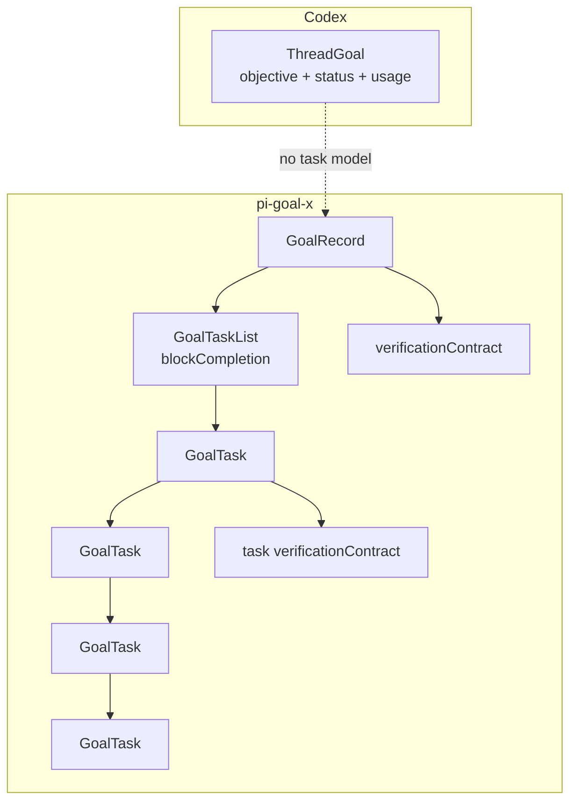
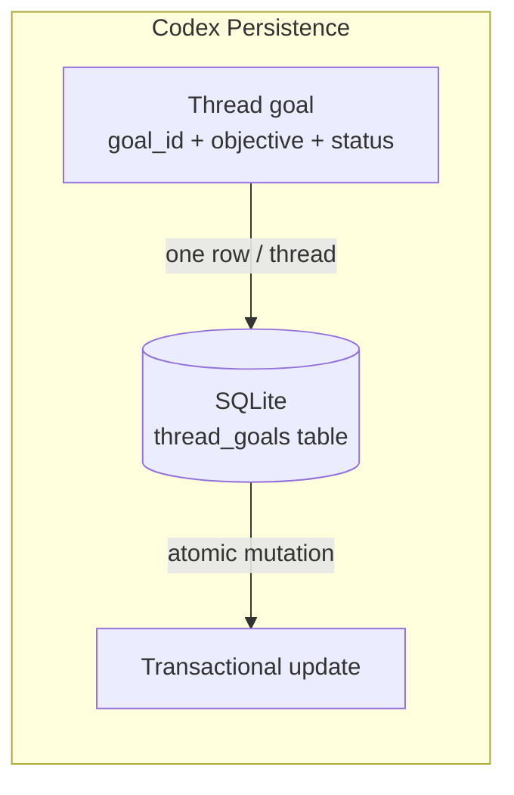
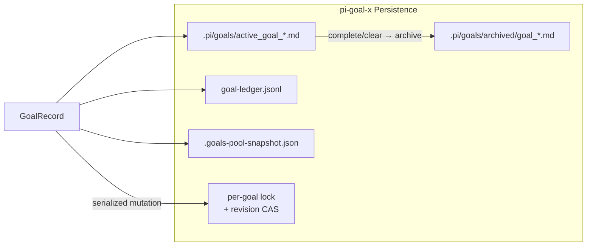
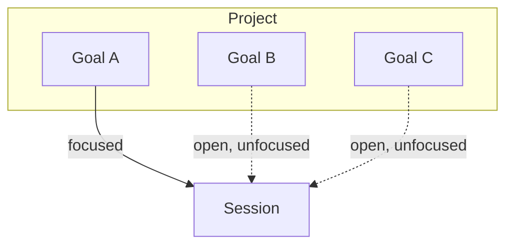
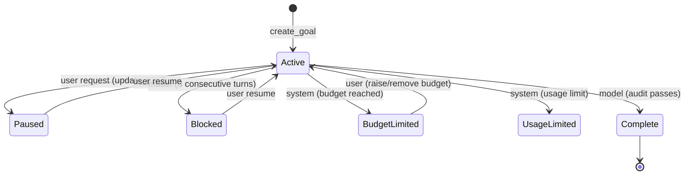
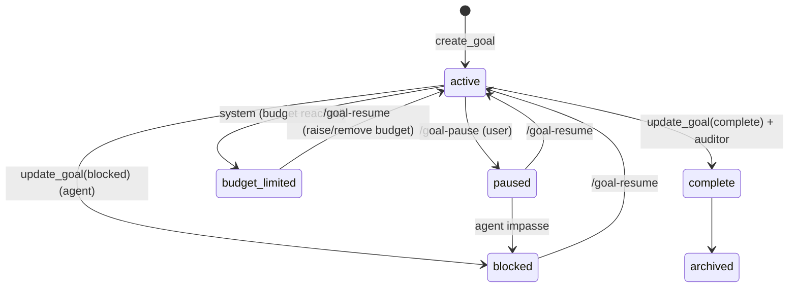
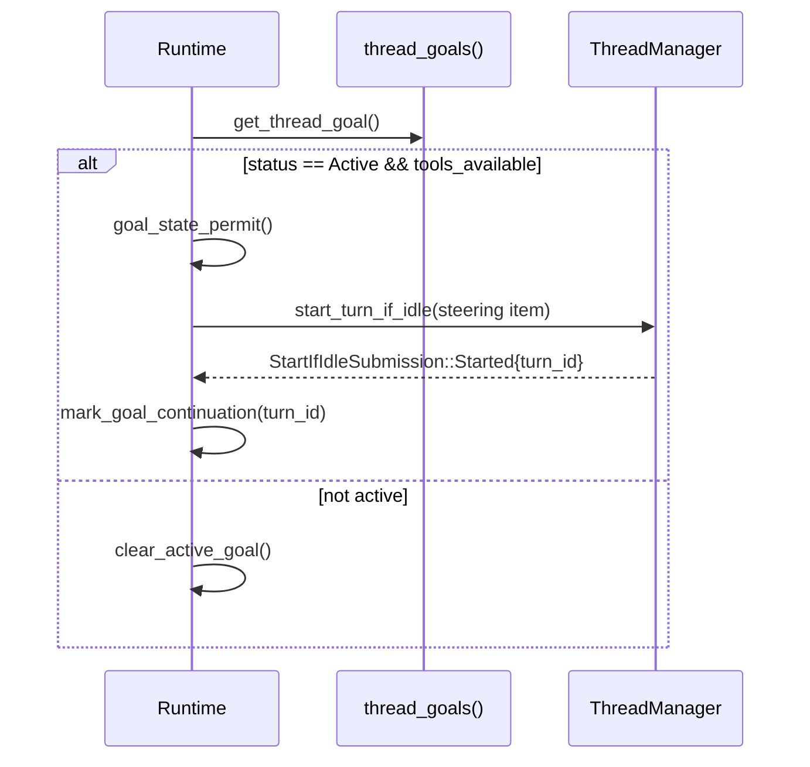
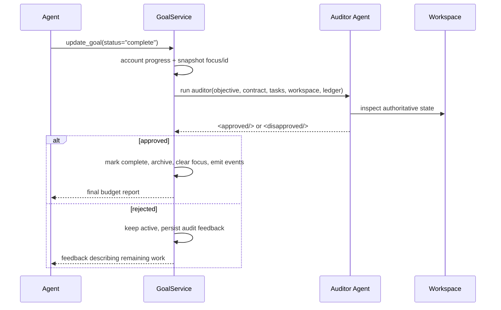
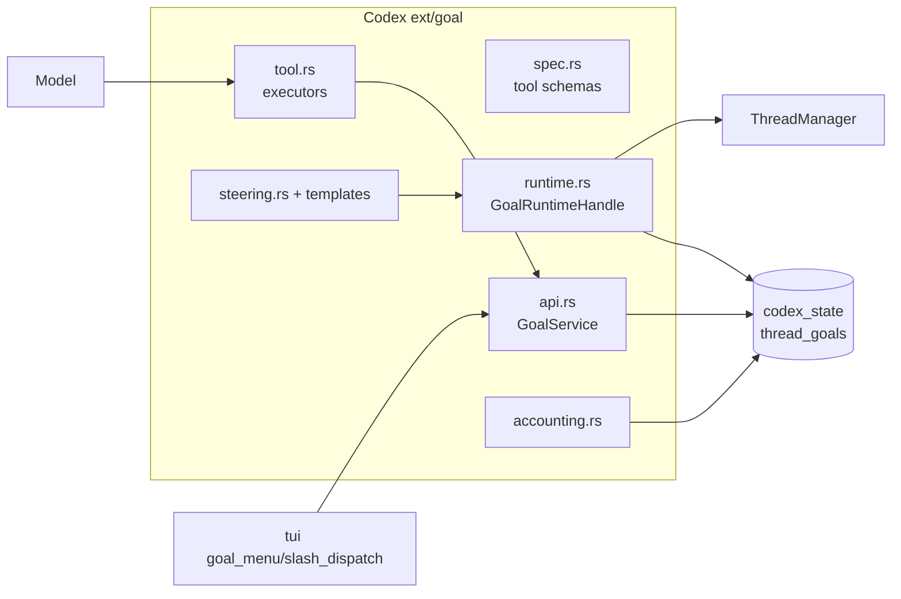
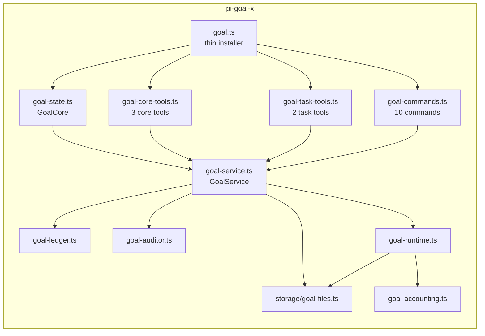

# Goal System Design Comparison: `openai/codex` vs `pi-goal-x`

**Document type:** Technical Research / Architecture Comparison
**Status:** Draft
**Date:** 2026-09-15
**Primary audience:** Engineers maintaining or extending `pi-goal-x` / `pi-secretary`
**Scope:** Compare the goal-management design of OpenAI Codex with the pi-goal-x extension for the pi coding agent.

---

## Executive Summary

`pi-goal-x` is a goal-management extension for the [pi](https://github.com/earendil-works/pi-coding-agent) coding agent. It is **not** a reimplementation of OpenAI Codex's goal system from scratch; its own design record
(`specs/2026-08-03-codex-inspired-goal-interface/{PRODUCT,TECH}.md`) explicitly names Codex's goal module as the **reference implementation**, then documents a curated set of **deliberate deviations**.

The central design rule that `pi-goal-x` borrows from Codex is:

> **Tools express durable model intents; a service owns validated state mutation; runtime hooks own accounting and continuation; steering prompts own behavioral policy; UI and external commands mutate through the same service.**

The two systems share a common philosophy — a tiny, stable, model-facing surface rich with internal behavior — but diverge sharply on scope. Codex ships a **minimal, database-backed, single-goal** system whose sophistication lives almost entirely in prompt steering. `pi-goal-x` keeps that prompt discipline **and** layers on durable task trees, verification contracts, an independent completion auditor, multi-goal focus, Sisyphus ordering, explicit continuation/allowance control, and inspectable filesystem persistence.

---

## Table of Contents

1. [Sources and Scope](#1-sources-and-scope)
2. [Background and Purpose](#2-background-and-purpose)
3. [Model-Facing Surface](#3-model-facing-surface)
4. [Data Model](#4-data-model)
5. [Persistence](#5-persistence)
6. [Lifecycle and Continuation](#6-lifecycle-and-continuation)
7. [Completion Verification and Audit](#7-completion-verification-and-audit)
8. [Architecture](#8-architecture)
9. [Comparison Matrix](#9-comparison-matrix)
10. [Trade-offs and Design Rationale](#10-trade-offs-and-design-rationale)
11. [Conclusions and Recommendations](#11-conclusions-and-recommendations)
12. [References](#12-references)

---

## 1. Sources and Scope

### Codex (reference)

All Codex goal code lives in the `codex-rs/ext/goal/` crate:

| File | Responsibility |
| --- | --- |
| `src/spec.rs` | Tool schemas for `get_goal`, `create_goal`, `update_goal` |
| `src/tool.rs` | Tool executors; validation, usage accounting, terminal updates |
| `src/api.rs` | `GoalService` — persisted mutations, serialized against idle continuation |
| `src/runtime.rs` | `GoalRuntimeHandle` — restore, continuation, external-mutation effects |
| `src/accounting.rs` | Per-turn token/time baselines, budget transition |
| `src/steering.rs` + `templates/goals/*.md` | Bounded internal-context templates |
| `state/src/model/thread_goal.rs` | `ThreadGoal` data model + `ThreadGoalStatus` |
| `protocol/src/protocol.rs` | Protocol-level goal types and events |
| `tui/src/chatwidget/{slash_dispatch,goal_menu}.rs` | User-facing `/goal` namespace and goal menu UI |

The `codex-rs/ext/goal/src/*.rs` files total **~3,320 lines across 11 files** (as of 2026-09-15).

### pi-goal-x (comparison target)

Source mirror: `~/Artifacts/Repositories/com.github/WeZZard/pi-goal-x`. Key modules:

| Module | Responsibility |
| --- | --- |
| `extensions/goal.ts` (thin installer) | Registers commands/tools/events, wires UI |
| `extensions/goal-service.ts` | `GoalService` — sole mutation boundary |
| `extensions/goal-state.ts` | `GoalCore` — in-memory pool/focus state |
| `extensions/goal-record.ts` | `GoalRecord`, `GoalTask`, `GoalTaskList` data model |
| `extensions/goal-runtime.ts` | Per-session focus, continuation scheduling |
| `extensions/goal-accounting.ts` | Token/time baselines, budget transition |
| `extensions/goal-auditor.ts` | Independent completion auditor |
| `extensions/goal-drafting.ts`, `goal-questionnaire.ts` | Guided goal creation |
| `extensions/goal-ledger.ts` | Append-only JSONL event ledger |
| `specs/2026-08-03-codex-inspired-goal-interface/{PRODUCT,TECH}.md` | The design record that prescribes the Codex-inspired interface |

> **Note on completeness:** The original monolithic `extensions/goal.ts` orchestrator was ~3,755 lines. After the Codex-inspired refactor it was split into bounded modules, and `goal.ts` shrank to a thin installer (<500 lines) whose only job is wiring.

---

## 2. Background and Purpose

Both systems answer the same question: **how does a coding agent maintain and pursue a durable, long-running objective across turns and sessions?**

### Why this matters

Non-goal coding agents are stateless with respect to the user's *intent*. Each turn is an isolated request. Long-running work (migrations, refactors, multi-day features) needs:

1. A durable objective that survives context compaction and session restart.
2. A way to continue autonomously when idle.
3. A definition of "done" that is stronger than "the agent stopped talking."
4. Visibility into progress, usage, and blockers.

### Codex's design posture

Codex is a **single-thread, single-goal** system. A goal is a first-class persisted record in a SQLite database, keyed to a thread. Its model-facing surface is deliberately small (3 tools), and its behavior is governed almost entirely by **prompt steering** rather than runtime state machines.

### pi-goal-x's design posture

`pi-goal-x` adopts Codex's *interface principles* but expands the *feature surface*. It is multi-goal per project (one focused per session), adds structured task trees and verification contracts, and adds an independent completion auditor. The design record (PRODUCT.md) states the intent plainly:

> "The redesign is an interface simplification, not a reduction to a trivial single-goal implementation."

---

## 3. Model-Facing Surface

### 3.1 Tool surface

Both systems keep the model-facing schema tiny and push policy into descriptions/steering.

| | Codex | pi-goal-x |
| --- | --- | --- |
| **Tools** | 3 | 5 |
| **Core tools** | `get_goal`, `create_goal`, `update_goal` | `get_goal`, `create_goal`, `update_goal` |
| **Task tools** | — | `set_goal_tasks`, `update_goal_task` |

**Codex** installs the three tools **statically** when goals are enabled for a persisted thread — it does not vary the tool set by goal phase. This is the property `pi-goal-x` deliberately copied, replacing its earlier dynamic `syncGoalTools()` that reconstructed the active tool set from confirmation/tweak/focus/settings state (a source of tool-selection errors and correctness risk).

**pi-goal-x** installs five tools statically when tasks are enabled, or three when tasks are disabled at session start. Tool executors validate current state and return an actionable error on an invalid transition, rather than relying on prior tool hiding.

### 3.2 `update_goal` status schema

Both use a **single-field** status schema and push the real policy into the tool description.

**Codex** (`src/spec.rs`) — `update_goal` accepts status `complete | blocked | paused`:

```json
{ "status": "complete" | "blocked" | "paused" }
```

`paused` is gated to *explicit user request only* — the model may never pause on its own initiative. Budget/usage limits are system-controlled.

**pi-goal-x** — `update_goal` accepts `complete | blocked`. User pause is a separate `/goal-pause` command; the model reports only terminal outcomes.

```json
{ "status": "complete" | "blocked" }
```

### 3.3 Command surface

| | Codex | pi-goal-x |
| --- | --- | --- |
| **Commands** | Single `/goal` namespace with subcommands | 10 discrete tab-completable commands |
| **Subcommands** | bare summary, goal set, `edit`, `pause`, `resume`, `clear` | — |
| **Commands** | — | `/goal`, `/sisyphus`, `/goal-tweak`, `/goal-pause`, `/goal-resume`, `/goal-clear`, `/goal-list`, `/goal-focus`, `/goal-unfocus`, `/goal-settings` |

pi-goal-x's ten-command palette is a deliberate reduction from fifteen commands. It kept dedicated, tab-completable lifecycle commands for user ownership (pause/resume/clear/focus/unfocus/settings), while the model-facing lifecycle goes through the three core tools.

**Key divergence:** pi-goal-x adds a second goal **mode** — **Sisyphus** (`/sisyphus`) — for ordered, step-by-step execution (migrations, staged refactors). Codex has no ordered-goal mode; its `update_plan` is transient progress, not a persisted ordered task list.

---

## 4. Data Model

### 4.1 Codex `ThreadGoal`

Flat, single-purpose record. The `state/src/model/thread_goal.rs` struct:

```rust
pub struct ThreadGoal {
    pub thread_id: ThreadId,
    pub goal_id: String,
    pub objective: String,
    pub status: ThreadGoalStatus,
    pub token_budget: Option<i64>,
    pub tokens_used: i64,
    pub time_used_seconds: i64,
    pub created_at: DateTime<Utc>,
    pub updated_at: DateTime<Utc>,
}
```

Status enum (`ThreadGoalStatus`):

```rust
pub enum ThreadGoalStatus {
    Active,
    Paused,
    Blocked,
    UsageLimited,
    BudgetLimited,
    Complete,
}
```

Semantics of note:
- `is_active()` — `Active` only; only active goals continue.
- `is_terminal()` — `BudgetLimited | Complete`.

### 4.2 pi-goal-x `GoalRecord`

A much richer graph. From `extensions/goal-record.ts`:

```ts
export type GoalStatus = "active" | "paused" | "blocked" | "budget_limited" | "complete";
export type TaskStatus = "pending" | "complete" | "skipped";

export interface GoalTask {
  id: string;
  title: string;
  status: TaskStatus;
  completedAt?: string;
  skippedAt?: string;
  evidence?: string;
  skipReason?: string;
  verificationContract?: string;
  lightweightSubtasks?: boolean;
  subtasks?: GoalTask[];
}

export interface GoalTaskList {
  tasks: GoalTask[];
  blockCompletion: boolean;
  proposedAt: string;
}

export interface GoalRecord {
  id: string;
  objective: string;
  status: GoalStatus;
  autoContinue: boolean;
  usage: GoalUsage;
  sisyphus: boolean;
  createdAt: string;
  updatedAt: string;
  stopReason?: StopReason;
  pauseReason?: string;
  pauseSuggestedAction?: string;
  skipAuditor?: boolean;
  revision?: number;          // optimistic-concurrency mutation counter
  tokenBudget?: number;
  scheduler?: GoalSchedulerState;
  currentTaskId?: string;
  taskList?: GoalTaskList;
  verificationContract?: string;
}
```

**Observations:**
- Codex's model is **objective + accounting + status**.
- pi-goal-x adds a **recursive task tree** (`GoalTask[]` with nested `subtasks`), task-level and goal-level **verification contracts**, explicit **Sisyphus** mode, a **revision counter** for concurrency, a **scheduler** state for waits/deadlines, and **focus** metadata (`currentTaskId`).

### 4.3 Task model



Codex has **no task model at all**. pi-goal-x models goals as recursive trees of tasks, each of which can carry its own verification contract and evidence.

---

## 5. Persistence

### 5.1 Storage backends

| | Codex | pi-goal-x |
| --- | --- | --- |
| **Backend** | SQLite via `codex_state` (`thread_goals()` table) | Markdown files + JSONL ledger + pool snapshot |
| **Location** | `~/.codex/state` database | `.pi/goals/active_goal_*.md`, `.pi/goals/archived/goal_*.md`, `.goals-pool-snapshot.json` |
| **Record unit** | One goal per thread | Multiple open goals per project |
| **History** | Transactional row updates | Append-only JSONL ledger (`goal-ledger.ts`) |
| **Concurrency** | Per-thread semaphore (`goal_state_permit`) | Per-goal file lock + `revision` compare-and-apply + focus-revision async tokens |

### 5.2 Codex: database, one goal per thread



**Constraint:** `create_goal` **fails** if an unfinished goal already exists for the thread — the `ok_or_else` in `tool.rs`:

```
"cannot create a new goal because this thread has an unfinished goal; complete the existing goal first"
```

This enforces the single-goal-per-thread invariant at the tool boundary.

### 5.3 pi-goal-x: files + ledger, multi-goal with one focus



**Ordering guarantee:** the authoritative active-file write happens **before** the in-memory pool/focus commit and **before** archival. A failed active-file write aborts the whole transaction (no memory/ledger/focus/archive commit); a failed ledger append is best-effort and only surfaces diagnostics.

**Design rationale:** the spec's deviation table states why files over a DB:

> Codex "state database" → pi-goal-x "safe markdown files plus ledger and session focus" — for the existing Pi extension storage contract and **inspectability**.

### 5.4 Multi-goal focus model



A project may keep several goals **open**; a session works against exactly **one focused goal**. This is the single biggest deliberate divergence from Codex's one-goal-per-thread model, and it introduces the need for the `focusRevision` safety token so an unfocus/focus change discards late async results (audit/task confirmation).

---

## 6. Lifecycle and Continuation

### 6.1 Status state machines

**Codex** — six statuses:



**pi-goal-x** — five statuses (no `usage_limited`):



### 6.2 Auto-continuation

| | Codex | pi-goal-x |
| --- | --- | --- |
| **Trigger** | Goal `active` + thread idle | Goal `active` + declared runnable work/wait + allowance remaining + real progress tool outcome |
| **Mechanism** | `continue_if_idle()` → `start_turn_if_idle()` injects steering item | Same idle-continuation concept, gated by `maxAutonomousRuns` allowance |
| **Gate** | Implicit "active → keep going" | Explicit `update_goal` continuation declaration (`ready`/`wait`) + spending allowance |
| **Wait support** | — | Explicit `wait` with `deadline` + `polling{interval,max_checks}`; `pi-goal:wake` scheduler signal |

**Codex** continuation (from `runtime.rs`):



**pi-goal-x** continuation is the hardened version. Before yielding, the agent must **declare** runnable work or an external wait via `update_goal({continuation:...})`, or report complete/paused/blocked. A missing decision permits one repair prompt within the remaining allowance, then pauses. Goals no longer restart merely because they remain unfinished or a tool was used. This is driven by `maxAutonomousRuns` in `/goal-settings` or `.pi/pi-goal-x-settings.json`.

### 6.3 Blocker handling

Both use the **same prompt policy**: `blocked` only after the **same blocking condition recurs for 3 consecutive goal turns**. Critically, this is **not** enforced by a persisted runtime counter — it is prompt policy backed by model evaluations. The spec documents this as deliberate:

> "The blocker threshold is prompt policy, not another persisted counter."

A user pause is an immediate, distinct state (`paused`), controlled by the user, not the model.

---

## 7. Completion Verification and Audit

This is pi-goal-x's headline differentiator.

| | Codex | pi-goal-x |
| --- | --- | --- |
| **Self-audit** | Yes (prompt-enforced requirement-by-requirement audit before `update_goal(complete)`) | Yes |
| **Independent auditor** | **None** | Optional separate auditing agent (configurable model/thinking level) |
| **Verdict** | Model decides | `<approved/>` / `<disapproved/>` markers from a separate agent |
| **Evidence** | Derives requirements from objective + authoritative current state | Task evidence + verification contracts + recorded requirements |

### 7.1 Codex: model self-audit (prompt-driven)

The completion audit is entirely **prompt steering** in `templates/goals/continuation.md`:

> "Treat completion as unproven and verify it against the actual current state… The audit must prove completion, not merely fail to find obvious remaining work."

The model is instructed to:
- Derive concrete requirements from the objective and referenced files/plans/specs.
- Identify authoritative evidence for each requirement and inspect current state.
- Match verification scope to requirement scope.
- Treat uncertain/indirect evidence as **not achieved**.

Only then may it call `update_goal(status="complete")`.

### 7.2 pi-goal-x: model self-audit **plus** independent auditor



The auditor is invoked **only** inside `update_goal(complete)` ("independent audit remains an internal phase of `update_goal(complete)`, not a separate model tool"). It receives the objective, mode, verification contract, task tree + evidence, current usage/budget, latest rejected audit, and the workspace path. The model does **not** fill a separate completion-paperwork field.

---

## 8. Architecture

### 8.1 Codex



**Central design rule:** `GoalService` (api.rs) is the sole mutation boundary; runtime owns continuation/accounting/restore; steering owns prompt policy; TUI mutates through the same service.

### 8.2 pi-goal-x



Both architectures converge on the same principle: a **single service owning validated mutation**, with thin executors/commands, a runtime for continuation, accounting, and bounded steering prompts. pi-goal-x applies this at **larger feature scope**.

### 8.3 Deliberate deviations (from the design record)

| Codex | pi-goal-x target | Reason |
| --- | --- | --- |
| One goal per thread | Multiple project goals, one focused per session | Existing high-value multi-session workflow |
| Three tools | Three core tools + two task tools | Preserve structured task trees and evidence |
| No separate completion agent | Independent semantic auditor | Completion-quality differentiator |
| `update_plan` as transient progress | Persistent goal task tree | Cross-compaction, user-visible progress |
| State database | Safe markdown files + ledger + session focus | Pi storage contract and inspectability |
| `clear` deletes thread goal state | `clear` archives goal state | Preserve project history |
| No Sisyphus mode | Optional goal-mode metadata and discipline | Existing ordered-execution feature |

---

## 9. Comparison Matrix

| Dimension | Codex | pi-goal-x |
| --- | --- | --- |
| **Interface origin** | Reference | Codex-inspired port |
| **Model tools** | 3 | 5 (+2 task tools) |
| **Goal modes** | single (regular) | regular + **Sisyphus** |
| **Task tracking** | none | **recursive tasks + contracts** |
| **Task evidence** | none | per-task `evidence` |
| **Persistence** | SQLite (1 goal/thread) | markdown + ledger (multi-goal, 1 focused/session) |
| **Status set** | 6 (incl. `usage_limited`) | 5 (no `usage_limited`) |
| **Auto-continue** | idle-based | **allowance-gated + explicit ready/wait declarations** |
| **Completion budget report** | structured fields | structured fields |
| **Token/time accounting** | per-turn baselines | per-turn baselines + ready/wait scheduling |
| **Blocked rule** | 3 consecutive turns (prompt) | 3 consecutive turns (prompt) |
| **Completion verification** | model self-audit (prompt) | self-audit **+ independent auditor agent** |
| **Clear semantics** | deletes | **archives** |
| **Wait/polling** | — | `deadline` + `polling` + `pi-goal:wake` |
| **Concurrency control** | per-thread semaphore | per-goal lock + revision CAS + focus token |
| **Recoverability** | DB transactional | ledger + pool snapshot + compaction recovery |

---

## 10. Trade-offs and Design Rationale

### 10.1 The core trade-off: simplicity vs richness

**Codex** optimizes for **minimalism and reliability**. A single persisted row, a single-goal-per-thread invariant, and no task model means fewer failure modes, simpler invariants, and a smaller test surface. The sophistication is concentrated in prompt steering, which is cheap to evolve and model-agnostic.

**pi-goal-x** optimizes for **capability and visibility**. It accepts a larger state machine and more concurrency surface in exchange for task trees, contracts, multi-goal focus, ordering discipline, and an independent auditor.

### 10.2 Prompt policy vs runtime state

Both deliberately put the **three-consecutive-turn blocker rule** and the **completion audit** into prompt steering rather than a persisted runtime counter/machine. This is a deliberate, evaluated design choice. The spec notes the risk and its mitigation:

> "Prompt-only blocker threshold is inconsistent across models" → "Mirror Codex wording exactly in tool + continuation prompt and gate release on repeated-blocker evaluations."

### 10.3 Static tool set vs dynamic allowlist

Codex installs tools statically. pi-goal-x's earlier dynamic `syncGoalTools()` was a source of correctness risk (tool visibility depended on confirmation/tweak/focus/settings state) and was removed in the refactor — **stable tools validate state in the executor** instead.

### 10.4 Auditing as a differentiator

The independent auditor is pi-goal-x's strongest differentiator but also its most opinionated feature. It trades:
- **+** Independent adversarial check that guards against the acting agent's self-confirmation bias.
- **−** Extra model cost, added latency on completion, and a second model to configure/tune.

Codex forgoes this entirely, trusting the prompt-driven self-audit.

### 10.5 Files vs database

pi-goal-x's markdown-plus-ledger persistence is a conscious choice for `pi`'s storage contract:
- **+** Human-inspectable, diff-able goal files; append-only ledger for history; no schema migration.
- **−** No transactional atomicity across the file and ledger (best-effort ledger append), requiring the revision/lock reconcile machinery.

Codex's SQLite gives real transactions and referential integrity, at the cost of opacity and migration effort.

---

## 11. Conclusions and Recommendations

### Conclusions

1. **`pi-goal-x` is Codex-inspired, not a port.** It reuses Codex's interface philosophy and prompt-steering patterns while deliberately diverging on feature scope.
2. **The two share a core architectural rule:** small stable model surface, single mutation service, runtime-owned continuation/accounting, prompt-owned policy.
3. **The key functional gap** between them is task tracking and independent auditing — pi-goal-x adds both; Codex has neither.
4. **Codex's reliability posture** (single goal/thread, DB transactions, static tools) is simpler but less capable; pi-goal-x accepts more complexity for capability and visibility.

### Recommendations for `pi-secretary`

If `pi-secretary` intends to build a goal/secretary feature, the strongest lessons to carry forward are:

1. **Keep the model-facing tool surface small and stable.** Prefer prompt steering over exposed state machines.
2. **Centralize all mutations behind one service** with a mutation token/version check to guard against late async results.
3. **Install tools statically;** validate state in executors rather than varying tool visibility by phase.
4. **Make completion verify actual evidence**, and consider an independent auditor if quality assurance justifies the cost.
5. **Prefer inspectable, human-auditable persistence** (files + append-only ledger) over an opaque DB if transparency matters more than transactional atomicity.
6. **Make auto-continuation explicit** (declare work/wait) rather than implicit, to avoid runaway or spurious restarts.
7. **Gate continuation by an explicit allowance** and budget, mirroring pi-goal-x's `maxAutonomousRuns`.

---

## 12. References

### Codex source (revision at 2026-09-15)

- `codex-rs/ext/goal/src/spec.rs` — tool schemas
- `codex-rs/ext/goal/src/tool.rs` — executors
- `codex-rs/ext/goal/src/api.rs` — `GoalService`
- `codex-rs/ext/goal/src/runtime.rs` — `GoalRuntimeHandle`
- `codex-rs/ext/goal/src/accounting.rs` — accounting state
- `codex-rs/ext/goal/src/steering.rs` — prompt templates
- `codex-rs/ext/goal/templates/goals/{continuation,budget_limit,objective_updated}.md`
- `codex-rs/state/src/model/thread_goal.rs` — `ThreadGoal` data model
- `codex-rs/protocol/src/protocol.rs` — protocol goal types
- `codex-rs/tui/src/chatwidget/{slash_dispatch,goal_menu}.rs` — goal UI

### pi-goal-x source

- `specs/2026-08-03-codex-inspired-goal-interface/PRODUCT.md` — product design record
- `specs/2026-08-03-codex-inspired-goal-interface/TECH.md` — technical design record, source analysis, deviations, migration stages
- `extensions/goal.ts` — thin installer
- `extensions/goal-service.ts` — `GoalService` (mutation boundary)
- `extensions/goal-record.ts` — `GoalRecord`, `GoalTask`, `GoalTaskList`
- `extensions/goal-state.ts` — `GoalCore`
- `extensions/goal-auditor.ts` — independent auditor
- `extensions/goal-ledger.ts` — JSONL ledger
- `extensions/storage/goal-files.ts` — file persistence, pool snapshot

### External

- [pi-coding-agent](https://github.com/earendil-works/pi-coding-agent) — the host agent
- [pi.dev/packages/pi-goal-x](https://pi.dev/packages/pi-goal-x) — package metadata
