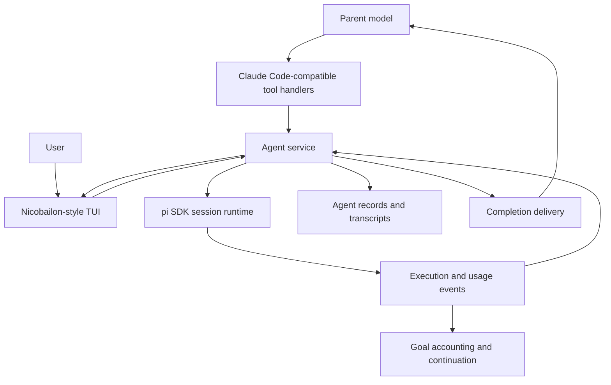
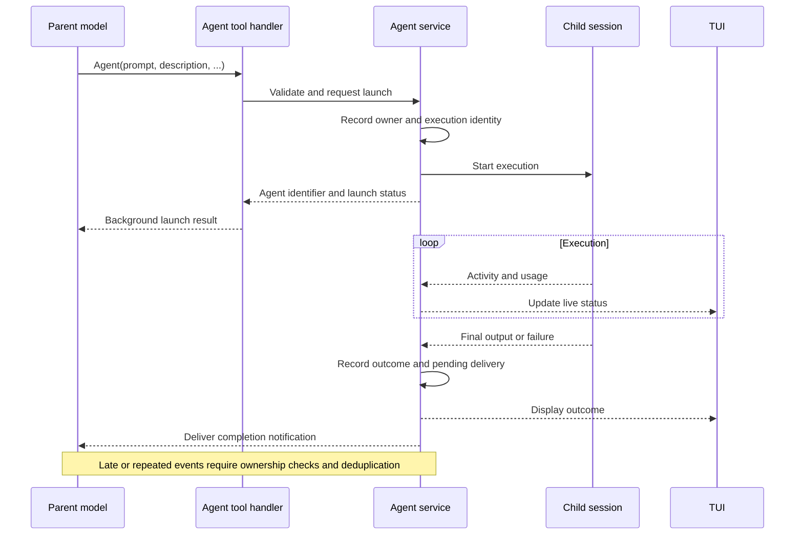

# Subagent Support: Comparative Technical Research

**Document type:** Technical research report and architecture comparison

**Status:** Draft for review; not an implementation specification

**Date:** 2026-09-16

**Audience:** Maintainers and contributors of `pi-secretary`

**Scope:** Claude Code tool contracts, nicobailon/pi-subagents terminal user interface, tintinweb/pi-subagents implementation, and integration with Secretary

## Executive Summary

Secretary will use three references for different concerns:

1. **Claude Code is the reference for model-facing tool names and input schemas.**
2. **nicobailon/pi-subagents is the reference for terminal user interface (TUI) design.**
3. **tintinweb/pi-subagents is an implementation reference for integration with pi.**

This division is the agreed design direction. It does not mean installing or wrapping either extension, copying every feature, or adopting either extension's public API unchanged.

Tintinweb's tool design is substantially closer to Claude Code's than nicobailon's: it uses `Agent`, matching core parameter names, separate lifecycle tools, and a similar workflow input shape. However, it is not schema-compatible with the inspected Claude Code release. Claude Code 2.1.272 uses `SendMessage` for messaging and resumption, while tintinweb uses `steer_subagent` and `Agent.resume`. Nicobailon combines dispatch and management in the action-based `subagent` tool.

The proposed architectural boundary is a dedicated agent service used by both tool handlers and the TUI, with pi SDK session execution beneath it. Goal management remains a separate subsystem. Agent usage and completion events connect the two; an agent finishing does not establish that a goal is complete.

The evidence establishes source-level design and schema construction. It does **not** establish live feature-flag settings, end-to-end compatibility, performance, or visual conformance. Background execution after quitting pi, the supported Claude Code feature set, model selection, and output retrieval remain open decisions.

## Contents

1. [Purpose and scope](#1-purpose-and-scope)
2. [Methodology and evidence](#2-methodology-and-evidence)
3. [Tool name comparison](#3-tool-name-comparison)
4. [Agent input schema comparison](#4-agent-input-schema-comparison)
5. [Messaging, output, cancellation, and workflows](#5-messaging-output-cancellation-and-workflows)
6. [TUI design findings](#6-tui-design-findings)
7. [pi implementation findings](#7-pi-implementation-findings)
8. [Secretary integration](#8-secretary-integration)
9. [Risks and validation requirements](#9-risks-and-validation-requirements)
10. [Conclusions and open decisions](#10-conclusions-and-open-decisions)
11. [References](#11-references)
12. [Appendix: Claude Code schema extraction](#appendix-claude-code-schema-extraction)

## 1. Purpose and Scope

### 1.1 Research questions

- Which tool names and input fields do the three implementations expose?
- Which similarities are exact schema matches, and which are only conceptual similarities?
- Which nicobailon interaction patterns can be implemented without adopting its tool API?
- Which tintinweb implementation patterns are relevant to Secretary's pi integration?
- How should subagent execution interact with existing goal accounting and continuation?
- What must be decided or verified before implementation?

### 1.2 Scope boundaries

The primary scope is single-agent delegation, concurrent execution, messaging, resumption, cancellation, output retrieval, and inspection. Workflow tools are compared to establish API boundaries, not to authorize a workflow engine implementation.

The following are not committed features: agent teams, remote cloud execution, cross-session messaging, nested delegation, scheduled execution, persistent agent memory, automatic worktree commits, and third-party terminal integrations.

Tool invocation schemas and agent-definition configuration are different interfaces. For example, Claude Code's agent-definition `maxTurns` is not evidence of an `Agent.max_turns` invocation field.

### 1.3 Terminology

- **Tool contract:** tool name, input schema, validation rules, and observable behavior.
- **Session:** conversation history and runtime configuration associated with an agent.
- **Run:** one execution of an agent; resuming a session can produce another run.
- **Foreground execution:** the invoking operation waits for completion.
- **Background execution:** control returns before completion while work continues.
- **Detached process:** execution in a process with a lifecycle separate from the invoking process. Background execution does not necessarily use a detached process or survive parent exit.
- **Cancellation:** a request to stop work; accepting the request and observing termination are distinct events.
- **Resumption:** continuing a previously established conversation. Exact eligibility and configuration behavior differ by implementation.
- **FleetView:** the upstream name for the persistent agent summary/navigation component; retained here when discussing that component.

## 2. Methodology and Evidence

### 2.1 Baselines

| System | Inspected baseline | Evidence |
| --- | --- | --- |
| Claude Code | Installed version **2.1.272** | Embedded schema constructors in the local executable; official documentation for behavior [C1–C3] |
| tintinweb/pi-subagents | Commit `e955e29c51b7a6cce37e1108cd2d6c57a77e151c` | Tool definitions, invocation configuration, manager, runner, and README [T1–T7] |
| nicobailon/pi-subagents | Commit `07bd09e0f93a19caee3c39e3cf4069c70ee8dbcd` | Schema definitions, registration, tool reference, and observability documentation [N1–N5] |
| pi-secretary | Commit `2b0489ac55c755e37f972de413fb16862f979127` before this report | Extension entry point, goal runtime, accounting, and package configuration [P1–P4] |

Claude Code executable SHA-256:

```text
195e24e8e1f9bf46f1eaee72d434a33e18f9f5796f29a6348a00d16c5f8aee75
```

### 2.2 Method

The investigation used read-only source inspection and bounded extraction of embedded JavaScript from the installed Claude Code executable. No Claude API request was issued for schema discovery. Repository references are pinned to commits. Official Claude documentation is a live source accessed on the report date, not a version-pinned specification.

Evidence is distinguished as follows:

| Classification | Meaning in this report |
| --- | --- |
| Source finding | Directly supported by inspected schema or implementation code |
| Documented behavior | Stated by upstream documentation; not independently exercised here |
| Agreed direction | Explicitly selected in the project discussion |
| Recommendation | Proposed consequence of the research; not yet approved as a requirement |
| Open decision | Requires a product or engineering decision before implementation |

Normalized TypeScript examples describe input shapes; they are not literal exported interfaces or generated JSON Schema. Where a projection omits fields, it is labeled. JSON Schema acceptance, runtime validation, defaults in descriptions, and actual schema defaults are not treated as equivalent.

### 2.3 Limitations

- Claude Code feature gates were inspected, not activated in a live session. The report does not claim one universal schema is advertised in every session.
- This is a targeted source review, not a complete security audit of either extension.
- UI findings are based on documentation and source, not an executed TUI walkthrough. No visual verification or human approval of an implemented interface is claimed.
- No performance benchmark or compatibility test suite was run.
- A reference implementation can contain defects or version-specific workarounds. Its behavior is not automatically a Secretary requirement.
- This report compares input schemas. Exact output schemas, error envelopes, and notification compatibility require follow-up research before conformance can be claimed.

## 3. Tool Name Comparison

| Operation | Claude Code 2.1.272 | tintinweb | nicobailon |
| --- | --- | --- | --- |
| Launch | `Agent` | `Agent` | `subagent` |
| Message running agent | `SendMessage` | `steer_subagent` | `subagent({ action: "steer" })` |
| Resume finished agent | `SendMessage` | `Agent({ resume: ... })` | `subagent({ action: "resume" })` |
| Retrieve output | `Read` on output file; `TaskOutput` still exists but is documented as deprecated | `get_subagent_result` | `subagent({ action: "status", ... })` and output artifacts |
| Wait | `TaskOutput({ block: true })` | `get_subagent_result({ wait: true })` | `bg_wait`, when enabled |
| Stop | `TaskStop` | No dedicated stop tool in its registered tool set; UI and extension RPC support stopping | `subagent({ action: "stop" })` |
| Scripted orchestration | `Workflow`, feature-gated | `SubagentWorkflow`, configurable | Workflow fields on `subagent` |
| Agent-definition management | Outside the core `Agent` input schema | Files and `/agents` UI | Management actions on `subagent` |

Sources: [C1–C3], [T1–T3], [N1–N4]. This table lists canonical names relevant to delegation, not every alias or team-specific tool.

**Conclusion:** tintinweb is the closer API reference, but Claude Code remains authoritative for Secretary's public contract. In particular, `get_subagent_result` and `steer_subagent` must not be described as current Claude Code tool names.

## 4. Agent Input Schema Comparison

### 4.1 Core fields

**Required** and **optional** below describe schema declarations. Runtime requirements are stated separately.

| Concern | Claude Code `Agent` | tintinweb `Agent` | nicobailon `subagent` |
| --- | --- | --- | --- |
| Instructions | Required `prompt: string` | Required `prompt: string` | Optional `task: string`; direct task dispatch requires an agent |
| Description | Required `description: string` | Required `description: string` | No equivalent direct-launch description field |
| Agent type | Optional `subagent_type: string` | Required `subagent_type: string` | Optional `agent: string` |
| Instance name | Optional constrained `name` | Optional string `name` | `name` is a schedule-creation field, not an instance-name equivalent |
| Model | Optional enum; conditionally omitted | Optional string; provider/model or fuzzy selection | Optional string; provider/model, unique bare ID, optional thinking suffix |
| Background | Optional `run_in_background`; conditionally omitted | Optional `run_in_background` | Optional `async` |
| Resumption | No `resume` field; use `SendMessage` | Optional `resume: string` | `action: "resume"` with target ID |
| Thinking | No invocation field | Optional `thinking: string` | Dispatch uses model suffix; top-level `thinking` is for watchdog configuration |
| Turn limit | No invocation field | Optional `max_turns: number`, minimum 1 | No direct `max_turns`; other budgets and deadlines exist |
| Parent context | `subagent_type: "fork"` | Optional `inherit_context: boolean` | Optional `context: "fresh" \| "fork" \| "profile"` |
| Isolation | `"worktree" \| "remote"` | `"off" \| "worktree"`, field configurable | `"none" \| "worktree"`; also `worktree?: boolean` |
| Built-in tools only | No equivalent invocation boolean | Optional `isolated: boolean` | No equivalent dispatch boolean |
| Working directory | Internal `cwd` explicitly omitted from public schema | No public `Agent.cwd` | Optional `cwd: string` |
| Scheduling | No `Agent` scheduling field | Optional `schedule: string`, field configurable | Separate schedule actions and fields |

Sources: [C1], [T1–T2], [N1–N3].

### 4.2 Claude Code: normalized complete published field set

This is the union of fields available across the inspected `Agent` schema variants, not a claim that every field is always advertised:

```ts
Agent({
  description: string,
  prompt: string,
  subagent_type?: string,
  model?: "sonnet" | "opus" | "haiku" | "fable",
  run_in_background?: boolean,
  name?: string,
  isolation?: "worktree" | "remote",
  team_name?: string,       // deprecated; ignored
  mode?: PermissionMode,   // deprecated; ignored
})
```

`PermissionMode` includes `acceptEdits`, `auto`, `bypassPermissions`, `default`, `dontAsk`, and `plan`; preprocessing maps `manual` to `default`.

Important constraints and conditional behavior:

- `name` matches `^[A-Za-z0-9][A-Za-z0-9_-]{0,63}$`, with additional exclusions for reserved recipients and agent-ID-shaped names.
- `subagent_type` has no schema default. Runtime can use `general-purpose` when available; a session without that fallback requires an explicit type.
- The description states that agents run in the background by default. The boolean does not have a schema `.default(true)`.
- `run_in_background` is omitted when fork mode is enabled or background tasks are disabled.
- `model` is omitted when `CLAUDE_CODE_SUBAGENT_MODEL_FORCE` is active. Fork agents inherit the parent model and ignore a supplied model override.
- `remote` belongs to the enum, but actual remote execution availability is separately gated.
- No published `resume`, `max_turns`, `thinking`, `inherit_context`, or `isolated` field exists in this baseline.

### 4.3 Tintinweb: normalized complete launch field set

```ts
Agent({
  prompt: string,
  description: string,
  subagent_type: string,
  name?: string,
  model?: string,
  thinking?: string,
  max_turns?: number,
  run_in_background?: boolean,
  resume?: string,
  isolated?: boolean,
  inherit_context?: boolean,
  isolation?: "off" | "worktree", // omitted when feature disabled
  schedule?: string,              // omitted when feature disabled
})
```

Schema and behavior distinctions [T1–T2]:

- `max_turns` has minimum 1 but is a number, not an integer schema.
- `thinking` is a string, although its description lists levels.
- `name` is a schema string; naming rules in descriptions or runtime are not regex constraints in that declaration.
- Background execution is normally the default, but configuration and agent definitions participate in resolution.
- `resume` continues a finished agent. Live guidance is a separate tool operation.
- `isolated` restricts extension/MCP tool availability; it is not filesystem isolation or a security sandbox.
- `schedule` cannot be combined with resumption or context inheritance and requires background execution.

### 4.4 Nicobailon: dispatch projection and broader schema

The following is a **direct-dispatch projection**, not its complete public schema:

```ts
subagent({
  agent?: string,
  task?: string,
  model?: string,
  context?: "fresh" | "fork" | "profile",
  async?: boolean,
  isolation?: "none" | "worktree",
  worktree?: boolean,
  baseRef?: string,
  cwd?: string,
  agentScope?: string,
  timeoutMs?: number,
  maxRuntimeMs?: number,
  toolTimeoutMs?: number,
  checkpointBeforeDeadlineMs?: number,
  toolBudget?: object,
  usageBudget?: object,
  output?: string | boolean,
  outputMode?: "inline" | "file-only",
  outputSchema?: object | boolean,
  skill?: string | string[] | boolean,
  acceptance?: string | object | boolean,
  gate?: string,
})
```

All top-level fields are schema-optional. Runtime validation determines which execution or management mode is selected and which combinations are valid. Nested objects can have their own required fields. Some schema types deliberately overapproximate runtime acceptance: for example, a boolean branch may accept `false` but reject `true` at runtime. [N1]

Additional field groups include:

| Group | Representative fields |
| --- | --- |
| Targeting and inspection | `action`, `id`, `runId`, `dir`, `index`, `childId`, `view`, `lines` |
| Messaging | `message`, `mode`, `steeringRecovery` |
| Workflow execution | `workflow`, `workflowScript`, `workflowScriptPath`, `args`, `globalConcurrencyLimit`, `maxSubagentSpawnsPerRun`, `preflight` |
| Agent management | `config`, `capabilities`, `topic` |
| Scheduling | `name`, `at`, `every`, `sessionOnly`, `timezone`, `overlap`, `catchUp` |
| Missions and worktree evidence | `mission`, `missionId`, `missionUpdate`, `handoffPath`, `laneId`, `merge`, `supersession` |
| Execution and artifacts | `machine`, `extensionBindings`, `control`, `artifacts`, `includeProgress`, `share`, `sessionDir`, `fast` |

The authoritative complete field inventory is [N1]. This report does not claim to reproduce all management subcontracts.

The current tool reference explicitly rejects legacy top-level `tasks`, `chain`, and `parallel` inputs. Sequential and parallel composition now use workflow scripts. Earlier descriptions of those legacy fields should not be used as the current API baseline. [N3]

### 4.5 Semantic incompatibilities

1. **Same name does not guarantee the same meaning.** Nicobailon's `name` is not an agent-instance name.
2. **Model fields have different value domains.** Claude aliases, fuzzy model selection, and provider-qualified identifiers are not interchangeable.
3. **Context inheritance differs.** Claude selects a fork type. Tintinweb's `inherit_context` implementation prepends rendered parent context; it is not equivalent to cloning the session's message entries. Nicobailon has explicit context modes. [C2, T4, N3]
4. **Isolation enums differ.** `off`, `none`, and `remote` are not portable values.
5. **Agent definitions are not invocation schemas.** Definition-level settings must not be copied into tool schemas without an explicit compatibility decision.

## 5. Messaging, Output, Cancellation, and Workflows

### 5.1 Messaging and resumption

Claude Code's plain-message projection is:

```ts
SendMessage({
  to: string,
  message: string,
  summary?: string,
  notify_when_idle?: boolean,
})
```

The exact published shape depends on features [C1]:

| Cross-session messaging | Agent teams | `message` | `notify_when_idle` |
| --- | --- | --- | --- |
| Disabled | Disabled | Required string | Absent |
| Disabled | Enabled | Required string or protocol object | Absent |
| Enabled | Disabled | String, default empty string | Optional boolean |
| Enabled | Enabled | String or protocol object, default empty string | Optional boolean |

`to` is required, single-line, and bounded to 300 Unicode code points by a regex. `summary` is optional with a schema maximum of 200 characters; preprocessing/documentation also describes truncation. With teams enabled, protocol objects include shutdown requests/responses and plan-approval responses. This does not imply those team protocols belong in Secretary's initial scope.

The canonical fields are `to` and `message`, not historical `recipient` and `content` spellings. Compatibility preprocessing in Claude Code was not exhaustively reconstructed.

Tintinweb separates live guidance from resumption:

```ts
steer_subagent({ agent_id: string, message: string })
// Both fields required; target must be running.

Agent({
  prompt: "Continue investigating the failing test",
  description: "Continue test investigation",
  subagent_type: "general-purpose",
  resume: "<agent-id>",
})
```

Nicobailon uses actions:

```ts
subagent({ action: "steer", id: "<run-id>", message: "..." })
subagent({ action: "resume", id: "<run-id>", message: "..." })
```

Its steering `mode` can be `steer`, `follow_up`, or `auto`. Its documented acknowledgments distinguish acceptance, queueing, and later consumption; acknowledgment is not proof the model followed the instruction. [N3]

### 5.2 Output retrieval and waiting

| Tool | Input | Required fields and defaults |
| --- | --- | --- |
| Claude `TaskOutput` | `{ task_id, block?, timeout? }` | `task_id` required; `block` defaults to true; `timeout` defaults to 30000 ms, range 0–600000, number rather than integer schema |
| Tintinweb `get_subagent_result` | `{ agent_id, wait?, verbose? }` | `agent_id` required; `wait` and `verbose` behavior default to false |
| Nicobailon `bg_wait` | `{ id?, nonBlocking?, all?, timeoutMs?, stopOnAttention? }` | All schema-optional; `nonBlocking` requires `id` at runtime and conflicts with `all`; default blocking window is configurable, otherwise 30 minutes |

Claude's documentation deprecates `TaskOutput` in favor of `Read` on an output file, but the inspected binary still defines it. Secretary must explicitly decide whether to implement this compatibility tool. [C1, C3]

Tintinweb supports full-conversation output with `verbose`. Nicobailon distinguishes status/transcript inspection from waiting and normally relies on native completion notification for ordinary async runs. [T1, N3–N4]

### 5.3 Cancellation and resumption eligibility

```ts
// Claude Code
TaskStop({
  task_id?: string,
  shell_id?: string, // deprecated
})
```

Both fields are schema-optional, but runtime requires a truthy identifier selected through `task_id ?? shell_id`. The schema is a strict object. [C1]

Nicobailon's `stop` ends a current-session top-level async run; `childId` can target a child of a multi-child run. It distinguishes `stop` from `interrupt`, rejects certain foreground/nested targets, and documents stopped runs as non-resumable. Claude's current documentation allows messaging to resume a stopped agent once the run has exited. These are materially different semantics. [C2, N3]

Tintinweb supports cancellation through its manager, UI, and extension RPC but does not register a separate public stop tool. [T1, T3, T7]

### 5.4 Workflow boundary

| Concern | Claude Code | Tintinweb | Nicobailon |
| --- | --- | --- | --- |
| Tool | `Workflow` | `SubagentWorkflow` | `subagent` |
| Inline source | `script` | `script` | `workflowScript` |
| File source | `scriptPath` | `scriptPath` | `workflowScriptPath` |
| Named workflow | `name` | `name` | `workflow` |
| Input data | `args` | `args` | `args` |
| Replay/resume field | `resumeFromRunId` | `resumeFromRunId` | Different control model; not this field |
| Title/description | Optional, ignored; metadata belongs in script | Same principal convention | Not equivalent fields |

Claude Code's inspected `Workflow` schema has optional `script`, `name`, `description`, `title`, `args`, `scriptPath`, and `resumeFromRunId`. It also has object-level selector validation. The script maximum is 524288 characters. `resumeFromRunId` matches `^wf_[a-z0-9-]{6,}$`. Runtime availability and restrictions are feature-gated. Dormant implementation branches do not imply additional published fields. [C1]

Tintinweb is particularly close to this input shape, but uses a different tool name and does not thereby establish full runtime compatibility. Nicobailon's workflow API has a different script interface and authority model. [T1, N3]

**Scope conclusion:** basic subagent support does not require any of these workflow engines.

## 6. TUI Design Findings

### 6.1 Nicobailon's interaction model

The selected UI reference provides three complementary surfaces [N5]:

| Surface | Purpose | Relevant behavior |
| --- | --- | --- |
| Inline tool display | Historical delegation record and progress/result presentation | Compact status, tool activity, expandable detail; configurable rich or summary presentation |
| FleetView | Persistent visibility and navigation while editing | Below-editor summary by default; optional above-editor placement; expands to main session and active children |
| Fleet inspector | Detailed observation and control | Structured Markdown/tool transcript, run selection, steering, stop confirmation, output/session paths |

FleetView activates from an empty, focused editor with Down or Left. Printable navigation keys are not intercepted before activation. Within the inspector, documented defaults include arrows or `j/k` for selection, page scrolling, tool-detail expansion, `s` for messaging, `D` for stop confirmation, and Escape to close.

The upstream UI has optional Inspect plugins and terminal integrations. Entering a child-specific inspector may depend on those plugins. Secretary should adopt the interaction requirements without assuming Herdr, Ghostty, or external panes are mandatory dependencies.

Nicobailon enables both FleetView and an additional async widget by default. Using only FleetView to avoid duplicate live summaries is a **recommendation**, not a statement about the upstream default or an approved Secretary requirement.

### 6.2 Proposed information flow

The following diagram is a **proposed component decomposition**, not a diagram of existing Secretary implementation:



Both user actions and tool invocations should enter the same service. The UI should not maintain an independent execution state or bypass ownership checks.

### 6.3 Display semantics

Recommended distinctions:

- Launch accepted versus execution started.
- Running versus waiting in a queue.
- Cancellation requested versus execution terminated.
- Completed execution versus partial output, failure, or cancellation.
- Acknowledged message delivery versus model compliance.
- Agent completion versus goal completion.

A completed status query does not mean the queried agent completed. Historical tool results and live status have different purposes and should not overwrite one another.

### 6.4 Usage labels

Do not copy upstream token labels without their definitions. Nicobailon's documented **context-window token usage** is the latest assistant turn's input plus cache-read tokens, while its documented **cumulative token usage** is accumulated input-plus-output usage. These are different quantities. [N5]

Secretary's goal accounting uses its own established formula, documented in Section 8.2. TUI context usage, cumulative provider usage, and goal-budget usage must be labeled separately and must not be substituted for one another.

## 7. pi Implementation Findings

### 7.1 Tintinweb's separation of responsibilities

| Module | Responsibility | Relevance to Secretary |
| --- | --- | --- |
| `agent-manager.ts` | Agent records, queues, ownership, cancellation, resumption, retained sessions | Reference for lifecycle management |
| `agent-runner.ts` | SDK session creation, resources, models/tools, prompting, event collection | Reference for pi execution integration |
| `child-context.ts` | Async-context-local child-session marker | Avoid process-global child/root flags |
| `group-join.ts` | Grouped completion notification | Reference for notification coalescing, not a required policy |
| `src/ui/` | Widget, fleet navigation, conversation viewer | Implementation examples; nicobailon remains the UI authority |

Sources: [T3–T6]. These modules are reference material, not a proposed file-by-file port.

### 7.2 Execution and persistence

Tintinweb creates child sessions through `createAgentSession()`. Background work can execute inside the parent's process. Its shutdown handler aborts agents and disposes child sessions. Persisted sessions allow later resumption; they do not mean active execution survives quitting pi. [T1, T3–T4]

Nicobailon documents a different arrangement: foreground children use sessions inside the parent process, while background children use a detached runner. [N3, N6]

**Recommendation:** choose process lifetime explicitly before implementing shutdown and restoration. Session-scoped execution is simpler, but it has not been approved as the required Secretary behavior.

### 7.3 Initialization, resource loading, and cleanup

Tintinweb uses `AsyncLocalStorage` to mark child-session construction. This avoids a process-wide flag affecting unrelated concurrent session work. Its runner binds extensions so child resources can initialize. Its manager explicitly handles extension shutdown before session disposal and bounds shutdown waiting. The source documents resource leaks when extension cleanup was skipped. [T3–T5]

Secretary must decide which of its own behaviors are active in a child. Loading the extension in a child must not accidentally create a second top-level dashboard, grant unrestricted nested delegation, or start independent continuation of the parent's goal.

### 7.4 Tool availability and permissions

Tintinweb accounts for tools registered after initial resource loading, including extension tools registered during session startup or later turns. It re-evaluates the active tool set and checks execution eligibility. A startup-only snapshot would not cover late registration. [T4]

Tool filtering is not a security sandbox. Filesystem/process access, secrets, project trust, and permission behavior require separate treatment. A Git worktree isolates a checkout but does not isolate the process from the host filesystem.

### 7.5 Ownership and concurrency

Tintinweb scopes nested-agent controls to the owning parent and cancels owned children when that parent finishes. Its code explicitly notes that depth limits do not bound horizontal fan-out. [T3]

Secretary should consider these limits independently:

- Concurrent active runs.
- Cumulative child launches.
- Maximum delegation depth.
- Token and time budgets.

A concurrency design must also avoid a parent occupying the only execution slot while synchronously waiting for a queued child. Nested delegation is not yet a committed feature, but an ownership model should not preclude enforcing it later.

### 7.6 Background completion sequence

This sequence is **illustrative of the proposed service boundary**. It does not select a process model, notification format, or persistence guarantee:



## 8. Secretary Integration

### 8.1 Existing implementation

The inspected package implements goal management, not subagent execution. Relevant integration points are:

| Existing code | Current responsibility | Potential integration |
| --- | --- | --- |
| `extensions/secretary/index.ts` | Tool registration, session hooks, continuation messages, accounting adapter | Register agent tools and route lifecycle events |
| `extensions/secretary/goal-engine.ts` | Goal services and per-thread runtime composition | Coordinate with a separate agent service |
| `extensions/secretary/goal/runtime.ts` | Goal continuation and accounting application | Receive attributed descendant usage |
| `extensions/secretary/goal/accounting.ts` | Token deltas and accounting baselines | Preserve established budget calculation |
| `extensions/secretary/goal-ui.ts` | Goal presentation and commands | Coexist with agent UI; do not overload goal state |

The runtime exposes `recordDescendantTokenUsage()`, but the current host adapter does not call it. The existing session-local `pi.sendMessage()` wiring is not a general router to multiple child sessions. [P1–P3]

### 8.2 Goal-budget usage

The established **goal-budget token usage** formula is defined by `goalTokenDeltaForUsage()` in `goal/accounting.ts`:

```text
goal-budget token usage =
    max(inputTokens - cachedInputTokens, 0)
  + max(outputTokens, 0)
```

This formula is the baseline for descendant attribution; it must not be replaced with an upstream extension's cumulative token total. Provider usage fields must first be normalized to Secretary's `TokenUsage` semantics. In particular, cache-read accounting must not be subtracted twice when an upstream provider separates cached and uncached input.

Recommended attribution metadata includes parent session identity, agent identity, execution identity, originating goal identity, and an event identifier or sequence number for deduplication. These are internal data-model recommendations, not additions to the public `Agent` schema.

The policy for a goal being replaced or cleared while its child is running remains open. At minimum, late usage must not be silently charged to an unrelated replacement goal.

### 8.3 Continuation and completion

The existing continuation logic reacts to the parent becoming settled; it does not model outstanding child dependencies. The integration should distinguish:

- Parent work that can proceed independently.
- A parent waiting for a child result needed for its next action.
- Background work that does not block further parent work.

Simply disabling continuation whenever any child exists is too broad. Ignoring outstanding work can repeatedly launch duplicate tasks. The policy needs tests around child completion, queued continuation, and goal replacement.

Agent completion must not automatically mark a goal complete. A successful run can return findings, partial implementation, or a request for additional input without satisfying the parent's objective.

## 9. Risks and Validation Requirements

This is a proposed validation plan, not a report of executed tests.

| Risk | Required validation before release |
| --- | --- |
| Claude schema drift | Versioned schema fixtures; required/optional fields, enums, defaults, unknown-field behavior, and selected feature variants |
| Unsupported fields accepted silently | Negative tests; explicit errors or documented compatibility handling |
| UI and tools disagree | Shared-service tests for equivalent message, stop, and resume operations |
| Wrong-session completion delivery | Session switch, reload, fork, stale ownership, and delayed-event tests |
| Duplicate delivery or usage | Event replay, repeated callbacks, retry, and deduplication tests |
| Resource leaks | Cancellation during startup, queued cancellation, shutdown timeout, extension cleanup, and retained-session disposal |
| Concurrency deadlock or unlimited fan-out | Queue saturation and parent/child dependency tests; explicit limits |
| Unexpected child privileges | Project trust, tool restrictions, late tool registration, and nested-delegation tests |
| Shared-checkout conflicts | Concurrent mutation tests; explicit worktree behavior if supported |
| Sensitive transcript persistence | Storage permissions, retention, redaction policy, and path validation |
| Misleading outcomes | Distinguish partial result, API failure, cancellation, and successful completion |
| Terminal interaction regressions | Empty/non-empty editor focus, keybinding conflicts, narrow terminals, resize, transcript scrolling, and stop confirmation |
| Headless behavior differs unintentionally | Print, JSON, RPC, and TUI behavior checked against documented support |

Visual and interaction verification should use the project's required recorded walkthrough procedure when a UI exists. Recording completeness, execution outcome, and human review status must be reported separately. No walkthrough is required to validate this Markdown research report itself.

## 10. Conclusions and Open Decisions

### 10.1 Agreed direction

| Concern | Selected reference | Consequence |
| --- | --- | --- |
| Public tool contract | Claude Code | Do not substitute tintinweb's result/steering names or nicobailon's action-based API |
| TUI design | nicobailon | Adopt its navigation, inspection, and progressive disclosure patterns independently of its tool schema |
| pi execution implementation | tintinweb | Study SDK integration and lifecycle handling without inheriting its public deviations automatically |
| Goal integration | Secretary | Maintain separate goal and agent state; connect through explicit accounting and lifecycle events |

### 10.2 Recommendations, not yet approved requirements

- Implement an agent service shared by tool handlers and UI commands.
- Separate a resumable conversation's identity from each execution's identity internally.
- Use a documented Claude Code compatibility baseline rather than claiming compatibility with an unspecified moving release.
- Treat unsupported operations as explicit limitations; do not silently downgrade isolation or permissions.
- Prefer one persistent live summary initially to avoid duplicate progress displays, subject to UI review.
- Keep workflow orchestration separate from the initial subagent feature.
- Follow tintinweb's lifecycle lessons, but verify them against Secretary's supported pi versions rather than copying version-specific internals blindly.

### 10.3 Open decisions

| Decision | Options or question |
| --- | --- |
| Compatibility target | Adopt 2.1.272 as the implementation baseline, or select another explicit release? It is currently the research baseline only. |
| Feature variants | Which fork, team, cross-session, and remote schema variants are supported? How are unsupported variants represented? |
| Model selection | Preserve Claude's alias enum exactly, or explicitly extend it for pi provider/model identifiers? |
| Process lifetime | Stop on parent shutdown, or support execution after quitting pi through a separate process/supervisor? |
| Output contract | Implement deprecated `TaskOutput`, expose output files through the existing pi read tool, or both? Which output/error envelopes must match? |
| Context inheritance | Implement actual fork semantics, fresh sessions only, or a documented subset? |
| Agent definitions | Which discovery locations, frontmatter fields, trust rules, and built-in agent types are supported? |
| Worktree behavior | Which base reference, uncommitted-change policy, cleanup, and result preservation rules apply? |
| Messaging | Which acknowledgment, queueing, resume eligibility, and recipient-resolution rules are required? |
| Persistence | What survives reload, session switching, process restart, and record eviction? What is the retention policy? |
| Goal interaction | How are late usage, goal replacement, budget exhaustion, and outstanding dependencies handled? |
| UI scope | Which nicobailon surfaces and shortcuts are required, and which external inspector integrations are excluded? |

The next artifact should be a design specification resolving these decisions, followed by an implementation plan and conformance tests. This report does not authorize code changes or claim the open decisions are settled.

## 11. References

### Claude Code

- **[C1]** Local executable: `/Users/wezzard/.local/share/claude/versions/2.1.272`. SHA-256 and bounded extraction details are recorded in this report. The executable is not redistributed.
- **[C2]** [Create custom subagents](https://code.claude.com/docs/en/sub-agents), accessed 2026-09-16. Live documentation; may change independently of the inspected executable.
- **[C3]** [Tools reference](https://code.claude.com/docs/en/tools-reference), accessed 2026-09-16. Live documentation.

### tintinweb/pi-subagents — pinned commit `e955e29c51b7a6cce37e1108cd2d6c57a77e151c`

- **[T1]** [Tool definitions and host integration](https://github.com/tintinweb/pi-subagents/blob/e955e29c51b7a6cce37e1108cd2d6c57a77e151c/src/index.ts)
- **[T2]** [Invocation configuration](https://github.com/tintinweb/pi-subagents/blob/e955e29c51b7a6cce37e1108cd2d6c57a77e151c/src/invocation-config.ts)
- **[T3]** [Agent manager](https://github.com/tintinweb/pi-subagents/blob/e955e29c51b7a6cce37e1108cd2d6c57a77e151c/src/agent-manager.ts)
- **[T4]** [Agent runner](https://github.com/tintinweb/pi-subagents/blob/e955e29c51b7a6cce37e1108cd2d6c57a77e151c/src/agent-runner.ts)
- **[T5]** [Child-session context](https://github.com/tintinweb/pi-subagents/blob/e955e29c51b7a6cce37e1108cd2d6c57a77e151c/src/child-context.ts)
- **[T6]** [Grouped completion](https://github.com/tintinweb/pi-subagents/blob/e955e29c51b7a6cce37e1108cd2d6c57a77e151c/src/group-join.ts)
- **[T7]** [README and feature documentation](https://github.com/tintinweb/pi-subagents/blob/e955e29c51b7a6cce37e1108cd2d6c57a77e151c/README.md)

### nicobailon/pi-subagents — pinned commit `07bd09e0f93a19caee3c39e3cf4069c70ee8dbcd`

- **[N1]** [Input schemas](https://github.com/nicobailon/pi-subagents/blob/07bd09e0f93a19caee3c39e3cf4069c70ee8dbcd/src/extension/schemas.ts)
- **[N2]** [Extension registration](https://github.com/nicobailon/pi-subagents/blob/07bd09e0f93a19caee3c39e3cf4069c70ee8dbcd/src/extension/index.ts)
- **[N3]** [Tool reference](https://github.com/nicobailon/pi-subagents/blob/07bd09e0f93a19caee3c39e3cf4069c70ee8dbcd/docs/tool-reference.md)
- **[N4]** [Background wait tool](https://github.com/nicobailon/pi-subagents/blob/07bd09e0f93a19caee3c39e3cf4069c70ee8dbcd/src/runs/background/wait-tool.ts)
- **[N5]** [Observability and TUI](https://github.com/nicobailon/pi-subagents/blob/07bd09e0f93a19caee3c39e3cf4069c70ee8dbcd/docs/observability.md)
- **[N6]** [README](https://github.com/nicobailon/pi-subagents/blob/07bd09e0f93a19caee3c39e3cf4069c70ee8dbcd/README.md)

### Secretary — local baseline `2b0489ac55c755e37f972de413fb16862f979127`

The relative links resolve to the current checkout; the baseline above identifies the revision inspected.

- **[P1]** [Extension entry point](../../extensions/secretary/index.ts)
- **[P2]** [Goal runtime](../../extensions/secretary/goal/runtime.ts)
- **[P3]** [Goal accounting](../../extensions/secretary/goal/accounting.ts)
- **[P4]** [Package configuration](../../package.json)

## Appendix: Claude Code Schema Extraction

### A. Reproducibility

The executable was read as bytes and bounded UTF-8 windows were extracted around embedded schema constructors. This avoids executing Claude, contacting a provider, or dumping the entire executable. Byte offsets apply only to the executable with the recorded SHA-256.

```python
from pathlib import Path
import hashlib

binary = Path.home() / ".local/share/claude/versions/2.1.272"
data = binary.read_bytes()
print(hashlib.sha256(data).hexdigest())

for offset, length in [
    (176220200, 3400),  # Agent fields and public-schema selection
    (187849686, 3100), # SendMessage fields and feature variants
    (176320696, 700),  # TaskStop
    (176400300, 750),  # TaskOutput
    (188301252, 3500), # Workflow schema vicinity
]:
    print(offset, data[offset:offset + length].decode("utf-8", "replace"))
```

This procedure establishes embedded construction, not the final schema a particular live session sends to a provider. Minified symbol names and offsets are not a supported API.

### B. Public `Agent` schema selection

The relevant extracted logic removes the internal working-directory field and conditionally removes background/model controls:

```js
MMn = p(() => {
  let e = AMs().omit({ cwd: !0 }),
      n = Sc() || E7() ? e.omit({ run_in_background: !0 }) : e;
  return a.CLAUDE_CODE_SUBAGENT_MODEL_FORCE
    ? n.omit({ model: !0 })
    : n;
});
```

In the inspected build, `Sc()` is the background-disabled predicate and `E7()` is the fork-enabled predicate. These predicates must not be treated as stable names for integration.

### C. Input schema versus compatibility preprocessing

The inspected code also contains deprecated aliases and input normalization. For example, `TaskOutput` normalization recognizes older identifier spellings, but its canonical schema field remains `task_id`. Likewise, `SendMessage` has compatibility handling outside its published schema. The report intentionally does not turn every accepted historical spelling into a recommended public field.
