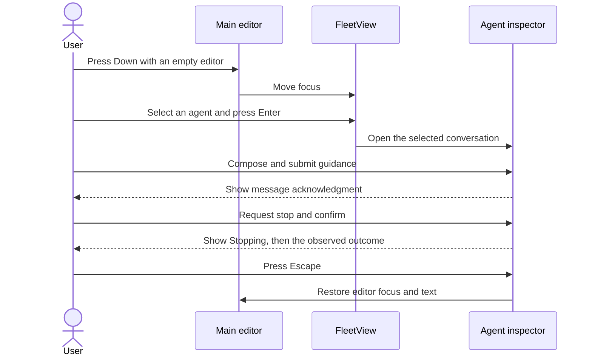

# Subagent Support: Interaction Design

**Document type:** UX and interaction specification.

**Status:** Interaction specification. Automated execution evidence is recorded in the [implementation report](../research/subagent-implementation-evidence.md); human visual approval remains separate.

**Related documents:** [Requirements](../user-stories/subagents.md), [technical design](../arch/subagents.md), and [research](../research/subagent-system-comparison.md).

## 1. Design Principles

- The interface follows nicobailon's inline display, FleetView, and inspector interaction model.
- The user can inspect background work without asking the parent model to poll.
- One persistent FleetView is displayed below the editor by default. An additional async widget is not displayed.
- Status uses text and symbols as well as color.
- Closing a view is different from stopping execution.
- A completed execution is different from a completed user objective.
- The UI and tool responses report the same underlying state.

The single-widget default and the command names below are proposed Secretary choices. They do not claim to reproduce every upstream control or external terminal integration.

## 2. Information Architecture

### 2.1 Inline tool display

- Each `Agent` call displays the agent type, task description, execution mode, and available status.
- A foreground call streams bounded recent activity until it settles.
- Interrupting a foreground `Agent` call requests cancellation of that child. The child's output remains inspectable if the foreground response is interrupted. Cancelling a `TaskOutput` wait stops only the wait.
- A background call reports the launch identifier and directs the user to FleetView for current activity.
- A completed background execution creates a separate completion entry. It does not rewrite the historical launch result.
- The configured pi tool-expansion key reveals task details, result text, and artifact paths.
- A truncated result identifies where the full output can be read.

### 2.2 FleetView

- The collapsed view reports active and queued work belonging to the current parent session.
- The expanded view contains the main session and agent rows ordered by creation time.
- Each row shows a description, explicit status, resolved model, and elapsed execution time when available.
- Context usage is displayed only when it is available from the host. Unknown usage is not displayed as zero.
- Recently finished executions remain visible until FleetView is next collapsed. The inspector retains the full session list.
- FleetView is hidden when no active, queued, or recently finished work remains. The inspector can still be opened by command.

The following is a layout example. Angle-bracket values are placeholders, not measurements:

```text
<active count> active agents · <queued count> queued · ↓/← to inspect

> main
  Explore          Locate request handlers     running
                   <model> · <elapsed time>
  general-purpose  Implement validation        queued
  reviewer         Review error handling       failed
```

### 2.3 Inspector

- `/agents` opens the current-session agent list and selected transcript.
- `/agents <id-or-name>` opens one agent directly.
- Wide terminals display the agent list beside the transcript. Narrow terminals display a selectable list followed by a full-width detail view.
- Details include the original task, definition source, model, status, current activity, messages, tool calls, outcome, output path, and worktree information.
- Output text is rendered as Markdown where appropriate. Control sequences from transcripts are not executed.
- New content is followed automatically only while the user is at the end of the transcript.
- Scrolling upward pauses automatic following. Returning to the end resumes it.

## 3. Primary Interactions

### 3.1 Inspect an agent

- **User intent:** The user wants to understand delegated work and its current outcome.
- **Entry conditions:** The current session has an agent record, or the user knows its identifier.
- **User action:** The user presses Down or Left in an empty editor, selects an agent, and presses Enter. The user can instead invoke `/agents`.
- **Observable outcome:** The inspector shows the selected agent without starting a model turn.
- **Feedback:** The view identifies the agent, execution state, and whether the transcript is live or historical.
- **Failure and recovery:** Missing artifacts remain visible as a diagnostic. The user can inspect the retained record and output paths; the interface does not manufacture a transcript.

### 3.2 Message or resume an agent

- **User intent:** The user wants to redirect active work or continue a previous conversation.
- **Entry conditions:** The selected agent belongs to the current session and is eligible for messaging or resumption.
- **User action:** The user presses `s`, enters guidance, and submits it. Escape cancels the composer.
- **Observable outcome:** A running agent receives queued guidance. A resumable finished agent starts another background execution of the same conversation.
- **Feedback:** The interface reports either “Message queued” or “Resume accepted.” It does not report “Instruction followed.”
- **Failure and recovery:** One-shot agents, missing history, unavailable models, changed tool permissions, and missing worktrees produce explicit errors. The draft is retained after a rejected submission so the user can copy or revise it. If previously accepted guidance cannot be delivered before the run stops, the inspector labels it undelivered or uncertain. The user can copy it for an explicit resend; it is not automatically replayed.

Secretary initially exposes one guidance operation. Nicobailon's `steer`, `follow_up`, and `auto` selector is not copied because those modes would introduce a second public messaging contract beyond the selected Claude Code behavior.

### 3.3 Stop an agent

- **User intent:** The user wants selected work to stop while retaining its available output.
- **Entry conditions:** The selected execution is queued, starting, running, or already stopping.
- **User action:** The user presses `D` and confirms the identified execution. `/agents stop <id-or-name>` provides the same operation with confirmation in the TUI.
- **Observable outcome:** A queued execution is cancelled before starting. Active execution shows “Stopping” until termination is observed.
- **Feedback:** The view distinguishes a pending stop request from a cancelled execution. It states that file changes are not rolled back.
- **Failure and recovery:** If the selected execution finishes or is replaced before confirmation, the confirmation does not target the newer execution. If stopping cannot be confirmed, the view reports that uncertainty and does not offer a conflicting resume.

### 3.4 Exit, reload, or switch sessions

- **User intent:** The user wants to leave the current session without orphaned background work.
- **Entry conditions:** The parent may have active child executions.
- **User action:** The user quits pi, reloads extensions, starts a new session, or switches sessions.
- **Observable outcome:** Current-session children are stopped. Their available records and saved conversations remain inspectable when the parent is restored.
- **Feedback:** On restoration, interrupted executions are identified as interrupted, not completed. No child starts automatically.
- **Failure and recovery:** A missing or damaged saved session cannot be resumed. The user can still inspect other retained evidence and start a separate task explicitly.

### 3.5 Inspect and clean up a worktree

- **User intent:** The user wants to locate an agent's changes and safely remove an unnecessary worktree.
- **Entry conditions:** The selected agent has a recorded worktree.
- **User action:** The user reads its path and branch in the inspector. `/agents cleanup <id-or-name>` requests cleanup of that agent's idle worktree.
- **Observable outcome:** An unchanged worktree can be removed after confirmation. Worktrees with changes or commits remain available.
- **Feedback:** Retained worktrees explain that changes require manual review. Cleanup states that future resumption of that agent will be unavailable.
- **Failure and recovery:** The command refuses dirty, changed, active, foreign, or unverifiable worktrees. Resumption is unavailable while cleanup is in progress. If cleanup is interrupted and the remaining files cannot be verified, the view reports that manual recovery is required and continues to refuse resumption. This release provides no force-delete or automatic merge command.

## 4. Navigation and Accessibility

| Context | Key | Behavior |
| --- | --- | --- |
| The editor is empty and focused. | Down or Left | The key activates FleetView when visible. |
| FleetView has focus. | Up/Down or `j/k` | The key changes selection. |
| FleetView has focus. | Enter | The key opens the selected inspector or returns to the main session. |
| FleetView has focus. | Escape | The key returns focus to the editor. |
| The inspector is open. | Page Up/Page Down | The key scrolls by the available transcript viewport. |
| The inspector is open. | Shift+K/Shift+J | The key scrolls the transcript by one line. |
| The inspector is open. | `x` or the configured tool-expansion key | The key toggles tool details. |
| The inspector is open. | `s` | The key opens the message composer. |
| The inspector is open. | `D` | The key opens stop confirmation. |
| The inspector is open. | Escape | The key closes the inspector without stopping work. |
| The composer is open. | Escape | The key cancels composition without sending a message. |

- Custom keybindings and displayed hints must remain consistent.
- Printable navigation keys are captured only after focus enters FleetView or the inspector.
- Normal editing, file completion, IME composition, and existing editor extensions continue to work.
- The interface wraps or truncates by terminal display width and remains usable after resize.
- Theme changes update existing views without losing selection or scroll position.
- The main editor retains its text when the inspector opens or closes.

## 5. Visible Interaction Flow

- The sequence diagram shows one successful interaction path from the user's perspective.
- The [architecture's UI state model](../arch/subagents.md#121-ui-state-model) is the authoritative specification of states, transitions, guards, and effects. Those implementation contracts are not duplicated here.



### 5.1 Pending actions and recovery

- While guidance is being submitted, the interface prevents duplicate submission and identifies the selected recipient.
- If submission is rejected, the user keeps the draft and receives an actionable explanation.
- If acceptance is uncertain, the interface preserves the text and target and prevents resubmission until the original request is resolved.
- Dismissing a pending request returns focus to the originating view. It does not retract the request or cancel the agent.
- A delayed response cannot replace a more recently selected transcript, close another dialog, or steal focus.
- If the agent completes while the composer is open, the draft remains available. The interface explains whether submitting it will resume the agent or whether resumption is unavailable.
- Escape dismisses only the currently focused dialog. A subsequent Escape can close the inspector without stopping work.
- Message drafts are not restored after leaving or replacing the parent UI session in this release.

## 6. Notifications and Non-TUI Behavior

- Successful completion updates inline history and FleetView without an extra success toast.
- Failure and interrupted execution produce visible notices in the owning session.
- Completion never steals keyboard focus from the editor or an open composer.
- A state-only display refresh does not start a model turn.
- The parent model can receive a completion message independently of whether a toast is shown.
- In headless modes, commands return text rather than opening a terminal component.
- Print and JSON mode reject a request to resume an idle agent through `SendMessage`, because that operation starts background execution. The response directs the caller to use a persistent TUI or RPC session; it does not accept work that normal process completion would terminate.
- Cleanup requiring confirmation is unavailable in headless mode. Model-facing `TaskStop` remains an explicit stop request and does not require a dialog.

## 7. Review Criteria

- Reviewers must be able to distinguish launch, completion, failure, partial output, and cancellation without relying on color.
- Inspection, messaging, stopping, and cleanup must satisfy the requirements in [SA-02 through SA-06](../user-stories/subagents.md#sa-02-observe-concurrent-work).
- A UI walkthrough must cover narrow and wide terminals, keyboard focus, resize, scrolling during streaming, completion while open, and stale stop confirmation.
- The review must record visual verification separately from execution tests and human approval.
- The user must retain their draft, selected target, and reading position through progress updates and unsuccessful actions where the interaction contract requires it.
- Technical transition and guard coverage is specified in the [architecture verification contract](../arch/subagents.md#125-state-machine-verification).
- The [UI state-machine acceptance scenarios](../../doc/acceptance/ui-state-machine.feature) cover modal focus, duplicate submission, stale responses, and session deactivation.
