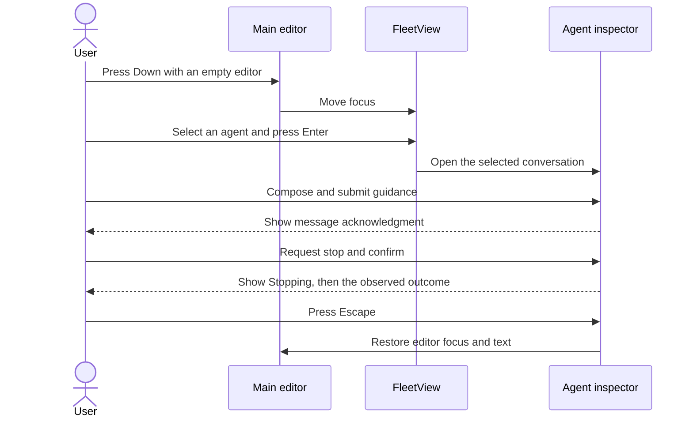

# Subagent Support: Interaction Design

**Document type:** UX and interaction specification.

**Status:** Interaction specification for the subagent interface. Automated execution evidence is recorded in the [verification report](../testing/subagent-verification.md); human visual approval remains separate. Revised 2026-09-19: the unified fleet indicator ([Section 2.2](#22-fleet-indicator)) and the split fleet view overlay ([Section 2.4](#24-fleet-view-overlay)) are implemented and replace the former FleetView, async widget, and inspector.

**Related documents:** [Requirements](../user-stories/subagents.md), [technical design](../arch/subagents.md), and [research](../research/subagent-system-comparison.md).

## 1. Design Principles

- The interface ports nicobailon's inline display, fleet navigation, and inspector interaction model onto Secretary's Claude Code-compatible runtime. A single unified fleet indicator replaces the former FleetView summary and the async widget; background work no longer has a second live list.
- The user can inspect background work without asking the parent model to poll.
- The fleet indicator is displayed below the editor by default and can be configured above it.
- Status uses text and symbols as well as color.
- Closing a view is different from stopping execution.
- A completed execution is different from a completed user objective.
- The UI and tool responses report the same underlying state.

Foreground detach, live prompt auditing, external job display, and external terminal inspectors remain excluded. The corresponding upstream surfaces are not ported because their runtime features are out of scope. All other upstream controls and configuration are ported.

## 2. Information Architecture

### 2.1 Inline tool display

- Each `Agent` call displays the agent type, task description, execution mode, and available status.
- Two display modes are configurable. Rich mode is the default and allows expansion; summary mode keeps one static result row per call and ignores expansion.
- A foreground call streams bounded recent activity until it settles. Its card shows the agent name and status glyph, a bounded task line, current activity, a live status line, the configured tool-expansion hint, and available token and duration statistics.
- Interrupting a foreground `Agent` call requests cancellation of that child. The child's output remains inspectable if the foreground response is interrupted. Cancelling a `TaskOutput` wait stops only the wait.
- A background call reports the launch identifier and directs the user to FleetView for current activity.
- A completed background execution creates a separate completion entry. It does not rewrite the historical launch result. A failed or interrupted completion produces a visible notice in the owning session.
- The configured pi tool-expansion key reveals task details, result text, and artifact paths in rich mode.
- A truncated result identifies where the full output can be read.

### 2.2 Fleet indicator

- The fleet indicator is the single agent list below (or above) the editor. It replaces the former collapsed/expanded FleetView and the separate async widget. There is no summary or info bar; the list itself is the whole surface.
- The indicator is visible only while at least one top-level agent execution is non-terminal. When no agent is active, the surface below (or above) the editor renders nothing; the indicator does not occupy a permanent row.
- When the indicator is visible, the main session is always the first row and cannot be collapsed. Top-level agents are appended in creation order while their execution is non-terminal (queued, starting, running, or cancelling).
- A row is removed immediately when its execution reaches a terminal status. The completion remains visible through the inline completion entry in the transcript, and terminal agents remain inspectable in the fleet view overlay.
- Each row shows a selection circle, the agent name, an explicit status text label, and right-aligned elapsed time and usage labels when available.
- The selection circle is hollow (`○`) on an unselected row and filled (`●`) on the selected row. The circle encodes selection only. Status is conveyed by the text label, never by the circle's shape or color; the filled circle may use the theme's accent color, but color is never the only channel.
- **Context-window usage** is the latest assistant turn's input plus cache-read tokens. **Cumulative usage** is the accumulated input-plus-output total. These are different quantities and are labeled separately. They are not the goal-budget usage defined by the goal subsystem, and they are not substituted for it.
- Unknown usage is not displayed as zero. Rows whose source artifacts predate window data keep the token-total label without a window label.
- Rows are themed and display width-aware. The layout truncates by terminal display width and realigns right-side information after resize.
- When more rows exist than fit, the visible window follows the selection.
- Pressing Down in an empty, focused editor moves focus into the list and selects the first row. Up and Down move the selection. Pressing Up on the first row or pressing Escape returns focus to the editor. Left no longer activates the indicator. Enter opens the fleet view overlay on the selected agent row. Enter on the main row returns focus to the prompt input instead; the main session's transcript is the session behind the editor, so there is no overlay destination for it.

The following is a layout example with an active selection. Angle-bracket values are placeholders, not measurements:

```text
○ main
● <agent name> · <status> · <elapsed> · <window> · <cumulative>
○ <agent name> · <status>
```

### 2.3 Async widget (removed)

- The async widget is removed. Active background executions appear as rows in the fleet indicator ([Section 2.2](#22-fleet-indicator)) instead of a second live list.
- The widget's enable, fold, and expansion configuration no longer exists. Live per-agent activity is visible in the fleet view overlay instead of an activity sub-line in the indicator.

### 2.4 Fleet view overlay

- The fleet view overlay is the inspector, presented as a full fleet view. Pressing Enter on a fleet indicator row opens the overlay focused on that agent. `/agents` opens the overlay, and `/agents <id-or-name>` opens one agent directly.
- The overlay is a bordered overlay with a title row showing the active agent count, a selection-position indicator, a footer of available keys, and a minimum supported width below which only a diagnostic line is shown.
- On wide terminals the overlay is a vertical split: a narrow navigation list on the left and the selected agent's transcript on the right. The list column is a fixed narrow width sized to the longest visible row label, capped at 32 columns; the transcript occupies the remaining width.
- On narrow terminals the overlay displays a full-width selectable list followed by a full-width detail view for the chosen agent.
- The list contains subagents only. The main session is not a row in the overlay; its transcript is the session behind the overlay.
- The default filter lists active and queued agents. Pressing `a` toggles the filter to also list terminal agents (succeeded, failed, cancelled, or interrupted). The footer identifies the toggle.
- Each list row uses the same selection-circle convention as the fleet indicator and shows only the agent name. Status, elapsed time, usage, and current activity are not repeated on list rows; they appear in the status header of the transcript pane for the selected agent.
- The title row shows a bounded breadcrumb of the current drill path: the root label (`Agents`), the current level, and its nearest ancestor, with intermediate levels elided as `…` (for example `Agents › … › code-search › parser`). The title row also shows the active agent count.
- The left list always displays exactly one level of the hierarchy. On open it lists the top-level agents of the session. The list contains subagents only; the main session is not a row in the overlay.
- Pressing Enter or Right on a selected agent drills into that agent: the list replaces itself with the agent's nested children and selects the first child. Pressing Left returns to the parent level and re-selects the agent the user came from. Left at the root level does nothing. This follows the same level-navigation convention as the [Secretary configuration menu](#25-secretary-configuration-menu).
- Enter or Right on an agent without nested children does not change the level. A session in which no agent has children therefore offers no level beyond the root, and drilling is never available.
- The default filter lists active and queued agents at the current level. Pressing `a` toggles the filter to also list terminal agents (succeeded, failed, cancelled, or interrupted). The filter applies to every level and is identified in the footer.
- The transcript pane always shows the selected agent and updates as the selection moves.
- The transcript pane is split into a fixed status header and the scrolling transcript below it. The header floats at the top of the pane as an inline panel without an enclosing box: its first line shows the agent name, status label, elapsed time, and available usage labels, its second line shows the current activity, and a single horizontal divider separates it from the transcript. The header never scrolls with the transcript. The same header applies to the full-width detail view on narrow terminals.
- Optionally, in a mouse-enabled full-screen host, wheel scrolling over the transcript pane scrolls the transcript with the same auto-follow pause and resume rules as keyboard scrolling, and wheel scrolling over the navigation list moves the selection. This enhancement is host-dependent and is not a required behavior; keyboard scrolling remains the primary contract.

The following is a layout example. Angle-bracket values are placeholders, not measurements:

```text
┌ Agents › <parent agent> ────────────── <active count> active ─┐
│ ● <agent name>  │ <name> · <status> · <elapsed> · <window> · <cumulative>
│ ○ <agent name>  │ activity: <current activity>                |
│                 │ ────────────────────────────────────────────|
│                 │ <transcript of the selected agent>          |
├─────────────────┴─────────────────────────────────────────────┤
│ ↑/↓ select · Enter/→ open · ← back · a finished · s message   │
│ D stop · r reload · Esc close                                 │
└───────────────────────────────────────────────────────────────┘
```

- Details include the original task, definition source, model, status, current activity, messages, tool calls, outcome, output path, and worktree information.
- The transcript renders assistant text as Markdown where appropriate, tool calls with their name, bounded arguments, status, and bounded output, and notices such as queued or undelivered guidance. Control sequences from transcripts are not executed.
- New content is followed automatically only while the user is at the end of the transcript.
- Scrolling upward pauses automatic following. Returning to the end resumes it.

### 2.5 Secretary configuration menu

- `/secretary` opens the Secretary configuration menu as a full-screen page in pi's native selector style: horizontal rules above and below, a bold heading showing the breadcrumb path, muted subtitle lines, `→` selection markers, and a two-line footer whose operations line shows the functions that operate the lists in the configuration and whose navigation line shows the movement keys. The menu keeps the same minimum-width and theme behavior as the inspector. A view with no list operations leaves the operations line empty.
- The top level lists the Secretary modules that have a configuration surface. In this release only Subagents is present. Modules without a configuration surface do not appear as disabled or placeholder entries, matching the exclusion policy in [Section 8](#8-ported-surface-exclusions).
- The Subagents section lists the subagent configuration items as a navigation list. In this release the only item is Model Fallback Lists; later subagent options join this list instead of being inlined into the section page.
- The model fallback list manager shows every configured list with its model count, followed by an `＋ Add List` row. Lists are created, renamed, and removed from this page.
- Entering a list shows its models in resolution order, from first tried to last tried. Model identifiers render as `modelId [provider]`, matching pi's native model selectors. An empty list shows a single selected `＋ Add Model` row and nothing else.
- The list-name prompt, the rename prompt, and the model picker are full-screen pages with the same chrome. Their text fields use pi's standard single-line input with its block cursor. The rename prompt is prefilled with the current name. The picker's candidate list excludes models already in the list and is filtered as the user types.
- Right enters the selected item's level and Left returns to the parent level, following the drill-down convention for multi-level menus. Escape dismisses the entire menu from any level. When a text field is focused, such as a name prompt or the model-picker filter, Left and Right move the text caret instead of navigating menu levels.
- The menu edits the user-global Secretary configuration. Project-level configuration remains a hand-edited file, and the menu states this boundary.
- Changes are validated and persisted when the user confirms them. The previous configuration remains in effect if validation or persistence fails. Renaming preserves the list's models and its position in the manager; definitions that reference the old name fail at launch until they are updated.

The following layouts are examples. Angle-bracket values are placeholders, not measurements.

Top level after `/secretary`:

```text
────────────────────────────────────────────────────────────

Secretary
Edits the user-global configuration only.

→ Subagents

  ↑/↓ select · Enter/→ open · Esc dismiss
────────────────────────────────────────────────────────────
```

The Subagents section's configuration items:

```text
────────────────────────────────────────────────────────────

Secretary › Subagents

→ Model Fallback Lists

  ↑/↓ select · Enter/→ open · ← back · Esc dismiss
────────────────────────────────────────────────────────────
```

The model fallback list manager:

```text
────────────────────────────────────────────────────────────

Secretary › Subagents › Model Fallback Lists
Edits the user-global configuration only.

→ <list name>  <count> models
  <list name>  <count> models
  ＋ Add List

  a add list · r rename list · d remove list
  ↑/↓ select · Enter/→ open · ← back · Esc dismiss
────────────────────────────────────────────────────────────
```

The rename prompt for a fallback list:

```text
────────────────────────────────────────────────────────────

Rename List
Renaming preserves the list's models.
Definitions that reference the old name fail at launch
until they are updated.

> <current name>▌

  Enter confirm · Esc cancel
────────────────────────────────────────────────────────────
```

A fallback list that contains models:

```text
────────────────────────────────────────────────────────────

Secretary › Subagents › Model Fallback Lists › <list name>
Models are tried from first to last.

→ <modelId> [<provider>]
  <modelId> [<provider>]
  <modelId> [<provider>]
  ＋ Add Model

  a add · d remove · Shift+K/J move up/down
  ↑/↓ select · Enter/→ open · ← back · Esc dismiss
────────────────────────────────────────────────────────────
```

An empty fallback list:

```text
────────────────────────────────────────────────────────────

Secretary › Subagents › Model Fallback Lists › <list name>
Models are tried from first to last.

→ ＋ Add Model

  Enter/→ add
  ← back · Esc dismiss
────────────────────────────────────────────────────────────
```

The model picker opened from `＋ Add Model`:

```text
────────────────────────────────────────────────────────────

Add Model › <list name>

> <typed text>▌

→ <modelId> [<provider>]
  <modelId> [<provider>]

  Enter add
  ↑/↓ select · Esc cancel
────────────────────────────────────────────────────────────
```

The confirmation shown before removing a list:

```text
────────────────────────────────────────────────────────────

Remove List

Remove fallback list "<list name>"?
Definitions that reference it will fail at launch
until they are updated.

  Enter confirm · Esc cancel
────────────────────────────────────────────────────────────
```

## 3. Primary Interactions

### 3.1 Inspect an agent

- **User intent:** The user wants to understand delegated work and its current outcome.
- **Entry conditions:** The current session has an agent record, or the user knows its identifier.
- **User action:** The user presses Down in an empty editor, selects an agent, and presses Enter. The user can instead invoke `/agents`.
- **Observable outcome:** The fleet view overlay shows the selected agent without starting a model turn.
- **Feedback:** The view identifies the agent, execution state, and whether the transcript is live or historical.
- **Failure and recovery:** Missing artifacts remain visible as a diagnostic. The user can inspect the retained record and output paths; the interface does not manufacture a transcript.

### 3.2 Message or resume an agent

- **User intent:** The user wants to redirect active work or continue a previous conversation.
- **Entry conditions:** The selected agent belongs to the current session and is eligible for messaging or resumption.
- **User action:** The user presses `s`, enters guidance, and submits it. Escape cancels the composer.
- **Observable outcome:** A running agent receives queued guidance. A resumable finished agent starts another background execution of the same conversation.
- **Feedback:** The interface reports either “Message queued” or “Resume accepted.” It does not report “Instruction followed.”
- **Failure and recovery:** One-shot agents, missing history, unavailable models, changed tool permissions, and missing worktrees produce explicit errors. The draft is retained after a rejected submission so the user can copy or revise it. If previously accepted guidance cannot be delivered before the run stops, the inspector labels it undelivered or uncertain. The user can copy it for an explicit resend; it is not automatically replayed.

Secretary initially exposes one guidance operation. Nicobailon's `steer`, `follow_up`, and `auto` selector is not copied because those modes would introduce a second public messaging contract beyond the selected Claude Code behavior.

### 3.3 Stop an agent

- **User intent:** The user wants selected work to stop while retaining its available output.
- **Entry conditions:** The selected execution is queued, starting, running, or already stopping.
- **User action:** The user presses `D` and confirms the identified execution. `/agents stop <id-or-name>` provides the same operation with confirmation in the TUI.
- **Observable outcome:** A queued execution is cancelled before starting. Active execution shows “Stopping” until termination is observed.
- **Feedback:** The view distinguishes a pending stop request from a cancelled execution. It states that file changes are not rolled back.
- **Failure and recovery:** If the selected execution finishes or is replaced before confirmation, the confirmation does not target the newer execution. If stopping cannot be confirmed, the view reports that uncertainty and does not offer a conflicting resume.

### 3.4 Exit, reload, or switch sessions

- **User intent:** The user wants to leave the current session without orphaned background work.
- **Entry conditions:** The parent may have active child executions.
- **User action:** The user quits pi, reloads extensions, starts a new session, or switches sessions.
- **Observable outcome:** Current-session children are stopped. Their available records and saved conversations remain inspectable when the parent is restored.
- **Feedback:** On restoration, interrupted executions are identified as interrupted, not completed. No child starts automatically.
- **Failure and recovery:** A missing or damaged saved session cannot be resumed. The user can still inspect other retained evidence and start a separate task explicitly.

### 3.5 Inspect and clean up a worktree

- **User intent:** The user wants to locate an agent's changes and safely remove an unnecessary worktree.
- **Entry conditions:** The selected agent has a recorded worktree.
- **User action:** The user reads its path and branch in the inspector. `/agents cleanup <id-or-name>` requests cleanup of that agent's idle worktree.
- **Observable outcome:** An unchanged worktree can be removed after confirmation. Worktrees with changes or commits remain available.
- **Feedback:** Retained worktrees explain that changes require manual review. Cleanup states that future resumption of that agent will be unavailable.
- **Failure and recovery:** The command refuses dirty, changed, active, foreign, or unverifiable worktrees. Resumption is unavailable while cleanup is in progress. If cleanup is interrupted and the remaining files cannot be verified, the view reports that manual recovery is required and continues to refuse resumption. This release provides no force-delete or automatic merge command.

### 3.6 Open and navigate the Secretary configuration menu

- **User intent:** The user wants to review or change Secretary module settings without editing configuration files by hand.
- **Entry conditions:** The user is in an interactive TUI session.
- **User action:** The user types `/secretary` and presses Enter, moves between items with Up/Down, and opens the selected section or list with Enter or Right. Left returns to the parent level, and Escape dismisses the entire menu from any level.
- **Observable outcome:** The menu opens at the top level, then the Subagents section, then the model fallback list manager, and finally one list's models in resolution order.
- **Feedback:** Each view shows its breadcrumb path, its available keys, and the current selection. The menu edits the user-global configuration only and says so.
- **Failure and recovery:** If the stored configuration is invalid, the menu reports the validation error and offers no editing until the file is corrected by hand. The menu does not rewrite an unreadable configuration.

### 3.7 Add, rename, or remove a model fallback list

- **User intent:** The user wants a new named list for a class of subagents, wants to give an existing list a better name, or wants to retire a list that is no longer needed.
- **Entry conditions:** The model fallback list manager is open.
- **User action:** The user selects the `＋ Add List` row or presses `a`, enters a name, and confirms with Enter. To rename a list, the user selects it, presses `r`, edits the prefilled name, and confirms with Enter. To remove a list, the user selects it, presses `d`, and confirms the dialog that names the list.
- **Observable outcome:** A new empty list appears in the manager. A renamed list keeps its models and its position in the manager under the new name. A removed list disappears.
- **Feedback:** A duplicate or invalid name is rejected inline and the draft is retained. The rename prompt warns that definitions referencing the old name will fail at launch until they are updated; the removal confirmation warns the same for the removed name. Each successful change is reported in a status line.
- **Failure and recovery:** If persisting the change fails, the menu reports the failure and the previous configuration remains in effect. A removed list can be recreated only by adding it again; a renamed list can be renamed back. There is no undo in this release.

### 3.8 Edit the models in a fallback list

- **User intent:** The user wants to control which models a list tries and in which order, so that an exhausted subscription falls back to an affordable alternative.
- **Entry conditions:** A fallback list is open. To add a model, at least one model known to pi is not already in the list.
- **User action:** The user selects the `＋ Add Model` row or presses `a`, filters the model picker by typing, and presses Enter to add the selected model at the end of the list. The user selects a model and presses `d` to remove it without confirmation, or presses Shift+K or Shift+J to move it up or down in the list. The list's top-to-bottom order is the resolution order.
- **Observable outcome:** The list shows the added model last, omits removed models, and reflects the new order.
- **Feedback:** The picker excludes models already present in the list. Each change is reported in a status line.
- **Failure and recovery:** If persisting a change fails, the menu reports the failure and the previous list contents remain in effect. An empty list is valid configuration; a launch that references it fails with an actionable error until the list contains at least one model.

### 3.9 Delegate using available definitions

**Status:** Implemented for [SA-13](../user-stories/subagents.md#sa-13-discover-agent-definitions-without-filesystem-probing), with deterministic SDK verification. This does not establish live-model selection quality or human approval.

- **User intent:** The user wants a predefined or custom agent to handle a task without first teaching the parent where its definition lives.
- **Entry conditions:** Delegation is enabled, and any required custom definition is installed in an authorized configuration scope.
- **User action:** The user asks the parent to delegate a task, optionally naming a definition such as `Explore` or a custom type.
- **Observable outcome:** The parent can select an available definition without first listing directories or reading agent files through tools. The selected child appears through the existing launch and inspection surfaces.
- **Feedback:** Normal launch feedback distinguishes the selected definition from the instance name. An unknown type or unavailable catalog returns an actionable error instead of appearing to launch successfully.
- **Failure and recovery:** The user can correct the definition or request an available type. The request-boundary update policy makes corrected configuration available on the next model request. Existing child work is not silently replaced or restarted.

### 3.10 Continue after changing definitions

**Status:** Implemented request-boundary update policy for SA-13, with deterministic edit-during-generation and recovery tests.

- **User intent:** The user wants configuration changes to take effect predictably without altering work already requested.
- **Entry conditions:** The user has edited a definition file or a model fallback list while the session is open.
- **User action:** The user continues the conversation after saving the change. No new refresh command or editing wizard is introduced.
- **Observable outcome:** The next model request uses the updated available definitions. Calls from a response already being generated keep the definition that response was given; running agents are not reconfigured by the edit.
- **Feedback:** Invalid configuration prevents new delegation with an actionable error. The application does not insert reminder text into the saved human message or display each refresh as a new chat message.
- **Failure and recovery:** The user corrects the configuration and continues. Configuration editing alone does not trigger a model response, grant permission to resume a goal, or cancel existing agents.

## 4. Navigation and Accessibility

| Context | Key | Behavior |
| --- | --- | --- |
| The editor is empty and focused. | Down | The key moves focus into the fleet indicator and selects the first row. |
| The fleet indicator has focus. | Up/Down or `j/k` | The key changes selection. Up on the first row returns focus to the editor. |
| The fleet indicator has focus. | Enter | The key opens the fleet view overlay focused on the selected agent. |
| The fleet indicator has focus. | Escape | The key returns focus to the editor. |
| The fleet view overlay is open. | Up/Down or `j/k` | The key changes the selected agent at the current level. |
| The fleet view overlay is open. | Enter or Right | The key drills into the selected agent's nested level when it has children. Right on a childless agent does nothing. |
| The fleet view overlay is open. | Left | The key returns to the parent level and re-selects the agent the user came from. At the root level it does nothing. |
| The fleet view overlay is open. | `a` | The key toggles whether terminal agents are listed. |
| The inspector is open. | Up/Down or `j/k` | The key changes the selected agent. |
| The inspector is open. | Home/End | The key selects the first or last agent. |
| The inspector is open. | Page Up/Page Down | The key scrolls by the available transcript viewport. |
| The inspector is open. | Shift+K/Shift+J | The key scrolls the transcript by one line. |
| The inspector is open. | `x`, `X`, or the configured tool-expansion key | The key toggles tool details. |
| The inspector is open. | `s` | The key opens the message composer. |
| The inspector is open. | `D` | The key opens stop confirmation. |
| The inspector is open. | `r` or `R` | The key reloads the selected transcript. |
| The inspector is open. | Escape | The key closes the inspector without stopping work. |
| The composer is open. | Escape | The key cancels composition without sending a message. |
| The `/secretary` menu is open. | Up/Down | The key moves the selection between items. |
| The `/secretary` menu is open. | Enter or Right | The key opens the selected item or confirms the pending action. |
| The `/secretary` menu is open. | Left | The key returns to the previous level. At the top level it does nothing. |
| A menu text field is focused. | Left/Right | The keys move the text caret in the name prompts and the model-picker filter; they do not navigate menu levels. |
| The `/secretary` menu is open. | `a` | The key starts the add flow for the current view: a new list in the manager, or a new model in a list. |
| The `/secretary` menu is open. | `r` | The key opens the rename prompt for the selected fallback list, prefilled with its current name. |
| The `/secretary` menu is open. | `d` | The key removes the selected item. List removal requires confirmation; model removal does not. |
| A fallback list detail is open. | Shift+K/Shift+J | The key moves the selected model up or down in the list, changing its resolution order. |
| The model picker is open. | Printable characters | The characters filter the candidate models. |
| The `/secretary` menu is open. | Escape | The key dismisses the entire menu from any level. A focused prompt, picker, or confirmation page cancels itself first. |

- Inspector-level keys are configurable when a terminal intercepts them. Displayed hints always reflect the configured keys. Prompt interactions keep fixed keys such as Enter and Escape.
- Printable navigation keys are captured only after focus enters FleetView or the inspector.
- Normal editing, file completion, IME composition, and existing editor extensions continue to work.
- The interface wraps or truncates by terminal display width and remains usable after resize.
- Theme changes update existing views without losing selection or scroll position.
- The main editor retains its text when the inspector opens or closes.

## 5. Visible Interaction Flow

- The sequence diagram shows one successful interaction path from the user's perspective.
- The [architecture's UI state model](../arch/subagents.md#121-ui-state-model) is the authoritative specification of states, transitions, guards, and effects. Those implementation contracts are not duplicated here.



### 5.1 Pending actions and recovery

- While guidance is being submitted, the interface prevents duplicate submission and identifies the selected recipient.
- If submission is rejected, the user keeps the draft and receives an actionable explanation.
- If acceptance is uncertain, the interface preserves the text and target and prevents resubmission until the original request is resolved.
- Dismissing a pending request returns focus to the originating view. It does not retract the request or cancel the agent.
- A delayed response cannot replace a more recently selected transcript, close another dialog, or steal focus.
- If the agent completes while the composer is open, the draft remains available. The interface explains whether submitting it will resume the agent or whether resumption is unavailable.
- Escape dismisses only the currently focused dialog. A subsequent Escape can close the inspector without stopping work.
- Message drafts are not restored after leaving or replacing the parent UI session in this release.

## 6. Notifications and Non-TUI Behavior

- Successful completion updates inline history and FleetView without an extra success toast.
- Completion never steals keyboard focus from the editor or an open composer.
- A state-only display refresh does not start a model turn.
- The parent model can receive a completion message independently of whether a toast is shown.
- In headless modes, commands return text rather than opening a terminal component.
- Print and JSON mode reject a request to resume an idle agent through `SendMessage`, because that operation starts background execution. The response directs the caller to use a persistent TUI or RPC session; it does not accept work that normal process completion would terminate.
- Cleanup requiring confirmation is unavailable in headless mode. Model-facing `TaskStop` remains an explicit stop request and does not require a dialog.
- In print, JSON, and non-persistent modes, `/secretary` returns text that states the user-global configuration file path and summarizes the configured fallback lists. It does not open a terminal component or accept edits.
- If the agents UI configuration cannot be read or contains fields or values this build does not support — for example a key written into the shared user-global file by a different Secretary version — the fleet indicator and the fleet view overlay keep rendering with their documented defaults, and an error notification states that the configuration was not applied. The notification appears once per distinct problem and appears again only after the problem has cleared and recurred. When the configuration becomes valid, the configured placement and overlay keys take effect on the next display refresh.

## 7. Review Criteria

- Reviewers must be able to distinguish launch, completion, failure, partial output, and cancellation without relying on color.
- Inspection, messaging, stopping, and cleanup must satisfy the requirements in [SA-02 through SA-06](../user-stories/subagents.md#sa-02-observe-concurrent-work), and the ported presentation must satisfy [SA-10](../user-stories/subagents.md#sa-10-recognize-delegated-work-through-the-ported-presentation).
- A UI walkthrough must cover narrow and wide terminals, keyboard focus, resize, scrolling during streaming, completion while open, and stale stop confirmation.
- The review must record visual verification separately from execution tests and human approval.
- The user must retain their draft, selected target, and reading position through progress updates and unsuccessful actions where the interaction contract requires it.
- Technical transition and guard coverage is specified in the [architecture verification contract](../arch/subagents.md#125-state-machine-verification).
- The [UI state-machine acceptance scenarios](../../doc/acceptance/ui-state-machine.feature) cover modal focus, duplicate submission, stale responses, and session deactivation.

## 8. Ported Surface Exclusions

The following upstream surfaces depend on runtime features that are out of scope in [Section 1 of the requirements](../user-stories/subagents.md#1-purpose-and-confirmed-constraints). They are not ported, and no equivalent control is shown:

- The foreground detach card hint and configured shortcut. Interrupting a foreground call remains the supported way to stop foreground work.
- Prompt Audit and its redo-with-guidance view. Secretary does not record or replay live prompt snapshots.
- External job rows, project panes, and external terminal inspector plugins such as Herdr and Ghostty.
- Upstream steering delivery modes. Secretary exposes one guidance operation whose acknowledgment follows the selected Claude Code messaging contract.
- Workflow, chain, mission, and schedule tree rows. Secretary's initial scope excludes orchestration.
