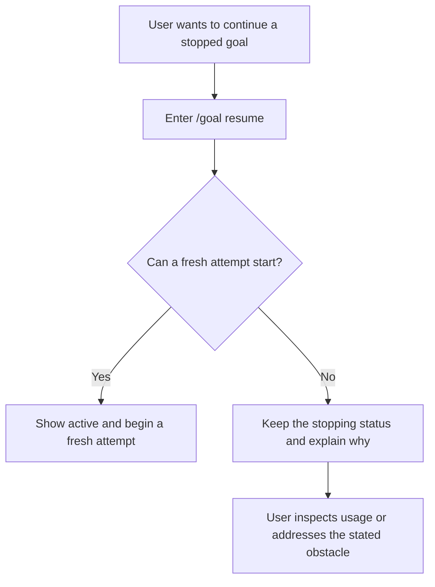

# UX Design: Codex Goal Replicate with pi-goal-x TUI

**Project:** pi-secretary — Codex goal replicate
**Document type:** UX / Interaction Design
**Status:** Draft; this describes the intended experience, not a claim that every interaction is implemented.
**Date:** 2026-09-15
**Updated:** 2026-09-16
**Audience:** Product designers, developers, and reviewers evaluating the user's experience.
**Scope:** This document describes what the user can do, what they see, and how they recover when an action cannot succeed. Internal mechanisms belong in the [architecture document](../arch/architecture.md).
**Related:** [User stories](../user-stories/user-stories.md) · [Document responsibilities](../README.md)

---

## 1. Design Principles

1. **The goal is visible at a glance.** The user can see the objective, current status, and usage without interrupting work.
2. **The user owns the objective.** The agent does not silently narrow the objective, pause it, or replace it with an easier task.
3. **Feedback describes what happened.** A confirmation must not say that work resumed when it remains stopped.
4. **The interface and agent agree.** A user asking about a paused goal should not receive an answer that it is active merely because more work is possible.
5. **Stopped does not mean finished.** Pause, failure, and exhausted budget remain distinct from successful completion.
6. **More detail is available when needed.** The compact display supports quick checks, while the expanded view supports inspection.

## 2. Product Model

- Each session has at most one current goal. The goal expresses the outcome the user wants, rather than the next individual task.
- An active goal can continue across responses without repeated instructions from the user. The `active` label does not mean the agent is continuously typing or executing an action.
- The goal remains available when the user returns to a session. A different session shows its own goal, or no goal.
- The user can create, edit, pause, resume, inspect, or clear a goal. The agent can report completion or a blocker, but cannot decide on its own to redefine the objective.
- A goal's token budget limits how much work may be spent on it. Reaching that limit does not mean the objective has been achieved.
- When the user changes a goal after inspecting its status, subsequent automatic work follows that decision. Work already underway may finish, but its late results must not restore an older objective or stopping status.
- A status question does not change the user's decision. Showing a new usage value also does not cancel a pause or authorize a resume.
- The interface adopts pi-goal-x's compact widget and expanded dashboard. It does not expose task trees, a separate completion auditor, or multiple focused goals.

## 3. Surface Layout

### 3.1 Above-editor goal widget

- A compact widget above the editor shows the current goal and its usage.
- The following mockup illustrates the layout, not measured usage.

```text
┌─ GOAL ────────────────────────────────────────────────────────────────┐
│ ● active   Improve benchmark coverage       tokens used · elapsed time│
└───────────────────────────────────────────────────────────────────────┘
```

| Element | User-facing content |
| --- | --- |
| Status indicator | A color and symbol accompany the written status from §4. |
| Objective | A one-line preview identifies the outcome being pursued. |
| Usage | The display shows goal-token usage and elapsed goal time. |

- The widget appears whether the user created the goal with a command or asked the agent to create it.
- Reopening a session shows its current goal without requiring `/goal` first.
- The widget and footer agree when the goal changes. Both disappear when the goal is cleared.
- A missing widget means there is no current goal only when the goal information was successfully loaded. If that information is unavailable, the interface explains the problem rather than implying that the goal was cleared.

### 3.2 Expanded dashboard (`Ctrl+Shift+T`)

- `Ctrl+Shift+T` opens or closes the expanded goal view.
- The expanded view shows the full objective, status, tokens used, token budget when present, remaining tokens, elapsed time, and creation and update times.
- `Esc` inside the expanded dashboard closes that view without changing the goal.
- Long objectives remain readable in the expanded view even when the compact preview is truncated.

### 3.3 Status line

- A compact footer shows the goal status and usage even when the expanded dashboard is closed.
- The footer uses the same status labels as the widget. The user should not have to decide which display to trust.

## 4. Status Visual Language

| Status | Indicator | Meaning to the user |
| --- | --- | --- |
| `active` | ● green | The goal is open for continued work, although the agent may not be acting at this moment. |
| `paused` | ⏸ yellow | The user has put the goal on hold; work will not resume automatically. |
| `blocked` | ⛔ red | Work has stopped because the agent cannot proceed or an error prevented it from continuing. |
| `usage_limited` | 🔒 amber | A service usage limit prevents further work. |
| `budget_limited` | 💰 amber | The goal has used its available token budget; the agent may summarize unfinished work but must not present it as complete. |
| `complete` | ✓ green | The requested outcome has been achieved and checked. |

- When the reason for a stopped goal is known, explain it in plain language. Distinguish “A connection error stopped the run” from “This task needs your decision.”
- If the reason is unavailable, say so. Do not invent a project blocker to explain the label.
- A temporary error that is successfully recovered from must not leave the user seeing a blocked goal while work proceeds as though it were active.

## 5. Command Palette

### 5.1 Commands

| Command | User intent and outcome |
| --- | --- |
| `/goal` | Inspect the current goal, its status, and its usage without changing it. |
| `/goal <objective>` | Tell the agent what outcome to pursue; if a goal already exists, change its objective. |
| `/goal edit` | Review and revise the current objective in an editor. |
| `/goal pause` | Put the current goal on hold so the agent does not keep working on it automatically. |
| `/goal resume` | Ask the agent to make a fresh attempt at the stopped goal. |
| `/goal clear` | Remove the current goal after confirmation, without claiming that it was completed. |

- `<objective>` is the user's description of the desired outcome. It must not be blank and must contain at most 4,000 characters. For example, `/goal Improve benchmark coverage` gives the agent an outcome to pursue rather than a command to change a status label.
- Submitting a revised objective asks the agent to pursue it, including making a fresh attempt if the goal was paused, blocked, or usage-limited. To leave a stopped goal unchanged, inspect it with `/goal` or cancel the editor rather than submitting a revision.
- Editing does not provide extra token budget or remove an external service limit. An exhausted goal budget prevents resumption; a fresh attempt may stop again if the external problem remains.
- A user who wants to inspect rather than continue a stopped goal uses `/goal`. Asking the agent “Is this goal blocked?” is also an inspection, not permission to resume.

### 5.2 Tab completion & feedback

- Command suggestions use action-first descriptions such as “Pause the current goal” and “Show goal details.”
- Feedback names the action that succeeded. It does not merely repeat the action the user requested.
- If resume cannot proceed because the budget is exhausted, say “Cannot resume: this goal has used its token budget.” Keep `budget_limited` visible rather than showing “Goal resumed.”
- If the user pauses a goal that has already exhausted its budget, explain that it is already stopped because of the budget. Do not show a conflicting `paused` confirmation.
- When an action fails, explain what did not happen and whether the goal is unchanged. Do not show a success message or remove the goal prematurely.
- Ask for confirmation before clearing a goal. Cancellation leaves the goal unchanged.
- Feedback must not restart work on a paused or cleared goal, and pausing a goal must not discard an unrelated message the user submitted.

## 6. Interaction Flows

### 6.1 Create a goal

- **User intent:** The user wants the agent to pursue a stated outcome without needing repeated prompts.
- **Entry conditions:** The user has a session open. An existing goal, if any, remains visible while the user decides what to do.
- **User action:** The user enters `/goal <objective>` or explicitly asks the agent to create a goal.
- **Observable outcome:** A new goal appears and work can begin. When the user uses the command to revise an existing goal, the revised objective appears instead.
- **Feedback:** Show the objective and whether work can proceed. Do not say that work has started if a budget or usage restriction still prevents it.
- **Failure and recovery:** A blank objective produces a request to describe the desired outcome. An objective longer than 4,000 characters produces a request to shorten it. Neither failure loses the existing goal. Asking the agent to create a second unfinished goal does not silently replace the first; explain the conflict and let the user decide whether to edit or clear the existing goal.

### 6.2 Edit a goal

- **User intent:** The user wants to refine the desired outcome rather than create a separate goal.
- **Entry conditions:** A current goal exists.
- **User action:** The user enters `/goal edit`, reviews the prefilled objective, and submits a revision or cancels.
- **Observable outcome:** A submitted revision replaces the displayed objective and asks the agent to work toward it, even if the goal was previously paused or blocked. Work already underway may finish, but subsequent work follows the revised objective and late results cannot restore the old one. Cancelling leaves the objective and status unchanged.
- **Feedback:** Confirm the revised objective and make clear whether a fresh attempt is starting or the goal remains stopped. A goal without remaining budget stays visibly budget-limited; an external service limit may stop a new attempt again.
- **Failure and recovery:** If there is no goal, explain that the user needs to create one. Ask the user to fill in a blank revision or shorten one longer than 4,000 characters. If the revision cannot be saved, retain the previous goal and explain that the revision was not applied.

### 6.3 Pause / Resume

#### Pause

- **User intent:** The user wants to stop further automatic work without losing the goal.
- **Entry conditions:** A current goal exists; the agent may already be working on it.
- **User action:** The user enters `/goal pause`.
- **Observable outcome:** The goal remains available for later, and new automatic work does not start from an earlier intention to continue. Work already underway may finish, but its late result must not undo the pause. Pausing does not undo completed changes.
- **Feedback:** Show `paused` when the pause succeeds. If the goal is already stopped by its exhausted budget, explain that reason and keep `budget_limited` visible.
- **Failure and recovery:** If pausing fails, do not claim that the agent has stopped. Explain the failure so the user can decide whether to try again.

#### Resume

- **User intent:** The user wants the agent to continue a stopped goal.
- **Entry conditions:** A current goal exists, and the user can inspect why it stopped.
- **User action:** The user enters `/goal resume`.
- **Observable outcome:** The agent makes a fresh attempt toward the same objective. The user does not have to prove that an earlier task blocker is resolved before asking the agent to reassess it. No new token allowance is implied by the command.
- **Feedback:** Confirm resumption when the fresh attempt is accepted, not that the underlying obstacle has necessarily disappeared. If a known restriction prevents the attempt, keep the stopping status and explain why. If the new attempt later stops, report the new outcome rather than leaving an outdated success claim uncorrected.
- **Failure and recovery:** If the token budget is exhausted, direct the user to inspect the goal's usage with `/goal` and explain that repeating resume will not bypass the limit. A task blocker is reassessed during the fresh attempt, while an external service limit may stop it again. Explain the known condition and a supported next step when one exists; do not offer an undocumented budget-changing command.



### 6.4 Clear a goal

- **User intent:** The user wants to remove the current goal rather than pause it or mark it complete.
- **Entry conditions:** A current goal exists.
- **User action:** The user enters `/goal clear` and confirms after reviewing which goal will be removed.
- **Observable outcome:** The goal disappears from the widget and footer, and no new automatic work starts for it. Work already underway may finish, but its late result cannot recreate the cleared goal. Already completed work and conversation history are not undone.
- **Feedback:** Confirm that the goal was cleared only after removal succeeds. A later status question receives “No current goal,” not an old active-goal description.
- **Failure and recovery:** Cancelling leaves the goal unchanged. If removal fails, retain the goal display and explain that it was not cleared. If there is no goal, say that there is nothing to clear.

### 6.5 Escape interaction

- `Esc` inside the expanded dashboard closes it without changing the goal.
- During active goal work outside the expanded dashboard, `Esc` pauses the goal with the same feedback and limits as `/goal pause`.
- A pause does not undo completed work or guarantee reversal of an action already underway. If the goal could not be paused, the feedback must explain that rather than claim success.

## 7. Widget State Rendering

### 7.1 Compact widget

- The compact widget shows enough of the objective to identify the goal, followed by its status and usage.
- The expanded dashboard remains the place to read an objective that does not fit on one line.

### 7.2 Paused

- The paused goal remains visible with the `paused` label.
- Returning to the session or asking a question about the goal must not make it active again without a request to resume.

### 7.3 Budget-limited detail

- The detail view shows `budget_limited`, tokens used, the token budget, and no remaining tokens.
- The unfinished objective remains visible. Exhausting the budget does not produce a completion indicator.

## 8. Empty and Boundary States

| Situation | What the user sees and can do |
| --- | --- |
| There is no current goal. | The widget and footer are absent; `/goal` explains how to create one. |
| The goal is complete. | The completion label remains visible until the user chooses to clear or change the goal. |
| The user asks for status after pausing or clearing. | The answer reflects the pause or absence of a goal, and does not restart work. |
| The user switches or returns to a session. | The display shows that session's goal rather than the previous session's goal. |
| The user forks a session. | The new session initially shows the inherited goal and usage; later changes in either session do not change the other. |
| A temporary connection problem is recovered from. | The goal does not remain labeled blocked merely because the temporary failure occurred. |
| An error prevents work from continuing. | The stopped status and explanation distinguish an execution error from a task that needs the user's input. |
| The goal's current information cannot be loaded. | The interface says the information is unavailable rather than presenting an old status as current or implying that the goal was cleared. |
| An action cannot have the requested effect. | Feedback and the goal display agree about what actually happened, with a reason and a supported next step when known. |
| An earlier attempt reports an error after the user pauses or changes the goal. | The user's newer decision remains in effect. Explain the old attempt's result without presenting it as a fresh blocker for the current goal. |
| An earlier request takes longer to process than a later decision. | The delayed request does not silently replace the user's newer decision. Explain that it was superseded rather than claiming it succeeded. |

## 9. Accessibility & Keyboard

- The user can complete goal interactions with the keyboard.
- Color is never the only status signal; a written label accompanies each indicator.
- Closing a detail view is distinguishable from pausing work, including in the feedback shown to the user.

## 10. UX Acceptance Criteria

1. A current goal is visible after creation or return to a session without first running `/goal`.
2. The widget, footer, and an answer to a status question do not give conflicting descriptions of the goal.
3. The user can distinguish inspecting a goal from resuming it, and clearing a goal from completing it.
4. Pausing or clearing stops new automatic work based on the earlier goal. Work already underway may finish, but cannot undo the newer decision or erase unrelated user messages.
5. A resume that cannot proceed explains why; it never claims success while the goal remains stopped.
6. Editing the objective makes clear what the agent will pursue and whether work can continue.
7. Clearing requires confirmation, cancellation leaves the goal unchanged, and failed removal does not hide the goal.
8. Stopped-goal explanations distinguish known task blockers, execution errors, exhausted goal budget, and service usage limits without inventing a reason.
9. A temporarily unavailable goal status is presented as unavailable, not as a definite old status or a missing goal.
10. The compact display, detail view, and keyboard interactions remain understandable without knowledge of storage, event delivery, or model-request handling.
11. A delayed result or earlier request does not overturn a later accepted user decision merely because it finishes last.
