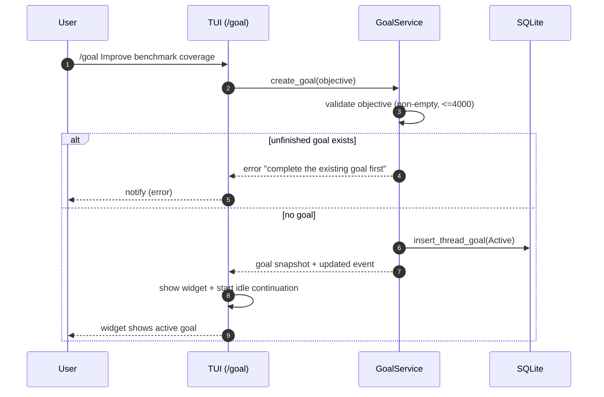
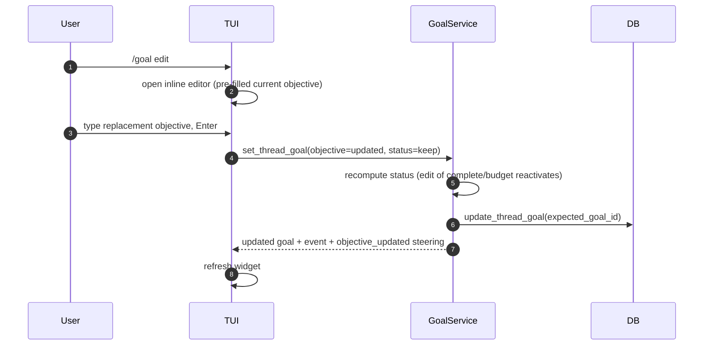
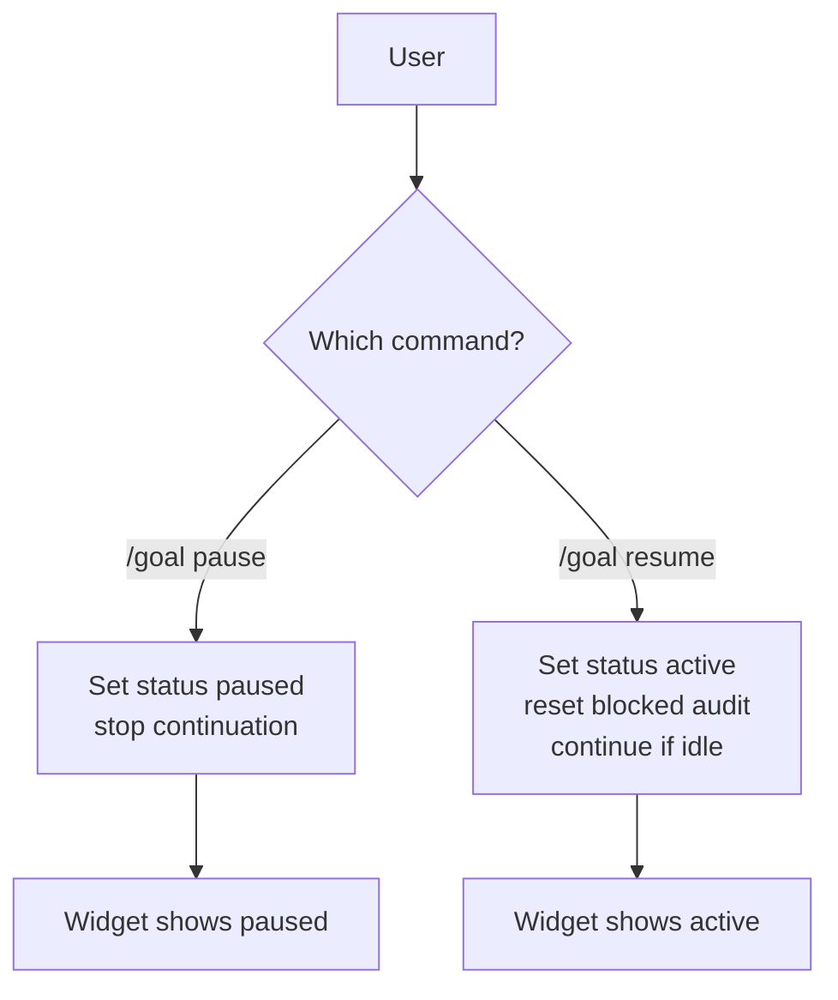
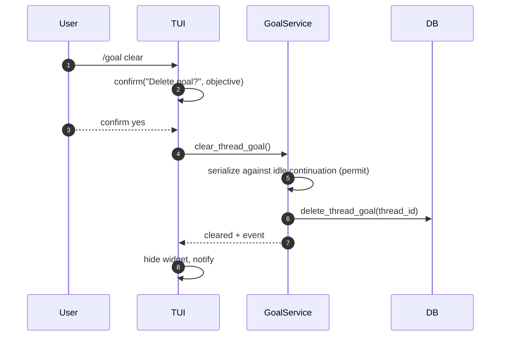

# UX Design: Codex Goal Replicate with pi-goal-x TUI

**Project:** pi-secretary — Codex goal replicate
**Document type:** UX / Interaction Design
**Status:** Draft
**Date:** 2026-09-15
**Related:** `../user-stories/user-stories.md` · `../arch/architecture.md`
**Scope:** The developer-facing TUI and command surface, ported from
pi-goal-x's interaction model onto Codex goal semantics.

---

## 1. Design Principles

The TUI is borrowed from **pi-goal-x**; the goal *semantics* come from
**Codex**. The UX must make a Codex-goal feel like a first-class,
always-visible part of the session without widening the model surface.

1. **Always-visible, at a glance.** The goal's status, elapsed time, and token
   usage are visible without interrupting work.
2. **User owns intent.** Lifecycle actions (edit/pause/resume/clear) are
   user-driven, never model-driven.
3. **Progressive disclosure.** A compact summary by default; a richer dashboard
   on demand.
4. **Atomic commands.** Each lifecycle action is one discoverable command or
   keybinding.
5. **Honest state.** The UI renders exactly what the service persisted — no
   invented progress, no hidden state.
6. **Fidelity first.** The TUI presents Codex semantics; it never invents
   features Codex does not have (no task trees, no auditor, no archival).

---

## 2. Loyalty to the Sources

> **What we port from pi-goal-x (UX):** the above-editor widget + dashboard,
> the status line, the command palette and tab-completion, the `Ctrl+Shift+T`
> expand/collapse, `Esc`-to-pause interop, and the notify/confirm/select UI
> patterns.
>
> **What we take from Codex (semantics):** the three-tool model surface, the
> six statuses, single-goal-per-thread, SQLite persistence, and the
> requirement-by-requirement completion audit via prompt steering.

The two must not blur: the TUI must **not** show task trees, contracts, or an
auditor, because the underlying system is Codex-faithful.

---

## 3. Surface Layout

### 3.1 Above-editor goal widget

A compact widget sits above the editor. It shows the focused goal and live
accounting.

```
┌─ GOAL ────────────────────────────────────────────────────────────────┐
│ ● active   Improve benchmark coverage           12.4k tok · 08:23      │
└───────────────────────────────────────────────────────────────────────┘
```

**Elements:**
| Element | Content |
| --- | --- |
| Status dot | Color-coded by status (see §4). |
| Status label | `active` / `paused` / `blocked` / `usage_limited` / `budget_limited` / `complete` |
| Objective | Truncated one-line objective. |
| Usage | `tokensUsed` (formatted) and `timeUsedSeconds` (HH:MM:SS). |

**Behavior:**
- Auto-shown when a goal exists.
- Updates on every goal state change (`ThreadGoalUpdated` event).
- No widget when no goal exists.

### 3.2 Expanded dashboard (`Ctrl+Shift+T`)

Expanding the widget reveals full detail in a scrollable pane.

```
┌─ GOAL DETAIL ─────────────────────────────────────────────────────────┐
│ Status         active                                                  │
│ Objective      Improve benchmark coverage so the suite runs in < 5 min │
│ Usage          tokens: 12,400 / 50,000   time: 08:23                    │
│ Budget         remaining: 37,600 tokens (no time limit)                 │
│ Created       2026-09-15 09:00:00                                       │
│ Updated       2026-09-15 09:08:23                                       │
└────────────────────────────────────────────────────────────────────────┘
```

**Interactions:**
- `Ctrl+Shift+T` toggles expansion/collapse.
- `Esc` inside the expanded dashboard collapses it back to the compact widget.

### 3.3 Status line

A compact, always-on footer status line (pi-goal-x style) shows a one-line
summary even when the widget is collapsed or scrolled away.

```
goal: active · 12.4k tok · 08:23
```

---

## 4. Status Visual Language

| Status | Indicator | Meaning |
| --- | --- | --- |
| `active` | ● green | Work is in progress; continues when idle. |
| `paused` | ⏸ yellow | Explicitly paused by the user; does not continue. |
| `blocked` | ⛔ red | Agent-reported impasse (3 consecutive turns). |
| `usage_limited` | 🔒 amber | Hit the usage limit; stopped by system. |
| `budget_limited` | 💰 amber | Hit the token budget; one-time wrap-up. |
| `complete` | ✓ green | Objective achieved and verified. |

---

## 5. Command Palette

The user-facing surface is the Codex `/goal` namespace, rendered with
pi-goal-x's command registration + tab-completion.

### 5.1 Commands

| Command | Behavior |
| --- | --- |
| `/goal` | Show the goal summary (bare). |
| `/goal <objective>` | Create/replace the goal and start it. |
| `/goal edit` | Open an inline editor to replace the objective. |
| `/goal pause` | Set status `paused` (user-initiated). |
| `/goal resume` | Set status `active` (resume a paused/blocked goal). |
| `/goal clear` | Delete the goal state (confirmation required). |

### 5.2 Tab completion & feedback

- Commands appear in tab completion with action-first descriptions.
- `ctx.ui.notify(...)` on success/failure for fire-and-forget feedback.
- `ctx.ui.confirm(...)` before destructive actions (`/goal clear`).
- `ctx.ui.select(...)` when a choice is ambiguous (e.g. resume a paused vs
  blocked goal).

---

## 6. Interaction Flows

### 6.1 Create a goal



### 6.2 Edit a goal



### 6.3 Pause / Resume



### 6.4 Clear a goal



### 6.5 Escape interaction

- `Esc` during active goal work pauses (mirrors pi-goal-x Escape-to-pause).
- `Esc` inside the expanded dashboard collapses the widget.

---

## 7. Widget State Rendering

### 7.1 Compact widget

```
┌─ GOAL ────────────────────────────────────────┐
│ ● active   Improve benchmark coverage  12.4k │
└───────────────────────────────────────────────┘
```

### 7.2 Paused

```
┌─ GOAL ────────────────────────────────────────┐
│ ⏸ paused   Improve benchmark coverage  12.4k │
└───────────────────────────────────────────────┘
```

### 7.3 Battery of statuses rendered in the detail pane

```
Status         budget_limited
Objective      Improve benchmark coverage
Usage          tokens: 50,000 / 50,000   time: 12:00
Budget         reached: 50,000 (limit)   remaining: 0
```

---

## 8. Empty and Boundary States

| State | UI |
| --- | --- |
| No goal | No widget; `/goal` shows a hint. |
| Goal in a terminal state (`complete`) | Widget confirms completion; user may `/goal clear` to remove. |
| Error creating (unfinished goal exists) | `notify(error)` with directive to complete first. |
| Stale/late context | TUI renders only the authoritative service snapshot. |

---

## 9. Accessibility & Keyboard

- All widget interactions are keyboard-driven (no mouse required).
- `Ctrl+Shift+T` expand/collapse; `Esc` collapse/pause; arrow keys navigate
  selectors.
- Color is never the sole differentiator — status text accompanies the dot.

---

## 10. UX Acceptance Criteria

1. A compact goal widget is visible whenever a goal exists.
2. `Ctrl+Shift+T` expands/collapses the dashboard; `Esc` collapses.
3. The status line always reflects the current state.
4. `/goal` family commands work with tab-completion and clear feedback.
5. Destructive `/goal clear` requires confirmation.
6. The TUI never presents task trees, contracts, or an auditor (Codex-faithful
   semantics).
7. Every UI change is driven by a persisted-state event (no divergence between
   TUI and service).
